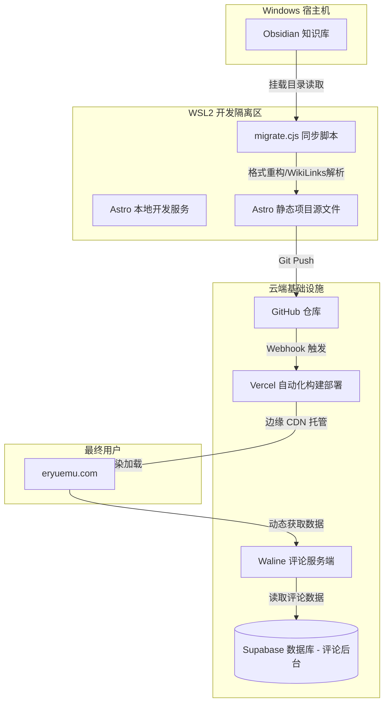

# eryuemu-blog (二月木的个人博客)

* 主访问地址: [https://eryuemu.com](https://eryuemu.com)
* Vercel 分配地址: [https://eryuemu-blog.vercel.app](https://eryuemu-blog.vercel.app)
* 原 GitHub Pages 地址 (已停用): [https://eryuemu.github.io/eryuemu-blog](https://eryuemu.github.io/eryuemu-blog)

本仓库是二月木的个人博客项目。项目开发环境在 WSL2 中实现物理隔离，利用自定义脚本自动同步 Windows 本地 Obsidian 知识库，并托管至 Vercel 进行全球边缘加速部署。

---

## 项目架构与技术栈

### 1. 技术栈 (Technology Stack)

| 维度 | 技术/服务 | 说明 |
| :--- | :--- | :--- |
| **前端核心** | Astro | 基于组件岛架构的现代静态站点生成器 (SSG)，保证极致的首屏加载速度与 SEO 表现 |
| **内容编写** | Obsidian | 本地 Markdown 知识库，作为博客内容的唯一可信源 (Single Source of Truth) |
| **开发环境** | WSL2 (Ubuntu) | 实现开发环境与 Windows 宿主机的物理隔离，通过 nvm 管理 Node.js 版本 |
| **托管与部署** | Vercel | 托管静态资源，集成 GitHub 自动触发构建 (CI/CD)，使用全球边缘节点加速 |
| **域名解析** | Spaceship DNS | 管理自定义域名 `eryuemu.com` 的 A 记录和 CNAME 记录 |
| **评论系统** | Waline | 依托 Supabase 云端数据库与 Vercel 实例部署的轻量评论系统 |
| **浏览统计** | Vercount | 轻量化的网页浏览量 (PV/UV) 统计服务 |

### 2. 系统架构图 (Architecture Diagram)



---

## 本地开发与常驻服务管理

博客开发通过 WSL2 中的 Astro 常驻服务进行管理，防止开发服务意外退出：

```bash
# 后台常驻运行本地开发服务器 (默认端口: http://localhost:4321)
npx astro dev --background

# 检查当前服务运行状态
npx astro dev status

# 实时查看本地开发日志
npx astro dev logs

# 停止后台开发服务器
npx astro dev stop
```

---

## Obsidian 知识库同步方案

当你在本地 Obsidian 中写完或修改了文章，可以通过以下方式同步到博客：

### 1. 同步机制说明
运行脚本时，它会执行以下管道操作：
1. **源路径扫描**：从挂载的 Windows 本地路径（如 `/mnt/c/MyKnowledgeBase/开发`）读取最新的 Markdown 文档。
2. **Slug 映射解析**：根据 `migrate.cjs` 内置的 `slugMap` 映射表将中文文件名转换为 URL 友好的 slugs。
3. **内容预处理**：
   - 提取原始 Obsidian 的 `created` 日期生成统一的 `pubDate`。
   - 解析 Obsidian 格式图片语法（如 `![[image.png]]`）并转换为标准的相对路径。
   - 解析 `[[WikiLinks]]` 并自动转换为适配 `eryuemu.com/blog/xxx` 的站内链接（无 `/eryuemu-blog` 前缀）。
4. **编译与覆盖**：生成标准的 Astro Markdown 博客格式，并写入项目的 `src/content/blog/` 目录中。

### 2. 执行同步命令
在 WSL2 项目根目录下运行：
```bash
node migrate.cjs
```
