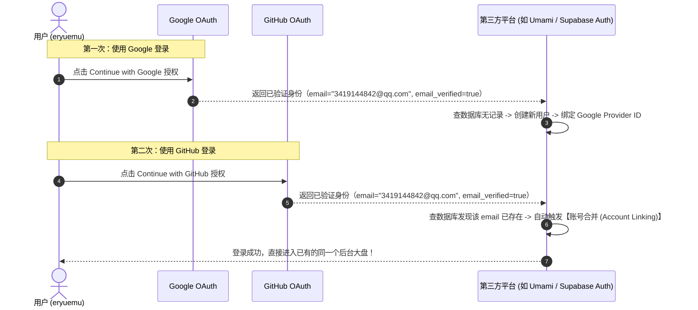

## 一、先逐个确认三个账号的本质

| # | 账号 | 定性 | 发卡方 | 管理方 |
|---|------|------|--------|--------|
| ① | `3419144842@qq.com` 注册的**微软账号** | ✅ 真实微软账号 | 微软 | 微软 |
| ② | `eryuemu1213@outlook.com`（outlook 邮箱） | ✅ 真实微软账号（**原生**） | 微软 | 微软 |
| ③ | 用 QQ 邮箱注册的**谷歌账号**，拿它登录 Bing | ✅ 真实谷歌账号（**不是微软账号**） | 谷歌 | 谷歌 |

**关键结论：**
- **② 自动就是微软账号**：注册 outlook.com 邮箱的过程本身就是"创建微软账号"，邮箱地址 = 登录名，两者是同一件事，不存在"单独的邮箱账号"。
- **① 也是微软账号**：微软允许用任何邮箱（含第三方 QQ 邮箱）当登录名，地位和 outlook 账号完全一样，只是登录名挂着腾讯的名。
- **③ 不是微软账号**：全程没有创建任何微软账号，你的身份就是那个谷歌账号本身。

---

## 二、核心概念：登录名 ≠ 账号本身

「3419144842@qq.com」只是一串字符串（登录名），**不是账号本身**，谁都可以拿它当用户名。

```
你（真实世界的人）
│
├─ 注册 → 微软账号 A   登录名：3419144842@qq.com     ← 微软发卡，微软管理
│                       密码是微软的，管 Windows 激活、OneDrive
│
├─ 注册 → 微软账号 B   登录名：eryuemu1213@outlook.com  ← 微软发卡，微软管理
│                       原生邮箱，邮件直接存微软
│
└─ 注册 → 谷歌账号 C   登录名：3419144842@qq.com     ← 谷歌发卡，谷歌管理
                        密码是谷歌的，管 Gmail、YouTube、Search Console
```

**类比：一个班有两个人都叫"王伟"**——名字相同，但学籍、成绩、家长联系方式完全不同，老师绝不会把两人的作业本搞混。你只是注册两家平台时恰好都填了同一个 QQ 邮箱当名字而已。

---

## 三、用谷歌账号登录 Bing = OAuth 授权，不是"微软账号登录"

> 不存在"通过谷歌登录的微软账号"这回事。

**两种登录机制的本质区别：**

| | Windows 登录 | Bing 站长平台 / GitHub 登录 |
|---|---|---|
| 类型 | **账号硬绑定**（系统级） | **第三方授权登录**（OAuth，Web 标准） |
| 含义 | 激活、加密、同步全挂微软体系，系统安全底座 | 信任第三方（Google）的认证结果 |
| 类比 | iPhone 只能用 Apple ID | 微信扫码登录任意网站 |

**OAuth 后台实际流程：**
```
Bing 问 Google：这人说他是站长，你确认一下？
  ↓ 页面跳到 Google，弹出授权窗口
Google 问你：允许 Bing 获取你的基本资料吗？
  ↓ 你点「允许」
Google 给 Bing 发一张"通行证"（上面没有你的密码）
  ↓
Bing 凭通行证确认：你是 3419144842@qq.com，权限通过 ✅
```
**全程 Bing 拿不到你的 Google 密码**，只是拿到"你本人授权过"的凭证。微软的数据库里只是记了一笔："这个网站的站长 = 谷歌账号 3419..."。


*图：Bing 站长平台通过 Google OAuth 授权登录后，右上角个人资料直接显示 Google 账号的昵称（yuemu er）与邮箱（3419144842@qq.com）*

---

## 四、为什么①和③不会冲突？（4 个原因）

冲突的前提是"同一个东西有两方在管"，这里每一方只认自己的记录：

1. **密码独立**：微软验证 A 查微软存的密码，谷歌验证 C 查谷歌存的密码，两家永远不互相比对、互相看不见。
2. **数据独立**：A 的 OneDrive 和 C 的 Gmail 井水不犯河水。
3. **OAuth 协议禁止传密码**：授权通行证里不含密码，微软想越界也拿不到。
4. **唯一交点**：两家往同一个 QQ 邮箱发找回密码邮件——但这只是"都往同一个地址寄信"，就像两家银行往你同一个手机号发短信，不代表两家银行是一家的。

---

## 五、①和②都是微软账号，它们又是什么关系？

- 默认状态下：**两个完全独立的账号**（密码、OneDrive 各自独立），微软家的"两张卡"。
- 想合并：登录 `account.microsoft.com` 把其中一个邮箱设为另一个的**别名** → 变成"一个账号两个登录名"，用哪个登录都是同一个账号。需要主动操作，默认不合并。

---

## 六、延伸规律：哪些产品支持第三方登录？

### 微软产品三类现状

| 产品类别 | 典型代表 | 登录方式 |
|---------|---------|---------|
| 消费级/系统级（**绝大多数**） | Windows、Office、Edge、Xbox、OneDrive、Outlook | 只认微软账号 |
| 开发者/站长类 Web 产品（少数） | GitHub、Bing 站长平台、Microsoft Learn | 支持 Google/Apple 第三方登录 |
| 企业产品（特殊） | Microsoft 365 企业版、Azure | 公司工作账号，可配"联邦认证"对接 Google Workspace |

### 判断规律（一句话）

> **面向"自己人生态"的产品 → 只认自家账号（护城河）；面向"想拉进来的外人"的产品 → 才开第三方登录（获客策略）。**

- **消费级只用自家账号**：Windows/Office/Xbox 是生态根基，登录一个等于进全家桶。Google 的 Pixel 手机同样强制谷歌账号——对称逻辑。
- **开发者产品反而开放**：微软在开发者/站长领域是**后来者**（GitHub 是收购的，站长圈早被 Google 霸占），没资格要求用户重新注册，只能降低门槛拉人。Bing 站长平台支持"一键从 Google 导入"就是在挖 Google 的墙脚——这是生意。


*图：Bing 站长平台直接支持从 Google Search Console 导入站点与 OAuth 认证，降低站长迁移门槛*

- **企业场景特殊**：登录是身份管理问题，由公司 IT 决定，可对接任意身份系统，与个人用户无关。

### Google 也一样对称

- Google 消费产品（搜索、Gmail、YouTube、Android）→ 只认谷歌账号
- Google 开发者产品（Search Console、Firebase）→ 也只认谷歌账号（护城河够深，不需要拉微软用户）

**本质：登录方式是商业决策而非技术限制。**

---

## 八、进阶实战：第三方 SaaS 对“邮箱别名”与“多 OAuth 登录”的判定机制

在搭建站点（如配置 Umami 访问统计、Vercel 部署、Supabase 数据库）时，经常会遇到更深入的鉴权疑问：
1. **同一个 QQ 邮箱改了英文别名，在第三方平台算同一个账号吗？**
2. **用同一个邮箱分别注册了 Google 和 GitHub，在第三方平台分别点击第三方登录，进的是同一个账号吗？**

### 1. 邮箱别名（Alias）与第三方平台：字符串精确匹配

在 QQ 邮箱体系中，数字主账号（如 `3419144842@qq.com`）与自定义英文别名（如 `eryuemu1213@qq.com`）在腾讯底层对应的是**同一个物理收件箱**。

但在所有外部第三方平台（如 Umami、GitHub、各大 SaaS 服务商）眼中：
- 它们没有腾讯内部的别名映射数据库，对用户唯一身份的判定标准是**字符串精确匹配（Exact String Match）**。
- `3419144842@qq.com` 与 `eryuemu1213@qq.com` 字符完全不同，因此系统会将它们视为**两个截然独立、互不相通的用户实体**。

```
┌────────────────────────────────────────────────────────┐
│                   腾讯 QQ 邮箱底层服务                  │
│               [ 统一物理收件箱: eryuemu ]              │
└──────────────────────────┬─────────────────────────────┘
                           │
             ┌─────────────┴─────────────┐
             ▼                           ▼
    【数字地址】3419144842@qq.com      【英文别名】eryuemu1213@qq.com
             │                           │
  ───────────┼───────────────────────────┼───────────────────────────
             │ (第三方平台视角：字符串比对) │
             ▼                           ▼
    【Umami 账号 A (博客专享)】   【Umami 账号 B (HBU Wiki 专享)】
```

**💡 实战妙用：**
许多海外现代 SaaS 平台（例如 Umami Cloud）为了防止滥用，限制“每个免费账号最多创建 1 个站点”。利用 QQ 邮箱的别名机制，你可以合规注册两个独立账号（分别挂载个人博客与校园 Wiki），各自享受完整的独立免费配额，而所有密码重置与安全验证邮件依然全部汇总在同一个 QQ 邮箱中，省去了维护多套邮箱的麻烦。

---

### 2. 多 OAuth 登录源的判定：账号自动合并（Account Linking）

如果你用 `3419144842@qq.com` 注册了 Google 账号与 GitHub 账号，当你在支持两者的第三方平台（如 Umami 登录页）分别点击 **「Continue with Google」** 与 **「Continue with GitHub」** 时，系统是如何判定的？

**核心结论：进的是同一个账号！**



#### 判定机制原理解析：
1. **邮箱为主键（Primary Identity Anchor）**：在现代 Web 鉴权系统（如 NextAuth、Supabase Auth、Auth0）中，经过验证的邮箱（Verified Email）是用户的最高唯一标识。
2. **权威第三方信任链**：Google 和 GitHub 作为顶级身份提供商（Identity Provider, IdP），其传回的 `email_verified: true` 具有极高公信力。
3. **自动打通绑定**：第三方平台识别到两家大厂提供的是同一个邮箱字符串，就会自动把 Google ID 和 GitHub ID 关联到该用户的同一条记录上。

---

### 3. 为什么第三方 OAuth 登录的账号无法直接“输邮箱+密码”？

当你通过 Google 一键登录后，如果在登录界面直接输入邮箱和自己的常用密码，系统会提示“密码错误”或“未设置密码”：
- **原因**：OAuth 全程只传递授权 Token，第三方平台**从未保存过你的独立明文/哈希密码**。
- **打通方式**：在登录页点击 **`Forgot password?`（忘记密码）**，通过收到的重置邮件设置一个独立密码。设置完成后，该账号即同时具备 **“OAuth 一键免密登录”** 与 **“账号密码手动登录”** 双通道，数据完全一致。

---

## 九、实操全景结论

- **Bing 站长工具**：继续用谷歌账号登录，跟 Search Console 自动同步，最省事。
- **对外邮件身份**：用 `eryuemu1213@outlook.com`（原生、正规、不依赖国内邮箱服务）。
- **SaaS 多配额管理**：需要多个独立账号时，善用 QQ 邮箱的数字地址与英文别名（对外部平台是两个完全独立的身份，收信依然在同一个收件箱）。
- **第三方登录（OAuth）**：只要底层绑定的主邮箱一致，无论点 Google 还是 GitHub 登录，现代化系统都会自动做 Account Linking，安全且不迷路。

