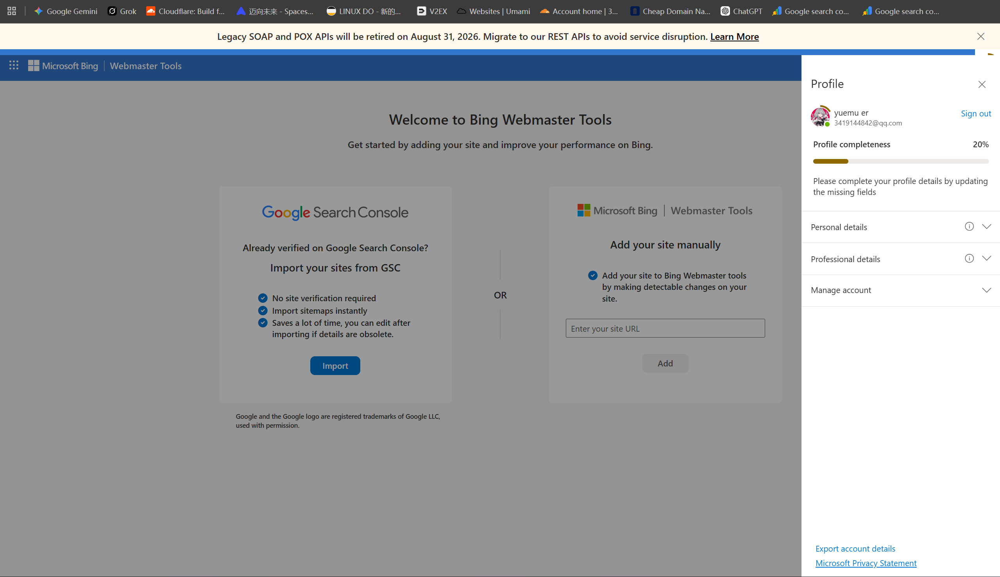
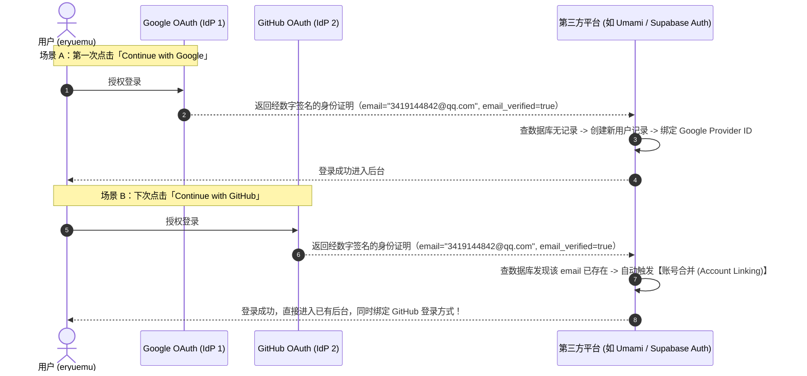

## 一、先逐个确认三个账号的本质

| # | 账号 | 定性 | 发卡方 | 管理方 |
|---|------|------|--------|--------|
| ① | `3419144842@qq.com` 注册的**微软账号** | ✅ 真实微软账号 | 微软 | 微软 |
| ② | `eryuemu1213@outlook.com`（outlook 邮箱） | ✅ 真实微软账号（**原生**） | 微软 | 微软 |
| ③ | 用 QQ 邮箱注册的**谷歌账号**，拿它登录 Bing | ✅ 真实谷歌账号（**不是微软账号**） | 谷歌 | 谷歌 |

**关键结论：**
- **② 自动就是微软账号**：注册 outlook.com 邮箱的过程本身就是"创建微软账号"，邮箱地址 = 登录名，两者是同一件事，不存在"单独的邮箱账号"。
- **① 也是微软账号**：微软允许用任何邮箱（含第三方 QQ 邮箱）当登录名，地位和 outlook 账号完全一样，只是登录名挂着腾讯的名。
- **③ 不是微软账号**：全程没有创建任何微软账号，你的身份就是那个谷歌账号本身。

---

## 二、核心概念：登录名 ≠ 账号本身

「3419144842@qq.com」只是一串字符串（登录名），**不是账号本身**，谁都可以拿它当用户名。

```
你（真实世界的人）
│
├─ 注册 → 微软账号 A   登录名：3419144842@qq.com     ← 微软发卡，微软管理
│                       密码是微软的，管 Windows 激活、OneDrive
│
├─ 注册 → 微软账号 B   登录名：eryuemu1213@outlook.com  ← 微软发卡，微软管理
│                       原生邮箱，邮件直接存微软
│
└─ 注册 → 谷歌账号 C   登录名：3419144842@qq.com     ← 谷歌发卡，谷歌管理
                        密码是谷歌的，管 Gmail、YouTube、Search Console
```

**类比：一个班有两个人都叫"王伟"**——名字相同，但学籍、成绩、家长联系方式完全不同，老师绝不会把两人的作业本搞混。你只是注册两家平台时恰好都填了同一个 QQ 邮箱当名字而已。

---

## 三、用谷歌账号登录 Bing = OAuth 授权，不是"微软账号登录"

> 不存在"通过谷歌登录的微软账号"这回事。

**两种登录机制的本质区别：**

| | Windows 登录 | Bing 站长平台 / GitHub 登录 |
|---|---|---|
| 类型 | **账号硬绑定**（系统级） | **第三方授权登录**（OAuth，Web 标准） |
| 含义 | 激活、加密、同步全挂微软体系，系统安全底座 | 信任第三方（Google）的认证结果 |
| 类比 | iPhone 只能用 Apple ID | 微信扫码登录任意网站 |

**OAuth 后台实际流程：**
```
Bing 问 Google：这人说他是站长，你确认一下？
  ↓ 页面跳到 Google，弹出授权窗口
Google 问你：允许 Bing 获取你的基本资料吗？
  ↓ 你点「允许」
Google 给 Bing 发一张"通行证"（上面没有你的密码）
  ↓
Bing 凭通行证确认：你是 3419144842@qq.com，权限通过 ✅
```
**全程 Bing 拿不到你的 Google 密码**，只是拿到"你本人授权过"的凭证。微软的数据库里只是记了一笔："这个网站的站长 = 谷歌账号 3419..."。


*图：Bing 站长平台通过 Google OAuth 授权登录后，右上角个人资料直接显示 Google 账号的昵称（yuemu er）与邮箱（3419144842@qq.com）*

---

## 四、为什么①和③不会冲突？（4 个原因）

冲突的前提是"同一个东西有两方在管"，这里每一方只认自己的记录：

1. **密码独立**：微软验证 A 查微软存的密码，谷歌验证 C 查谷歌存的密码，两家永远不互相比对、互相看不见。
2. **数据独立**：A 的 OneDrive 和 C 的 Gmail 井水不犯河水。
3. **OAuth 协议禁止传密码**：授权通行证里不含密码，微软想越界也拿不到。
4. **唯一交点**：两家往同一个 QQ 邮箱发找回密码邮件——但这只是"都往同一个地址寄信"，就像两家银行往你同一个手机号发短信，不代表两家银行是一家的。

---

## 五、①和②都是微软账号，它们又是什么关系？

- 默认状态下：**两个完全独立的账号**（密码、OneDrive 各自独立），微软家的"两张卡"。
- 想合并：登录 `account.microsoft.com` 把其中一个邮箱设为另一个的**别名** → 变成"一个账号两个登录名"，用哪个登录都是同一个账号。需要主动操作，默认不合并。

---

## 六、延伸规律：哪些产品支持第三方登录？

### 微软产品三类现状

| 产品类别 | 典型代表 | 登录方式 |
|---------|---------|---------|
| 消费级/系统级（**绝大多数**） | Windows、Office、Edge、Xbox、OneDrive、Outlook | 只认微软账号 |
| 开发者/站长类 Web 产品（少数） | GitHub、Bing 站长平台、Microsoft Learn | 支持 Google/Apple 第三方登录 |
| 企业产品（特殊） | Microsoft 365 企业版、Azure | 公司工作账号，可配"联邦认证"对接 Google Workspace |

### 判断规律（一句话）

> **面向"自己人生态"的产品 → 只认自家账号（护城河）；面向"想拉进来的外人"的产品 → 才开第三方登录（获客策略）。**

- **消费级只用自家账号**：Windows/Office/Xbox 是生态根基，登录一个等于进全家桶。Google 的 Pixel 手机同样强制谷歌账号——对称逻辑。
- **开发者产品反而开放**：微软在开发者/站长领域是**后来者**（GitHub 是收购的，站长圈早被 Google 霸占），没资格要求用户重新注册，只能降低门槛拉人。Bing 站长平台支持"一键从 Google 导入"就是在挖 Google 的墙脚——这是生意。


*图：Bing 站长平台直接支持从 Google Search Console 导入站点与 OAuth 认证，降低站长迁移门槛*

- **企业场景特殊**：登录是身份管理问题，由公司 IT 决定，可对接任意身份系统，与个人用户无关。

### Google 也一样对称

- Google 消费产品（搜索、Gmail、YouTube、Android）→ 只认谷歌账号
- Google 开发者产品（Search Console、Firebase）→ 也只认谷歌账号（护城河够深，不需要拉微软用户）

**本质：登录方式是商业决策而非技术限制。**

---

## 八、进阶实战：第三方 SaaS 对“邮箱别名”与“多 OAuth 登录”的判定机制（以 Umami 为例）

在搭建站点（如配置 Umami 访问统计、Vercel 部署、Supabase 数据库）时，我们经常会遇到一系列更深层次的鉴权与身份判定疑问。以下按照实际折腾场景，逐一拆解其底层判定机制：

### 8.1 疑问一：用 QQ 邮箱注册的 Google 账号登录后，直接输邮箱密码能进吗？是同一个账号吗？

> **真实场景**：在 Umami 登录页点击 **「Continue with Google」**，授权的是用数字 QQ 邮箱（`3419144842@qq.com`）注册的谷歌账号，进后台后右上角显示该数字邮箱。如果以后不点 Google，直接在登录框手输这个 QQ 邮箱和密码，进的是同一个账号吗？

#### 核心解答：
1. **在底层数据库中，它 100% 对应同一个账号**：因为系统的用户唯一标识锚定的是 `3419144842@qq.com` 这个邮箱字符串。
2. **为什么目前直接输密码会报错？**
   - 因为走的是 Google OAuth 第三方授权，Google 只向平台发放了“授权通行证（Token）”。平台数据库里**从来没有存储过你的独立本地密码**。
   - 此时直接输入密码，系统会提示“密码错误”或“未设置密码”。
3. **如何打通“Google 一键登录 + 邮箱密码手动登录”双通道？**
   - 在登录界面输入该邮箱，点击 **`Forgot password?`（忘记密码）**。
   - 平台会往你的 QQ 邮箱发送一封密码重置邮件。
   - 点开邮件设置一个独立密码后，账号就拥有了完整的本地凭证：
     - 👉 既能点击 **Continue with Google** 免密秒登；
     - 👉 也能手输 **QQ 邮箱 + 自设密码** 登录。
     - **两者进的是完全相同的后台大盘，数据完全一致。**

---

### 8.2 疑问二：QQ 邮箱的数字主号和英文别名，在第三方平台算同一个账号吗？

> **真实场景**：之前在 Umami 里用英文别名 `eryuemu1213@qq.com` 注册并绑定了 HBU Wiki，后来发现 Umami 免费版限制“每个账号只能创建 1 个站点”。那把数字主账号 `3419144842@qq.com` 拿来用，第三方平台会认为是同一个账号还是两个账号？

#### 核心解答：
在第三方平台眼里，**这绝对是两个完全独立、互不相通的账号！**

```
┌────────────────────────────────────────────────────────┐
│                   腾讯 QQ 邮箱底层服务                  │
│               [ 统一物理收件箱: eryuemu ]              │
└──────────────────────────┬─────────────────────────────┘
                           │ (发往两个地址的信，都躺在同一个收件箱)
             ┌─────────────┴─────────────┐
             ▼                           ▼
    【数字地址】3419144842@qq.com      【英文别名】eryuemu1213@qq.com
             │                           │
  ───────────┼───────────────────────────┼───────────────────────────
             │ (第三方平台视角：仅做严格字符串比对)
             ▼                           ▼
    【Umami 账号 A (博客专享)】   【Umami 账号 B (HBU Wiki 专享)】
    （拥有 1 个独立免费站点配额） （拥有 1 个独立免费站点配额）
```

- **腾讯内部视角**：数字邮箱与英文别名是**同一收件箱的映射别名（Alias）**，发给谁都能收到。
- **第三方 SaaS 视角**：平台没有腾讯内部的数据库权限，判定用户唯一性的逻辑是**字符串严格比对（String Exact Match）**。因为 `3419144842@qq.com` 与 `eryuemu1213@qq.com` 字面完全不同，数据库会分配两个完全不同的 `User ID`。
- **💡 实战妙用（多配额合规管理）**：
  在许多限制“单账号仅限 1 个免费项目”的平台（如 Umami Cloud），利用别名机制可以合规创建两个独立账号，各自享受独立免费额度；而找回密码、验证邮件**依然全部汇总在同一个 QQ 邮箱中**，无需额外注册和维护其他邮箱服务商。

---

### 8.3 疑问三：用同一个 QQ 邮箱注册了 Google 和 GitHub，在第三方平台分别点击第三方登录，进的是同一个账号吗？

> **真实场景**：我的 Google 账号和 GitHub 账号背后绑定的主邮箱都是 `3419144842@qq.com`。当一个网站（如 Umami / Vercel / Supabase）同时提供 **「Continue with Google」** 和 **「Continue with GitHub」** 时，我用两个不同按钮登录，系统是如何判定的？

#### 核心解答：
**是的！只要两家大厂提供的主邮箱字符串一致，进的 100% 是同一个账号！**



#### 登录判定机制深度剖析：
1. **权威身份提供商（IdP - Identity Provider）**：
   Google 和 GitHub 就像数字世界里的“公安局”与“车管所”。当它们向第三方平台出具由官方数字签名的身份凭据（声明该用户真实拥有此邮箱且已验证）时，第三方平台完全信任这一凭据。
2. **邮箱为主键（Primary Identity Anchor）**：
   在现代 Web 鉴权架构（如 Supabase Auth、NextAuth、Clerk、Auth0）中，`email` 字段被设定为数据库的 **唯一索引（Unique Constraint）**。
3. **自动账号打通（Account Linking 机制）**：
   当系统收到 GitHub 的登录请求时，发现其返回的邮箱已存在于数据库中，系统不会粗暴报错，也不会新建重复用户，而是自动将该 GitHub 身份挂载到原有的用户记录下。这被称为“多登录源自动聚合”。

---

### 8.4 账号身份判定三定律（速查表）

| 对比维度 | 场景举例 | 第三方平台判定结果 | 底层核心逻辑 |
| :--- | :--- | :--- | :--- |
| **字符不同，同收件箱** | `eryuemu1213@qq.com`<br>vs `3419144842@qq.com` | **2 个完全独立的账号** | 平台只做字符串比对，不感知邮箱内部别名机制 |
| **字符相同，不同 OAuth** | Google(`34xxx`)<br>vs GitHub(`34xxx`) | **1 个相同的账号** | 现代鉴权系统以已验证邮箱为主键，自动触发 Account Linking |
| **OAuth 登录 vs 本地密码** | Google 一键登录<br>vs 直接输邮箱密码 | **同一个账号，但需激活密码** | OAuth 登录不传明文密码，需通过“忘记密码”重设本地凭证 |

---

## 九、实操全景结论

- **Bing 站长工具**：继续用谷歌账号登录，跟 Search Console 自动同步，最省事。
- **对外邮件身份**：用 `eryuemu1213@outlook.com`（原生、正规、不依赖国内邮箱服务）。
- **SaaS 多配额管理**：需要多个独立账号时，善用 QQ 邮箱的数字主号与英文别名（对外部平台是两个完全独立的身份，收信依然在同一个收件箱）。
- **第三方登录（OAuth）**：只要底层绑定的主邮箱一致，无论点 Google 还是 GitHub 登录，现代化系统都会自动做 Account Linking，安全且不迷路。


