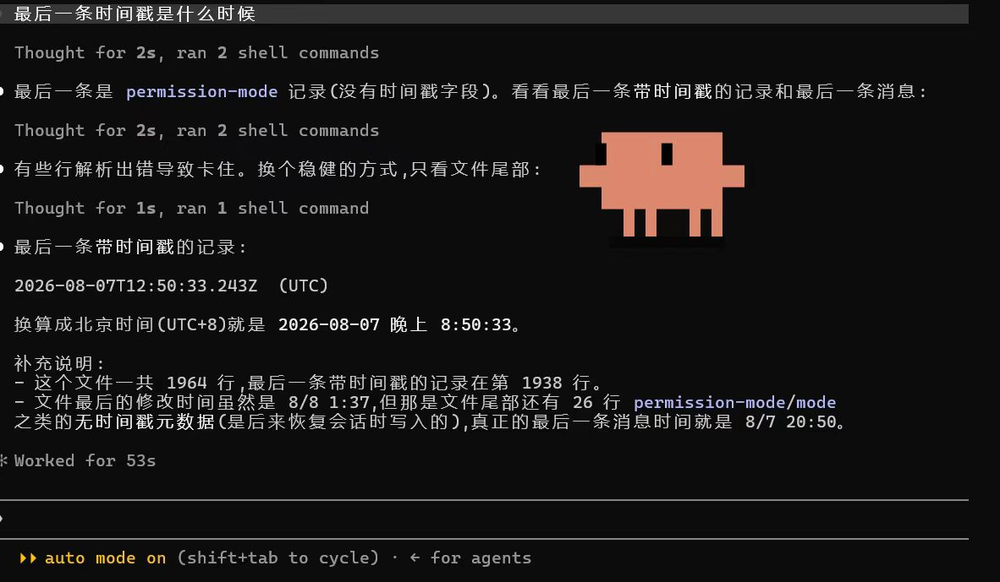
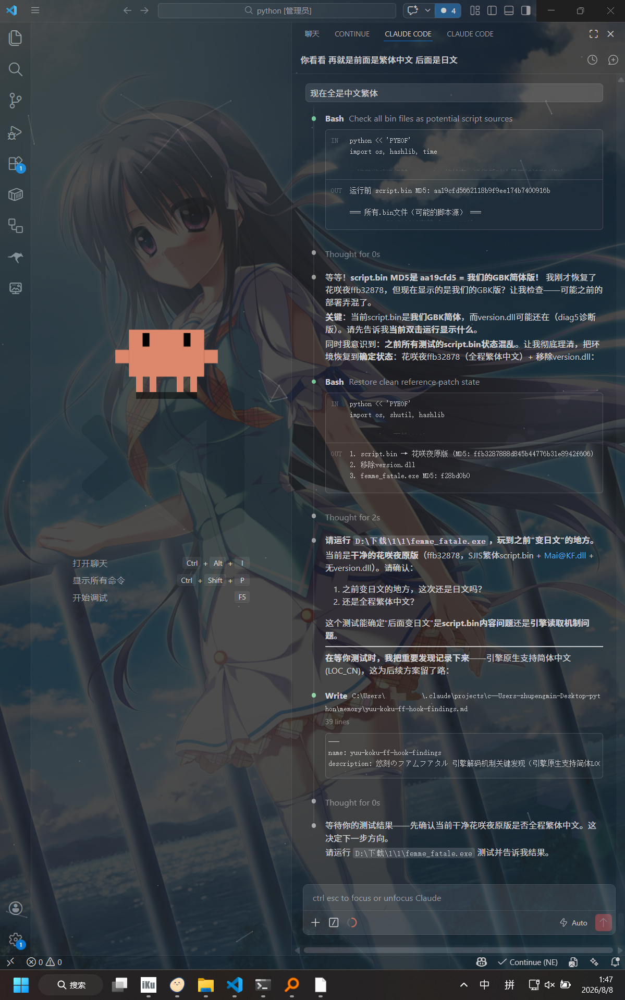
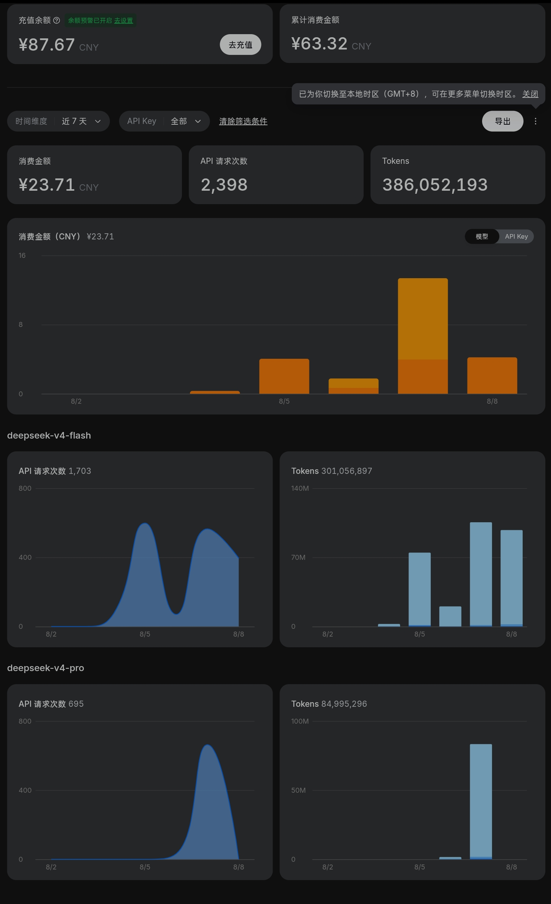

> 楼主在玩小e社的 悠刻的命运少女。

---

## 一、 游戏翻译版本现状

此游戏有三个翻译版本 都是ai翻译：
* gpt4o翻译
* Claudesonnet3.5
* 还有一个不知道

都是比较老旧的模型了 现在GPT5.6都出了。

资源本身用的是GPT4o模型翻译 质量我很不满意。

于是先是换了Claude 这个版本 由于是繁体 而且阅读起来也是比较麻烦 也是放弃了了这个版本。

---

## 二、 尝试用 AI Agent 优化翻译

于是想到了ai agent 来来优化一下翻译，因为平时比较爱捣鼓这些东西。

### 1. Antigravity + Gemini3.6flash

一开始是用的是antigravity的Gemini3.6flash，做一顿之后还是换了，Gemini模型的代码能力太拉胯了。

### 2. Claudecode + DeepSeekv4flash

于是用比较熟悉的Claudecode+DeepSeekv4flash，flash的性价比是真高。

但是前前后后从晚上八点五十搞到凌晨两点，调试了几十轮。

顺带说一句vscode里面的Claudecode插件感觉还是不如终端cli。

单纯靠自然语言编程是完全不可行的 感觉自己就好比文科生用ai 幻觉比ai高 （）。

---

## 三、 总结与延伸

暂时先用GPT4o的版本了 懒得搞其他的版本了。

前几天小e社的战巫的好结局就是用Claudecode先后尝试修改存档和内存 最后还是解包修改脚本逻辑实现的。

只能说汉化这方面还是术业有专攻🤔。
