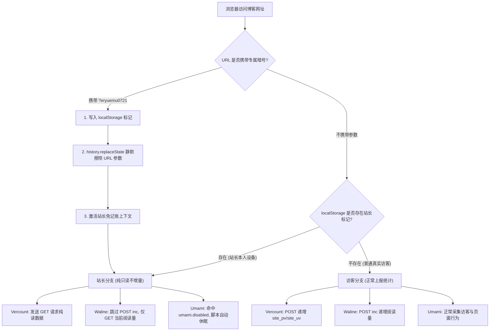

# 博客切页怒刷两千访问量：Vercount、Waline 与 Umami 三套统计机制拆解与本地零追踪模式实录

> **起因**：在给博客「关于我」页面增加阅读量与字数统计后，偶然注意到主站页脚的总访问量数字跳动极快。自己在几个主页面和文章之间来回点击切换调试，总访问量便以肉眼可见的速度不断自增——粗略估算，全站 6000 多的访问量中，至少有两千多次是站长自己日常高频调试与切页刷出来的“虚假繁荣”。
> **涉及系统**：Vercount（`events.vercount.one` 全站统计）、Waline（Supabase PostgreSQL 文章阅读量）、Umami Cloud（客户端行为分析）
> **技术栈**：Astro 5.x · ClientRouter (View Transitions) · TypeScript · Web Storage API (localStorage) · History API
> **核心结论**：单纯依靠传统服务端的“IP 黑名单”在现代代理/梯子频繁漂移的环境下完全失效。通过拆解三套统计系统的底层通信协议，利用 Vercount 的隐藏 `GET` 只读接口、Waline 只读查询参数与 Umami 官方原生免追踪规范，配合浏览器本地同源持久化存储与动态 URL 抹除，构建了一套与网络 IP 彻底解绑、对普通访客 0 影响、对搜索引擎 SEO 零干扰的**「站长免记账模式（Zero-Tracking Mode）」**。

---

## 💡 速览：三套统计系统机制与改造方案对照

| 统计系统 | 统计作用域 | 默认累加机制 | 传统 IP 封禁为何失效 | 本地免记账改造方案 |
| :--- | :--- | :--- | :--- | :--- |
| **Vercount** | 全站级 `site_pv` 与 `site_uv` | 凡发送 `POST` 请求，服务端无条件对 `site_pv` 递增 +1 | 科学上网出口 IP 随节点漂移，宽带 CGNAT 动态分配导致 IP 随时变更 | 将请求降级为 `GET` 查询，只读取 `site_pv/site_uv`，不触发数据库累加 |
| **Waline** | 单文章/页面阅读量（`time` 字段） | 前端发送 `POST /api/article` 并携带 `{ action: 'inc' }` | 每次新开标签页或不同会话均会发起递增请求 | 识别站长身份后跳过 `action: 'inc'`，直接走 `GET /api/article?type=time` 纯只读拉取 |
| **Umami** | 访问趋势、来源与访客行为 | 客户端加载脚本后自动向云端分析上报每次 Pageview 事件 | IP 变动导致被识别为全新 Session 访客，产生脏数据 | 写入 Umami 官方标准标记 `localStorage.setItem('umami.disabled', '1')`，脚本主动休眠 |

---

# 一、 问题还原：两千次虚假访问量的诞生

## 1.1 从「关于我」增加阅读量与字数说起

在近期的博客功能完善中，作者对「关于我」（`/about/`）页面进行了重构。原本该页面为一个独立的一级页面，为了保持与全站博客文章一致的视觉规范与元数据展示，页面改用 `src/layouts/BlogPost.astro` 作为通用布局模板：

```astro
---
// src/pages/about.astro
import Layout from '../layouts/BlogPost.astro';

const wordCount = 2531;
const readingTime = Math.max(1, Math.ceil(wordCount / 350));
---

<Layout
    title="关于我"
    description="关于 eryuemu（二月木）..."
    pubDate={new Date('2026-07-18T16:42:00+08:00')}
    id="about"
    wordCount={wordCount}
    readingTime={readingTime}
>
    <!-- 正文内容 -->
</Layout>
```

在接入之后，布局组件自带的字数统计、阅读时长和 Waline 阅读量计数器顺利生效。

## 1.2 异常现象：导航栏单页切页导致页脚计数疯狂自增

在完成上述页面改造后，作者在本地与生产环境反复测试页面跳转与布局表现。然而在测试过程中，注意到了一个反直觉的现象：

> **“就是 我自己本人在主页面的时候 切换导航栏 这个站最下面的总访问量一直在增加（） 就是说 我单纯想着自己浏览调试的时候 不刷量 目前看来这得有两千是我刷的”**

现象具体表现为：
1. 打开博客首页，页脚显示总访问量例如为 `6,450`；
2. 点击顶部导航栏的「关于我」，页面平滑过渡，底部数字变为 `6,451`；
3. 点击导航栏的「项目」，数字变为 `6,452`；
4. 点击回「首页」，数字再次变为 `6,453`。

只要站长在站内进行正常的页面巡检、排版校对或文章编写预览，总访问量就会以极高的频率线性上涨。博客总访问量中充斥着站长本人制造的大量无效统计。

---

# 二、 为什么常规思路行不通？（三套机制的底层剖析）

面对自身流量污染统计数据的问题，初学者往往会第一时间想到“把站长自己的 IP 加进黑名单”或者“在统计后台过滤”。但在现代开发与网络环境下，这些常规方案无一例外会彻底失效。

## 2.1 【疑问/情况】：为什么不能直接在后台把自己的 IP 封禁/排除？

> **对话复盘**：“话说应该不应该把自己的ip禁止统计了 但是这个代理ip平常一直变 不禁也没啥吧”

### 【底层技术原理】：IP 动态漂移与出口拓扑的不确定性

在服务端或统计面板中配置基于客户端 IP 的黑名单，存在两大无法克服的技术缺陷：

1. **代理节点轮询与出口 IP 高频漂移**：
   开发与折腾过程中普遍依赖 Clash / 梯子等网络代理工具。无论是开启负载均衡（Load Balance）还是根据规则自动分流，网络请求经过的代理服务器出口 IP 随时都在香港、日本、美国、新加坡之间跳变。甚至短短 10 分钟内，同一个浏览器的出口 IP 就会更换数次。任何静态的 IP 黑名单规则在此场景下都毫无意义。
2. **运营商级 NAT（CGNAT）与蜂窝网络动态分配**：
   在手机移动网络（4G/5G）或普通家用宽带环境下，宽带拨号每隔 24~48 小时被运营商强制重置分配新 IP；更关键的是，大量宽带处于运营商 CGNAT 网关内，数千个家庭共享同一个公网出口 IP。若强行封禁某个公网 IP，极有可能将处于同一网段的真实潜在访客一同误杀。

因此，**试图在网络层（L3/L4 IP）解决应用层身份标识的问题，从网络拓扑上就是不可行的**。

---

## 2.2 【疑问/情况】：为什么感觉 Umami、Waline 和 Vercount 的计数逻辑完全不一样？

> **对话复盘**：“这个umami和网页文章不是一个计数方法好像”

### 【底层技术原理】：三套统计系统的数据模型与防抖边界

博客系统中同时存在三套统计体系，各自的职责边界、去重策略与数据模型截然不同：

```text
┌────────────────────────────────────────────────────────────────────────┐
│                          博客前端 (Browser Client)                      │
└──────┬─────────────────────────┬───────────────────────────────┬───────┘
       │                         │                               │
       ▼                         ▼                               ▼
┌──────────────┐         ┌──────────────┐                ┌──────────────┐
│ Vercount API │         │  Waline API  │                │  Umami Cloud │
└──────┬───────┘         └──────┬───────┘                └──────┬───────┘
       │                         │                               │
       ▼                         ▼                               ▼
[整站 PV/UV 累加]        [单文章阅读量累加]               [全站多维会话分析]
无条件 POST 递增          sessionStorage 防抖             客户端指纹 + Session
```

1. **Vercount（全站级简单计数器）**：
   - **定位**：公益极简访问量服务，类似经典的卜算子计数器。
   - **机制**：前端发送 `POST https://events.vercount.one/api/v2/log`，携带 `{ url, isNewUv }`。只要服务端收到 `POST` 请求，其后端数据库中的 `site_pv` 计数器就会无脑递增 +1；仅在 `isNewUv: true` 时才累加 `site_uv`。
2. **Waline（基于 Supabase PostgreSQL 的单页计数器）**：
   - **定位**：伴随评论系统的文章阅读计数。
   - **机制**：针对具体文章路径（如 `/posts/my-post/`），向服务端发送带有 `{ path, type: 'time', action: 'inc' }` 的 `POST` 请求。前端在 `BlogPost.astro` 中通过 `sessionStorage.getItem('waline_pv_' + path)` 做了会话级拦截，单次会话内反复刷新不会重复递增，但重新打开浏览器或不同标签页会再次递增。
3. **Umami（专业无 Cookie 隐私分析平台）**：
   - **定位**：全功能网站流量与转化率分析。
   - **机制**：不依赖 Cookie，而是根据客户端请求头中的 IP、User-Agent 以及主机名生成临时的每日哈希指纹，用于识别独立访客和会话（Session）。同一次会话中的连续点击会被归并为一个完整的用户访问旅程，而不是粗暴地累加独立访客数。

---

## 2.3 【疑问/情况】：为什么仅仅是在主页面切换导航栏，页脚的访问量就会不停上涨？

### 【底层技术原理】：Astro View Transitions 与无状态 POST 的叠加效应

该问题的根源在于现代前端静态站点生成器（SSG）的**单页应用（SPA）路由导航事件**与**传统统计脚本**之间的冲突：

Astro 在启用 `<ClientRouter />` 后，站内所有链接的点击均被浏览器端 JavaScript 劫持，转由 HTML5 Fetch 与 DOM 交换完成页面无刷新过渡，并向全局 `document` 派发 `astro:page-load` 自定义生命周期事件。

在旧版 `Footer.astro` 的脚本中，为了确保页面跳转后页脚统计能够动态刷新，绑定了该事件：

```typescript
// 旧版逻辑缺陷演示
function setupFooterStats() {
    async function fetchStats() {
        const statUrl = window.location.href.replace(/^https?:\/\/eryuemu\.com/, 'https://www.eryuemu.com');
        
        // 缺陷所在：只要切页就无脑发起 POST 请求
        const res = await fetch('https://events.vercount.one/api/v2/log', {
            method: 'POST',
            headers: { 'Content-Type': 'application/json' },
            body: JSON.stringify({ url: statUrl, isNewUv: isNewUv })
        });
        // ...
    }
    fetchStats();
}

// 每次点击导航栏切页，均会触发一次全量 POST 上报
document.addEventListener('astro:page-load', setupFooterStats);
```

由于 Vercount 后端的逻辑是**“见 POST 即累加”**，当站长在导航栏中从 `首页` -> `归档` -> `项目` -> `关于我` 点击一圈时，浏览器在几十秒内连续发出了 4 次 `POST` 请求，Vercount 忠实地将全站 `site_pv` 增加了 4。

---

# 三、 架构设计：构建「站长免记账模式」

既然网络层 IP 无法识别站长，服务端又缺乏传统后台的登录鉴权 Session，最佳的工程解决方案必须下沉到**客户端持久化存储（Browser Storage）**层。

实现一套合格的“免记账模式”，必须同时满足以下四大严苛要求：
1. **网络无感**：不受梯子、代理节点切换、断网重连与宽带变动的影响；
2. **零权限泄露**：不引入复杂的账号密码系统，不暴露任何私有数据库或管理权限；
3. **零游客干扰**：对普通读者 100% 透明，完全保留真实的访客统计能力；
4. **零 SEO 风险**：不破坏页面语义，不产生重复 URL，杜绝被搜索引擎判定为作弊伪装（Cloaking）。



## 3.1 突破点：挖掘 Vercount API 的隐藏 GET 只读接口

要让页脚能够正常显示当前的访问量与访客数，同时又绝不增加统计，核心在于**统计接口是否支持纯读模式**。

通过对 Vercount 服务端接口协议进行逆向抓包与终端验证测试：

```bash
# 1. 验证 POST 请求（默认行为）：返回数据，且后端内部执行 site_pv = site_pv + 1
curl -X POST https://events.vercount.one/api/v2/log \
  -H "Content-Type: application/json" \
  -d '{"url":"https://www.eryuemu.com","isNewUv":false}'

# 2. 验证 GET 请求（隐藏只读模式）：
curl -s "https://events.vercount.one/api/v2/log?url=https%3A%2F%2Fwww.eryuemu.com"
```

终端返回 JSON 数据：
```json
{
  "status": "success",
  "message": "Data retrieved successfully",
  "data": {
    "site_uv": 1023,
    "site_pv": 6458,
    "page_pv": 2433
  }
}
```

多次连续执行上述 `GET` 请求，返回的 `site_pv` 稳定维持在 `6458` 不动，未发生任何增量！这证明了：**当使用 HTTP GET 查询带参 URL 时，Vercount 仅执行只读查询，完美契合站长免记账需求**。

## 3.2 Waline 与 Umami 的免追踪对接

1. **Waline 只读查询**：
   在 `BlogPost.astro` 中，普通访客走的是 `POST /api/article`（携带 `action: 'inc'`）；而站长身份被识别后，直接绕过该分支，仅调用 `GET /api/article?path=...&type=time`，只拉取当前存储的计数值展示在文章侧边栏与头部。
2. **Umami 官方原生免追踪规范**：
   查阅 Umami 官方开发者文档，Umami 追踪脚本内置了对本地存储的检测规则：只要宿主环境的 `localStorage` 中存在名为 `umami.disabled` 且值为 `'1'` 的项，追踪脚本就会在初始化时直接退出，不发送任何事件上报。

---

# 四、 用户核心疑问深度技术解析

在方案设计与实现过程中，围绕该机制的底层原理、安全性与边界条件，产生了一系列极具技术代表性的关键探讨。以下按照真实提炼出的疑问展开逐一解析。

---

### 4.1 【疑问/情况】：这套机制到底在我的电脑上做了什么？修改了系统文件吗？

> **对话复盘**：“啥意思 ？ 没听懂 只在我这个电脑上做了什么”

#### 【底层技术原理】：操作系统零侵入与客户端运行时沙箱

该方案**没有对本地电脑操作系统进行任何修改**：
- **无系统与网络改动**：没有修改 `/etc/hosts`，没有修改注册表，没有安装任何后台进程，也没有修改 Clash 代理规则。
- **纯代码逻辑部署**：所有代码变更均位于博客源代码仓库中，经构建后部署在 Vercel 静态 CDN 边缘节点。
- **数据存储宿主为浏览器沙箱**：当且仅当站长在浏览器中输入特定参数时，页面中运行的内联 JavaScript 脚本调用了 W3C 标准的浏览器本地存储接口（`window.localStorage.setItem()`），在浏览器的用户配置文件（Profile）目录下写入了一条键值对数据。数据完全受限于浏览器的应用沙箱之内。

---

### 4.2 【疑问/情况】：这会影响正常游客的计数与浏览吗？

> **对话复盘**：“我草这是什么原理 不影响游客计数浏览吧”

#### 【底层技术原理】：同源数据隔离与条件分支短路

对于互联网上的普通读者，其访问链路完全不受影响：
1. **数据状态隔离**：普通访客访问的是干净的官方域名（`https://eryuemu.com/`），其本地环境从未写入过 `eryuemu_is_owner` 标识；
2. **运行时分支命中**：前端代码在执行统计上报前执行布尔运算判定：
   ```typescript
   const isOwner = typeof localStorage !== 'undefined' && localStorage.getItem('eryuemu_is_owner') === '1';
   ```
   对普通访客而言，该表达式恒为 `false`；
3. **统计链路原样执行**：访客的浏览器继续向 Vercount 发送 `POST` 增量请求，向 Waline 发送 `inc` 增量请求，Umami 脚本正常工作。整个渲染树与 DOM 结构对普通读者无任何区别。

---

### 4.3 【疑问/情况】：这会对网站的 SEO 和搜索引擎爬虫产生负面影响吗？

> **对话复盘**：“再就是 不影响seo吧”

#### 【底层技术原理】：爬虫无态性、标准规范链接与杜绝 Cloaking

对搜索引擎优化（SEO）的影响为 **0**，原因由底层爬虫运行机制决定：

1. **搜索引擎爬虫（Googlebot / Bingbot）不带参数**：
   搜索引擎蜘蛛在抓取网页时，遵循 Sitemap 与全站内链抓取，请求的 URL 始终为标准的规范路径（如 `/about/`），绝不会拼接站长的暗号参数。
2. **爬虫无持久化会话（Stateless Client）**：
   即使现代 Googlebot 具备无头浏览器（Headless Chromium）渲染能力，爬虫在每次抓取请求后都会销毁沙箱环境，绝不跨请求持久化存储 `localStorage` 数据。
3. **规范链接（Canonical URL）强约束**：
   在 HTML 头部，`<link rel="canonical" href="..." />` 永远指向服务端计算出的纯净路径。
4. **拒绝作弊伪装（No Cloaking）**：
   搜索引擎重点惩罚的是“向爬虫返回一套内容、向人类返回另一套欺诈内容”的 Cloaking 作弊手法。而本方案中，服务端向所有人下发的 HTML 源码、Meta 标签、结构化数据（JSON-LD）100% 保持严格同构，仅在客户端执行异步请求时做只读/写入路由，完全符合搜索引擎质量准则。

---

### 4.4 【疑问/情况】：如果别人也知道了这个暗号，他们也能复刻吗？会不会有权限安全风险？

> **对话复盘**：“也就是说存浏览器里面了什么东西 如果其他人知道的话 按理说他们也能复刻”

#### 【底层技术原理】：鉴权认证（Authentication）与客户端免追踪（Opt-out）的本质区别

站长敏锐地指出了客户端标记的共享风险，但该机制在安全层面上是绝对安全的：

1. **零权限赋予**：
   `eryuemu_is_owner` 只是一个**客户端自愿放弃被统计的开关（Client-side Opt-out Flag）**，而非服务端授权令牌（如 JWT Token、OAuth 凭据或 Admin Password）。它不赋予持有者任何管理后台权限、无法篡改任何文章数据、无法删除评论，更无法访问 Supabase 数据库。
2. **复刻的唯一后果**：
   若有其他访客好奇地在浏览器中输入了该暗号，其产生的唯一影响是：**该访客今后浏览本博客时，也不会被计入总访问量**。这与用户在浏览器中安装了 uBlock Origin、AdGuard 或开启隐私浏览模式产生的效果完全一致，对站长与网站系统没有任何破坏性。

---

### 4.5 【疑问/情况】：暗号名字有什么要求？能存在多久？底层存储原理是什么？

> **对话复盘**：“可以怎么设置？ 名字有什么要求 再就是 这个可以持续存在多久 再就是 这个是什么存储的原理 简单说说”

#### 【底层技术原理】：URL 规范、存储生命周期与 HTML5 Web Storage 机制

针对这四个连环技术发问，从底层规范展开解析：

#### 1. URL Query 参数命名规范
URL 问号后面的参数属于 RFC 3986 规范中的 Query 组件：
- **安全字符集**：推荐使用英文字母（`a-z`, `A-Z`）、阿拉伯数字（`0-9`）、下划线 `_` 和连字符 `-`；
- **禁止字符**：避免包含空格、中文以及保留控制符（如 `#` 代表锚点，`&` 代表参数分隔符，`?` 代表查询开始），若包含必须经过 URL Percent-Encoding（百分号编码）。

#### 2. 生命周期与持久化时效对比
在现代浏览器中，主要存储方案的时效边界如下：

| 存储类型 | 数据持久化位置 | 过期时间（Lifecycle） | 跨标签页共享 | 随网络请求传输 |
| :--- | :--- | :--- | :--- | :--- |
| **SessionStorage** | 内存 | 标签页关闭即销毁 | 否（仅限同标签页） | 否 |
| **Cookie** | 磁盘文件 | 由 `Expires / Max-Age` 指定（通常有期） | 是 | **是（每次 HTTP 均携带）** |
| **LocalStorage** | **磁盘数据库** | **永久有效（除非主动清除）** | **是** | **否（纯本地静默）** |

因为选用了 `localStorage`，一旦存入，即便电脑关机、浏览器重启、节点反复切换，标记依然永久驻留。只有在以下三种特定场景下失效：
- 站长在浏览器设置中执行了“清除浏览数据 / 清理 Cookie 与网站数据”；
- 运行在无痕窗口 / 隐私模式下（窗口关闭后沙箱全量丢弃）；
- 更换了全新的物理设备或启用了新的独立浏览器配置文件。

#### 3. 底层存储与安全隔离机制
- **磁盘物理载体**：在 Chromium 内核（Chrome、Edge）中，`localStorage` 物理保存在用户数据目录下的 `Local Storage/leveldb/` 数据库中；在 Gecko 内核（Firefox）中，保存在 `webappsstore.sqlite` 文件中。
- **同源策略（Same-Origin Policy）强隔离**：浏览器按照协议、域名、端口三元组（`https` + `eryuemu.com` + `443`）开辟沙箱。任何第三方网站（例如百度、Google）的前端 JavaScript 脚本均**绝对无法跨域读取** `eryuemu.com` 沙箱内的任何键值数据。
- **零网络开销**：传统 Cookie 无论资源是否需要，每次请求静态图片、CSS 都会在 Request Header 中携带，浪费上行带宽；`localStorage` 纯粹存放在本地，除非脚本主动读取，否则不会产生任何多余的网络字节。

---

# 五、 落地实装：定制专属暗号 `eryuemu0721` 与完整代码

根据需求，将通用触发参数收敛为站长专属暗号 **`eryuemu0721`**，并在全站组件中完成闭环适配。

## 5.1 全局检测与静默抹除：`src/components/BaseHead.astro`

在全站通用的 `<head>` 区域注入一段轻量自执行脚本，负责暗号捕获、状态存取与 URL 痕迹清理：

```astro
<!-- src/components/BaseHead.astro -->
<!-- Admin / Owner zero-tracking mode detector -->
<script is:inline>
	try {
		const params = new URLSearchParams(window.location.search);
		const val = params.get('eryuemu0721');
		const isTurnOff = val === '0' || val === 'off';
		const isTurnOn = (params.has('eryuemu0721') && !isTurnOff) || 
		                 params.get('token') === 'eryuemu0721' || 
		                 params.get('secret') === 'eryuemu0721';

		if (isTurnOn) {
			localStorage.setItem('eryuemu_is_owner', '1');
			localStorage.setItem('umami.disabled', '1');
			console.log('🛡️ [站长免记账模式] 已开启：全站统计（Vercount/Umami/Waline）均处于纯只读状态，绝不增加自身访问！');
			params.delete('eryuemu0721');
			params.delete('token');
			params.delete('secret');
			const cleanSearch = params.toString() ? '?' + params.toString() : '';
			// 利用 HTML5 History API 在不刷新页面的前提下抹除地址栏中的暗号参数
			window.history.replaceState({}, '', window.location.pathname + cleanSearch + window.location.hash);
		} else if (isTurnOff) {
			localStorage.removeItem('eryuemu_is_owner');
			localStorage.removeItem('umami.disabled');
			console.log('🔄 [站长免记账模式] 已关闭：恢复正常访客统计。');
			params.delete('eryuemu0721');
			const cleanSearch = params.toString() ? '?' + params.toString() : '';
			window.history.replaceState({}, '', window.location.pathname + cleanSearch + window.location.hash);
		}
	} catch (e) {}
</script>
```

> **设计亮点**：通过 `window.history.replaceState`，当站长在地址栏键入 `https://eryuemu.com/?eryuemu0721` 并回车后，参数在毫秒内被读取并写入磁盘，随后地址栏中的 `?eryuemu0721` 瞬间被擦除，保持 URL 干净，避免站长在后续复制分享链接时误将暗号泄露给他人。

---

## 5.2 页脚访问量纯只读改造：`src/components/Footer.astro`

在页脚统计中引入只读分支逻辑。当检测到站长身份时，将原本的 `POST` 上报切换为隐藏的带参 `GET` 接口：

```typescript
// src/components/Footer.astro (片段)
async function fetchStats() {
    const hostname = window.location.hostname;
    // 本地开发环境不统计，避免污染生产数据
    if (hostname === 'localhost' || hostname === '127.0.0.1') {
        const visitorsEl = document.getElementById('visitors-count');
        const viewsEl = document.getElementById('views-count');
        if (visitorsEl) visitorsEl.innerText = '1 (本地)';
        if (viewsEl) viewsEl.innerText = '1 (本地)';
        return;
    }

    let isOwner = false;
    try {
        isOwner = typeof localStorage !== 'undefined' && localStorage.getItem('eryuemu_is_owner') === '1';
    } catch (e) {}

    const hasVisited = checkHasVisited();
    // 若为站长，强行将 isNewUv 置为 false，避免消耗 UV
    const isNewUv = !hasVisited && !isOwner;

    if (isNewUv) {
        markAsVisited();
    }

    const statUrl = window.location.href.replace(/^https?:\/\/eryuemu\.com/, 'https://www.eryuemu.com');

    try {
        let res: Response;
        if (isOwner) {
            // 站长免记账模式：使用 GET 请求仅获取当前数据，完全不增加 site_pv 和 site_uv
            res = await fetch(`${API_URL}?url=${encodeURIComponent(statUrl)}`);
        } else {
            // 真实访客模式：正常 POST 累加
            res = await fetch(API_URL, {
                method: 'POST',
                headers: {
                    'Content-Type': 'application/json'
                },
                body: JSON.stringify({
                    url: statUrl,
                    isNewUv: isNewUv
                })
            });
        }

        if (res.ok) {
            const json = await res.json();
            const data = json.data || json;
            
            const siteUv = Number(data.site_uv || 0);
            const sitePv = Number(data.site_pv || 0);

            const visitorsEl = document.getElementById('visitors-count');
            const viewsEl = document.getElementById('views-count');
            if (visitorsEl) visitorsEl.innerText = siteUv.toLocaleString();
            if (viewsEl) {
                viewsEl.innerText = sitePv.toLocaleString();
                // 站长模式下赋予原生 title 提示，不破坏既有 UI 视觉
                if (isOwner) {
                    viewsEl.title = '站长免记账模式 (仅读取不增量)';
                }
            }
        }
    } catch (err) {
        console.error('Failed to fetch stats:', err);
    }
}
```

---

## 5.3 文章阅读量纯只读改造：`src/layouts/BlogPost.astro`

在文章详情与「关于我」通用的布局模板中，对 Waline 阅读量计数逻辑实施同样的只读降级：

```typescript
// src/layouts/BlogPost.astro (片段)
async function updatePageviews() {
    const els = document.querySelectorAll<HTMLElement>('.waline-pageview-count');
    if (els.length === 0 || !WALINE_SERVER_URL) return;

    const rawPath = window.location.pathname;
    const currentPath = rawPath.replace(/\/+$/, '') || '/';
    const sessionKey = `waline_pv_${currentPath}`;
    const alreadyViewed = sessionStorage.getItem(sessionKey);

    let isOwner = false;
    try {
        isOwner = typeof localStorage !== 'undefined' && localStorage.getItem('eryuemu_is_owner') === '1';
    } catch (e) {}

    try {
        let count: number | null = null;

        // 仅当非站长且未在当前会话浏览过时，才发起 POST inc 递增请求
        if (!alreadyViewed && !isOwner) {
            const res = await fetch(`${WALINE_SERVER_URL.replace(/\/+$/, '')}/api/article`, {
                method: 'POST',
                headers: { 'Content-Type': 'application/json' },
                body: JSON.stringify({ path: currentPath, type: 'time', action: 'inc' }),
            });
            if (res.ok) {
                const data = await res.json();
                if (data?.data?.[0]?.time !== undefined) {
                    count = data.data[0].time;
                    sessionStorage.setItem(sessionKey, '1');
                }
            }
        }

        // 站长模式、重复切页或降级读取：执行纯 GET 接口获取当前阅读量
        if (count === null) {
            const res = await fetch(
                `${WALINE_SERVER_URL.replace(/\/+$/, '')}/api/article?path=${encodeURIComponent(currentPath)}&type=time`
            );
            if (res.ok) {
                const data = await res.json();
                if (data?.data?.[0]?.time !== undefined) {
                    count = data.data[0].time;
                }
            }
        }

        if (count !== null) {
            const formatted = count.toLocaleString();
            els.forEach((el) => {
                const elPath = el.getAttribute('data-path');
                if (!elPath || elPath === currentPath) {
                    el.textContent = formatted;
                }
            });
        }
    } catch (err) {
        console.warn('Failed to load pageviews from Waline:', err);
    }
}
```

---

# 六、 验证与日常使用指南

系统构建完成并推送到 GitHub 触发 Vercel 自动部署后，整套机制在生产环境中完全闭环。

### 1. 站长日常启用方式
在个人主力设备（PC 端 Chrome / Edge / Firefox 以及手机端移动浏览器）的地址栏中访问一次：
```text
https://eryuemu.com/?eryuemu0721
```
直接访问带值参数 `https://eryuemu.com/?eryuemu0721=1` 也完全支持。

- **预期验证现象**：
  1. 页面加载完成瞬间，地址栏后缀自动还原为 `https://eryuemu.com/`；
  2. 打开浏览器 DevTools 控制台，可看到日志输出：
     `🛡️ [站长免记账模式] 已开启：全站统计（Vercount/Umami/Waline）均处于纯只读状态，绝不增加自身访问！`；
  3. 在站内高频切换各个页面，页脚总访问量数字与网络面板中 Waline 请求均保持恒定只读，数字不再异常跳动；
  4. 鼠标悬停在页脚总访问量数字上，浮现浏览器原生气泡：`站长免记账模式 (仅读取不增量)`。

### 2. 模式重置/退出（备用）
若后续需要测试真实访客的上报链路，可在浏览器中访问：
```text
https://eryuemu.com/?eryuemu0721=0
```
也可以访问 `https://eryuemu.com/?eryuemu0721=off`，控制台将输出恢复提示，并清除磁盘中的站长标记。
