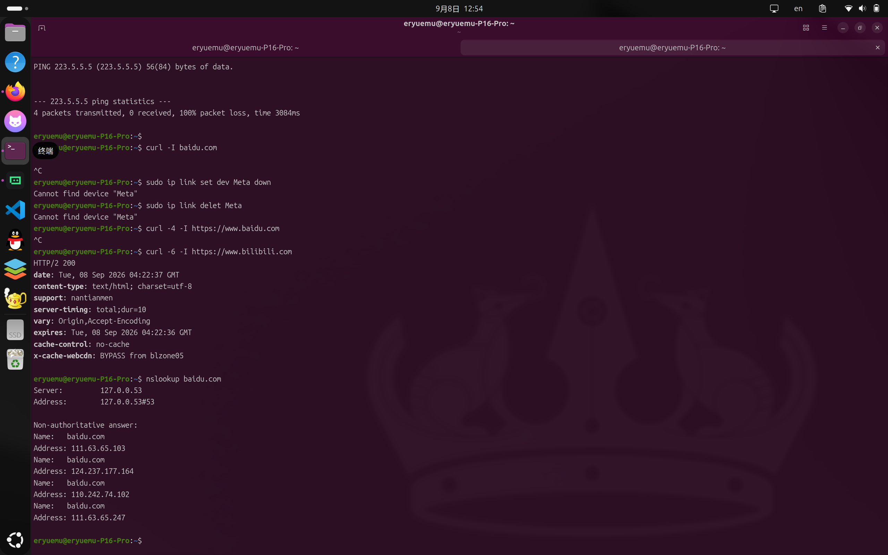

# 一次宽带欠费造成的乌龙

> **症状**：昨夜挂机运行 Docker 抓取任务，中午回来发现电脑网络中断。`ping 223.5.5.5` 100% 丢包，`curl -4` 访问外网直接超时，访问 HTTPS 报 TLS unexpected EOF；但 `curl -6` 访问 B 站正常返回 HTTP 200，`nslookup` 也能正常解析出公网 A 记录。同时，局域网内另一台运行 QQ Bot 的 Fedora 机器也出现容器内 TCP 全断的故障。  
> **排查过程**：网页打不开以为是普通 DNS 卡死，连续重启电脑两次无果 → 手机端网页版 Gemini 敲命令排查，发现“能上 B 站但搜不了网页”，定位为 IPv4 与 IPv6 割裂 → 打开 Trae 协同排查，本机停 Docker / 删虚拟网卡，局域网多机同时异常 → 结合高并发任务与舍友打游戏等表象，Trae 深入推断为“路由器 NAT 表打满”，建议重启路由器。  
> **转折与根因**：断电重启路由器后依然无法上网，浏览器重定向至 `lock.he.cninfo.net`，舍友确认宽带欠费，充值缴费后网络秒恢复——根因为纯粹的运营商宽带欠费停机。  
> **延伸测试**：分析欠费状态下 IPv6 仍能通信的机制；针对 Clash Verge TUN 模式下的 IPv6 开关进行实际抓包测试，验证是否存在真实 IP 泄露与异常分流。

---

## 0. 结论速览（先看这个）

| 排查节点 | 初始推断 / 误导因素 | 实际底层事实 |
|---|---|---|
| **起因** | 昨晚挂机运行 Docker 抓取任务，中午 IPv4 中断 | 纯属巧合，恰好赶上宽带计费周期欠费停机 |
| **初次尝试** | 以为是类似 Windows 的 DNS 或网络缓存卡顿，连续重启两次电脑 | 重启无法解决上游运营商机房侧的阻断策略 |
| **手机排查** | 手机端 Gemini 诊断：发现能上 B 站但无法搜索网页 | 揭示出 IPv4 中断与 IPv6 畅通的协议栈割裂现象 |
| **多机同断** | Fedora 机器上的 QQ Bot 容器同时断连 | 容器走 IPv4 连接腾讯服务器，同样被运营商机房阻断 |
| **关键干扰** | 舍友在打游戏，据此推测“老连接存活，新建连接被丢弃” | 宽带上午其实就已停机，舍友打游戏大概率直接切了手机热点，制造了“局域网一切正常”的视觉假象 |
| **AI 推导** | Trae 判定家用路由器 conntrack 表耗尽，建议断电重启路由器 | 属于将偶发巧合与典型理论案例生硬匹配导致的误判 |
| **证伪节点** | 重启路由器后网络未通，跳转至 `lock.he.cninfo.net` | 运营商机房（BRAS）在 IPv4 侧执行欠费劫持；充值后无须任何配置改动直接恢复 |
| **欠费通信机制** | 欠费停机状态下为何还能通过 Trae 与 AI 对话数小时 | 运营商欠费控制系统仅部署在 IPv4 上，未限制 IPv6 链路；系统触发双栈回退走 IPv6 直达后端 |
| **IPv6 开关建议** | 代理开启 TUN + IPv6 是否存在泄露真实 IP 风险 | 抓包证明当前节点支持 IPv6 且 Fake-IP 接管严格；但常规使用仍建议关闭代理 IPv6 以防外网握手延迟与断流 |

---

## 1. 现象与最初排查：从重启两次到手机端 Gemini

昨夜在 Ubuntu 工作站上通过 Docker 运行新浪视频归档抓取项目（`archiveteam/sinavideo-grab`），同时后台常驻运行 Clash Verge 的 TUN 模式以接管全局流量。

中午 12:48 回到工位，打开浏览器发现网页全部处于无限等待状态。当时的第一反应和以往在 Windows 上遇到断网类似，以为大概率是 DNS 解析缓存卡死或者网络协议栈偶发抽风，于是习惯性地执行了常规操作——**直接重启电脑**。

重启进系统后试了试，浏览器依然打不开任何网页；心想可能是没彻底刷新，接着又**重启了第二次**，结果发现依旧毫无变化。

连续重启两次都没解决，我意识到这绝非单纯的系统偶发性小故障。由于电脑端浏览器完全连不上网，我便拿出手机打开网页版 Gemini 寻求排查思路。

手机端的 Gemini 建议在 Linux 终端敲一组基础网络诊断命令来定位链路故障点。我按照提示在终端敲入测试命令，结果出现了一组自相矛盾的奇特现象：**B 站居然能秒级打开，但在浏览器里使用搜索引擎或者访问其他常见网页却完全连不上**。

在终端中执行命令复现并抓取现象：



```bash
# 1. ping 常用公共 DNS，完全不通
eryuemu@eryuemu-P16-Pro:~$ ping -c 4 223.5.5.5
PING 223.5.5.5 (223.5.5.5) 56(84) bytes of data.

--- 223.5.5.5 ping statistics ---
4 packets transmitted, 0 received, 100% packet loss, time 3077ms

# 2. curl 访问国内站点，提示 TLS 握手异常断开
eryuemu@eryuemu-P16-Pro:~$ curl -v https://www.bilibili.com
* Host www.bilibili.com:443 was resolved.
* IPv6: fdfe:dcba:9876::12
* IPv4: 198.18.0.16
* Trying [fdfe:dcba:9876::12]:443...
* TLS connect error: error:0A000126:SSL routines::unexpected eof while reading
curl: (35) TLS connect error: error:0A000126:SSL routines::unexpected eof while reading

# 3. 指定 IPv4 访问，直接超时挂起
eryuemu@eryuemu-P16-Pro:~$ curl -4 -I https://www.baidu.com
^C

# 4. 指定 IPv6 访问，秒级返回正常响应
eryuemu@eryuemu-P16-Pro:~$ curl -6 -I https://www.bilibili.com
HTTP/2 200 
date: Tue, 08 Sep 2026 04:22:37 GMT
content-type: text/html; charset=utf-8
server-timing: total;dur=10

# 5. DNS 解析功能完全正常
eryuemu@eryuemu-P16-Pro:~$ nslookup baidu.com
Server:		127.0.0.53
Address:	127.0.0.53#53

Non-authoritative answer:
Name:	baidu.com
Address: 111.63.65.103
Name:	baidu.com
Address: 124.237.177.164
```

异常表现概括：
* **IPv4 链路**：全阻断，ICMP 丢包率 100%，TCP 握手无法完成（百度等纯 IPv4 或优先 IPv4 的搜索入口因此无法连接）；
* **IPv6 链路**：完全通畅，B 站等全面支持 IPv6 的服务通过双栈直接秒开；
* **域名解析**：系统 DNS 可正常返回 A 记录。

手机端 Gemini 据此明确提示：**这是典型的 IPv4 与 IPv6 链路割裂问题（IPv4 全断，但 IPv6 畅通）**。

在手机屏幕上看着提示、再手动往电脑终端敲命令实在不够高效。既然 IPv6 完全通畅，我便决定打开本地安装的 Trae（AI IDE）来进行协同排查。得益于 Trae 桌面端能够通过 IPv6 正常连接其云端接口，我们得以在断网状态下开启对话，于是便有了最初向 Trae 抛出问题的那一幕，以及随后的全流程推导。

---

## 2. 本机初步尝试与局域网关联设备异常

在转向 Trae 进行深入推导前后，针对昨晚高并发抓取容器可能对本地网络接口或路由表造成污染的猜想，我首先在本机执行了以下操作：

```bash
# 停止抓取容器与 Docker 守护进程
sudo systemctl stop docker

# 怀疑 Clash 的虚拟网卡处于异常状态，尝试删除
sudo ip link set dev Meta down
sudo ip link delete Meta

# 重启网络管理器与本地解析服务
sudo systemctl restart NetworkManager
sudo systemctl restart systemd-resolved
```

执行后复测，问题依然存在：IPv4 依然无法外连，IPv6 依然正常。

此时，旁边局域网内的另一台 **Fedora 机器**也出现故障：
该机器常驻运行 QQ Bot（Docker 容器运行 NapCat），容器日志显示无法连接腾讯服务器，报错“DNS 解析仅返回 IPv6，容器无 IPv6 地址，容器内 TCP 握手全断”。

两台物理机器同时出现“IPv4 中断、IPv6 正常”的症状，排除了单机软件配置损坏的可能性。

---

## 3. 与 Trae 的排查过程与推导误判

将两台机器的症状和日志交由 Trae 分析。

起初 Trae 推测是我手动执行 `ip link delete Meta` 导致内核参数 `net.ipv4.ip_forward` 被意外修改为 0，从而阻断了转发。但我指出 **Fedora 机器没有安装过任何代理工具，仅运行了容器**。

随后，Trae 结合以下线索进行了逻辑推导：
1. 本机昨夜至中午持续运行大并发爬虫任务，产生大量短连接；
2. 局域网内舍友当时在打游戏，让我误以为“别人网络完好，只有我的机器有问题”；
3. IPv4 新建 TCP 连接全部超时失败，但理论上既有存量连接可能仍处于保持状态；
4. IPv6 在局域网中走无状态或 DHCPv6 直通，不依赖路由器的 IPv4 NAT 转换。

基于上述线索，Trae 给出了推断：
> 家用路由器的 NAT 连接跟踪表（conntrack）被长时间运行的抓取任务耗尽，导致路由器内存无法记录新的连接映射，从而主动丢弃所有新的 IPv4 SYN 包；而旧连接和不需要 NAT 状态转换的 IPv6 则不受影响。解决方案为重启家用路由器以重置连接跟踪表。

Trae 建议断电重启路由器，并给出简化结论以便同步给局域网其他设备。此时该推导在逻辑上完全自洽，符合所有观察到的表象。

---

## 4. 验证、转折与最终破案

由于舍友正在使用网络，排查暂停并等待适当时机。

游戏结束后，我对路由器执行了断电冷重启。重新上电并连接 Wi-Fi 后，网络并未恢复正常，反而电脑与手机端同时触发了系统级的网络受限提示：

> **“此网络需要登录/认证”**

点击认证后，浏览器被强制重定向至以下地址：  
`http://lock.he.cninfo.net/...`

查询该域名可知，这是**河南联通宽带欠费停机专用的重定向拦截门户**。

与此同时，舍友查询了宽带扣费记录，确认宽带账户因欠费已被运营商实施停机拦截。舍友随后完成了缴费充值（包年 660 元），我们在群里分摊了费用并重新通电插座：


*图：微信群聊确认宽带续费成功与分摊转账*

事后梳理时间线才破案：其实宽带在上午就已经断了，舍友开黑时大概率也是因为连不上 Wi-Fi，顺手就切了手机移动流量热点，根本没去深究网络状态，结果无意间制造了一个“局域网一切正常”的视觉假象。

完成缴费后，两分钟内无需重启任何设备或修改任何配置，本机的 IPv4 ping、网页访问全部恢复正常。

**实测结果彻底推翻了前期的推断**：
* 路由器连接跟踪表并未打满；
* 内核转发参数与本地网络配置均无问题；
* 根本原因始终是运营商机房端执行的欠费阻断策略。

---

## 5. 机制解密：为何欠费停机时 IPv6 仍能通信？

在整个排查过程中，最核心的技术疑问在于：**既然宽带早已欠费停机，为何能在数小时内持续在 Trae 中与 AI 正常进行文字会话？**

事后梳理出运营商的控制机制如下：

1. **单栈欠费控制网关**：  
   运营商机房（BRAS/BNG）的计费认证系统建设年代较早，很多策略控制设备仅部署在 IPv4 链路上。欠费时，网关只对 IPv4 流量执行封锁，并将 HTTP/HTTPS 请求劫持重定向到认证页面（这正是前文 `curl -v https://www.bilibili.com` 报 `TLS unexpected eof` 的根本原因：机房强行篡改目标 IP 返回拦截页面，导致 TLS 握手证书校验失败被强制断开）。
2. **IPv6 链路处于透传状态**：  
   机房控制网关未对 IPv6 流量配置对应的欠费阻断规则，光猫的 PPPoE/动态 IPv6 链路只要物理层连接正常，IPv6 报文便直接透传至运营商骨干网。
3. **应用层的双栈自动回退**：  
   Trae 桌面端的后端 API 域名解析具备公网 IPv6 地址，同时智谱、字节等国内云服务均已完成 IPv6 改造。当操作系统底层网络协议栈（Happy Eyeballs 算法）发现 IPv4 握手持续超时后，自动将连接透明回退至 IPv6 发起请求，从而实现了欠费期间 AI 会话的完全通畅。

---

## 6. 延伸测试：Clash Verge 的 TUN 模式与 IPv6 开关

在网络恢复后，针对日常使用的代理配置进行了进一步思考：在 Windows 环境中，我通常会主动关闭代理客户端的 IPv6 开关；而在 Linux 下的 Clash Verge 中，当前配置保持了 `tun.enable: true` 与 `ipv6: true` 同时开启的状态。

开启 TUN 模式与 IPv6 时，是否会存在真实 IP 泄露或流量异常旁路的问题？对此进行了底层实测。

### 抓包与出网测试

使用 `--noproxy "*"` 绕过环境变量，强制流量全部由 TUN 虚拟网卡接管，分别测试境外与国内流量：

```bash
# 1. 境外纯 IPv6 测试（访问第三方 IP 探测接口）
$ curl --noproxy "*" -s https://v6.ident.me
2a12:e100:21:0:114:514:1919:810

# 2. 境外 Cloudflare 链路追踪
$ curl --noproxy "*" -s https://cloudflare.com/cdn-cgi/trace | grep -E "ip|loc"
ip=103.151.173.210
loc=JP

# 3. 国内双栈站点直连测试
$ curl --noproxy "*" -s http://myip.ipip.net
当前 IP：2408:821a:5310:f870:xxxx  来自于：中国 河北 保定  联通
```

### 测试结论

1. **境外防漏 IP 表现正常**：  
   当前选用的日本代理节点自身配置了 IPv6 出口（返回的 `2a12:e100:...` 为海外数据中心地址）。境外域名请求首先由 Clash 的 Fake-IP 机制分配虚拟 IPv6 地址，流量被路由表导入 `Meta` 虚拟网卡，再通过代理节点转发出去，对端无法获取本地真实的联通 IPv6。
2. **国内分流规则生效**：  
   访问国内站点命中直连规则，流量由物理网卡直出，正确显示本地联通 IPv6，保证了国内访问速度且不消耗代理流量。

### 为什么在常规使用中仍建议关闭代理 IPv6？

尽管当前节点的配置没有发生泄漏，但从通用性角度考虑，关闭代理软件中的 IPv6 开关仍然是更推荐的方案，原因有两点：

1. **代理节点兼容性问题（外网卡顿主要来源）**：  
   绝大多数商业代理节点并不提供稳定的 IPv6 出口落地能力。若代理软件开启 IPv6，客户端在访问支持双栈的境外网站时会优先尝试发起 IPv6 连接；如果节点无法处理该流量，客户端必须等待数秒的握手超时，才会回退到 IPv4。**日常使用中访问某些外网页面偶尔出现 3~5 秒的转圈等待，大部分均由节点不支持 IPv6 触发的超时回退导致。**
2. **裸 IP 访问绕过风险**：  
   在默认的路由规则下，Fake-IP 仅能劫持域名请求。如果某些特定程序直接向裸 IPv6 地址发起连接，在未开启 `strict-route`（严格路由模式）的情况下，该连接可能会绕过虚拟网卡直接由物理网卡发出。

**建议**：除高校校园网 IPv6 免流或特定 PT/BT 做种需求外，普通网页浏览和开发场景下，建议直接在 Clash Verge 设置中**关闭 IPv6 开关**，仅保留 IPv4 代理通道，兼顾稳定性与防护性。

---

## 7. 总结

回顾本次排查过程，核心教训在于：**当多个看似巧合的高级技术线索（挂机大并发任务、老连接存活、双栈差异）同时出现时，容易让人先入为主地往深层系统与协议栈故障去推导。**

实际运维与排查中，优先验证物理链路状态、账户资费、基础连接提示等最外围的要素，往往比直接下结论分析内核机制更为高效。
