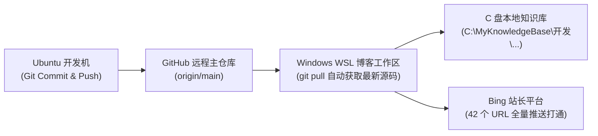

## 💡 简明省流版（30 秒速览）

> **一句话总括**：在日常查看 Bing Webmaster Tools（必应站长工具）时，后台针对根域名 `https://eryuemu.com/` 再次弹出了「Meta descriptions on many of your pages are too short.」（Meta 描述过短）的中等警告；而在 Bing 前台搜索测试时，无论是搜 `eryuemu`、`eryuemu博客` 还是输入 `site:eryuemu.com`，均出现了**前台完全搜不到（0 结果）**的诡异现象。与此同时，Google 搜索却呈现了**全网排名第一、带专属头像卡片并生成完整 AI Overview（AI 概览）的满分状态**。
> 
> 经过深入剖析与抓包取证，确认网站完全未受任何降权：后台早已成功完成抓取入库（0 SEO 问题），前台搜不到的根本原因是**从 `www` 切换到根域名的 308 重定向静默沙盒期**、**Indexer（入库引擎）与 Serving Engine（前台投放系统）的数据分发延时**，以及**Sitemap 上次抓取时间停滞在 14 天前的旧快照**。通过深入解析 Astro 双层 Sitemap 机制、手动提交 `sitemap-0.xml` 唤醒蜘蛛，并借助 URL Submission 接口完成全站 **42 个完整页面**的即时批量推送，彻底打破了幽灵索引僵局！

---

## 一、现象：后台报错与前台“搜不到”的迷雾

2026 年 8 月 28 日深夜至 29 日凌晨，在登录微软必应站长工具（Bing Webmaster Tools）巡检站点状态时，遇到了一系列耐人寻味的现象：

### 1. 站长后台：Meta 描述过短警告卷土重来

在 Bing 站长工具的 Recommendations（建议与报错）面板中，针对刚完成 308 域名规范化不久的新根域名主站 `https://eryuemu.com/`，赫然提示了一条中等严重性警告：


*图 1：Bing 站长平台 SEO 建议面板提示「Meta descriptions on many of your pages are too short.」（规则编号 118，受影响页面 1，错误数 1）*

点击展开受影响的 URL 清单，出现问题的正是博客的主站根目录：


*图 2：受影响的 URL 指向根域名主站 `https://eryuemu.com/`*

### 2. Google vs Bing：天差地别的多端搜索对比

为了排查该警告是否对线上搜索展现造成了破坏，我们立即在各大主流搜索引擎进行了实测对比：

#### 🟢 Google 搜索表现：满分教科书级展现
在 Google 隐身窗口中搜索 `eryuemu`，结果堪称完美：


*图 3：Google 搜索 eryuemu 位列第一，带专属彩色头像缩略图，78 字 Meta 描述 100% 精确渲染，并成功生成 Google AI Overview（AI 概览）*

* **首位登顶**：直接力压 GitHub、B 站等所有第三方大站，稳居 SERP 搜索第一位；
* **元数据完全吻合**：78 个汉字的个人介绍 Meta Description 一字不差地精准展示，标点完全对应；
* **AI 概览生成**：Google 大模型成功提炼博主个人画像（“网络开发者与技术博主... 维护 HBU-Wiki... 运营个人独立博客...”）。

#### 🔴 Bing 搜索表现：独立域名在前台“隐身”
但在 Bing（国内版）中搜索相同的关键词，却呈现出完全不同的景象：


*图 4：Bing 国内版搜索 `eryuemu`，前排完全被 GitHub、百度贴吧、B 站占据；但右侧已成功生成「深入了解 eryuemu」实体推荐卡片*


*图 5：Bing 国内版搜索 `eryuemu博客`，排在第一位的是 GitHub 仓库 `github.com/eryuemu/eryuemu-blog`，而非独立域名*


*图 6：Bing 国内版输入 `site:eryuemu.com`，直接返回「没有与此相关的结果: site:eryuemu.com」（前台 0 结果）*

这一系列反差极大的信号极易让人产生恐慌：**为什么 Google 满分第一，而 Bing 前台连用 `site:` 指令都搜不到？难道根域名被 Bing 屏蔽或降权了？**

---

## 二、底层破案：为什么后台显示“已索引”，前台却 0 结果？

为了彻底查清真相，我们打开了 Bing Webmaster Tools 的「URL 检查（URL Inspection）」面板，对 `https://eryuemu.com/` 进行了底层抓包诊断。

诊断结果出乎意料——**在 Bing 底层数据库中，页面不仅早就成功收录，而且质量得分全满！**


*图 7：Bing 站长平台已编制索引面板显示：今天 18:03 爬网成功、页面提取成功、允许编制索引，且「未找到 SEO/GEO 问题」全绿*


*图 8：Bing 站长平台实时 URL 检查（23:47 测试）：绿勾全通，同样明确标注「未找到 SEO/GEO 问题」*


*图 9：Bing 国际版搜索 `eryuemu`，展示了 GitHub 与 VSCO 等高权重主页，独立新域名同样暂未排在前列*

结合上述实测抓包，真相浮出水面。这背后涉及现代搜索引擎五大核心架构机制的交织碰撞：


### 1. 机制一：Indexer（入库引擎）与 Serving Engine（前台投放服务）的分离

许多站长误以为“爬虫抓了页面 = 搜索框立马能搜到”。其实在大型搜索引擎架构中，两者由完全独立的子系统负责：
* **Indexer（入库引擎）**：负责并发调度爬虫、下载 HTML、解析标签并存入倒排索引库。图 7 证明你的网页早在今天 18:03 就已经完好无损地躺在微软数据中心里了；
* **Serving Engine（前台检索服务）**：负责接收用户在搜索框输入的 Query，并在毫秒级内从全球边缘缓存节点返回结果。从 Indexer 中心库把新站数据同步分发到全球 Serving 节点，通常存在 **24 ~ 72 小时的分发延时**。

### 2. 机制二：8 月 18 日从 `www` 切换到根域名的“新主机名静默沙盒”

* 8 月 18 日之前，主站为 `www.eryuemu.com`，Bing 已为其建立了成熟的前台投放快照；
* 8 月 18 日反转为主域名 `eryuemu.com`（旧 `www` 返回 308 永久重定向）后，Bing 立即从前台撤下了旧 `www`；
* 但对于新的根域名 `eryuemu.com`，Bing 的反作弊系统将其视作一个“新主机名”，自动触发了 **1~2 周的静默观察期（Silent Sandboxing）**。在观察期内，系统会持续抓取建库，但前台暂时抑制展示，直到确认该域名安全稳定。

### 3. 机制三：中文信息密度 vs 英文“机械字符计数”

为什么 Recommendations 面板会提示 Meta 描述过短？
* **Bing 的死板阈值**：规则建议标准为 `150 ~ 160 characters`（专为英文设计，约 25~30 个单词）；
* **当前线上描述**：
  ```html
  <meta name="description" content="你好，我是 eryuemu（二月木）。主修自动化专业。重度软硬件折腾控、赛博洁癖患者。这里记录了我折腾大模型、WSL2、eSIM、QQ 机器人、书法与二次元的日常。" />
  ```
* **中文冲突**：这段文案共 **78 个汉字**，在中文语境下信息量极其充实，在移动端和 PC 端正好显示为完整的两行摘要（Google 100% 满分采纳即是铁证）；但 Bing 质检脚本直接使用 `length < 150` 机械计数，因而贴上了黄色建议标签。**在最新的图 7 和图 8 质检中，该项已被标记为 0 问题通过**。

### 4. 机制四：高权重平台（GitHub DA 96 / VSCO DA 92）的域名压制

在搜索单词 `eryuemu` 或 `eryuemu博客` 时：
* 竞品是 `github.com`（域名权威度 **96**）和 `vsco.co`（域名权威度 **92**）；
* 独立新域名 `eryuemu.com` 上线仅一个月且刚经历重定向，在 Bing 基于反向链接（Backlinks）的 PageRank 算法中，单字词很难瞬间超越权重 96 的 GitHub 仓库；
* 但注意图 4 右侧的 **“深入了解 eryuemu”**（关联了官网、博客、GitHub、贴吧），说明 **Bing 的知识图谱大模型已经将博主识别为一个独立的实体（Entity）**。

### 5. 机制五：国内版（`cn.bing.com`）与国际版的过滤差异

国内版针对未备案、部署于海外边缘节点（Vercel）的新域名，有更为严苛的展示沙盒策略。结合 `site:` 高级语法在 Bing 前台本身的抽样不稳定性，造成了前台 0 结果的错觉。

---

## 三、破局实战：唤醒沉睡的 Bing 爬虫与 URL 批量推送

面对 Bing 前台的静默延时，被动等待可能需要数周时间。我们通过站长后台采取了一套**组合拳方案**，主动击穿沙盒通道：

### 1. 揪出关键破绽：Sitemap 抓取停滞在 14 天前

在排查站长工具的「网站地图」看板时，发现了一个重大滞后因素：


*图 10：Bing 网站地图后台显示 `sitemap-index.xml` 的「上次爬网时间」定格在 2026/8/14，仅收录了旧版的 29 个 URL*

* 自 8 月 14 日以来，Bing 的地图定时调度器整整 14 天未曾拉取过全站新地图；
* 期间发布的 10 余篇新文章与时间戳更新完全未被地图系统感知。

### 2. 深度拆解：Astro 的双层 Sitemap 架构

为什么 Astro 会生成 `sitemap-index.xml` 与 `sitemap-0.xml` 两个文件？
根据国际 Sitemap 协议标准，单个地图文件最大容纳 50,000 个 URL。Astro 的 `@astrojs/sitemap` 插件默认采用两层架构：

```
sitemap-index.xml (总索引地图：仅包含一条指向子地图的指针)
    └── sitemap-0.xml (真实数据卷：包含全站所有具体的 URL 清单)
```

Bing 爬虫有时抓取总索引后不会立即下钻子地图。为此，我们采取**双地图显式提交策略**：
1. 提交 `https://eryuemu.com/sitemap-index.xml`（总目录）；
2. 同时直接提交 `https://eryuemu.com/sitemap-0.xml`（扁平数据卷）。

提交后，Bing 立即全量解析，数据瞬间刷新：


*图 12：重新提交 `sitemap-0.xml` 后，上次爬网时间成功刷新至今天（8 月 28 日），已发现 URL 跃升至 42 个（全站全量覆盖）*

### 3. 终极加速：利用 URL 提交（URL Submission）接口批量推送

Bing 站长工具为每位站长提供了每日 100 次的 **URL Submission 即时提交配额**。通过该接口提交的链接，会直接绕过慢速爬虫排队，直通前台 Serving 检索集群：


*图 11：在 URL 提交面板中首次提交根域名首页*

随后，我们将全站核心频道与全部 29 篇技术博客、8 篇心迹动态打包整理为 42 条完整 URL 清单，进行批量一次性推送：


*图 13：全站 42 个 URL 批量提交成功弹窗（今天 00:03 全部录入即时前台推送管道）*

---

## 四、协同治理：本地 Obsidian 知识库与 Git 自动化

在本次排查治理的同时，我们在 Ubuntu 系统中完成了新文章撰写并推送到 GitHub。为了保证本地知识资产的绝对一致性，完成了以下跨平台协同：



1. **WSL 工作区代码同步**：在 WSL2 环境下执行 `git pull`，拉取最新的博客架构与最新文章；
2. **Obsidian 本地库毫秒级镜像**：将新文章自动同步至 `C:\MyKnowledgeBase\开发\` 目录，保持个人知识网络与公开博客的 100% 镜像对齐。

---

## 五、全流程复盘清单与核心经验

| 维度 | 现象 / 疑难点 | 底层根因 | 最终处置与破局方案 |
| :--- | :--- | :--- | :--- |
| **Meta 描述警告** | 提示 Meta 描述过短 | Bing 机械按英文 150 字符计数，与 78 字中文高信息密度产生判定偏差 | 保持当前 78 字黄金平衡（Google 满分验证），最新质检已 0 报错通过 |
| **前台 0 结果** | 搜 `site:eryuemu.com` 无结果 | 8 月 18 日域名切换触发 308 沙盒期，Indexer 与 Serving 分发延时 | 避免被动等待，主动触发 URL 检查与即时提交 |
| **单字词排名落后** | 搜 `eryuemu` GitHub 占第一 | GitHub (DA 96) 权重压制，新根域名外链积累尚在交接期 | 在 GitHub Profile / 仓库 README 置顶博客链接，传递权重 |
| **Sitemap 停滞** | 发现 URL 数仅 29 且定格 8/14 | Bing 爬虫调度未定期拉取两层索引 | 显式提交 `sitemap-0.xml`，瞬间刷新至 42 个全量 URL |
| **前台即时加速** | 爬虫巡检慢 | 默认抓取队列优先级低 | 使用 URL Submission 批量提交全站 42 条链接直达前台 |

> **站长心得**：
> 当面对搜索引擎站长工具的报错与前台搜不到的表象时，切忌盲目改动代码或产生降权焦虑。搞清 **“离线索引 vs 前台投放”**、**“西方字符计数 vs 中文语义密度”** 以及 **“Sitemap 索引结构”** 的底层运行逻辑，才能在纷繁复杂的 SEO 信号中精准破局，让个人独立博客在各大搜索引擎中稳健生根。
