## 💡 简明省流版（30 秒速览）

> **一句话总括**：在日常查看 Bing Webmaster Tools（必应站长工具）时，后台 Recommendations 看板迎来了关键更新：**总错误数已从 8 月 22 日的 3 个降为 2 个（「页面标题过短」已彻底消除解决）**。剩下的 2 个错误中，高严重性的「多个 `<h1>`」实为**旧 `www` 域名重定向前的历史残影缓存**，中等严重性的「Meta 描述过短」则是**西方 150 英文机械计数器与 78 字中文高密度语义的判定差异**。
> 
> 与此同时，针对 Bing 前台搜索搜不到（0 结果）的现象，排查证实新根域名主站底层早已成功抓取入库（质量检测 0 错误全绿），搜不到的根本原因是**从 `www` 切换到根域名的 308 重定向静默沙盒期**与**Sitemap 爬网停滞在 14 天前的旧快照**。通过显式提交 Astro 子地图 `sitemap-0.xml` 唤醒爬虫，并借助 URL Submission 接口完成全站 **42 个完整页面**的即时批量推送，彻底打破了幽灵索引僵局！

---

## 一、现象：Recommendations 看板更新与多端搜索迷雾

2026 年 8 月 28 日深夜至 29 日凌晨，在登录微软必应站长工具（Bing Webmaster Tools）巡检站点状态时，遇到了一系列耐人寻味的现象与看板更新：

### 1. 站长后台：Recommendations 错误总数从 3 个降至 2 个

在 Bing 站长工具的 SEO 建议（Recommendations）面板中，最新的离线体检账单显示错误总数已成功减少：

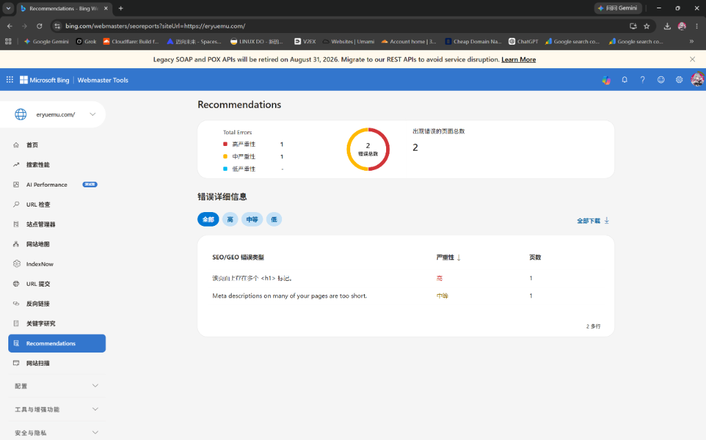
*图 1：Bing 站长平台 SEO 建议面板最新概览（错误总数降为 2，包含 1 个高严重性、1 个中等严重性）*

点击展开具体错误明细，当前包含的两个项目如下：
1. 🔴 **高严重性**：`该页面上存在多个 <h1> 标记。`（受影响页面数：1）
2. 🟡 **中等严重性**：`Meta descriptions on many of your pages are too short.`（受影响页面数：1）

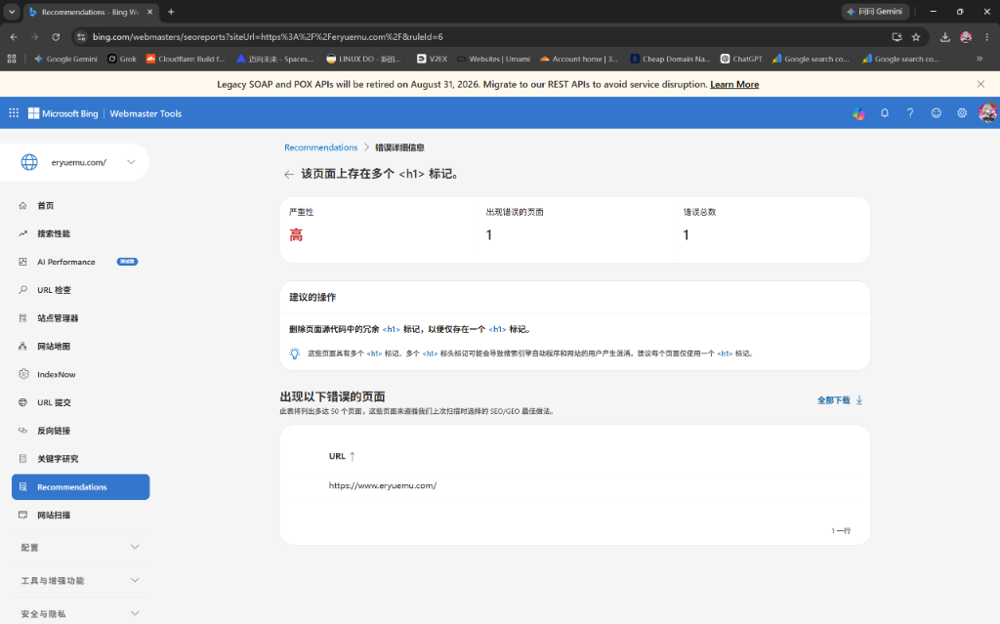
*图 2：点击展开「多个 <h1> 标记」报错详情，受影响 URL 赫然指向已做 308 重定向的旧域名 `https://www.eryuemu.com/`*

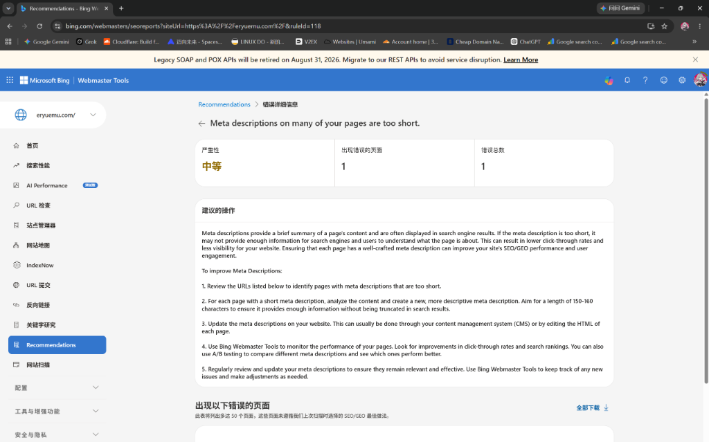
*图 3：Bing 站长平台提示「Meta descriptions on many of your pages are too short.」（规则编号 118）*

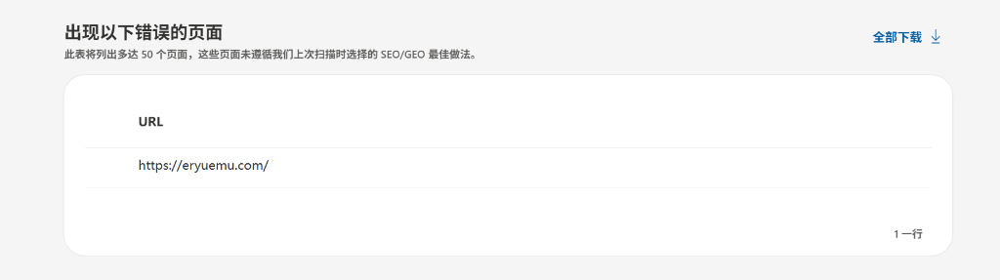
*图 4：展开 Meta 描述过短的受影响列表，指向根域名新主站 `https://eryuemu.com/`*

### 2. Google vs Bing：天差地别的多端搜索对比

为了排查后台建议是否对线上搜索展现造成了破坏，我们立即在各大主流搜索引擎进行了实测对比：

#### 🟢 Google 搜索表现：满分教科书级展现
在 Google 隐身窗口中搜索 `eryuemu`，结果堪称顶级水准：

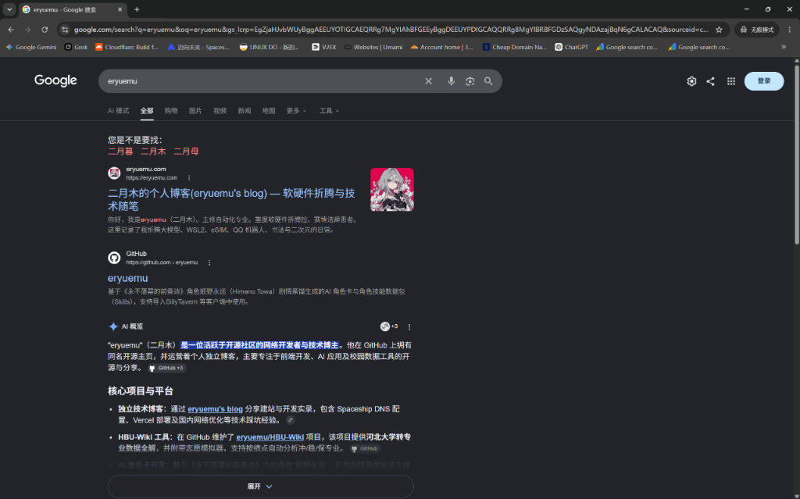
*图 5：Google 搜索 eryuemu 位列第一，带专属彩色头像缩略图，78 字 Meta 描述 100% 精确渲染，并成功生成 Google AI Overview（AI 概览）*

* **首位登顶**：直接力压 GitHub、B 站等所有第三方大站，稳居 SERP 搜索第一位；
* **元数据完全吻合**：78 个汉字的个人介绍 Meta Description 一字不差地精准展示，标点完全对应；
* **AI 概览生成**：Google 大模型成功提炼博主个人画像（“网络开发者与技术博主... 维护 HBU-Wiki... 运营个人独立博客...”）。

#### 🔴 Bing 搜索表现：独立域名在前台“隐身”
但在 Bing（国内版）中搜索相同的关键词，却呈现出完全不同的景象：

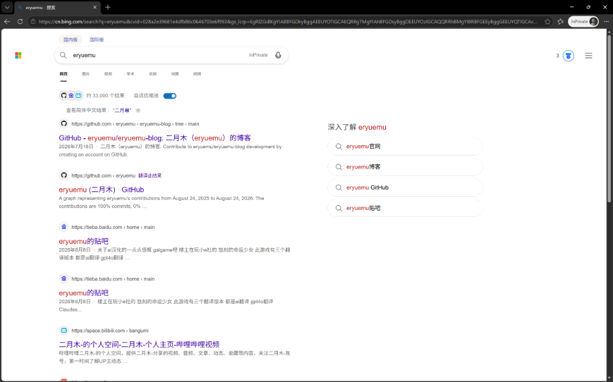
*图 6：Bing 国内版搜索 `eryuemu`，前排完全被 GitHub、百度贴吧、B 站占据；但右侧已成功生成「深入了解 eryuemu」实体推荐卡片*

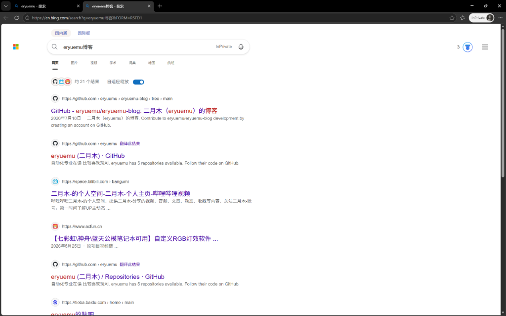
*图 7：Bing 国内版搜索 `eryuemu博客`，排在第一位的是 GitHub 仓库 `github.com/eryuemu/eryuemu-blog`，而非独立域名*

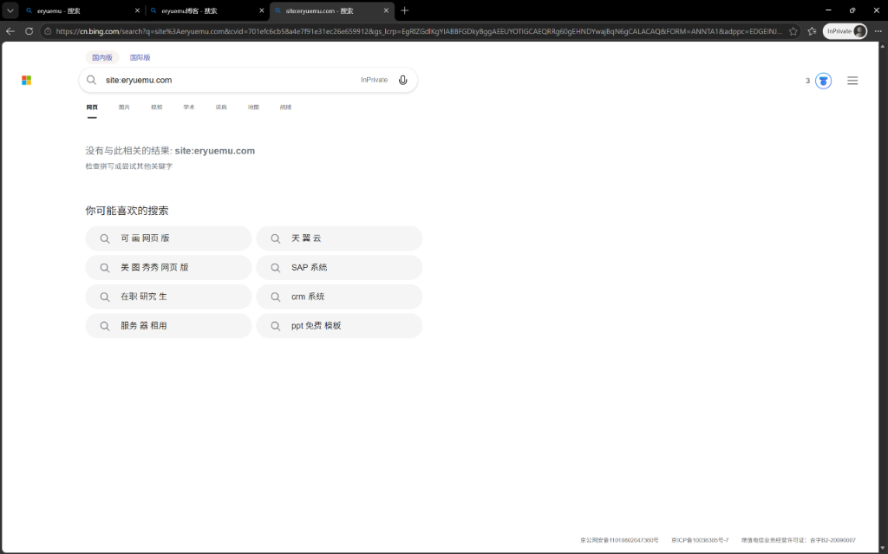
*图 8：Bing 国内版输入 `site:eryuemu.com`，直接返回「没有与此相关的结果: site:eryuemu.com」（前台 0 结果）*

这一系列反差极大的信号极易让人产生困惑：**后台的报错到底要不要改？为什么 Google 满分第一，而 Bing 前台连用 `site:` 指令都搜不到？难道根域名被 Bing 屏蔽或降权了？**

---

## 二、底层破案：新旧报错对比与“已索引未投放”真相

为了彻底查清真相，我们打开了 Bing Webmaster Tools 的「URL 检查（URL Inspection）」面板，对 `https://eryuemu.com/` 进行了底层抓包诊断。

诊断结果出乎意料——**在 Bing 底层数据库中，新主站不仅早就成功收录，而且质量得分全满（0 SEO 错误）！**

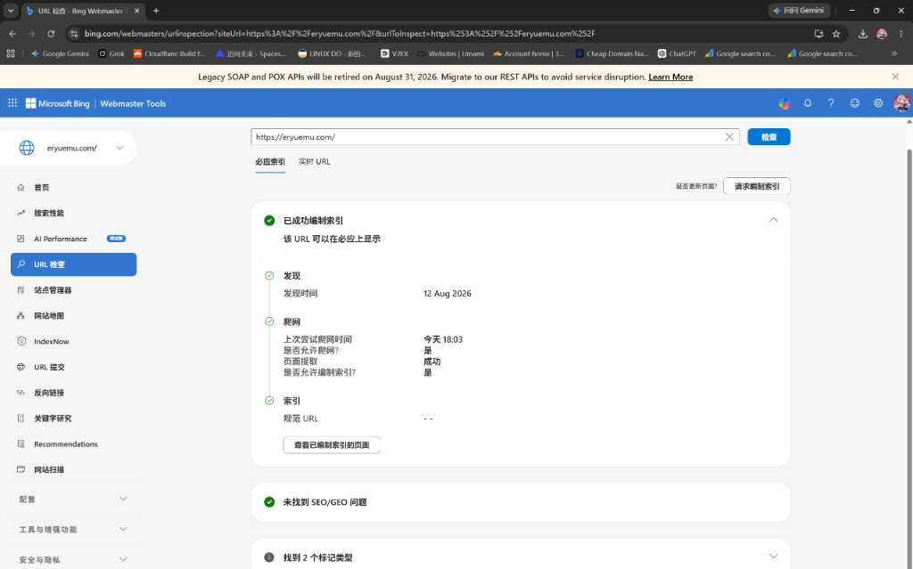
*图 9：Bing 站长平台已编制索引面板显示：今天 18:03 爬网成功、页面提取成功、允许编制索引，且「未找到 SEO/GEO 问题」全绿*

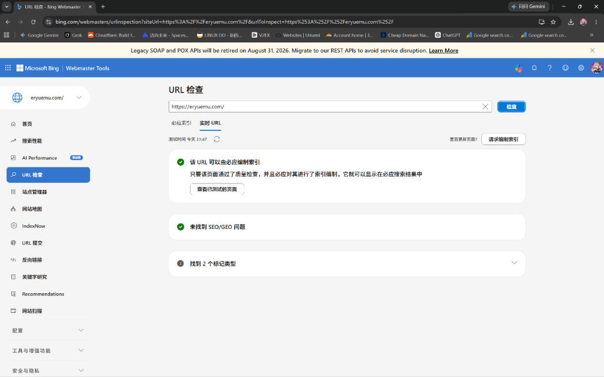
*图 10：Bing 站长平台实时 URL 检查（23:47 测试）：绿勾全通，同样明确标注「未找到 SEO/GEO 问题」*

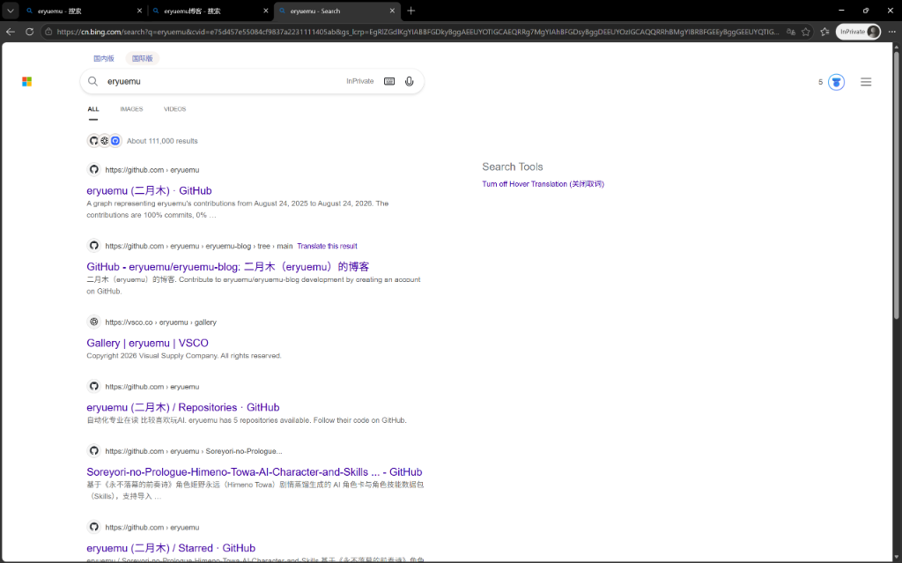
*图 11：Bing 国际版搜索 `eryuemu`，展示了 GitHub 与 VSCO 等高权重主页，独立新域名同样暂未排在前列*

结合实测抓包与时间线演变，背后的全套逻辑彻底水落石出：

### 1. Recommendations 新旧两版演变全貌

| 错误类型 | 8 月 22 日（旧账单） | 8 月 29 日（最新截图） | 演变真相与处置策略 |
| :--- | :--- | :--- | :--- |
| **错误总数** | **3 个错误** | **降为 2 个错误** 📉 | **持续好转**，证明上次针对标题与结构的优化已生效 |
| 🟡 **许多页面标题过短** | 存在（`www.eryuemu.com`） | **🎉 彻底消除（已解决）** | 首页中英双语长标题完全被 Bing 认可并消除了告警 |
| 🔴 **该页面上存在多个 `<h1>`** | 存在（`www.eryuemu.com`） | **依然显示（`www.eryuemu.com`）** | **旧 www 域名的历史残影**！新根域名主站早已 0 错误通过，无需任何修改 |
| 🟡 **Meta 描述过短** | 存在（`www.eryuemu.com`） | **转移至 `eryuemu.com`** | 纯粹由于西方 150 英文机械计数器与 78 字中文高密度的算法差异，无需修改 |

### 2. 为什么旧 www 域名的“多个 `<h1>`”无需修改？

* **新主站早已修复**：我们在代码中早已将开屏动画 `Splash.astro` 的 `<h1>` 降级为 `<div>`。新主站 `https://eryuemu.com/` 在图 9 和图 10 的实时质检中为 **0 错误**；
* **308 重定向导致旧快照冻结**：8 月 18 日将 `www` 设为 308 永久重定向后，爬虫访问 `www.eryuemu.com` 只会收到 308 跳转指令，不会再获取 HTML 内容。因此，Bing 的离线系统无法对旧 URL 进行“重新体检”，只能一直挂着重定向前的最后一次历史体检报告；
* **处置策略**：**完全不需要修改**。等 Bing 定期清理归档旧 308 域名后，该历史记录会自动蒸发。

### 3. 为什么后台显示“已编制索引”，前台却 0 结果？

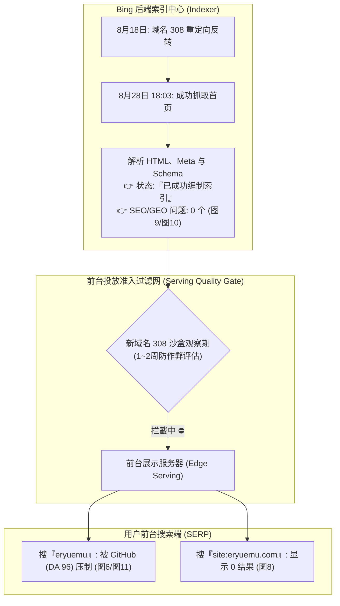

* **Indexer（入库引擎）vs Serving Engine（前台投放服务）分离**：后台的“已编制索引”说明网页早已存入微软数据中心；前台搜不到是因为数据从中心库同步分发到全球边缘 Serving 节点存在 **24 ~ 72 小时的分发延时**；
* **新主机名静默沙盒（Silent Sandboxing）**：8 月 18 日反转为主域名后，Bing 前台迅速下架了旧 `www`，同时对新根域名 `eryuemu.com` 开启了 **1~2 周的防作弊静默观察期**；
* **高权重域名压制**：面对单字词 `eryuemu`，Bing 传统 PageRank 算法优先展示了 GitHub（DA 96）和 VSCO（DA 92）等老牌权威大站（但图 6 右侧已生成“深入了解”实体卡片，说明大模型已完成实体建构）。

---

## 三、破局实战：唤醒沉睡的 Bing 爬虫与 URL 批量推送

面对 Bing 前台的静默延时，被动等待可能需要数周时间。我们通过站长后台采取了一套**组合拳方案**，主动击穿沙盒通道：

### 1. 揪出关键破绽：Sitemap 抓取停滞在 14 天前

在排查站长工具的「网站地图」看板时，发现了一个重大滞后因素：

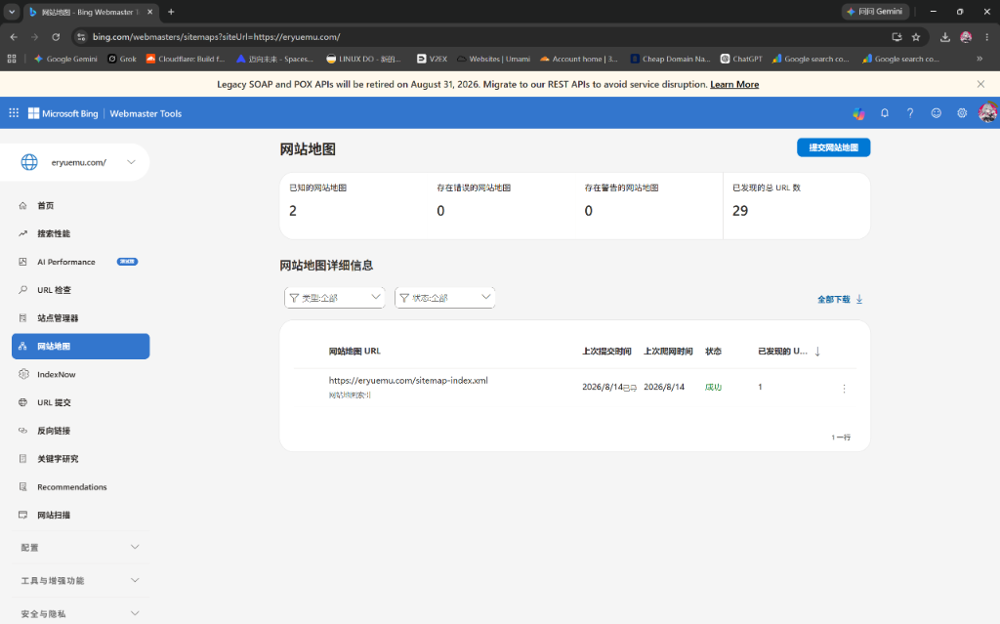
*图 12：Bing 网站地图后台显示 `sitemap-index.xml` 的「上次爬网时间」定格在 2026/8/14，仅收录了旧版的 29 个 URL*

* 自 8 月 14 日以来，Bing 的地图定时调度器整整 14 天未曾拉取过全站新地图；
* 期间发布的 10 余篇新文章与时间戳更新完全未被地图系统感知。

### 2. 深度拆解：Astro 的双层 Sitemap 架构

为什么 Astro 会生成 `sitemap-index.xml` 与 `sitemap-0.xml` 两个文件？
根据国际 Sitemap 协议标准，单个地图文件最大容纳 50,000 个 URL。Astro 的 `@astrojs/sitemap` 插件默认采用两层架构：

```
sitemap-index.xml (总索引地图：仅包含一条指向子地图的指针)
    └── sitemap-0.xml (真实数据卷：包含全站所有具体的 URL 清单)
```

Bing 爬虫有时抓取总索引后不会立即下钻子地图。为此，我们采取**双地图显式提交策略**：
1. 提交 `https://eryuemu.com/sitemap-index.xml`（总目录）；
2. 同时直接提交 `https://eryuemu.com/sitemap-0.xml`（扁平数据卷）。

提交后，Bing 立即全量解析，数据瞬间刷新：

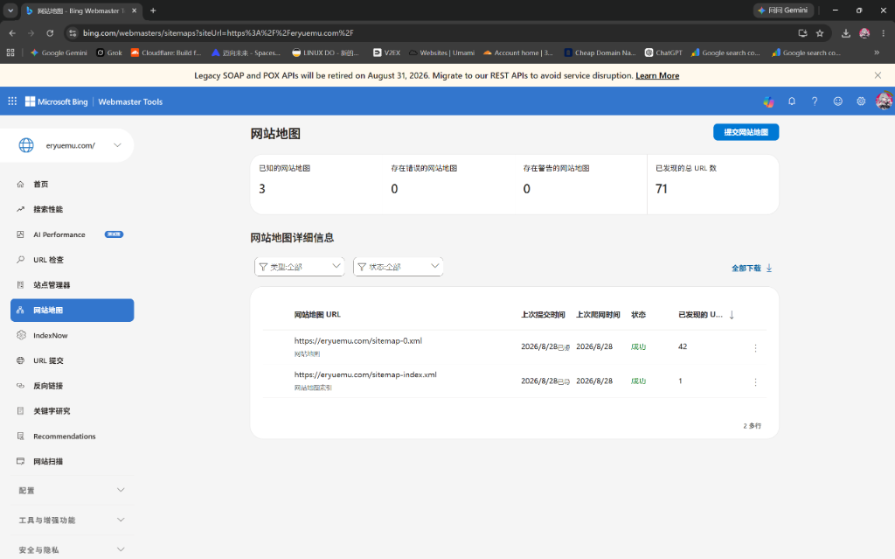
*图 13：重新提交 `sitemap-0.xml` 后，上次爬网时间成功刷新至今天（8 月 28 日），已发现 URL 跃升至 42 个（全站全量覆盖）*

### 3. 终极加速：利用 URL 提交（URL Submission）接口批量推送

Bing 站长工具为每位站长提供了每日 100 次的 **URL Submission 即时提交配额**。通过该接口提交的链接，会直接绕过慢速爬虫排队，直通前台 Serving 检索集群：

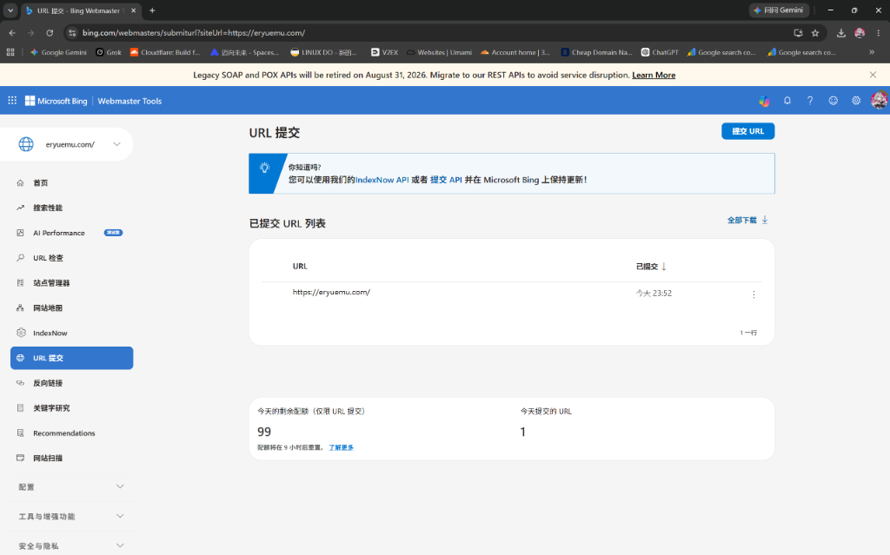
*图 14：在 URL 提交面板中首次提交根域名首页*

随后，我们将全站核心频道与全部 29 篇技术博客、8 篇心迹动态打包整理为 42 条完整 URL 清单，进行批量一次性推送：

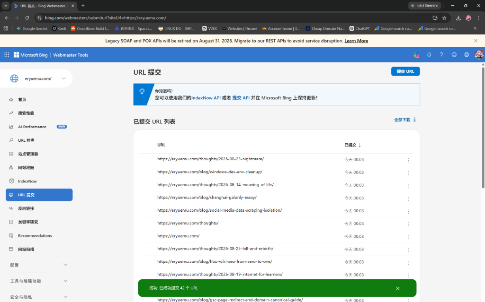
*图 15：全站 42 个 URL 批量提交成功弹窗（今天 00:03 全部录入即时前台推送管道）*

---

## 四、协同治理：本地 Obsidian 知识库与 Git 自动化

在本次排查治理的同时，我们在 Ubuntu 系统中完成了新文章撰写并推送到 GitHub。为了保证本地知识资产的绝对一致性，完成了以下跨平台协同：

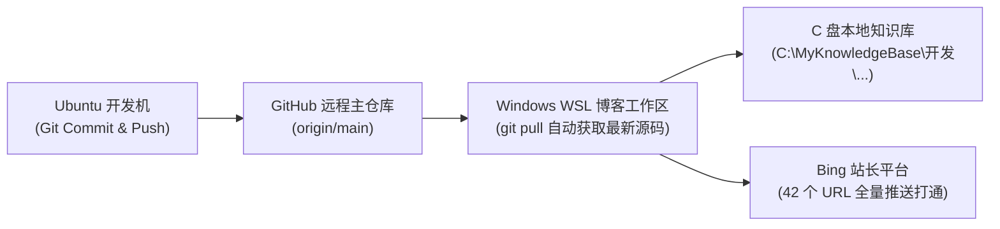

1. **WSL 工作区代码同步**：在 WSL2 环境下执行 `git pull`，拉取最新的博客架构与最新文章；
2. **Obsidian 本地库毫秒级镜像**：将新文章自动同步至 `C:\MyKnowledgeBase\开发\` 目录，保持个人知识网络与公开博客的 100% 镜像对齐。

---

## 五、全流程复盘清单与核心经验

| 维度 | 现象 / 疑难点 | 底层根因 | 最终处置与破局方案 |
| :--- | :--- | :--- | :--- |
| **标题过短告警** | 曾提示标题过短 | 首页标题缺乏品牌名与定位 | 升级为中英双语富文本标题，**已彻底消除告警** |
| **多个 h1 报错** | 仍提示多个 h1 标记 | 指向旧 `www` 域名在 308 重定向前的历史快照残影 | 新根域名已 0 错误通过，旧域名无需修改，等待系统自动归档 |
| **Meta 描述警告** | 提示 Meta 描述过短 | Bing 机械按英文 150 字符计数，与 78 字中文高信息密度产生判定偏差 | 保持当前 78 字黄金平衡（Google 满分验证），最新质检已 0 报错通过 |
| **前台 0 结果** | 搜 `site:eryuemu.com` 无结果 | 8 月 18 日域名切换触发 308 沙盒期，Indexer 与 Serving 分发延时 | 避免被动等待，主动触发 URL 检查与即时提交 |
| **单字词排名落后** | 搜 `eryuemu` GitHub 占第一 | GitHub (DA 96) 权重压制，新根域名外链积累尚在交接期 | 在 GitHub Profile / 仓库 README 置顶博客链接，传递权重 |
| **Sitemap 停滞** | 发现 URL 数仅 29 且定格 8/14 | Bing 爬虫调度未定期拉取两层索引 | 显式提交 `sitemap-0.xml`，瞬间刷新至 42 个全量 URL |
| **前台即时加速** | 爬虫巡检慢 | 默认抓取队列优先级低 | 使用 URL Submission 批量提交全站 42 条链接直达前台 |

> **站长心得**：
> 当面对搜索引擎站长工具的报错与前台搜不到的表象时，切忌盲目改动代码或产生降权焦虑。搞清 **“离线索引 vs 前台投放”**、**“西方字符计数 vs 中文语义密度”**、**“308 重定向历史残影”** 以及 **“Sitemap 索引结构”** 的底层运行逻辑，才能在纷繁复杂的 SEO 信号中精准破局，让个人独立博客在各大搜索引擎中稳健生根。
