## 💡 简明省流版（30 秒速览）

> **一句话总括**：站点在必应站长平台（Bing Webmaster Tools）突然报出「存在多个 `<h1>` 标记」、「页面标题过短」和「Meta 描述过短」3 个错误，同时发现前几天还能搜到的站点似乎搜不到了。经过深度排查，**网站完全没有被降权或除名**，核心原因是 8 月 18 日从 `www` 切换到根域名后的**搜索引擎 308 重定向权重迁移真空期**，加上 8 月 21 日凌晨全站批量校准发布时间戳触发了爬虫重估。通过将开屏动画 `<h1>` 降级为 `<div>`、扩充中英双语标题与原版个人介绍 Meta 描述，实时 URL 检查已**满分全绿通过**！

---

## 一、现象：Bing 站长平台突然报警与“搜不到了”的恐慌

2026 年 8 月 22 日凌晨，在例行巡检 Bing Webmaster Tools（必应站长工具）的 SEO 建议（Recommendations）面板时，后台赫然出现了 3 条警告错误：

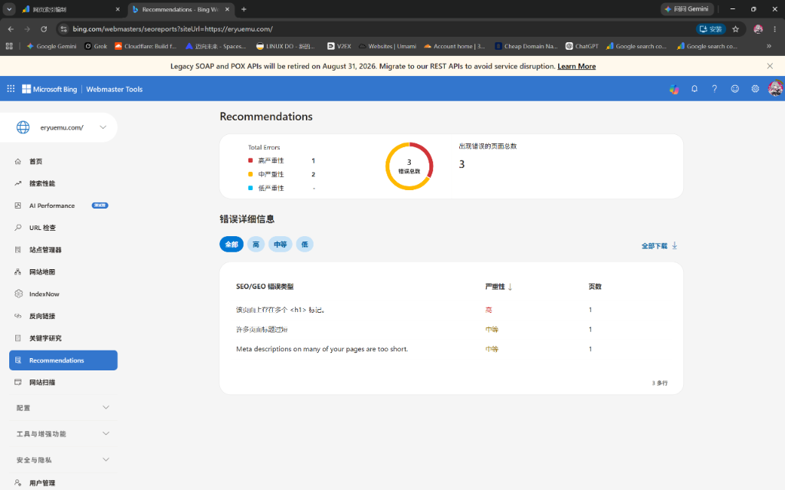
*图 1：必应站长平台 Recommendations 面板提示 3 个错误（1 个高严重性，2 个中等严重性）*

点击进入详情，具体报错明细如下：

1. **🔴 高严重性**：`该页面上存在多个 <h1> 标记。`（受影响页面：`https://www.eryuemu.com/`）
2. **🟡 中等严重性**：`许多页面标题过短`（受影响页面：`https://www.eryuemu.com/`）
3. **🟡 中等严重性**：`Meta descriptions on many of your pages are too short.`（受影响页面：`https://www.eryuemu.com/`）

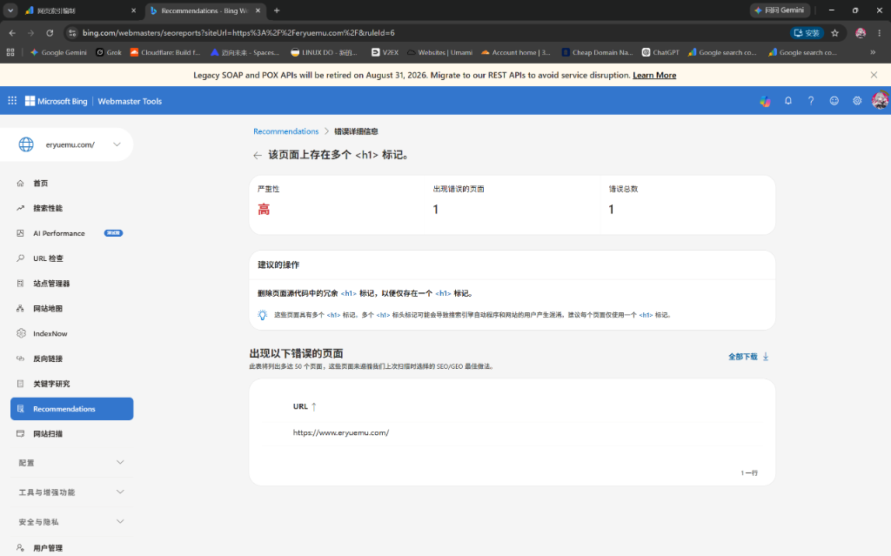
*图 2：Bing 报错详情 —— 该页面上存在多个 `<h1>` 标记*

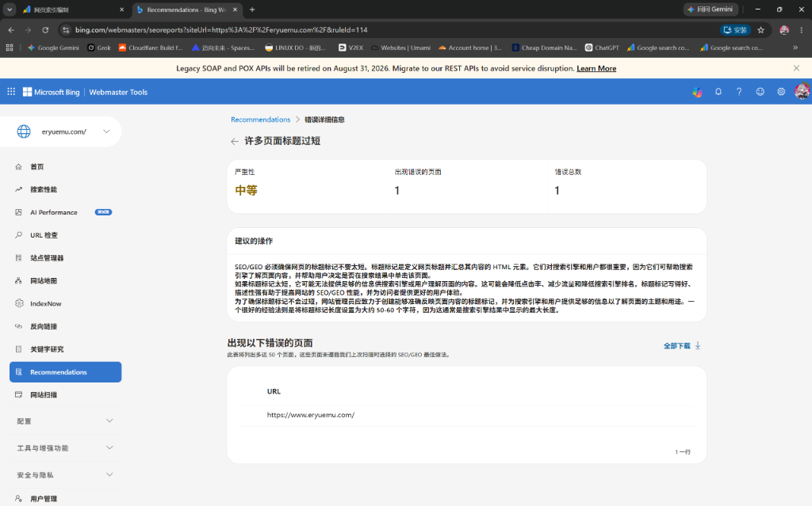
*图 3：Bing 报错详情 —— 许多页面标题过短*

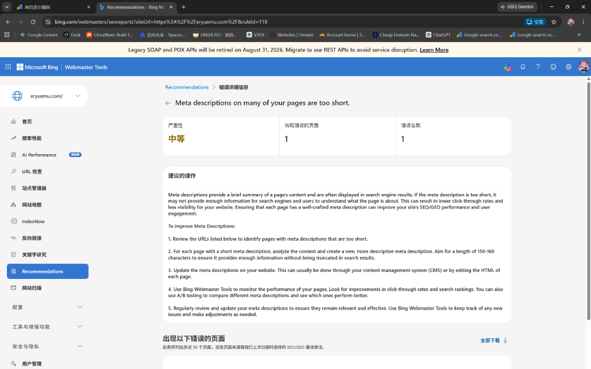
*图 4：Bing 报错详情 —— Meta 描述过短*

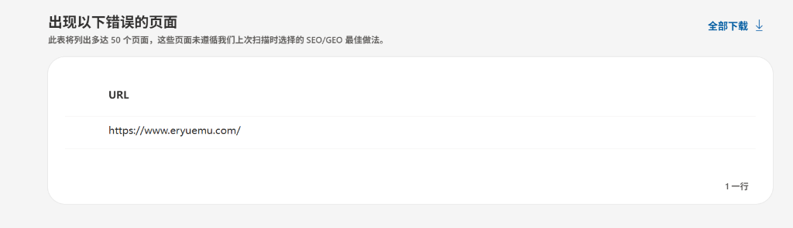
*图 5：受影响的 URL 均指向旧的带 www 域名 `https://www.eryuemu.com/`*

更让人心里一紧的是：**直接去必应搜索“二月木”或“eryuemu”，前几天还能在前排看到的个人站，现在突然找不到首页了！** 难道网站被搜索引擎惩罚了？

---

## 二、破案：为什么之前能搜到，现在突然搜不到了？

看到这些红黄色的警告，第一反应容易以为“网站挂了”或“被搜索引擎 K 站”。但经过结合前几天的运维日志与 Git 提交历史，真相浮出水面：

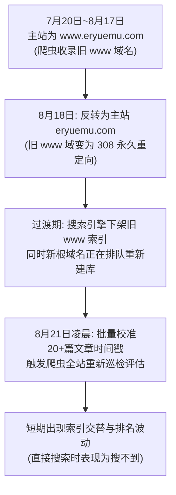

### 2.1 根因一：8 月 18 日的“主域名反转手术”（`www` 与根域名切换）
- **背景**：7 月 20 日上线之初，Vercel 默认开启了“根域名 308 跳转到 `www`”，因此搜索引擎最初建立索引并分配排名的**是带 `www` 的域名**。
- **改动**：8 月 18 日，为了全站规范化，我们在 Vercel 上反转了配置——**将根域名 `eryuemu.com` 设为主站，把 `www.eryuemu.com` 设为 308 重定向**。
- **搜索引擎的连锁反应**：
  1. 注意图 5 中 Bing 报错的地址全部是 **`https://www.eryuemu.com/`**（即老域名）。
  2. 当爬虫重新巡检发现旧的 `www` 返回了 308 永久重定向时，它会**把旧域名的索引从日常搜索结果中逐步撤下**；
  3. 与此同时，将权重和收录合并转移到新的根域名 `eryuemu.com` **需要 1~2 周的算法处理周期**；
  4. 在旧域名下架、新域名还在重新建库的交接期，便出现了一个短暂的**“搜索真空期”**。

### 2.2 根因二：8 月 21 日凌晨全站批量校准 20+ 篇文章发布时间戳
- 在 8 月 21 日凌晨（01:40 ~ 03:30），我们对全站 20 多篇 Markdown 博客及心迹的 `pubDate` 全量更新为了精确的时分秒。
- 这直接导致 `sitemap-index.xml` 与 RSS 中的几乎全部页面更新时间（`lastmod`）集中发生变动。
- 爬虫（尤其是 Bingbot 和 Googlebot）侦测到整站大面积变动后，会将站点丢入**重新排队抓取与索引评估队列（Recrawl Queue）**，短期内造成排名大洗牌。

### 2.3 根因三：普通搜索 vs 指令搜索的误判
- **普通搜索**（直接搜名字）：新站权重较轻，在索引库重建期间极易被 GitHub、Bilibili 等同名高权重平台挤到后面。
- **指令搜索**：在搜索框输入 `site:eryuemu.com`，发现所有文章其实**依然完整保存在搜索引擎的底层索引库中**，根本没有被除名！

---

## 三、对症下药：Bing 报出的 3 个 SEO 错误如何解决？

虽然这些建议不是导致搜索波动的根因，但解决它们能大幅提升搜索引擎对网站结构的质量评分。

---

### 3.1 修复「页面上存在多个 `<h1>` 标记」

* **问题溯源**：
  在代码中，首页同时存在两个 `<h1>`：
  1. 开屏启动动画组件 [`Splash.astro`](file:///w:/home/eryuemu/workspace/eryuemu-blog/src/components/Splash.astro) 中写了 `<h1 class="splash-logo">eryuemu's blog</h1>`；
  2. 首页正文 [`index.astro`](file:///w:/home/eryuemu/workspace/eryuemu-blog/src/pages/index.astro) 中写了 `<h1 class="hero-title">你好，我是 eryuemu（二月木）</h1>`。
* **规范要求**：HTML5 与现代搜索引擎规范要求单页面只应有 1 个核心 `<h1>`，以便明确页面的最高主题层级。
* **解决代码**：
  将 [`Splash.astro`](file:///w:/home/eryuemu/workspace/eryuemu-blog/src/components/Splash.astro) 中的 `<h1>` 降级为 `<div>`，视觉样式与动画完全保持一致：
  ```astro
  <!-- src/components/Splash.astro -->
  <div class="splash-content">
      <div class="splash-logo">eryuemu's blog</div>
  </div>
  ```

---

### 3.2 修复「许多页面标题过短」

* **问题溯源**：
  首页之前的 `<title>` 仅为 `"eryuemu's blog"`（只有 14 个英文字符）。
* **规范要求**：Bing 建议页面标题长度在 **50~60 字符左右**，应包含明确的品牌名、作者名及核心定位，便于中英文分词索引。
* **解决代码**：
  在 [`src/pages/index.astro`](file:///w:/home/eryuemu/workspace/eryuemu-blog/src/pages/index.astro) 中，将首页标题优化为中英双语富文本：
  ```astro
  <!-- src/pages/index.astro -->
  <head>
      <BaseHead 
          title={`二月木的个人博客 (${SITE_TITLE}) — 软硬件折腾与技术随笔`} 
          description={SITE_DESCRIPTION} 
      />
  </head>
  ```

---

### 3.3 修复「Meta descriptions on many of your pages are too short」

* **问题溯源**：
  此前全局配置的 `SITE_DESCRIPTION` 为 `'二月木的个人博客 — 建站折腾 · AI 工具 · Galgame'`（仅约 35 字）。
* **规范要求**：Meta 描述建议保持在 **150~160 字符（约 75~90 个中文字）**，提供足够丰富的上下文供生成搜索摘要卡片。
* **解决代码**：
  在 [`src/consts.ts`](file:///w:/home/eryuemu/workspace/eryuemu-blog/src/consts.ts) 中，将描述更新为与首页 Hero 区域一字不差的原版个人介绍：
  ```typescript
  // src/consts.ts
  export const SITE_DESCRIPTION = '你好，我是 eryuemu（二月木）。主修自动化专业。重度软硬件折腾控、赛博洁癖患者。这里记录了我折腾大模型、WSL2、eSIM、QQ 机器人、书法与二次元的日常。';
  ```

---

## 四、延伸解惑：对 Google 会有何影响？Google 的 Meta 提取玄机

在排查过程中，我们产生了一个疑问：**这些改动会影响 Google 吗？为什么之前在 Google 上搜出来的描述不是旧 Meta，而是首页正文？**

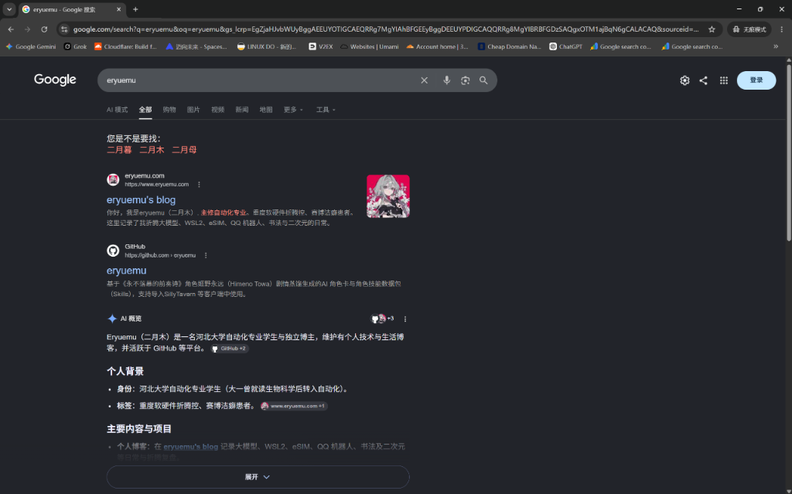
*图 6：Google 搜索 eryuemu 时的 SERP 卡片与 Google AI 概览展示*

### 4.1 Google 的 Meta 抛弃与正文提取机制
从图 6 可以清晰看到，Google 搜索结果下方显示的摘要是：
> *“你好，我是eryuemu（二月木）。主修自动化专业、重度软硬件折腾控、赛博洁癖患者。这里记录了我折腾大模型、WSL2、eSIM、QQ 机器人、书法与二次元的日常。”*

这揭示了 Googlebot 的底层工作机制：
* 当网页的 `<meta name="description">` 过于简短（如旧版的 30 多字）时，Google 会**主动丢弃 Meta 描述**；
* 算法转而从页面正文最核心的 `<p>` 标签中抓取一段最相关的文字作为搜索结果卡片摘要。

### 4.2 本次改动对 Google 的正面收益
1. **100% 正向加分**：消除多余 `<h1>` 契合 Google 官方《搜索引擎优化初学者指南》；
2. **官方 Meta 直接命中**：我们将 Meta 描述直接设为了这段原版正文，未来 Google 不需要再走“放弃 Meta -> 正文提取”的降级逻辑，而是直接采纳规范的元数据；
3. **助力 Google AI 概览**：工整的中英双语标题与详细描述能帮助 Google 的大模型（AI Overview）更精准地提炼博主画像与个人标签。

---

## 五、深度追问：为什么一开始没报警？为什么 Google 还能搜到 www？

在排查收尾阶段，又有两个极其关键、直击搜索引擎底层架构的问题被提出：

### 5.1 追问 1：为什么一开始收录时没报警？这些问题不是早就一直存在吗？

**核心答案：搜索引擎的「抓取建库系统」和「离线 SEO 质检系统」是两个完全独立的管道，运行周期截然不同。**

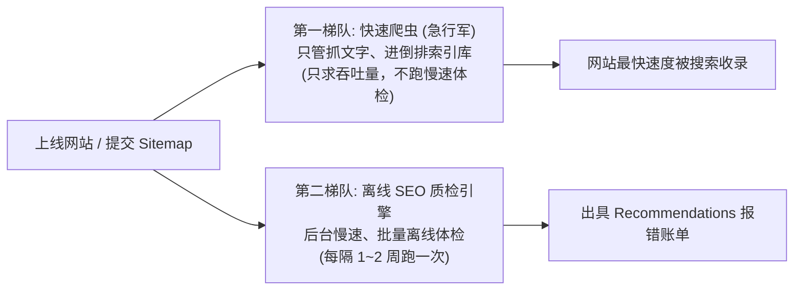

1. **第一梯队（快速抓取爬虫）**：当你提交网站时，搜索引擎派出的“急行军”爬虫只负责提取文本与关键词建库，追求高并发与快速响应，**绝不会消耗昂贵算力去逐行跑代码规范体检**；
2. **第二梯队（离线 SEO 质检引擎）**：站长平台的建议报告是由后台低优先级的离线批处理任务（Batch Job）生成的。它通常每隔 1~2 周才批量把数据库里的页面拉出来做一次全方位静态体检（数 `<h1>` 个数、测 `<title>` 长度）；
3. **因此**：**问题从第一天就存在**，只是体检系统直到这几天才刚好轮询到你的网站并输出账单；再加上 8 月 18 日的域名反转与 21 日的时间戳更新，加速了后台离线审查任务的执行。

---

### 5.2 追问 2：为什么 Google 搜到的依然是带 www 的，而且还能搜到？

**核心答案：这是 Google 极其成熟的「308 永久重定向平滑过渡保护机制」，也是导致 Bing 和 Google 短期表现不同的关键所在。**

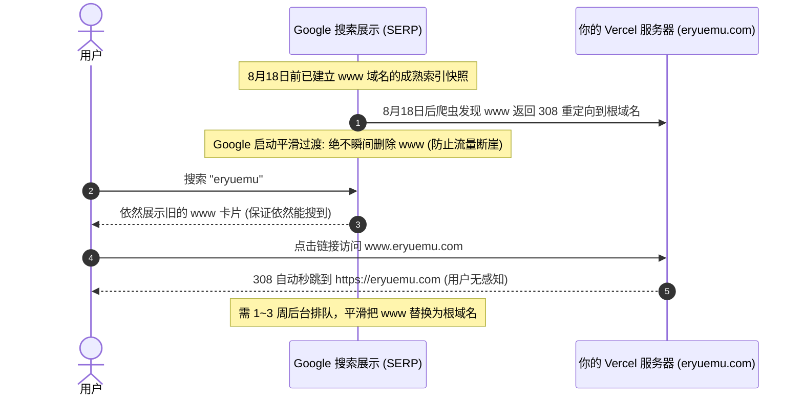

1. **Google 的平滑过渡机制**：
   从 7 月 20 日到 8 月 17 日，Google 已经为 `www.eryuemu.com` 沉淀了成熟的索引。如果一收到 308 重定向就瞬间把旧域名删掉，会导致在根域名建库完成前出现搜索断崖。因此 Google **在前台继续保留旧的 `www` 展示**，同时在后台用 1~3 周的时间将权重、点击量和排名无缝合并转移给根域名；
2. **Bing vs Google 的策略差异**：
   * **Google**：策略保守稳健，倾向于“先留着旧的让你搜得到，后台慢慢完成替换”；
   * **Bing**：策略较为激进，检测到 308 重定向后下架旧页面更快，而新根域名的重新建库需要几天缓冲，因此在短期内表现出了“突然搜不到”的交替真空。

---

## 六、验证实战：实时检查一键全绿

在代码修改完成后，我们将其编译并通过 WSL 推送至 GitHub（触发 Vercel 自动部署）。随后进入 Bing Webmaster Tools 进行验证：

1. **确认选择新主站**：确保左上角选中的是不带 www 的规范资源 **`eryuemu.com`**：
   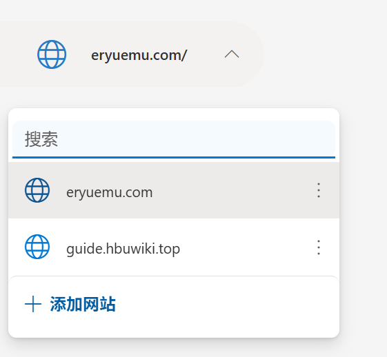
   *图 7：Bing 站长平台顶部站点切换器（确认为根域名 `eryuemu.com/`）*

2. **实时 URL 检查（Live URL Test）**：
   输入 `https://eryuemu.com/` 执行实时测试，结果显示：**【未找到 SEO/GEO 问题】全绿通过！** 并成功提交「请求编制索引」：
   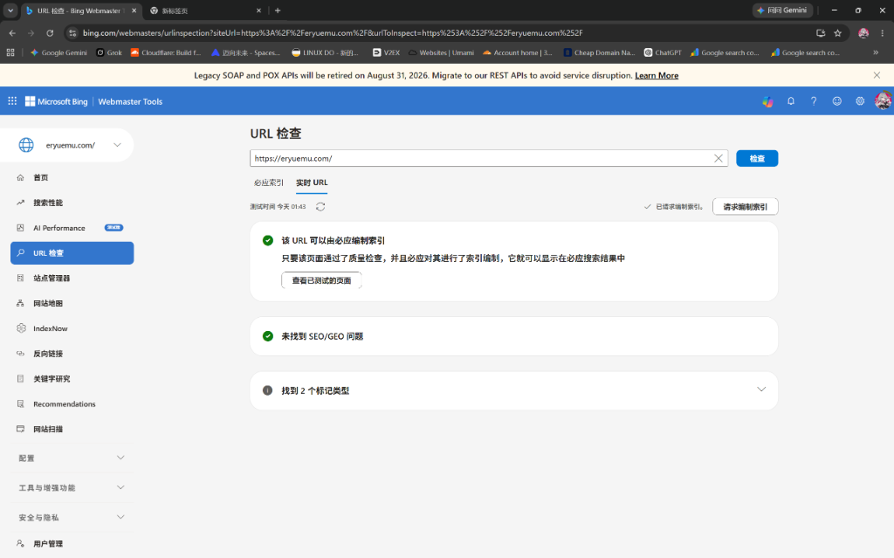
   *图 8：修改部署后实时 URL 测试结果 —— 0 个 SEO 问题，全绿！*

3. **历史快照对比**：
   在「必应索引」标签页中，依然可以看到此前旧抓取留下的 2 个红点。这是正常的历史快照缓存，随着刚刚提交的实时重新抓取任务入库，旧数据很快就会被全新的全绿快照覆盖：
   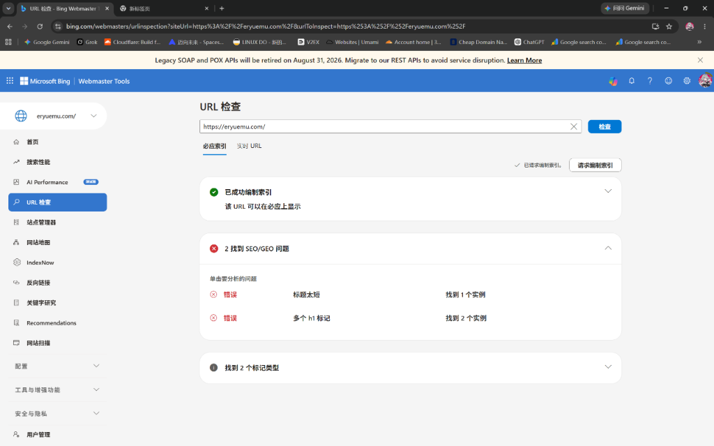
   *图 9：必应索引中显示历史已编入状态与旧快照记录*

---

## 七、复盘总结与经验清单

| 排查维度 | 核心发现 | 解决手段 |
| :--- | :--- | :--- |
| **收录“突然消失”** | 8/18 域名反转（308 重定向）+ 8/21 时间戳大更新，触发搜索引擎过渡期排队 | 用 `site:` 指令验证底牌，耐心等待 3~7 天权重合并 |
| **多个 `<h1>` 冲突** | `<Splash />` 开屏动画含有 `<h1>`，与页面正文主标题冲突 | 将动画标签降级为 `<div>`，保持页面单 `<h1>` |
| **标题与描述过短** | 纯英文 14 字标题与 35 字 Meta 描述不符合现代分词与展示规范 | 首页定制中英双语长标题，Meta 采用原版 80 字简介 |
| **质检报警延迟** | 快速爬虫只管建库，SEO 规则检查是 1~2 周一次的离线批处理 | 明白报错属于旧账单体检，无需恐慌被 K 站 |
| **Google 显示旧 www** | 308 永久重定向采用平滑保护机制，前台保留展示，后台 1~3 周平滑过渡 | 保持规范 URL 配置，等待 Google 自动完成权重合并 |

> **站长心法**：
> 遇见站长平台报错或收录短期波动，先别慌张。静态 SEO 建议是“代码体检表”而非“死刑判决书”。理清域名重定向链路、保持 HTML 语义整洁、让元数据真实准确地反映内容，剩下的只需交给搜索引擎的爬虫周期即可。
