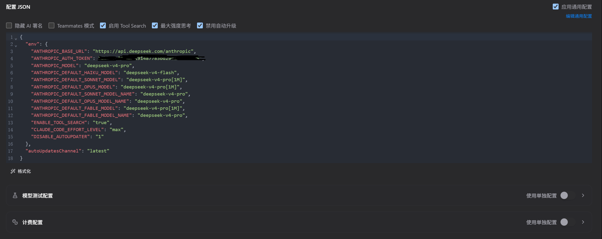
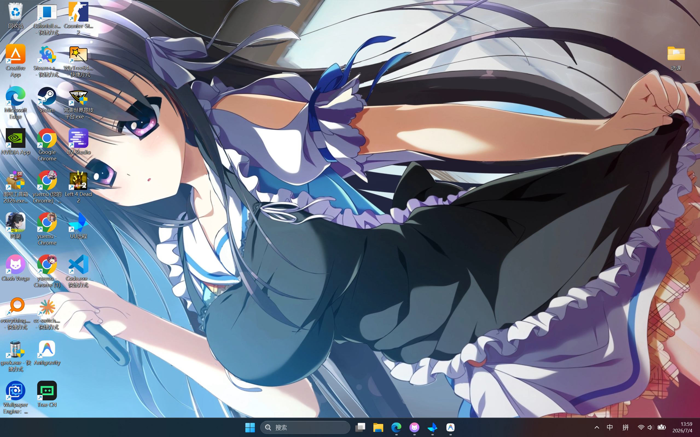

## 背景

- **场景**：新电脑 Windows 系统，无任何开发环境（无 Node.js、无 Python、无 Git）
- **目标**：安装 Claude Code，配合 Obsidian 的 Claudian 插件搭建本地知识库
- **结果**：使用官方原生安装方式，全程无需装 Node.js/npm，几分钟搞定

---

## 一、安装方式选型：原生 vs npm

### 旧方法（npm 版，已过时）

```
装 Node.js → 装 npm → 配置 npm 镜像源 → npm install -g @anthropic-ai/claude-code
```

缺点：依赖 Node.js 环境，新电脑需要先装一堆东西，且国内下载慢需配镜像。

### 新方法（原生版，推荐）

```powershell
irm https://claude.ai/install.ps1 | iex
```

> **本质是 PowerShell 脚本，不是 Python！** PowerShell 是 Windows 自带的原生命令行工具，无需额外安装任何运行环境。

优点：
- 直接下载预编译的独立 `claude.exe`，免去 Node.js 依赖
- 安装路径干净：`C:\Users\<用户名>\.local\bin\claude.exe`
- 临时文件集中在 `C:\Users\<用户名>\.claude\downloads`，装完自动清理
- 自带环境变量配置

---

## 二、下载慢？挂代理

### 问题

在国内直连下载安装包极慢，因为 PowerShell 默认不走系统代理。

### 解决方案

在安装命令前设置代理环境变量（以 Clash Verge 为例）：

```powershell
$env:HTTPS_PROXY = 'http://127.0.0.1:7897'
irm https://claude.ai/install.ps1 | iex
```

> ⚠️ **关键细节**：要先确认代理软件的实际端口号。Clash Verge 默认是 7897，而非 7890。端口不对等于没挂代理。

### 为什么看不到下载进度？

官方脚本里有一句 `$ProgressPreference = 'SilentlyContinue'`，强制隐藏了进度条。属于正常现象，后台其实在下。

---

## 三、环境变量 PATH 是什么？为什么需要配置？

### 打个比方

终端（PowerShell / CMD）是一个很死板的机器人。

- **不配 PATH**：你必须输入完整绝对路径 `C:\Users\eryuemu\.local\bin\claude.exe` 才能运行
- **配了 PATH**：把 Claude 所在文件夹登记到系统的"全局通讯录"里，之后在任何目录敲 `claude` 都能直接启动

### npm 版为什么不需要手动配？

因为 Node.js 安装包会自动把 npm 全局目录加入 PATH，装 Claude Code 时顺带就配好了。原生版需要手动（或由安装脚本）添加。

### 验证安装

```powershell
claude --version   # 查看版本
claude doctor      # 检查运行环境
```

---

## 四、跳过登录：`.claude.json` 配置

### 为什么要跳过？

Claude Code 默认首次运行会弹浏览器要求登录 Anthropic 官方账号。但国内用户通常走第三方 API 代理（如 CC Switch 替换为 DeepSeek），不需要也不能走官方网页登录。

### 配置方法

在 `C:\Users\<用户名>\.claude.json` 中添加：

```json
{
  "hasCompletedOnboarding": true
}
```

> 这相当于告诉程序"我是老手，已登录过，别弹网页了"。

---

## 五、CC Switch 五个配置选项详解



| 选项                 | 对应环境变量                            | 作用                                                      |
| ------------------ | --------------------------------- | ------------------------------------------------------- |
| **隐藏 AI 署名**       | —                                 | Git 提交时不显示 `Co-authored-by: Claude`，让提交记录看起来像纯手写        |
| **Teammates 模式**   | —                                 | 团队协作功能开关，个人本地使用影响不大                                     |
| **启用 Tool Search** | `ENABLE_TOOL_SEARCH`              | 开启高级语义搜索，大型项目中能更精准定位相关内容。**强烈建议勾选**                     |
| **最大强度思考**         | `CLAUDE_CODE_EFFORT_LEVEL: "max"` | 让 Claude 对复杂问题进行更深度的推理，代码质量更高。用 DeepSeek 等平价模型平替时尤其适合开启 |
| **禁用自动升级**         | `DISABLE_AUTOUPDATER: "1"`        | 防止官方静默升级导致代理/配置失效，确保当前稳定环境长期可用                          |

> 📌 **推荐组合**：后三个全勾（启用搜索 + 最大思考 + 禁用升级）。

---

## 六、附：VSCode 绿色便携版

### 下载

[微软官方 VSCode 绿色便携版（Windows 64位 ZIP）](https://code.visualstudio.com/sha256?build=stable&os=win32-x64-archive)

### 开启真正的便携模式（赛博洁癖必看）

默认情况下 VSCode 仍会把插件和配置存到 C 盘用户目录。要实现完全绿色：

1. 解压 ZIP 到任意文件夹
2. 在 `Code.exe` 同级目录下，新建一个名为 **`data`** 的空白文件夹
3. 双击 `Code.exe` 运行

之后所有插件、配置、缓存都装在 `data` 文件夹里，绝不污染 C 盘。

---

## 七、附：GitHub Pages + VitePress 自动部署

以 **HBU-Wiki**（VitePress 搭建）为例：

### 不需要本地装 npm 的情况

如果项目已配置好 GitHub Actions（`.github/workflows/`），只需：

1. 本地写 Markdown
2. `git push` 推送到 GitHub
3. GitHub 云端自动运行 `npm install` + 构建 + 部署到 GitHub Pages

> **本地只需装 Git，不需要 Node.js/npm。**

### 需要本地装 npm 的情况

如果想在本地实时预览网页效果（`npm run dev`），则必须安装 Node.js 和 npm。

---

## 八、附：新电脑必要软件清单

初步迁移完毕后的桌面一览：



### 系统清理三剑客（全绿色便携）

| 工具 | 用途 | 亮点 |
|------|------|------|
| **Geek** | 卸载工具 | 最强便携卸载，扫残血注册表和残留文件 |
| **Everything** | 文件搜索 | 秒级全盘搜索，远超 Windows 自带 |
| **WizTree** | 磁盘分析 | 最快空间占用可视化，一眼看出谁在吃硬盘 |

> 三款全是单文件/绿色便携神器，新电脑保持干爽的标配。

### 开发与 AI 生产力

| 工具 | 用途 |
|------|------|
| **VSCode 绿色版** | 主力编辑器，`data` 文件夹实现真正便携 |
| **LM Studio** | 本地运行大模型 |
| **Trae CN** | AI 编程助手 |
| **Claude Code** | 终端 AI 编程 + 知识库搭档 |
| **Antigravity** | 多智能体 AI IDE |

### 娱乐

| 工具 | 用途 |
|------|------|
| **CS2 + 完美平台** | FPS |
| **L4D2** | 经典合作射击 |
| **Wallpaper Engine** | 桌面美化 |

---

## 关键认知

> **Claude Code 的原生安装方式彻底改变了游戏规则。**
>
> 过去："装 Node.js → 配 npm 镜像 → 装 Claude Code" 三步走，新电脑上很折腾。
>
> 现在：一行 PowerShell 命令搞定，Windows 自带能力即可完成。
>
> 对于"赛博洁癖"用户来说，原生版的安装路径干净（`.local\bin\`），不污染系统目录，是当前最优解。

---

## 相关笔记

- **工具** ← 工具与效率
- HBU-Wiki（VitePress + GitHub Pages 项目）