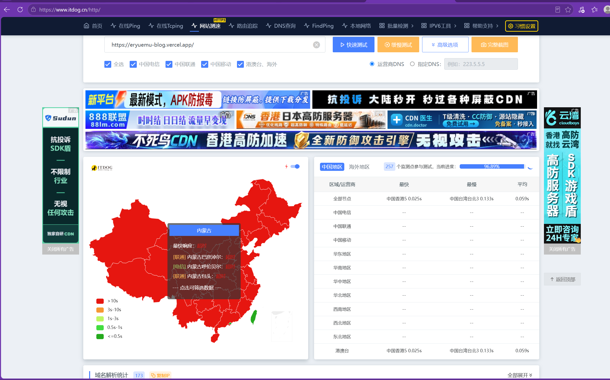
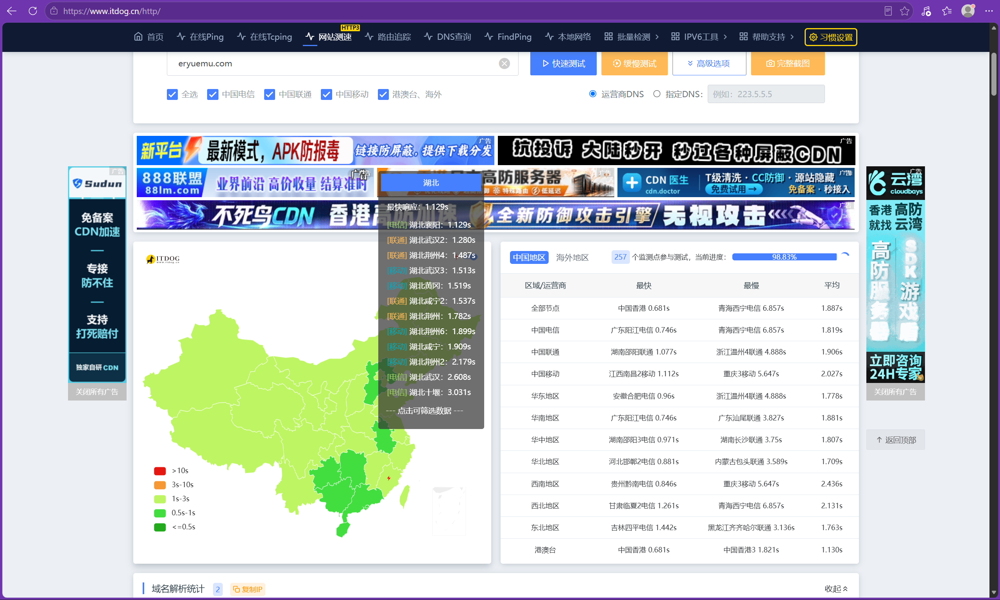
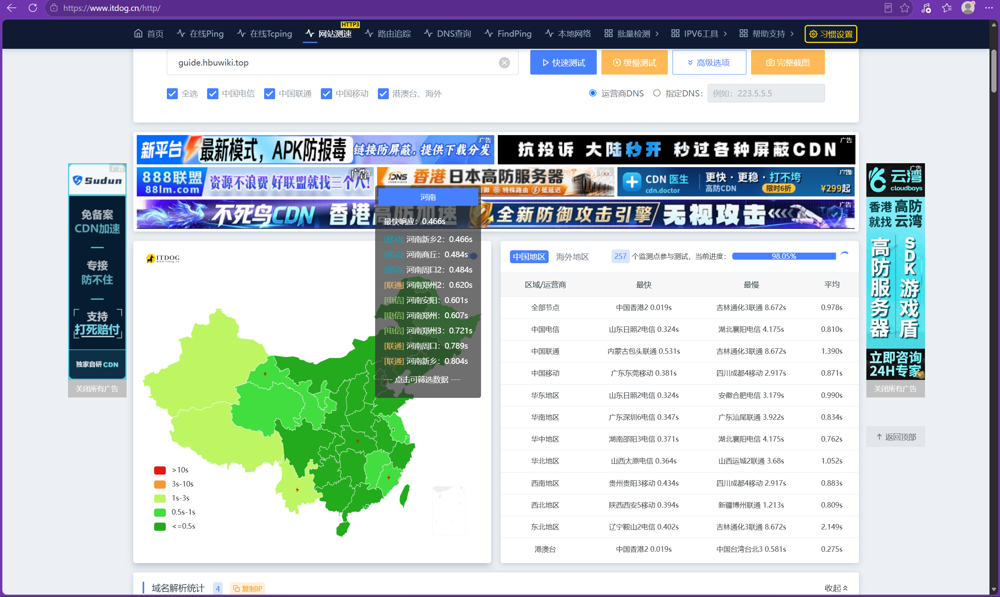
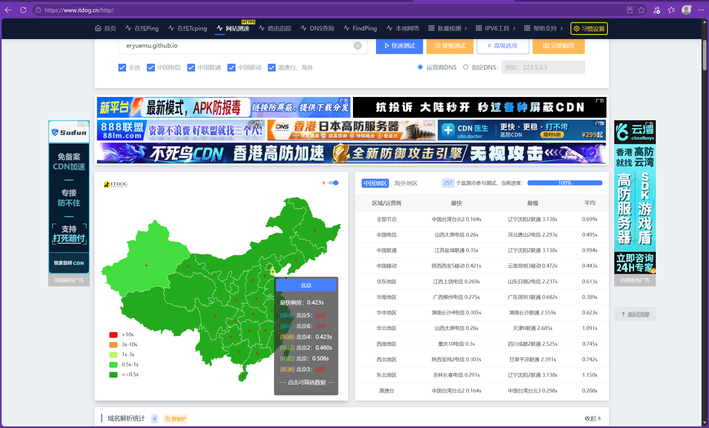
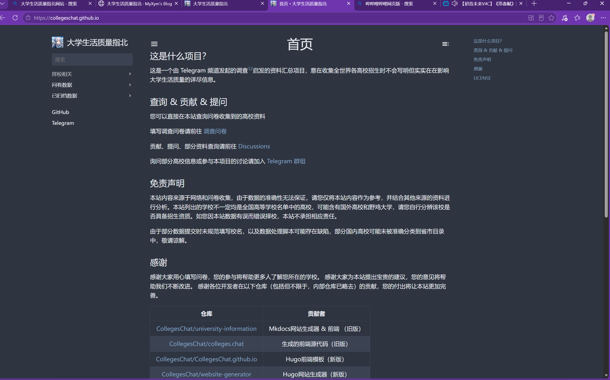
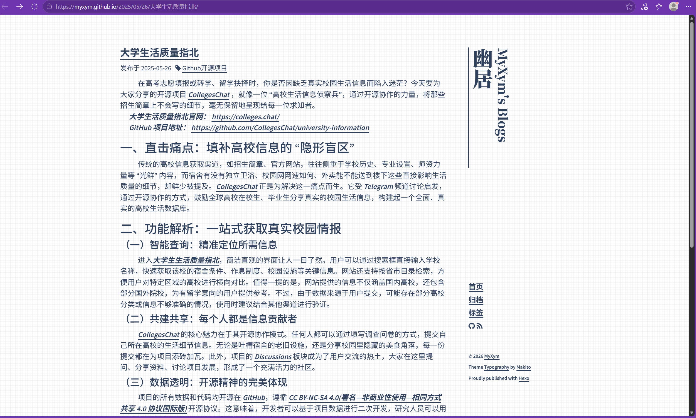
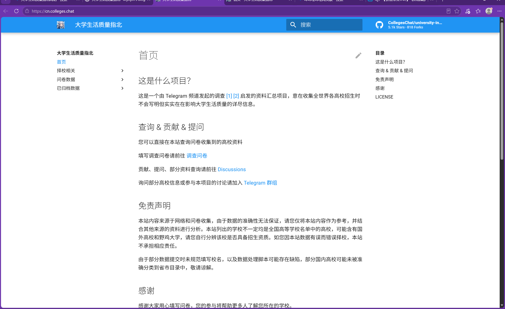

## 总纲：访问一个网站只有三步

浏览器打开一个网站，只发生三件事：

**① DNS 解析**（查号台：这个域名在哪？）→ **② 连接服务器**（TLS 握手时报上域名）→ **③ 拿网页**

GFW 只在前两步动手脚，而且**只认域名、不认服务器**：

| 环节 | GFW 怎么拦 | 效果 |
|------|-----------|------|
| ① 解析时 | **DNS 污染**：把 `xxx.vercel.app` 解析成假 IP / 超时 | 整个后缀全红，谁都连不上 |
| ② 握手时 | **SNI 干扰**：看到 TLS 里的域名是 `xxx.github.io` 就掐 | 部分节点超时，时好时坏 |

后面的所有问题，都是这两行表的实例。

---

## 背景：四个域名与一张测速图

提问前先查了四个域名的底细，顺带梳理测速数据：

| 域名 | 是谁的 | 实测解析 |
|------|--------|----------|
| `colleges.chat` | 「大学生活质量指北」主站（Next.js） | NS → Cloudflare，A → CF 代理 IP |
| `cn.colleges.chat` | 同站的国内加速入口 | DNSPod 智能解析 → 新加坡 Aceville CDN；响应带 `cf-ray`，源站仍走 Cloudflare |
| `collegeschat.github.io` | 同项目的 Hugo 版 | GitHub Pages 标准 IP |
| `myxym.github.io` | MyXym 的个人博客（Hexo） | GitHub Pages 标准 IP |

ITDOG 全国测速（264 个监测点）的现象：

| 测试地址 | 大陆表现 |
|----------|----------|
| `eryuemu-blog.vercel.app` | 电信/联通/移动**全部超时**，仅港澳台能通 |
| `eryuemu.com` | 基本全绿，平均 2.2s，个别节点超时 |
| `guide.hbuwiki.top` | 大部分绿，23 个超时 |
| `eryuemu.github.io` | 大部分绿，94 个超时 |


*图：eryuemu-blog.vercel.app 在 ITDOG 全国测速中全红超时（.vercel.app 后缀遭遇 DNS 污染）*


*图：eryuemu.com 自定义域名在 ITDOG 全国测速中全国大部分地区全绿秒开*


*图：guide.hbuwiki.top 自定义域名在 ITDOG 全国测速中基本畅通（仅 23 个线路超时）*


*图：eryuemu.github.io 默认域名受到部分省份 SNI 阻断干扰（94 个节点超时）*

于是有了下面十一个问题。

---

## Q1：collegeschat.github.io 和 myxym 是什么关系？

**结论：MyXym 是个人账号，CollegesChat 是组织账号，「他」和「项目」是两个不同的 GitHub 实体，各有一个 Pages。**

GitHub API 实测：

| GitHub 账号 | 类型 | 对应 Pages |
|------------|------|-----------|
| `MyXym` | **User**（个人用户） | `myxym.github.io` —— 他的 Hexo 个人博客 |
| `CollegesChat` | **Organization**（组织） | `collegeschat.github.io` —— 「大学生活质量指北」 |


*图：collegeschat.github.io 组织账号对应的「大学生活质量指北」项目前端网站*


*图：myxym.github.io 个人账号对应的 Hexo 个人博客（Theme Typography by Makito，PS：这个博客主题是真好看）*

GitHub Pages 默认域名规则是 `<用户名或组织名>.github.io`：项目放个人账号下用个人名，放组织下用组织名。他把项目放进了自己创建的组织里，所以 Pages 用组织名，和个人账号名无关。

> 类比自己：HBU-Wiki 在个人账号下，Pages 是 `eryuemu.github.io/HBU-Wiki`。哪天建个 `hbu-wiki` 组织把项目迁进去，Pages 会自动变成 `hbu-wiki.github.io`。

---

## Q2：同一个博客，.vercel.app 国内全红，.com 却基本都通，为什么？

**结论：不是服务器被墙，是 `*.vercel.app` 这个域名后缀被 DNS 污染，请求在「查地址」环节就死了。**

- GFW 对 `*.vercel.app` 整个后缀做 DNS 污染（解析返回假 IP / 超时），任何 `.vercel.app` 域名在国内都拿不到真实 IP
- 换成 `eryuemu.com` 后解析干净，正常返回 Vercel 的 IP，请求顺利到达
- **服务器没变、线路没变，变的只有域名这张「身份证」**
- 与内容无关：就算博客只有一句 Hello World，`.vercel.app` 照样打不开

---

## Q3：博客文章说 216.198.79.1 被墙、得换 76.76.21.21，对吗？

**结论：不对。两个 IP 国内实测均可直连，「IP 被墙」是网上流传的脑补，文章已按实测修正。**

关掉代理、纯国内网络实测：

| IP | 归属 | TCP 443 | TLS 握手 |
|----|------|:-------:|:--------:|
| `216.198.79.1` | 亚马逊 AWS（AS16509） | ✅ 通 | ✅ 成功 |
| `76.76.21.21` | 亚马逊 AWS（AS16509） | ✅ 通 | ✅ 成功 |

- 两个 IP 都是 Vercel 租用的 AWS 地址，不存在「新 IP 被墙、经典 IP 安全」之分
- 手机裸连 IP 看到「Vercel 官网」是正常现象：IP 上没配置域名（无 SNI），Vercel 边缘返回默认页面。**能访问 IP ≠ 能用 IP 建站**
- 真正决定能否访问的从头到尾只有一个：**域名**（`.vercel.app` 被污染 vs 自定义域名干净）

---

## Q4：github.io 有 94 个超时，guide.hbuwiki.top 只有 23 个，差在哪？

**结论：同一组服务器，差在 TLS 握手时暴露的域名（SNI）。GFW 对 `*.github.io` 有 SNI 干扰，自定义域名没有。**

先纠正一个误会：`eryuemu.github.io` 这个地址**本身不存在**（GitHub 返回 404），之前测到的是 GitHub 的 404 页面。HBU-Wiki 的真实 Pages 地址是 `eryuemu.github.io/HBU-Wiki`，访问它会 301 跳转到 `guide.hbuwiki.top`。

补测真实地址后的数据：

| 测试地址 | 失败数 | 握手时暴露的域名（SNI） |
|----------|:------:|------------------------|
| `eryuemu.github.io/HBU-Wiki` | 82 | `eryuemu.github.io` |
| `guide.hbuwiki.top` | **23** | `guide.hbuwiki.top` |

两个地址解析到**同一组 IP**（185.199.108-111.153），TCP 层全通，失败数却差 59 个。机制：

1. 访问 github.io 时，TLS 握手带着 `eryuemu.github.io` 的 SNI，部分省份节点被 GFW 掐断（丢包 / RST），连 GitHub 的 301 跳转都拿不到
2. 换成 `guide.hbuwiki.top`，SNI 干净，握手顺利通过
3. 剩下的 23 个失败是运营商线路本身的丢包 / 路由劣化，任何境外托管都躲不开这个基数

---

## Q5：福建、湖北连 eryuemu.com 都超时，限制这么严吗？

**结论：福建（及新疆、西藏）是特殊监管地区，对跨境流量有额外审查；湖北是线路噪音。超时 ≠ 被封。**

- 福建是 GFW 新封锁策略的试点区域，对境外 IP / 境外 TLS 有额外审查。ITDOG 数据里福建电信/联通/移动多个节点超时、其他省基本正常，完全吻合
- 湖北的零星超时更像运营商路由 QoS / 丢包，量级和福建不是一个档次
- 判断「被封」要看是否所有运营商、所有节点全部不可达；同一省里移动能通、电信超时，说明只是线路级偶发干扰，不是针对你的站

---

## Q6：买了 Spaceship 域名后变快了，是注册商在「加速」吗？

**结论：没有任何加速效果，一个字节都没有。变好的唯一原因，是域名后缀从被污染的 `.vercel.app` 换成了干净的 `.com`。**

注册商只干两件事：登记域名（相当于房产局的房本）+ 提供 DNS 解析（相当于查号台）。流量路径是「用户 → DNS 解析 → Vercel 边缘 → 站点」，注册商不碰内容传输。在阿里云、Cloudflare、Namecheap 买域名，效果一模一样。

> 反证：`eryuemu.com` 大陆平均 2.2s（香港 0.7s）——这正是「无加速、跨境直连」的正常水平。真要是上了 CDN 加速（比如 Cloudflare 中国合作伙伴），大陆均值应该在 0.5s 以下。

两个容易混淆的说法：

- **PremiumDNS / 全球解析节点**（Namecheap 卖的这个）：只是让「查号」快一丢丢，毫秒级差别，和网站打开速度（秒级）没关系
- **注册商捆绑卖的 CDN / 建站套餐**：那是另外付费买的产品，不是买域名送的

---

## Q7：要不要给 guide.hbuwiki.top 挂 Cloudflare 加速？

**结论：不用。免费 CF 对国内用户是「负加速」，它唯一的好处你已经用自定义域名白拿到了。**

### 7.1 为什么教程都说「GitHub Pages 挂 CF 很普遍」？

因为**那些教程是海外视角写的**。CF 免费版在全球有一堆边缘节点，海外用户套 CF 确实就近加速、还能白嫖缓存和防护；但 CF 在**大陆没有节点**，大陆用户访问 CF = 先绕到海外再回来。同一篇教程，对海外读者是「加速教程」，对你是「减速教程」。

### 7.2 关键：套 CF = 多一次跨境

| | 直连 GitHub Pages | 套 CF 免费版 |
|--|-------------------|--------------|
| 跨境次数 | 1 次 | **2 次** |
| 大陆访问体验 | 亚洲边缘兜底（262 点实测平均 1.8s） | 大陆流量常被导去美国节点，更慢 |
| SNI 被干扰 | 会（`github.io`） | 不会（CF 换掉 SNI） |
| 你的现状 | 已用 `guide.hbuwiki.top` 解决 | 白绕一圈 |

GitHub Pages 的 CDN（Fastly）在大陆直连时反而有亚洲节点兜底——它是「近的跨境」；CF 免费版对大陆相当于把节点放到了美国——是「远的跨境」。

### 7.3 CF 对国内唯一有用的点，你已经拿到了

网上推荐套 CF 的核心原因之一：CF 会把握手时的 SNI 换成你自己的域名，绕开 `github.io` 被干扰。但你绑 `guide.hbuwiki.top` 已经实现了这个效果（82 → 23 个超时就是「SNI 干净化」）。**CF 能给的份收益，你一分钱没花已经到手了。**

### 7.4 那 23 个超时怎么办？

治不了，也不用治。它们是跨境线路的物理损耗，CF 也改变不了（免费版大陆无节点，甚至 CF 自己的 IP 段在部分运营商也有干扰）。23/262 ≈ 8.8% 的超时率对真实用户几乎无感——测速点里大量移动宽带节点，而移动的跨境质量本来就垫底，你的真实读者不会用 262 个点测你。

### 7.5 什么时候才真需要 CF？

| 情况 | 需要吗 |
|------|:------:|
| 读者大部分在海外 | ✅ CF 很值 |
| 想要免费 SSL / 防攻击 / 防爬 / 缓存 | ✅ 可以要 |
| 网站被攻击、流量突然爆炸 | ✅ 急需 |
| 干脆把站迁到 Cloudflare Pages 托管 | ✅ 顺理成章 |
| 读者全在国内、只想让国内更快 | ❌ 免费 CF 给不了 |

你的情况是最后一行：读者是河大学生，全在国内，想要的是「国内快」。免费 CF 给不了，真正的解法只有两条：**付费香港/新加坡免备案 CDN**（花钱）或**国内云托管 + 备案**（麻烦）。

> 关于「Gemini 说 github.io 不能挂 CF、买的域名可以挂」：它说的是**技术上能不能挂**——`github.io` 的 DNS 归 GitHub 管你碰不了，`guide.hbuwiki.top` 是你（朋友）的域名、DNS 可控，理论上能挂 ✅。但「能挂」和「挂了会变好」是两回事。何况 `hbuwiki.top` 是朋友的域名，套 CF 免费版必须把整个域名的 NS 迁到 Cloudflare（不支持只挂子域名的免费方案），会动到朋友的主站，为了 23 个测速点完全不值得。

---

## Q8：大学生活质量指北的国内加速是怎么做的？

**结论：双线路 + 智能解析——国际走 Cloudflare，国内走付费新加坡 CDN，同一个源站；GitHub Pages 上的 Hugo 版是另一套老版本，和双线路无关。**

### 8.1 架构拆解

```
海外/港澳台用户 ──→ colleges.chat     ──→ Cloudflare（代理）    ──→ Next.js 源站
国内用户        ──→ cn.colleges.chat  ──→ 新加坡 Aceville CDN   ──→ 回源同一源站
                   （DNSPod 智能解析，按地区返回不同结果）
```

1. **国际线 `colleges.chat`**：NS 在 Cloudflare，走 CF 代理，海外和港澳台访问速度 OK
2. **国内线 `cn.colleges.chat`**：DNS 用 DNSPod **智能解析**——国内用户解析时返回的不是 CF 的 IP，而是 `43.169.12.131`（新加坡 Aceville CDN）。Aceville 是专门做亚太加速的 CDN 商，**域名不备案也能用**，就是 7.5 节说的「付费免备案 CDN」的具体形态
3. **回源**：Aceville 节点背后回源到同一套源站（响应头带 `cf-ray` 能看出后面还有 Cloudflare 的影子）。国内用户数据从新加坡兜一圈，但 CDN 缓存了静态资源，体验比直连 CF 好

所以 `cn.colleges.chat` 不是「忘了更新的国内服务器」，是**刻意做的一条国内线路**——他们的读者全是国内大学生，访问体验是命根子。


*图：cn.colleges.chat 国内加速线路入口（DNSPod 智能解析 + 新加坡 Aceville 免备案 CDN）*

### 8.2 两个维度的区分（当时最容易混的点）

| 维度 | 内容 | 关系 |
|------|------|------|
| 维度一：双线路 | `colleges.chat` + `cn.colleges.chat` | **同一个** Next.js 源站的两个入口，给国内国外分别开门 |
| 维度二：另一套站 | `collegeschat.github.io`（Hugo 版） | 项目早期用 GitHub Pages 搭的**老版本**，后来迁到新架构，老站没删 |

「双线路」不是「GitHub Pages + 服务器」——双线路说的是两个域名背后同一个源站；`collegeschat.github.io` 是另一套独立的老版本。

### 8.3 值不值得学？

| | colleges.chat | 你 |
|--|---------------|----|
| 读者 | 全国大学生，流量大 | 河大圈层，流量小 |
| 国内线路 | 付费新加坡 CDN | 直连跨境 |
| 超时率 | 优化过（依然有超时） | 23 个点 |
| 值得吗 | 值得（靠流量吃饭） | 暂时不值 |

**colleges.chat 的今天，就是你 GitHub Pages 项目的「未来形态」**：先在 GitHub Pages 起步 → 流量大了 → 再迁移到独立域名 + 服务器 + 双线路 CDN。你现在在第一步，他们在第二步。等哪天 wiki 的访问量让你觉得「必须优化国内速度了」，再照着他们的路子走不迟。

---

## Q9：GitHub 的 DNS 不也应该访问不了吗？为什么 vercel.app 被直接封域名、github.io 只是握手被掐？

**结论：GFW 是「分级治理」的——对不同域名用不同强度的手段，不是一刀切。vercel.app 被下死手（DNS 污染），github.io 被留一手（SNI 干扰）。**

封锁手段从轻到重：

| 强度 | 手段 | 效果 | 谁被这样对待 |
|------|------|------|-------------|
| 轻 | 丢包 / 限速 | 慢但不至于打不开 | 大部分正常站 |
| 中 | SNI 干扰（握手时掐一部分） | 部分节点超时，大部分能用 | `github.io` |
| 重 | DNS 污染（解析直接给假结果） | 全红，谁也打不开 | `vercel.app`、Google 系 |

这次实测正好是后两档的活证据：

| 域名 | DNS 解析 | 握手 | 测速结果 |
|------|----------|------|----------|
| `eryuemu.github.io/HBU-Wiki` | ✅ 正常（getent 能拿到真实 IP） | 被掐一部分 | 82 超时 / 其余通 |
| `eryuemu-blog.vercel.app` | ❌ 被污染（拿不到真实 IP） | 到不了这一步 | 100% 全红 |

为什么 GitHub 被「留一手」、Vercel 被「下死手」？

- **vercel.app**：上面托管着海量被墙的站，GFW 把整个后缀一污染，干净利落；而且这个域名只有开发者用，封了误伤面小、没人喊疼 → 下死手
- **github.io（以及 github.com）**：GitHub 是全球开发者命脉，国内企业、高校、开源项目全在用它。彻底封掉的政治经济代价太大——开发社区会炸，而且 GitHub 本身配合内容治理。所以策略是：**通道留着，但让你不舒服**——下载慢、raw 域名污染、部分节点掐握手，就是不让你完全躺平

所以 github.io 不是「应该被污染」，而是被**故意降级处理**：能让你用，但用得不舒服。这也解释了为什么「换个自定义域名」在两边都有效：vercel.app 换域名绕开 DNS 污染，github.io 换域名绕开 SNI 干扰——你的两个站，各自从不同的封锁档位里逃了出来。

---

## Q10：「握手掐」是什么？DNS 都出来了，为什么还是打不开？

**结论：DNS 出来 ≠ 能访问。拿到 IP 之后还有一步「自报家门」（TLS 握手 / SNI），GFW 就在这一步听名字掐线。**

还是打电话的比喻：

1. **DNS 解析 = 查号台**：浏览器问「eryuemu.github.io 的电话是多少？」→ 拿到号码 `185.199.x.x` ✅
2. **连接 = 拨号打通** ✅
3. **握手 = 拿起电话自报家门**：「喂，我找 github.io 的张先生」← 关键在这！接线员（GFW）一听你说找 github.io，啪，挂了

为什么必须「自报家门」？因为一台服务器（一个 IP）上住着几万个网站，服务器得知道你想看哪个。这个自报家门就是 TLS 握手里的 **SNI（Server Name Indication）**，而且是**明文**的——GFW 沿途能看到。

| 环节 | GFW 的作案位置 | 结果 |
|------|---------------|------|
| 查号台（DNS） | 污染：给你假号码 | 连号码都拿不到 → 全红（vercel.app） |
| 接线员（握手） | 听到域名就掐电话 | 号码拿到了、电话被挂 → 部分超时（github.io） |

为什么握手是「部分」被掐？

因为这位爱掐线的接线员不是每个城市都有——GFW 的 SNI 检测只部署在**部分运营商节点**上（或者对 github.io 是概率性干扰，丢一部分放一部分）。所以同样的域名，有的省份秒开、有的省份一直转圈。你测出的 82 个超时，就是「哪些节点装了这位接线员」。

一句话总结：

- `vercel.app`：查号台直接不给号码 → 100% 打不通（全红）
- `github.io`：号码给，但接线员听到名字就掐 → 部分打不通（82/23）
- 自定义域名：号码给，接线员也不认识这个名字 → 全部放行（只剩线路本身差）

---

## Q11：换成 guide.hbuwiki.top 为什么就行了？区别在哪？剩下 23 个超时又是什么原因？

**结论：换的只是握手时报的名字（SNI），服务器、内容、IP 一个都没换。剩下的 23 个超时是线路本身的物理损耗，换域名、换 CF、换任何境外托管都躲不掉。**

### 11.1 为什么 guide.hbuwiki.top 就行

访问 `eryuemu.github.io/HBU-Wiki`，握手自报家门：「喂，我找 github.io 的张先生」→ 接线员认识，掐 ❌
访问 `guide.hbuwiki.top`，握手自报家门：「喂，我找 guide.hbuwiki.top 的李先生」→ 接线员不认识，放行 ✅

服务器没换、内容没换、IP 也没换（还是 185.199.108-111.153 那一组），换的只有握手时说的那个名字。接线员的拦截名单里只有 `github.io` 这类域名，`guide.hbuwiki.top` 不在名单里。

GitHub 那边怎么认的？因为项目里有 `public/CNAME` 文件写着这个域名——对 GFW 来说这名字是陌生人（放行），对 GitHub 来说这名字是自家站点（正确返回内容）。**一个域名，两边都「认」，就成了。**

### 11.2 剩下 23 个超时是什么原因

那 23 个不是被拦的，是线路本身烂：

| 原因 | 说明 |
|------|------|
| 跨境损耗 | 站托管在境外（美国/亚太），跨境线路天然丢包，部分节点建立连接就超时 |
| 特殊地区 | 福建等监管试点地区，跨境连接天生被折腾 |
| 运营商 QoS | 移动 / 部分联通节点对境外流量丢包严重 |
| 网络抖动 | 测速是一次性快照，有些节点当时正好在抖 |

### 11.3 关键区分：人祸 vs 天灾

| | 82 个超时 | 23 个超时 |
|--|-----------|-----------|
| 性质 | 人祸（接线员掐的） | 天灾（线路烂的） |
| 换域名能绕开吗 | ✅ 能（你已经绕开了） | ❌ 不能 |
| 换 CF 有用吗 | 理论上能（但没必要） | ❌ 没用 |
| 特征 | 只针对 `github.io` | 任何境外站都有这个基数 |

除非把服务器搬进国内（要备案），否则这 23 个（约 8.8%）就是**「跨境访问的固定税」**——不是你的问题，是物理现实。你测 colleges.chat、测任何境外网站，都会看到类似的残留超时。

---

## Q12：评论区说「GitHub 进不去 = DNS 污染」，和我这个情况是一回事吗？

**结论：不是一回事。GFW 眼里的 GitHub 不是一个域名，是一族域名，每个成员待遇不同——评论区说的是主站 `github.com` 被 DNS 污染；你遇到的是 `github.io`（Pages）被握手干扰。两种病，不能照抄别人的药方。**

| 域名 | 处境 | 效果 |
|------|------|------|
| `vercel.app` | DNS 污染 | 🔴 100% 打不开 |
| `github.com`（主站） | DNS 污染 / 干扰 | 🔴 经常打不开 |
| `raw.githubusercontent.com` | DNS 污染 | 🔴 文件下不了 |
| `github.io`（Pages） | SNI 握手干扰 | 🟡 部分节点超时 |

- 「GitHub 进不去」的评论区：说的是主站 `github.com`——解析直接被污染，打不开
- 你的情况：`github.io` 解析正常（能拿到 IP），只是握手时报上名号时被概率性掐线
- 两个都是「GitHub 的域名」，但一个是 DNS 层的病、一个是握手层的病；网上那些「改 DNS / 换 hosts」的偏方对你无效——你的解析从头到尾都是好的
- github.io 反而是这一族里待遇最好的：只被部分掐；主站才是被往死里整的那个

---

## Q13：github.io 多刷新几次、流量换 WiFi、换个浏览器就能通，为什么？

**结论：因为 github.io 的拦截是概率性的（握手时随机掐一部分），不是 100% 全封——这是它和「全封」的本质区别，也是「换着试总能试通」的原因。**

| 操作 | 原理 |
|------|------|
| 多刷新几次 | GFW 不是每次握手都掐，是概率性丢包 / RST；没拦到的那次就通了 |
| WiFi 换流量 | 不同网络走不同线路、不同运营商、不同节点——这条路保安刚好在，那条路保安下班了 |
| 换个浏览器 | 浏览器可能换 HTTPS 端口或 TLS 版本重试，偶尔能绕过 |

类比：

- **DNS 污染**（vercel.app）= 家门牌号被从地图上抹掉了 → 任何人按地图都找不到，永远进不去
- **握手干扰**（github.io）= 保安在门口随机抽查，看到名字时拦时不拦 → 换条路、换个时间，可能就碰不到保安了

> 这也解释了为什么 82 个测速节点不代表真实用户体验：测速只试一次，真实用户会刷新第二次。测速红一下，和用户「打不开」之间，隔着一次重试的距离。

---

## Q14：换成 guide.hbuwiki.top 后稳定了很多，是怎么回事？

**结论：换了名字之后，保安（GFW）根本不认识它，一次都不拦——稳定不是因为线路变好，而是因为拦截名单把你移出去了。剩下的 23 个超时已经不是保安的问题，是路本身烂。**

| 域名 | 保安（GFW）的态度 | 效果 |
|------|------------------|------|
| `github.io` | 名字在抽查名单上 → 随机拦，有时放有时掐 | 不稳定 |
| `guide.hbuwiki.top` | 这谁？不在名单上 → 每次都放行 | 稳定 |

- 机制和 Q11 完全一致：换的只是握手时报的 SNI，服务器、IP、内容一个没换
- 那 23 个超时（约 8.8%）是跨境线路的固定税，跟你换什么名字没关系——是路的问题，不是保安的问题
- 验证方法：看超时集中在哪。集中在固定省份 / 运营商 = 路烂（治不了也不用治）；全省全运营商都红 = 被拦（才值得换名字绕）

---

## 总结：六句话带走

1. **GFW 是分级治理的**：丢包限速 → SNI 干扰 → DNS 污染，手段从轻到重。`github.io` 被「留一手」（开发者命脉，能让你用但用得不舒服），`vercel.app` 被「下死手」（后缀一污染、干净利落）。自定义域名通杀，是因为对 GFW 来说它是不认识的陌生人
2. **域名决定生死**：`*.vercel.app`、`*.github.io` 这类公共后缀被 DNS 污染 / SNI 干扰，自定义域名是绕开它们的唯一正解——换的只是握手时报的名字，服务器和 IP 一个都没变
3. **线路决定下限**：超时要分清人祸和天灾——82 个是人祸（换域名能绕开），23 个是天灾（约 8.8% 的「跨境访问固定税」），换域名、换 CF、换任何境外托管都躲不掉
4. **注册商不背锅也不领功**：它只做登记和解析；「换域名就变好」是因为后缀从被污染变成了干净
5. **免费 CF 帮不了国内用户**：它的加速是给海外读者的；国内要快只有两条路——付费亚太 CDN 或国内托管 + 备案
6. **GitHub 是一族域名，各有各的待遇**：主站 `github.com` / `raw.githubusercontent.com` 被 DNS 污染，Pages `github.io` 只被概率性握手干扰——评论区说的「GitHub 进不去」和你的「Pages 打不开」是两码事，别拿别人的换 DNS 偏方套自己。拦截是概率性的就有破绽：多刷新、换网络、换浏览器偶尔能通——测速红 ≠ 用户打不开

当前两个站点的架构（博客 `eryuemu.com` + Vercel，HBU-Wiki `guide.hbuwiki.top` + GitHub Pages）已经是国内访问的最优解，不需要再折腾。

---

## 附：本次排查用到的实测手段

| 手段 | 用途 |
|------|------|
| DNS-over-HTTPS（`dns.google/resolve`） | 没有 `dig` 也能查 A/NS/CNAME，且不受本地 DNS 污染影响 |
| GitHub API | 查账号类型（User/Organization）、仓库是否存在 |
| TCP + TLS 握手测试 | 区分「IP 不可达」和「SNI 被干扰」 |
| ITDOG 全国测速 | 看超时的分布规律：集中在某省 = 线路问题；全省通但部分运营商超时 = 偶发 |

> 心法：GFW 相关的结论必须实测。网上流传的「XX 被墙」大多经不起验证——这次最大的收获，就是发现「推荐 IP 被墙」的说法完全是脑补。

---

## 相关笔记

- [eryuemu.com 域名绑定与 DNS 踩坑实录](/blog/eryuemu-domain-binding-and-dns-troubleshooting) ← 前一篇：DNS 配置、Vercel 绑定、IP 实测（本文的续篇）
- [个人博客域名选购指南](/blog/personal-blog-domain-buying-guide) ← 域名后缀对比与注册商选择
- [HBU-Wiki 开发环境搭建：从fnm到项目级Node.js隔离](/blog/hbu-wiki-dev-env-setup) ← HBU-Wiki 项目本身
- [eryuemu-blog 部署与评论系统搭建全复盘](/blog/eryuemu-blog-deployment-comment-sys) ← 博客部署 + Waline 评论系统