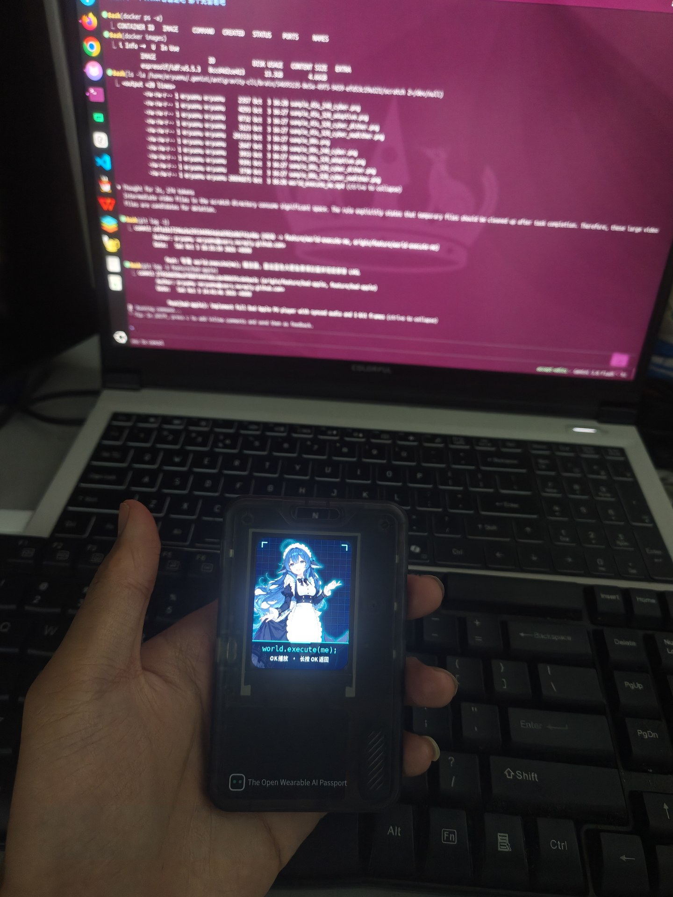
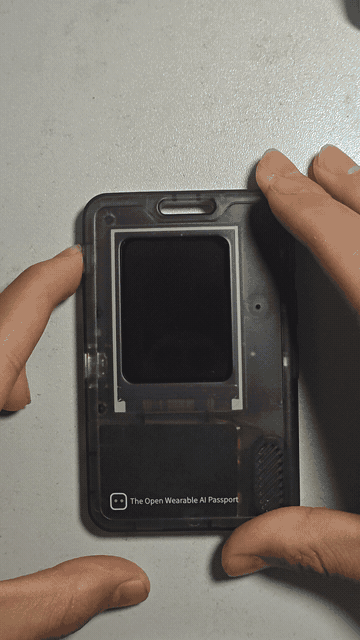
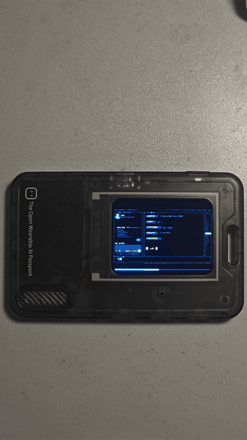
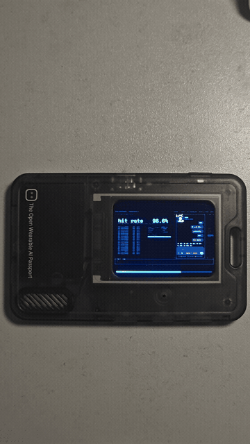
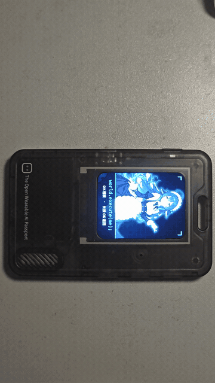

在 B 站刷到由 UP 主 @西西弗斯的风车 制作的《world.execute(me);》二创视频和音乐后深受触动，恰巧我最近也是刚入坑东方（PS：bad apple实在是太魔性了 影绘PV简直是艺术），更碰巧的是我刷到这个 FoloToy AI Passport，非常有意思的 AI 玩具。就像当年极客界对 Bad Apple 的执念一样，决定把这部作品带到 99 块钱的 FoloToy AI Passport 掌上工牌中。

本项目将原版 PV 经过逐帧差分提取、抖动量化与音视频复合封装，针对 ESP32-C3 进行了硬件零堆内存直驱优化，做成了完全纯离线运行的微型影音播放器。

老实说这个显示效果差强人意（），但实机拿在手上当个随身赛博摆件还是挺好玩的。

---

## 📺 B 站实机演示视频（内嵌播放）

  <iframe 
    src="https://player.bilibili.com/player.html?bvid=BV1qMHr6eEyy&page=1&high_quality=1&danmaku=0&autoplay=0" 
    scrolling="no" 
    border="0" 
    frameborder="no" 
    framespacing="0" 
    allowfullscreen="true"
    style="position: absolute; width: 100%; height: 100%; left: 0; top: 0; border: none;">
  </iframe>

> *如果上方内嵌播放器未加载，可直接点击跳转原视频：[B站原视频直达 (BV1qMHr6eEyy)](https://www.bilibili.com/video/BV1qMHr6eEyy)*

---

## 🎞️ 实机动态效果展示

### 1. 开机就绪与待机大肥鱼封面

### 2. 音频波形跳动与星空粒子

### 3. 高潮处刑倒计时 Execution

### 4. 播放完毕回到封面

---

## 🔗 开源与固件发布

固件已发布在官方社区，源码也已开源：
* **官方社区一键免编译刷入**：[https://ai-passport.folotoy.cn/plays/909/?v=1899-2](https://ai-passport.folotoy.cn/plays/909/?v=1899-2)
* **完整源码与工程 GitHub**：[https://github.com/eryuemu/ai-passport-world-execute-me](https://github.com/eryuemu/ai-passport-world-execute-me)
* **B 站演示原地址**：[https://www.bilibili.com/video/BV1qMHr6eEyy](https://www.bilibili.com/video/BV1qMHr6eEyy)

目前固件在官方社区已经冲进热度榜 Top 9：

本项目代码由 Antigravity 平台的 Gemini 3.8 Flash 与 Claude 5.5 Opus 结对协同完成，本人主要负责提出离谱需求、纠正 AI 的硬件幻觉、插拔数据线以及最终实机验收。

---

## 致谢与版权声明

* **音乐原作**：Mili -《world.execute(me);》
* **原二创 PV / 灵感**：B站 UP 主 @西西弗斯的风车 (原视频 BV1xCai6aE9g | GitHub: [MisakaZentai/world-execute-me-dsh-pv](https://github.com/MisakaZentai/world-execute-me-dsh-pv))
* **大肥鱼角色形象**：溟月 © 上善无形 / 女仆版 ZipZipPipe / 立绘 Small-tailqwq (遵循 CC BY-NC-SA 4.0 协议)
* **技术与非商用声明**：本作品为个人业余兴趣制作的非商用硬件技术探索与同人作品，严禁任何商业用途。
