## 💡 简明省流版（大白话 30 秒速览）

> **一句话总括**：2026 年 8 月 23 日 Google Search Console（GSC）发信报警博客有 34 个网页未编入索引（包含 6 个分类原因）。排查发现**仅有 1 个 404 错误是真正的代码/链接历史遗留问题**（由于 8 月 12 日精简文章 slug 导致旧链接失效，已通过 `vercel.json` 补充 301 永久重定向解决）；其余 5 类均为搜索引擎正常的规范化收敛、权重迁移与分批抓取排队账单，无需焦虑。

### 🎯 6 类索引状态排查与处理总览

| GSC 状态分类 | 影响数量 | 核心根因 | 严重程度 | 处理方案 / 状态 |
| :--- | :---: | :--- | :---: | :--- |
| **未找到 (404)** | 1 | 8/12 提交重构时精简了文章 slug，未配置旧地址跳转 | 🔴 需修复 | **已配置 `vercel.json` 301 永久重定向** ✅ |
| **备用网页（有适当规范标记）** | 4 | 不带尾斜杠 `/` 的 URL 变体，Canonical 标签生效 | 🟢 正常 | 符合预期，Canonical 正常工作，无需改动 |
| **重复网页，规范网页不同** | 1 | 心迹动态字数较短且列表页全量渲染正文，被判定重合 | 🟡 观察 | 符合短随笔设计定位，无需破坏列表体验 |
| **已抓取 - 尚未编入索引** | 3 | 8/22 刚抓取的新近文章，进入索引质量评估队列 | 🟡 等待 | 正常排队中（通常需 1~4 周） |
| **网页会自动重定向** | 5 | 8/18 根域名与 www 反转的 308 重定向历史延续 | 🟡 验证中 | 8/18 已在 GSC 发起验证，周期内正常推进 |
| **已发现 - 尚未编入索引** | 20 | 全站校准时间戳后触发重爬，新站抓取配额分批推进 | 🟡 排队中 | 8/20 已在 GSC 发起验证，由 Google 系统分批消化 |

---

## 一、事件起因：深夜两封 GSC 报警邮件与 34 个“未编入索引”

2026 年 8 月 23 日深夜，站长邮箱突然接连收到了 Google Search Console 系统的两封报警邮件：

1. 第一封提示：**「新原因导致网站 https://eryuemu.com/ 的站点地图中的网页无法被编入索引」**，明确列出原因是「重复网页，Google 选择的规范网页与用户指定的不同」。
2. 第二封提示：**「新原因导致网站 https://eryuemu.com/ 上的网页无法被编入索引」**，列出包含了「备用网页（有适当的规范标记）」、「未找到 (404)」以及「重复网页」。

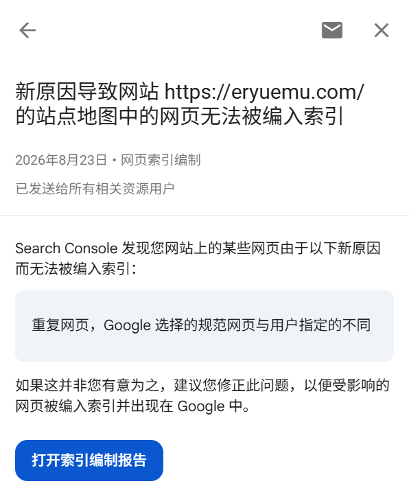
*图 1：8 月 23 日收到的第 1 封 GSC 邮件 —— 提示站点地图中存在重复网页*

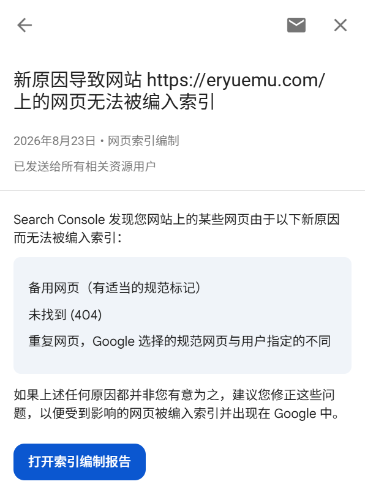
*图 2：8 月 23 日收到的第 2 封 GSC 邮件 —— 提示全站网页新增未编入索引原因*

点击邮件进入 Google Search Console 后台，在「编制索引 -> 网页」概览页面中，数据呈现出明显的反差：

* **已编入索引**：6 个页面
* **未编入索引**：**34 个页面**，共涉及 6 个细分原因

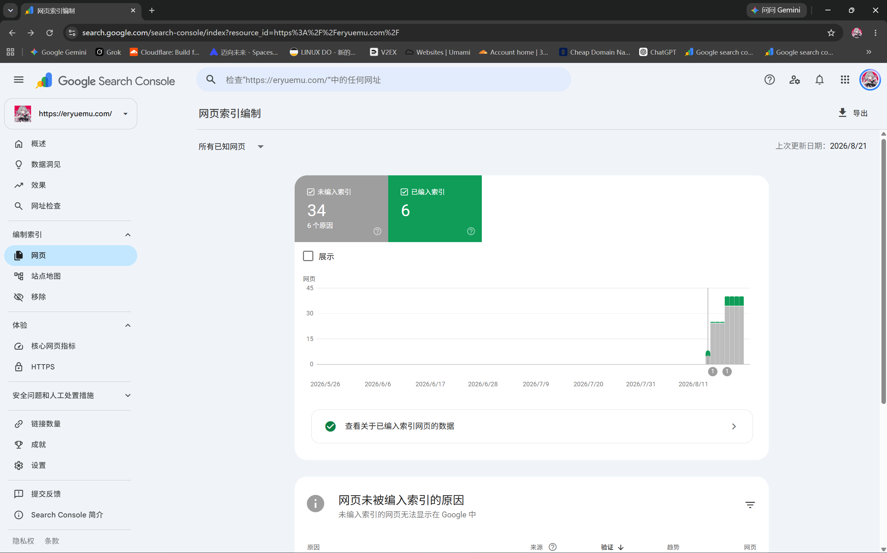
*图 3：GSC 网页索引编制总览面板，未编入索引数量呈现上升趋势*

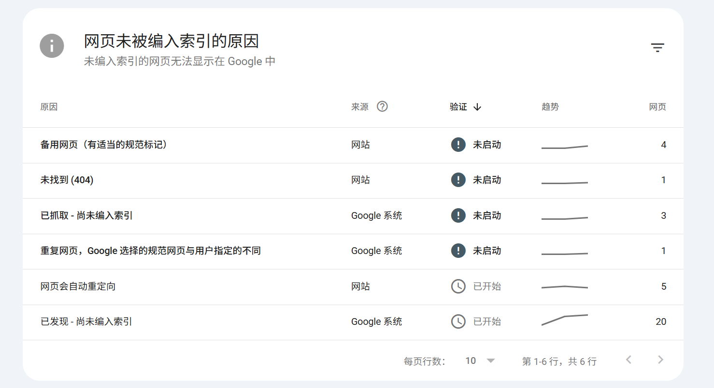
*图 4：GSC 列出的 6 大未编入索引具体原因明细*

很多新手站长在看到多达 34 个页面未收录、以及各种红色/灰色警告时容易陷入恐慌。但通过逐项钻取分析，可以快速剥离出真正的故障点与正常的爬虫运行规律。

---

## 二、真·代码级故障：404（未找到）深度溯源与 301 搬家修复

在 6 个原因中，**唯一属于真正的站点断链/历史遗留 bug 的，是「未找到 (404)」**。

### 2.1 报错现象与 URL 差异

点击 GSC 中的「未找到 (404)」下钻页面：

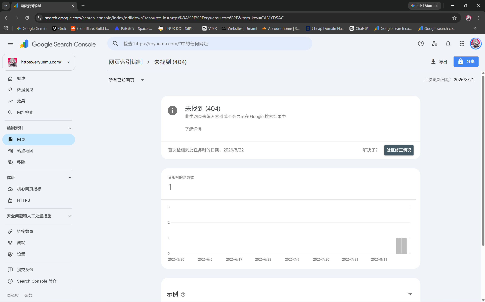
*图 5：GSC 404 未找到详情页，受影响网页数为 1*

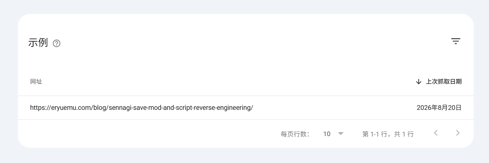
*图 6：GSC 捕获到的 404 示例网址*

受影响的 URL 为：
```text
https://eryuemu.com/blog/sennagi-save-mod-and-script-reverse-engineering/
```

然而在博客内容目录中检索，这篇关于《戦巫〈センナギ〉》存档修改与脚本逆向的文章，实际对应的 Markdown 文件是 `src/content/blog/sennaagi-save-script-recap.md`，当前生产环境的合法 URL 是：
```text
https://eryuemu.com/blog/sennaagi-save-script-recap/
```

两者对比：
* ❌ Google 抓取的旧地址：`.../sennagi-save-mod-and-script-reverse-engineering/`
* ✅ 当前存在的正规地址：`.../sennaagi-save-script-recap/`

### 2.2 利用 Git 历史还原真相：为什么曾经存在过这个 URL？

为了弄清楚这个旧 slug 从何而来，我们通过 WSL 进入仓库执行 `git log` 追溯：

```bash
git log --all --oneline -- "src/content/blog/*sennagi*"
```

输出定位到两处关键历史节点：
1. **2026-08-06 15:23:21（commit `dca3035`）**：首次新增文章，当时的文件名确实正是 `src/content/blog/sennagi-save-mod-and-script-reverse-engineering.md`。
2. **2026-08-12 17:23:54（commit `7a3f801`）**：提交信息为 `feat(blog): 发布《域名、GFW 与国内访问：一场测速引发的排查实录》`。

深入比对 `7a3f801` 的变更详情：

```bash
git diff 7a3f801~1 7a3f801 --summary
```

输出揭示了当时进行的一波集中重构与文件名精简：
```text
delete mode 100644 src/content/blog/ai-translation-reflections-e-society.md
create mode 100644 src/content/blog/domain-gfw-and-china-access.md
rename src/content/blog/{sennagi-save-mod-and-script-reverse-engineering.md => sennaagi-save-script-recap.md} (92%)
delete mode 100644 src/content/blog/shui-long-yin-shanghai-galonly.md
create mode 100644 src/content/blog/shuilongyin-galonly-essay.md
rename src/content/blog/{yukoku-translation-tech-retrospective.md => youketsu-localization-recap.md} (93%)
```

**根因彻底水落石出**：
在 8 月 12 日发布新文章时，顺手对全站几篇旧文章的 slug 进行了重构和统一精简：
- `sennagi-save-mod-and-script-reverse-engineering` ➔ `sennaagi-save-script-recap`
- `yukoku-translation-tech-retrospective` ➔ `youketsu-localization-recap`
- `shui-long-yin-shanghai-galonly` ➔ `shuilongyin-galonly-essay`

由于旧 slug 在 8 月 6 日至 8 月 12 日期间曾公开上线并被爬虫记录，当 Googlebot 于 8 月 20 日回访旧地址时，服务器返回了 404 Not Found。

### 2.3 解决方案：配置 Vercel 301 永久重定向

改名本身是提升 URL 规范度的良好习惯，但**切忌让旧 URL 凭空变成死链**。正确的做法是配置 **HTTP 301 Moved Permanently（永久重定向）**，告诉搜索引擎与外部引流链接：“内容已永久搬迁到新地址，请把原有的权重和索引同步转移到新地址”。

在项目根目录新建 [`vercel.json`](file:///w:/home/eryuemu/workspace/eryuemu-blog/vercel.json)：

```json
{
	"redirects": [
		{
			"source": "/blog/sennagi-save-mod-and-script-reverse-engineering/:path*",
			"destination": "/blog/sennaagi-save-script-recap/",
			"permanent": true
		},
		{
			"source": "/blog/yukoku-translation-tech-retrospective/:path*",
			"destination": "/blog/youketsu-localization-recap/",
			"permanent": true
		},
		{
			"source": "/blog/shui-long-yin-shanghai-galonly/:path*",
			"destination": "/blog/shuilongyin-galonly-essay/",
			"permanent": true
		}
	]
}
```

将改动提交并推送至 GitHub，Vercel 自动重新构建部署。部署后，当爬虫再次请求旧地址时，服务器将直接返回 301 并重定向到带尾斜杠的正式新地址，404 报警将在下一次抓取周期中彻底消除。

---

## 三、正常机制与延迟账单：其余 5 类状态深度剖析

除了 404 属于代码改名遗漏需要配置重定向外，其余 5 类未编入索引原因均属于**搜索引擎的内部运行规律与预期行为**。

---

### 3.1 备用网页（有适当的规范标记）—— 4 个页面

查看「备用网页」详情与示例：

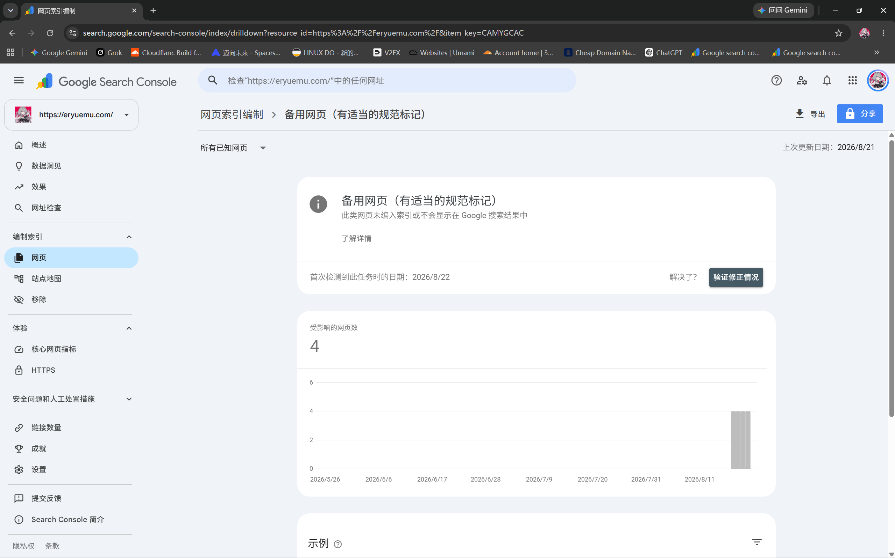
*图 7：GSC 备用网页详情页，受影响网页数为 4*

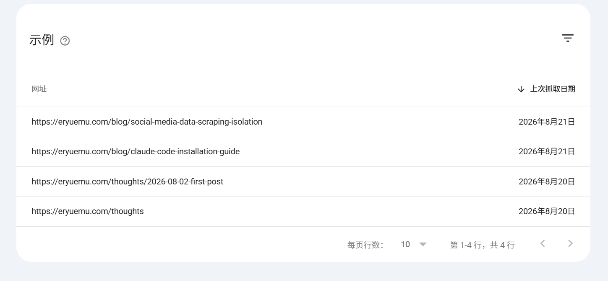
*图 8：受影响的 4 个 URL 均为不带末尾斜杠的变体*

受影响的 4 个 URL 分别为：
- `https://eryuemu.com/blog/social-media-data-scraping-isolation`
- `https://eryuemu.com/blog/claude-code-installation-guide`
- `https://eryuemu.com/thoughts/2026-08-02-first-post`
- `https://eryuemu.com/thoughts`

**深度原理**：
注意看上面的 URL，末尾都**没有尾斜杠 `/`**。
在 Astro 中，默认生成的静态路由和 Sitemap 均采用带尾斜杠的标准形式（如 `.../claude-code-installation-guide/`），并在 HTML `<head>` 中输出了规范标记：

```html
<link rel="canonical" href="https://eryuemu.com/blog/claude-code-installation-guide/" />
```

当 Googlebot 通过外部链接或自主探测发现不带尾斜杠的变体时，它读取了页面上的 `rel="canonical"`，确认了带斜杠的版本才是正主。因此，Googlebot 按照站长指示，将不带斜杠的变体标记为“备用替身”，只把正主编入索引。

> [!NOTE]
> **结论**：这是 Canonical 机制在严格按预期工作。说明网页没有发生内容重复，权重成功收敛至标准地址。**完全无需做任何改动**。

---

### 3.2 重复网页，Google 选择的规范网页与用户指定的不同 —— 1 个页面

查看该项的详情与受影响 URL：

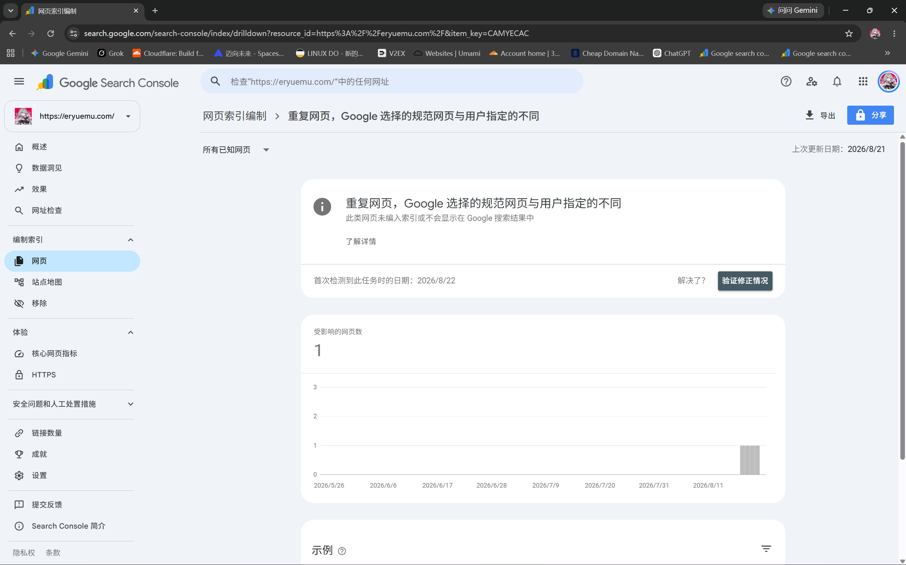
*图 9：GSC 重复网页详情页，受影响网页数为 1*

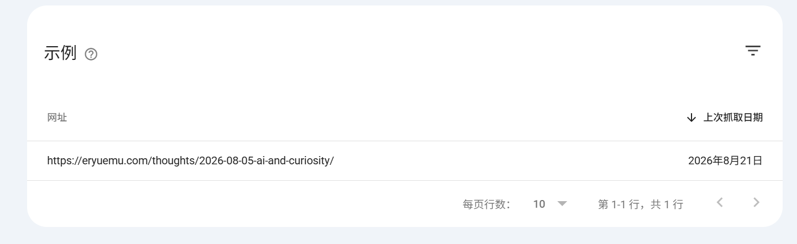
*图 10：受影响的 URL 为短心迹动态*

受影响的 URL 为：
```text
https://eryuemu.com/thoughts/2026-08-05-ai-and-curiosity/
```

**根因剖析（短动态与全量列表页的重合）**：
查阅该心迹文件 `src/content/thoughts/2026-08-05-ai-and-curiosity.md`，正文非常简短（只有两句关于 AI 与好奇心的生活感悟）。

与此同时，在心迹列表页 `src/pages/thoughts.astro` 中，为了给访客提供像即刻、朋友圈一样的连贯阅读流，模板代码直接全量渲染了每条动态的内容：

```astro
<!-- src/pages/thoughts.astro -->
<div class="thought-body prose">
    <Content />
</div>
```

这就导致了一个有趣的现象：
- 心迹列表页 `/thoughts/` 包含了这条动态的 **100% 完整正文**；
- 心迹详情页 `/thoughts/2026-08-05-ai-and-curiosity/` 也只有这相同的两句话。

Google 的算法在分析正文特征向量时，认为单页详情与主列表页高度相似（Thin Content + Duplicate Content），因此决定不将这个极短单页单独作为正规条目编入独立索引，而是把权重归集到列表页。

> [!TIP]
> **应对心法**：心迹（Thoughts）本身就是博客定位中的微动态/碎片感悟，其第一优先级是个人表达与列表流的即时阅读体验。不需要为了迎合爬虫指标而在列表页强行截断加“阅读更多”，允许个别短动态被判定为重复收敛是极小且健康的正常现象。

---

### 3.3 网页会自动重定向 —— 5 个页面（验证推进中）

查看「网页会自动重定向」详情：

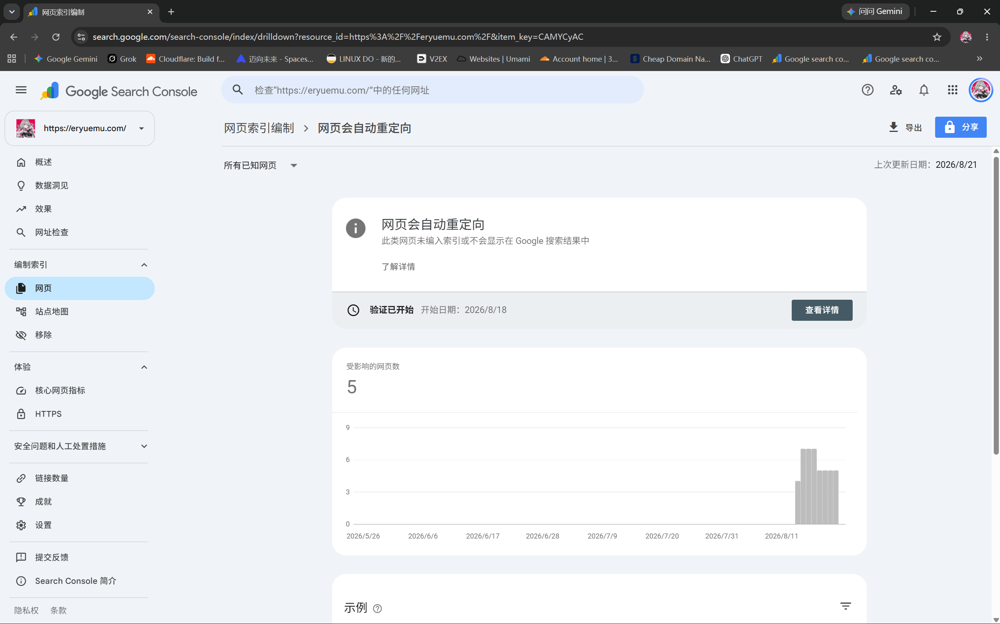
*图 11：GSC 网页会自动重定向详情页，显示「验证已开始：2026/8/18」*

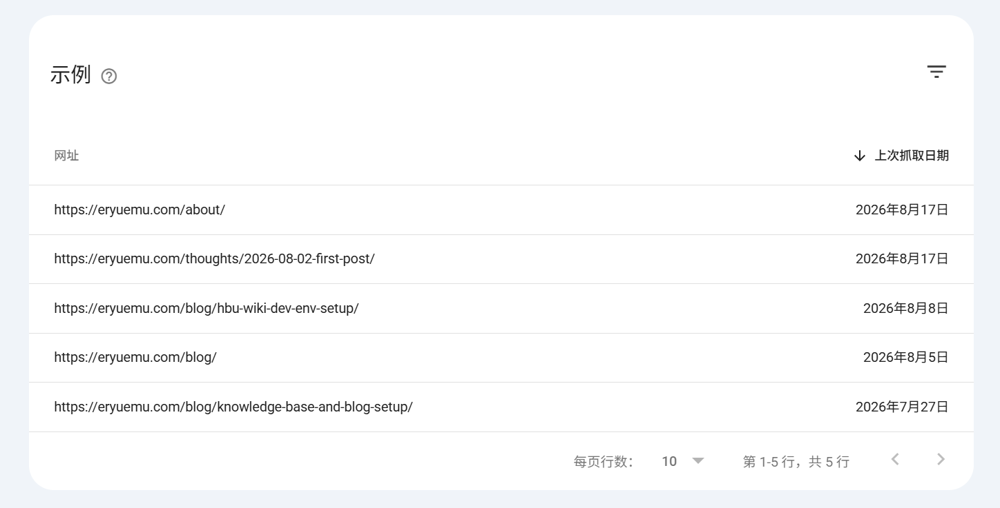
*图 12：受影响 URL 明细列表*

受影响页面包括 `/about/`、`/blog/`、`/thoughts/...` 等基础页面。

**深度原理**：
这正是此前博客文章《GSC 提示「网页会自动重定向」未编入索引？根域名与 www 规范化全复盘》中详细排查过的 **www ➔ 根域名（308 Permanent Redirect）反转历史**。

截图中赫然标注着：**「验证已开始，开始日期：2026/8/18」**。
Googlebot 验证重定向并非瞬间完成，它需要对整站网络拓扑做多轮重试与缓存刷新，周期通常为 **1 ~ 3 周**。这封信件只是 GSC 系统流水线生成的周期性状态摘要。

> [!NOTE]
> **结论**：验证已经在后台队列平稳推进，**无需任何重复操作，静候完成即可**。

---

### 3.4 已抓取未编入索引 (3) & 已发现未编入索引 (20)

最后两项均属于 Google 索引调度系统的**排队与资源配额机制**。

#### ① 已抓取 - 尚未编入索引（3 个页面）
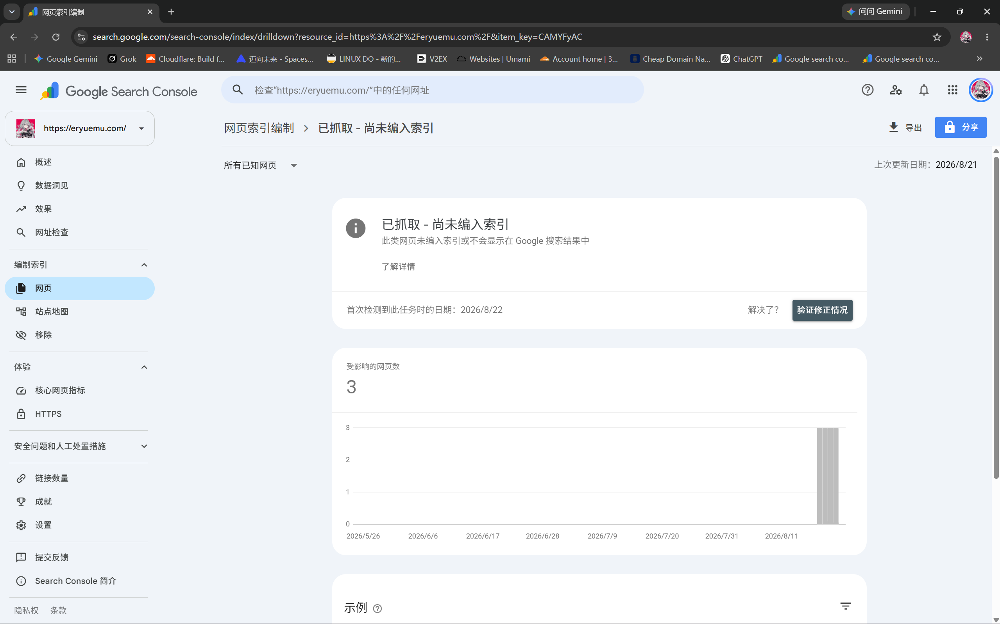
*图 13：已抓取尚未编入索引详情页*

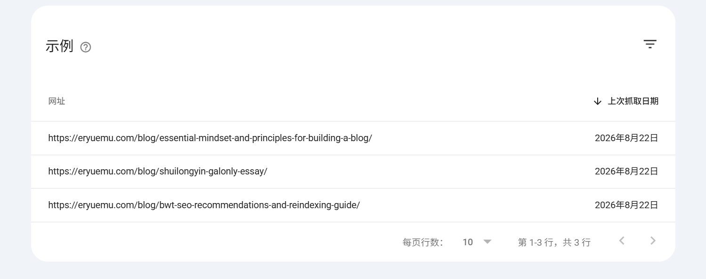
*图 14：抓取日期为 8 月 22 日的新近文章列表*

受影响的 3 篇均为 8 月 22 日刚抓取的近期文章（《建站心法》、《水龙吟漫评》、《Bing 站长 SEO 复盘》）。爬虫已经完成了网络请求并存入临时库，目前处于内容质量、语义结构与索引价值评估阶段。新站文章抓取后经过 1~4 周排队后转入已收录状态是完全正常的节奏。

#### ② 已发现 - 尚未编入索引（20 个页面）
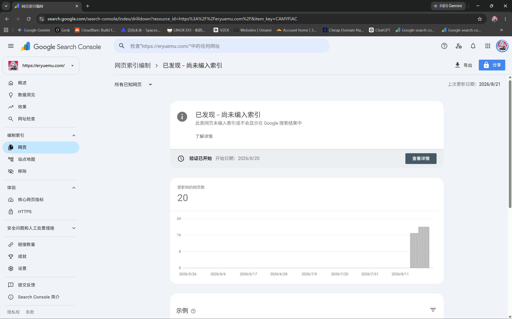
*图 15：已发现尚未编入索引详情页，显示「验证已开始：2026/8/20」*

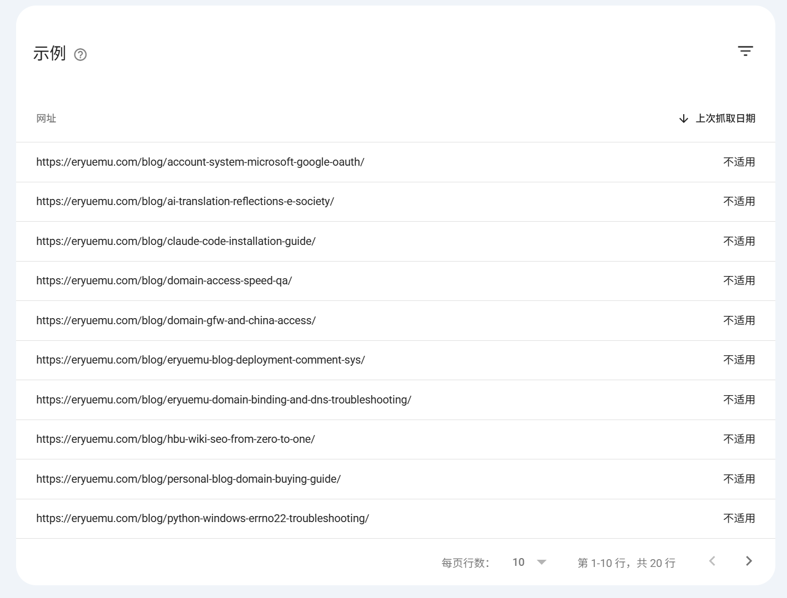
*图 16：等待抓取分配的 20 个文章 URL*

这批 URL 在 8 月 20 日全站批量校准发布时间戳后，`sitemap-index.xml` 的全量 `lastmod` 发生变动，触发 Googlebot 将全站文章重新加入调度池。由于新域名的爬取配额（Crawl Budget）有限，系统正在分批逐步派发抓取任务。

---

## 四、经验提炼：独立博客改名与多站 SEO 防坑守则

经历这一轮 6 大维度的全面复盘与实战排查，可以总结出以下 3 条高价值建站法则：

### 1. URL 即永久资产，改名必配 301
* 在静态博客初期规划内容时，尽量确立稳定、语义清晰的英文 slug；
* 如果后续必须重命名已有文章的 Markdown 文件名，**切记在第一时间于 `vercel.json` 或网关层补全 301 永久重定向规则**，避免搜索引擎在下一次回访时撞上 404。

### 2. 学会区分“代码故障”与“算法流水线账单”
* **真故障（需立即干预）**：404（死链）、500（服务崩溃）、DNS 解析失败、robots.txt 误写 Disallow /。
* **流水线账单（保持耐心即可）**：
  * 「网页会自动重定向」➔ 正在验证 308/301 跳转；
  * 「备用网页（规范标记）」➔ Canonical 正常起效收敛；
  * 「已发现/已抓取未编入索引」➔ 新站爬虫配额调度与索引评估中。

### 3. 规范化配置的完整闭环
* **构建层**：Astro 统一输出标准带斜杠 Canonical 标签与 Sitemap；
* **服务器层**：通过 `vercel.json` 或 Cloudflare Page Rules 管理历史重定向；
* **监控层**：结合 GSC 实时 URL 检查工具（Live URL Test）验证 HTTP 返回状态，做到改动可控、心中有数。
