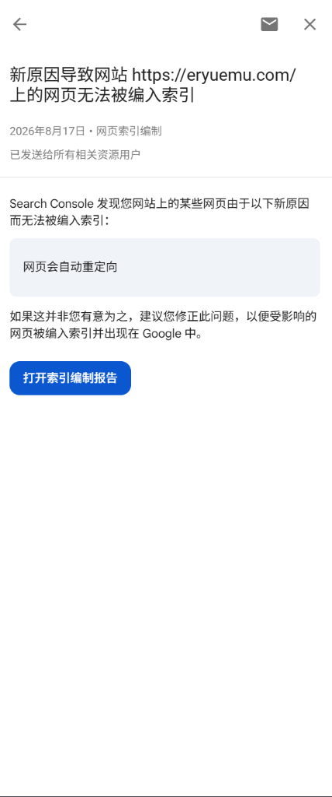

---
title: 'GSC 报警「备用网页」与「未编入索引」全复盘：VitePress Clean URLs 与多站 SEO 规范化'
description: '接续 8 月 18 日博客根域名重定向排查。详细复盘 8 月 20 日 GSC 两封邮件的前后因果、博客与知识库问题的内在关联，以及在 VitePress 中落地 Clean URLs 解决备用网页的完整实战。'
pubDate: '2026-08-20'
category: '开发'
type: 'ai-organized'
---

## 一、前后脉络：从 8 月 17 日到 8 月 20 日发生了什么？

把这几天收到的三封 GSC 报警邮件按时间线摆在一起，整个事件的发展过程非常清晰：


*图 1：8 月 17 日博客首次收到 GSC 邮件——提示「全站网页」因「网页会自动重定向」未编入索引*


*图 2：8 月 20 日博客第 2 次收到 GSC 邮件——提示「站点地图中的网页」存在重定向*


*图 3：8 月 20 日知识库第 1 次收到 GSC 邮件——提示新原因「备用网页（有适当的规范标记）」*

### 1.1 之前发生了什么？怎么干的？（8 月 17 ~ 18 日）

- **收到首封报警**：8 月 17 日，个人博客 `https://eryuemu.com/` 首次收到 GSC 邮件（图 1），提示 4 篇博客文章因「网页会自动重定向」无法编入索引；
- **排查原因**：排查发现，托管博客的 Vercel 默认将根域名 `eryuemu.com` 自动通过 308 状态码重定向到了 `www.eryuemu.com`，导致爬虫先抓到了根域名链接，接着被迫走了一次重定向；
- **改造与提交验证**：在 **8 月 18 日**，我们在 Vercel 中进行了反转配置，正式将不带 www 的根域名 `eryuemu.com` 设为主站，将带 www 的域名设为跳转；同时在代码的 Canonical 标签、Sitemap 中全量收敛为根域名，并在 GSC 控制台点击了「验证修正情况」。

### 1.2 现在又发生了什么？（8 月 20 日）

时隔两天，8 月 20 日下午邮箱同时弹出了两封新的 GSC 邮件：

1. **博客收到的第 2 封信（图 2）**：
   - 标题写着 *「新原因导致网站 https://eryuemu.com/ 的【站点地图中】的网页无法被编入索引：网页会自动重定向」*；
   - 细看标题会发现，这次多了 **「站点地图中」** 的限定。这是因为 Google 爬虫在处理提交的 `sitemap-index.xml` 独立报表时，触发了例行汇总通知。由于我们在 18 号提交的验证还在队列中排队（通常需要 1~2 周），系统在过渡期发送了这封信，属于正常排队阶段，并非网站出现了新故障。
2. **知识库副站收到的第 1 封信（图 3）**：
   - 标题写着 *「新原因导致网站 https://guide.hbuwiki.top/ 上的网页无法被编入索引：备用网页（有适当的规范标记）」*；
   - 这是开源知识库副站上线以来**第一次**收到 GSC 邮件，且报警原因是一个全新的专有名词——「备用网页」。

---

## 二、两个站点、两篇文章的内在关联

为什么个人博客和知识库副站会接连收到 GSC 的未收录报警？看似是两个独立的站点，背后其实面临着**完全同构的 SEO 规范化（Canonicalization）问题**：

| 维度 | **博客主站（8 月 18 日前篇）** | **知识库副站（8 月 20 日本篇）** |
| :--- | :--- | :--- |
| **站点地址** | `https://eryuemu.com/` | `https://guide.hbuwiki.top/` |
| **技术栈 & 托管** | Astro + TailwindCSS (部署于 Vercel) | VitePress (部署于 GitHub Pages) |
| **GSC 报警原因** | 网页会自动重定向 (Page with redirect) | 备用网页（有适当的规范标记） (Alternate page with proper canonical tag) |
| **问题的本质** | **域名层不规范**（`eryuemu.com` vs `www.eryuemu.com`） | **路径层不规范**（`/academics/transfer` vs `/academics/transfer.html`） |
| **解决方案** | 在 Vercel 反转 308 重定向，统一定为根域名主站 | 在 VitePress 开启 `cleanUrls: true`，消除 `.html` 后缀 |

### 为什么搜索引擎如此在意规范化？
当一个页面存在多种访问形式（带/不带 www，或者带/不带 `.html`）时：
1. **防止权重分散（PageRank Dilution）**：若外链一部分指向 A，一部分指向 B，搜索引擎会不知道该把排名权重算给谁；
2. **防止重复内容惩罚（Duplicate Content）**：如果两个 URL 输出一模一样的页面且没有明确说明主次，会被爬虫判定为低质量冗余网页；
3. **节约爬虫预算（Crawl Budget）**：爬虫无需在同一个页面的多个马甲之间来回重复抓取。

---

## 三、知识库深度排查：什么是「备用网页（有适当的规范标记）」？

登录 `https://guide.hbuwiki.top/` 的 GSC 控制台后台：


*图 4：HBU Wiki 网页索引编制总览（未编入索引 6 vs 已编入索引 7）*


*图 5：未编入索引原因明细列表（备用网页 4 个，已发现 2 个，已抓取 0 个）*

### 3.1 破除名词误区：什么是「备用网页」？

> [!IMPORTANT]
> **「备用网页」绝不是指网站搭建了备用镜像站，也不是指服务器发生了容灾切换。**  
> 在 Google 搜索体系中，**「备用网页（Alternate Page）」指的是「同一个页面的不同 URL 变体/别名」**。

点击进入「备用网页」详情页查看受影响的 URL：


*图 6：备用网页详情页及受影响趋势折线*


*图 7：受影响的 4 个无后缀示例 URL 列表*

受影响的 4 个 URL 分别为：
1. `https://guide.hbuwiki.top/academics/transfer-materials`
2. `https://guide.hbuwiki.top/academics/data-explorer`
3. `https://guide.hbuwiki.top/academics/course-recommendations-xhs`
4. `https://guide.hbuwiki.top/academics/transfer`

### 3.2 为什么会出现这个现象？（VitePress 底层机制）

知识库基于 **VitePress** 构建并托管在 **GitHub Pages** 上。排查 `.vitepress/config.mjs`，发现了导致该现象的根本原因：

```
1. 爬虫访问站内侧边栏链接:
   https://guide.hbuwiki.top/academics/transfer (编写时省略了 .html)
               │
               ▼
2. GitHub Pages 服务器底层响应:
   检测到 transfer 没有后缀，自动匹配 academics/transfer.html 文件并返回 200 页面内容
               │
               ▼
3. 爬虫读取 HTML 头部中的 canonical 标签:
   <link rel="canonical" href="https://guide.hbuwiki.top/academics/transfer.html" />
   （因为此前 config.mjs 中的 transformHead 用代码强行拼接了 .html）
               │
               ▼
4. Google 的决策机制:
   “页面自身明确声明了带 .html 才是权威地址。
    因此我把无后缀 URL 判定为【备用网页】，把它的所有搜索权重 100% 转移给带 .html 的标准页，不重复编入索引。”
```

**结论**：这个状态说明我们在代码里配置的 `canonical` 标签起到了防重复的作用，但两套 URL 体系并存导致了 GSC 报表出现分流报警。最优雅的解法是统一为现代的 **Clean URLs**。

### 3.3 补充：2 个「已发现」与 0 个「已抓取」
在知识库后台还看到了另外两项数据：


*图 8：已发现 - 尚未编入索引详情趋势*


*图 9：2 个处于发现排队中的 .html 示例 URL*


*图 10：已抓取 - 尚未编入索引数量为 0*

- **已发现 - 尚未编入索引（2 个）**：`about.html` 和 `analytics.html` 已经在 Google 的爬虫任务队列中排队，尚未分配抓取配额，属于正常周期；
- **已抓取 - 尚未编入索引（0 个）**：该项为 0，说明只要被 Google 抓取过的页面全部顺利通过了内容质量审查，没有任何页面因为质量问题被拒绝收录。

---

## 四、博客现状复核：17 篇待爬取与 7 篇验证中

切换回个人博客 `https://eryuemu.com/` 的控制台：


*图 11：个人博客网页索引编制总览（已发现 17 个，网页会自动重定向 7 个）*

### 4.1 17 篇文章处于「已发现 - 尚未编入索引」

*图 12：博客已发现 - 尚未编入索引详情趋势*


*图 13：博客 17 篇待爬取文章 URL 列表*

- **数据特征**：所有近期发布的 17 篇博文，其“上次抓取日期”全部显示为“不适用”；
- **原理解析**：博客近期提交了 `sitemap-index.xml`，Google 成功解析了全部 17 篇文章的 URL。对于中小型独立博客，Googlebot 会分批调度抓取，目前所有文章均在队列中健康等待。

### 4.2 7 个页面处于「网页会自动重定向」（8/18 验证中）

*图 14：博客网页会自动重定向详情（8 月 18 日验证进行中）*


*图 15：受影响的 7 个重定向 URL 列表*

- **数据特征**：顶部清晰标注 `验证已开始 开始日期：2026/8/18`；
- **原理解析**：我们在 8 月 18 日点击验证后，Google 需要 1~2 周时间逐一回访这 7 个 URL 确认是否仍存在 308 重定向。目前属于正常的验证过渡期。

### 4.3 URL 检查深度透视：爬虫的多路径发现机制
在 GSC 顶部检查单篇文章 `https://eryuemu.com/blog/ai-translation-reflections-e-society/`：


*图 16：单篇 URL 检查结果（网址尚未收录到 Google）*


*图 17：引荐来源明细——Google 探测到了带/不带 www、带/不带斜杠等 4 种路径*

展开引荐来源后可以看到，Googlebot 顺着外部链接和历史快照，探测到了该文章的 4 种入口形态（带/不带 www、带/不带尾斜杠），但最终**准确锁定了站点地图中声明的无 www 标准规范地址**，证明规范化引导完全生效。

---

## 五、知识库改造实战：落地 VitePress Clean URLs

为了彻底消除知识库的「备用网页」报警，我们对 `HBU-Wiki/.vitepress/config.mjs` 进行两处针对性改造：

```diff
 export default defineConfig({
   base: '/',
   title: "HBU Wiki - 河北大学生存指南",
+  cleanUrls: true, // 1. 开启 cleanUrls，生成现代干净无后缀 URL
 
   sitemap: {
     hostname: 'https://guide.hbuwiki.top'
   },
 
   transformHead({ pageData }) {
-    const canonicalUrl = `https://guide.hbuwiki.top/${pageData.relativePath}`
-      .replace(/index\.md$/, '')
-      .replace(/\.md$/, '.html')
+    const cleanPath = pageData.relativePath
+      .replace(/index\.md$/, '')
+      .replace(/\.md$/, '')
+    const canonicalUrl = `https://guide.hbuwiki.top/${cleanPath}`
```

### 5.1 本地编译与产物验证

在 WSL 中执行 `npm run docs:build` 进行编译测试：

1. **Sitemap 校验（`.vitepress/dist/sitemap.xml`）**：
   ```xml
   <url><loc>https://guide.hbuwiki.top/about</loc></url>
   <url><loc>https://guide.hbuwiki.top/academics/transfer</loc></url>
   ```
   所有条目中的 `.html` 后缀已被彻底消除，统一生成纯净 URL。
2. **HTML 头部 Canonical 校验（`.vitepress/dist/about.html`）**：
   ```html
   <link rel="canonical" href="https://guide.hbuwiki.top/about">
   <meta property="og:url" content="https://guide.hbuwiki.top/about">
   ```
   规范链接与站内跳转链接 100% 达成一致。

---

## 六、排坑插曲：WSL2 中 Git Push 遇 Connection Refused

在 WSL2 中对 HBU-Wiki 提交代码执行 `git push` 时，遭遇了连接报错：

```bash
fatal: unable to access 'https://github.com/eryuemu/HBU-Wiki.git/': Failed to connect to github.com port 443: Could not connect to server
```

### 6.1 根因定位与排查
1. **排查解析**：在 WSL2 中执行 `getent hosts github.com`，发现返回的 IP 竟然是 **`127.0.0.1`**；
2. **排查 hosts**：检查 Windows 宿主机的 `C:\Windows\System32\drivers\etc\hosts`，发现此前使用 **Steam++（Watt Toolkit）** 时，软件在 hosts 中写入了对 GitHub 的本地代理加速条目；
3. **跨系统隔离问题**：WSL2 是一个独立的 Linux 虚拟机。当 WSL2 同步了 Windows 的 hosts 将 GitHub 解析为 `127.0.0.1` 后，WSL2 尝试连接的是 Linux 自身的 443 端口，而 Linux 内部并没有代理服务监听，因此被系统直接判定为 `Connection Refused`。

### 6.2 解决方案
在 WSL2 内部的 `/etc/hosts` 中显式指定 GitHub 官方真实 IP：

```bash
sudo sh -c "echo '20.205.243.166 github.com' >> /etc/hosts"
```

Linux 系统会优先读取自身的 `/etc/hosts`，绕过 Windows 的本地加速劫持，执行 `git push origin main` 顺利秒级推送完成。

*(注：日常开发建议在 Steam++ 中单独取消勾选 GitHub 加速，避免修改 hosts 产生冲突。)*

---

## 七、总结与站长心法

1. **看懂 GSC 邮件与状态周期**：
   - 收到未编入索引邮件不必惊慌，看清邮件触发的维度（全站 vs 站点地图）和具体原因；
   - 提交验证后会有 1~2 周的爬虫排队周期，期间收到同类汇总属于正常过渡；
2. **两站问题的同一性**：
   - 个人博客解决了**域名层**（根域名 vs www）的二选一；
   - 知识库副站解决了**路径层**（无后缀 vs .html）的二选一；
3. **现代站点的三位一体法则**：
   - **站内链接**（Menu/Sidebar）、**Sitemap 声明**、**页面 Canonical 头部**必须保持 100% 相同的 Clean URLs 格式，这是最干净、最稳妥的 SEO 实践。

> 📖 **回到前篇**：[《GSC 提示「网页会自动重定向」未编入索引？根域名与 www 规范化全复盘》](/blog/gsc-page-redirect-and-domain-canonical-guide/)
