> [!NOTE]
> **系列导读**：本文为 [《GSC 提示「网页会自动重定向」未编入索引？根域名与 www 规范化全复盘》](/blog/gsc-page-redirect-and-domain-canonical-guide/)（8 月 18 日前篇）的后续追踪与多站进阶篇。
>
> 在前篇中，我们解决了个人博客（`eryuemu.com`）从 `www` 反转为根域名的**「域名级规范化」**并在 GSC 提交了验证。时隔两天，8 月 20 日邮箱接连收到两封 GSC 报警邮件——不仅带来了博客验证期内的阶段性进展反馈，更引出了知识库副站（`guide.hbuwiki.top`）在**「路径级规范化」**上的全新挑战（「备用网页」）。本文将两站联动，深度复盘从“单站域名规范化”到“多站全栈 Clean URLs 规范化”的完整实战体系。

---

## 一、现象：两封突如其来的 GSC 邮件报警

2026 年 8 月 20 日下午，站长邮箱连续收到了两封来自 Google Search Console 的未编入索引通知：

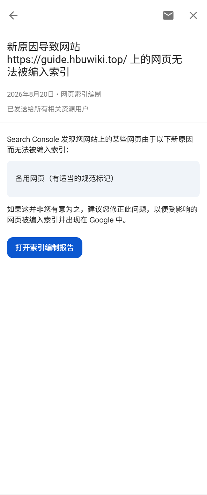
*图 1：GSC 发送的知识库未收录邮件——提示副站新原因「备用网页（有适当的规范标记）」*

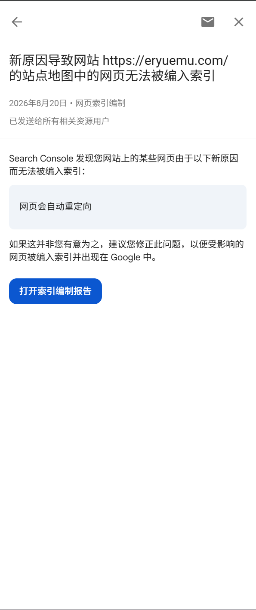
*图 2：GSC 发送的博客未收录邮件——承接 8/18 验证，提示站点地图「网页会自动重定向」*

很多站长一看到带有警示口吻的邮件（“某些网页无法被编入索引，建议您修正此问题”），很容易产生焦虑：“网站是不是配置坏了？”、“我是不是被 Google 降权了？”。

其实这两封邮件代表着两种截然不同的阶段：
1. **博客邮件（图 2）**：是对我们在 **8 月 18 日提交「根域名规范化验证」后**的阶段性巡检账单汇总（证明验证机制在后台运转）；
2. **知识库邮件（图 1）**：则是知识库副站（VitePress）在爬虫探测中触发的**全新路径规范化场景**。

带着这两条线索，我们登录两个站点的 GSC 控制台后台，分别展开全量剖析。

---

## 二、站点一（HBU Wiki）：剖析「备用网页（有适当的规范标记）」

进入 `https://guide.hbuwiki.top/` 的控制台：

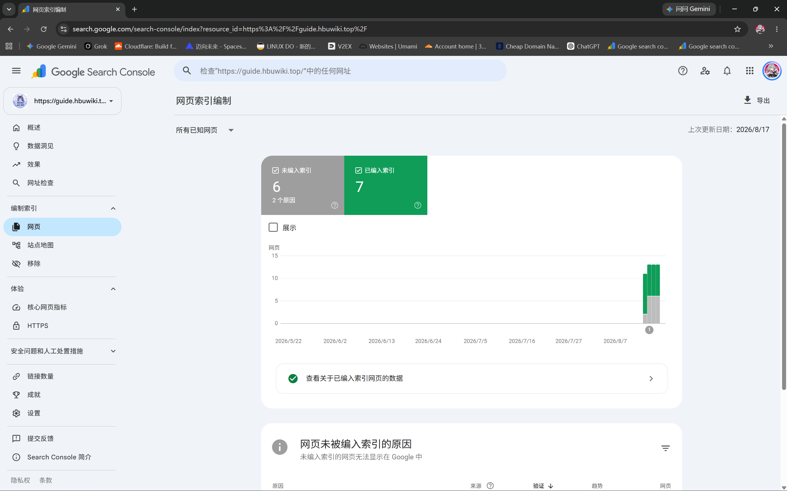
*图 3：HBU Wiki 网页索引编制总览（未编入索引 6 vs 已编入索引 7）*

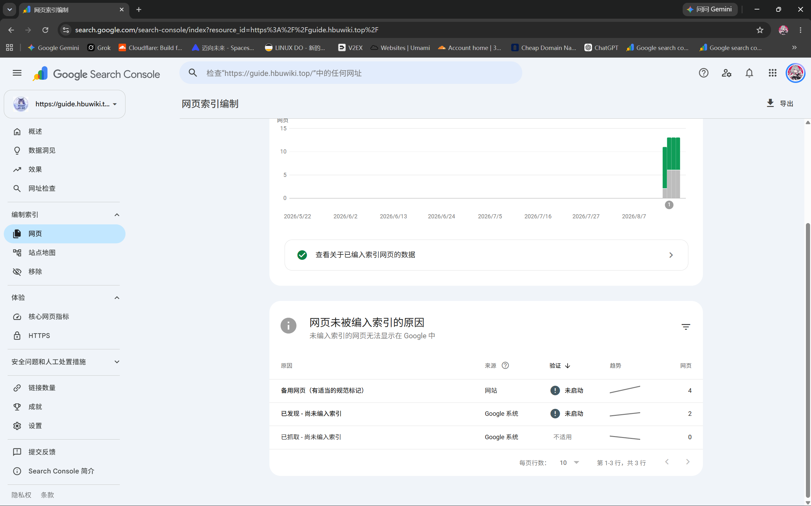
*图 4：未编入索引原因明细列表（备用网页 4 个，已发现 2 个，已抓取 0 个）*

### 2.1 什么是「备用网页」？（破除误区）

> [!NOTE]
> **「备用网页」绝不是指创建了什么备用镜像站或容灾备份。**  
> 在 Google 搜索体系中，**「备用网页（Alternate Page）」指的是「同一个网页的不同 URL 变体/别名」**。

点击进入「备用网页（有适当的规范标记）」详情：

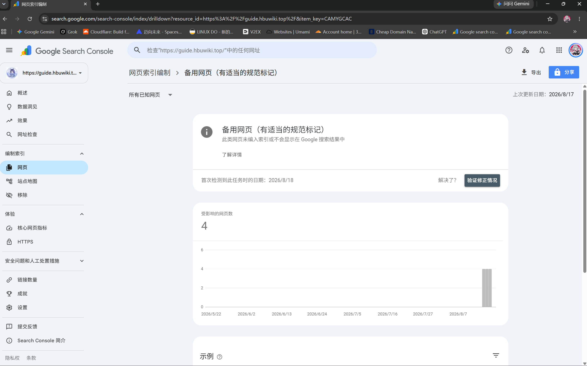
*图 5：备用网页详情页及受影响趋势折线*

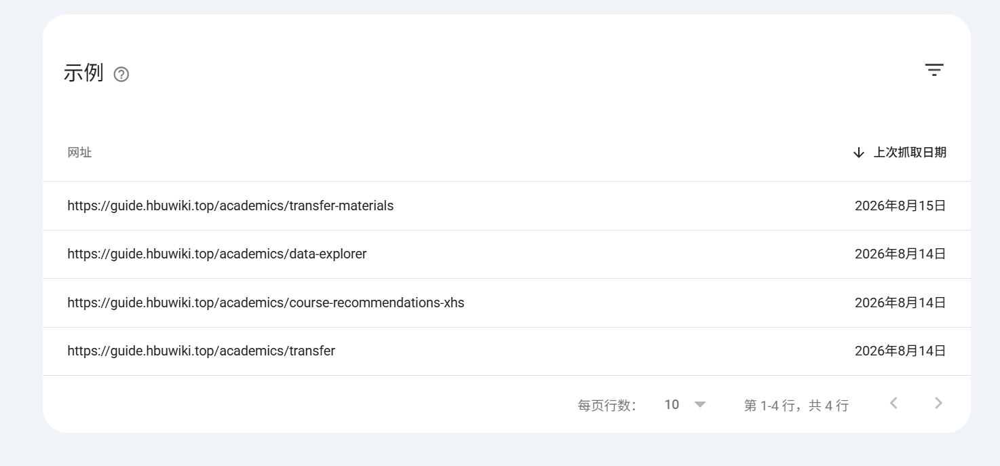
*图 6：受影响的 4 个无后缀示例 URL 列表*

受影响的 4 个 URL 分别为：
- `https://guide.hbuwiki.top/academics/transfer-materials`
- `https://guide.hbuwiki.top/academics/data-explorer`
- `https://guide.hbuwiki.top/academics/course-recommendations-xhs`
- `https://guide.hbuwiki.top/academics/transfer`

### 2.2 为什么会出现这个状态？

知识库基于 **VitePress** 构建并托管在 **GitHub Pages** 上。排查 `.vitepress/config.mjs` 发现：

```
1. 爬虫访问站内侧边栏链接:
   https://guide.hbuwiki.top/academics/transfer (无 .html 后缀)
               │
               ▼
2. GitHub Pages 服务器自动响应并返回:
   academics/transfer.html 的页面内容
               │
               ▼
3. 爬虫读取到该页面 head 中的 canonical 标签:
   <link rel="canonical" href="https://guide.hbuwiki.top/academics/transfer.html" />
               │
               ▼
4. Google 的权威归集决策:
   “页面自身声明了带 .html 才是唯一权威地址。
    因此把无后缀 URL 标记为【备用网页】，权重 100% 转移给带 .html 的标准页，不重复建索引。”
```

**结论**：这是 Google 严格执行 Canonical 规范标签的正常表现，起到了**防止内容重复、集中搜索权重**的作用，完全符合预期。

### 2.3 「已发现 - 尚未编入索引」的 2 个页面

在知识库报表中还有另外 2 个页面（`about.html` 与 `analytics.html`）处于「已发现 - 尚未编入索引」状态：

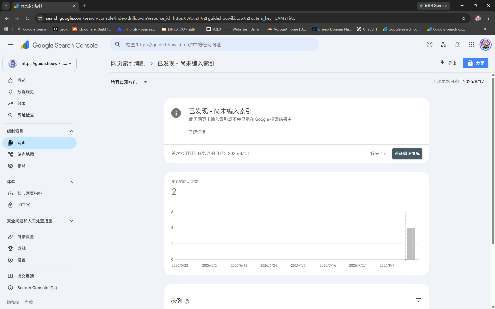
*图 7：已发现 - 尚未编入索引详情趋势*

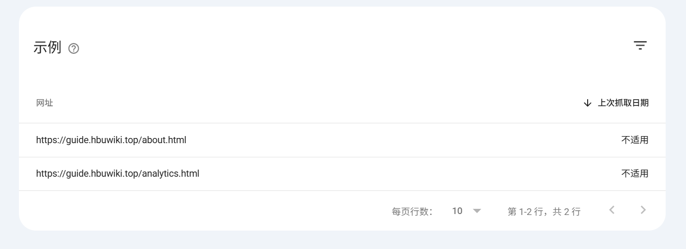
*图 8：2 个处于发现状态的 .html 示例 URL*

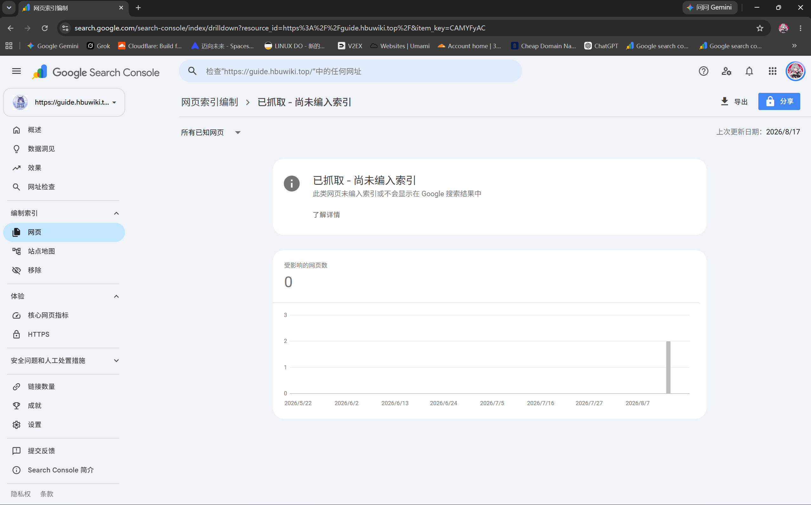
*图 9：已抓取 - 尚未编入索引数量为 0*

- **成因**：Google 已经通过 Sitemap 发现了这两个标准页面，但将其放到了爬虫抓取队列中排队，尚未分配配额抓取，属于新站正常等待期。

---

## 三、站点二（个人博客）：剖析「已发现」与「重定向验证」

切换至个人博客 `https://eryuemu.com/` 的 GSC 控制台：

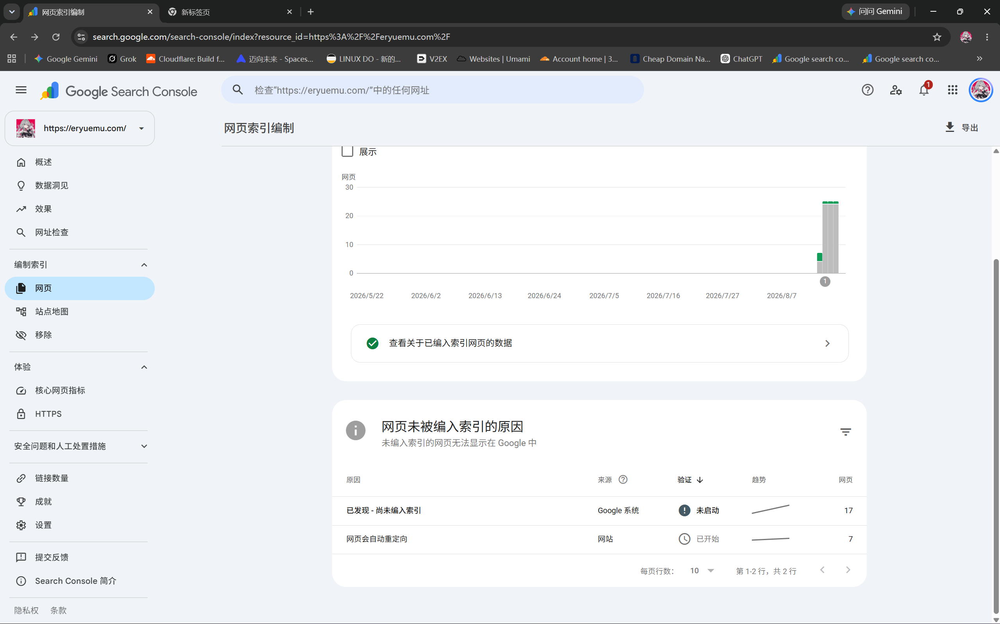
*图 10：个人博客网页索引编制总览（已发现 17 个，网页会自动重定向 7 个）*

### 3.1 17 篇文章「已发现 - 尚未编入索引」

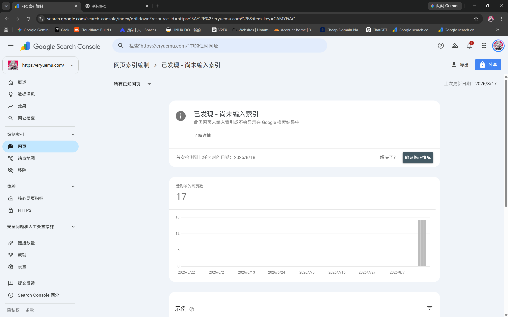
*图 11：博客已发现 - 尚未编入索引详情趋势*

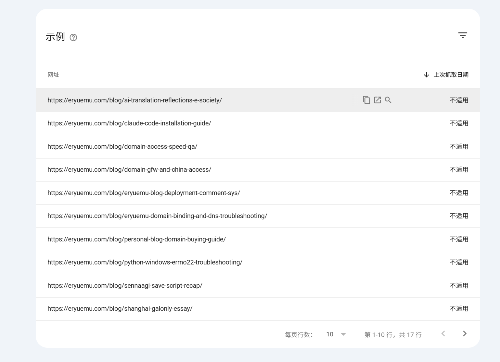
*图 12：博客 17 篇待爬取文章 URL 列表*

- **现象**：所有近期发布的博客文章（上次抓取日期均为“不适用”）。
- **根因**：博客近期提交了 `sitemap-index.xml`，Google 成功解析并提取了 17 篇文章的 URL。对于个人独立博客，Googlebot 不会一次性瞬间抓取全部页面，而是按权重周期性分批抓取。

### 3.2 7 个页面「网页会自动重定向」

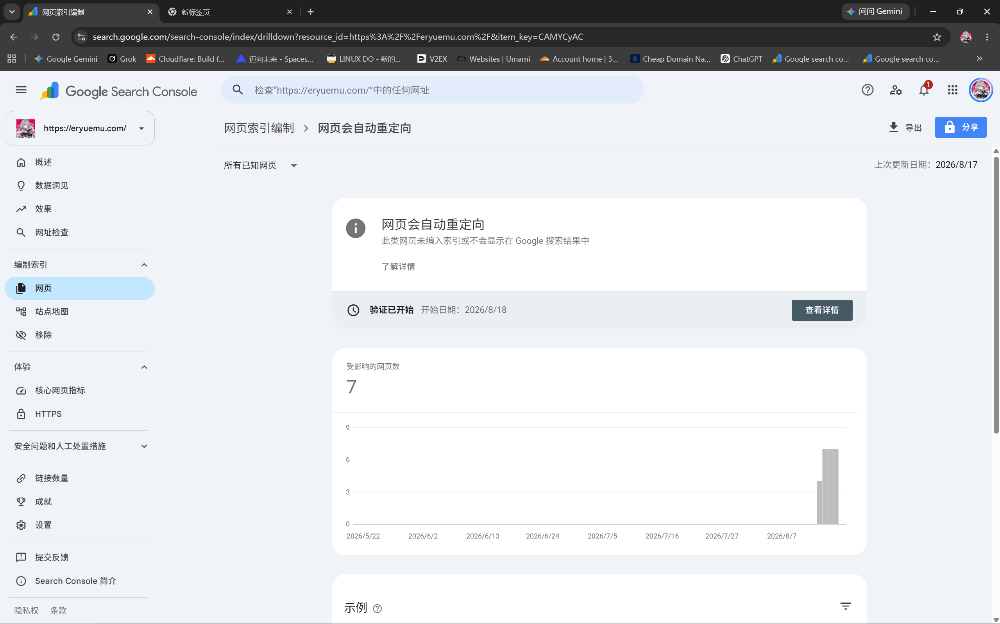
*图 13：博客网页会自动重定向详情（8 月 18 日验证已开始）*

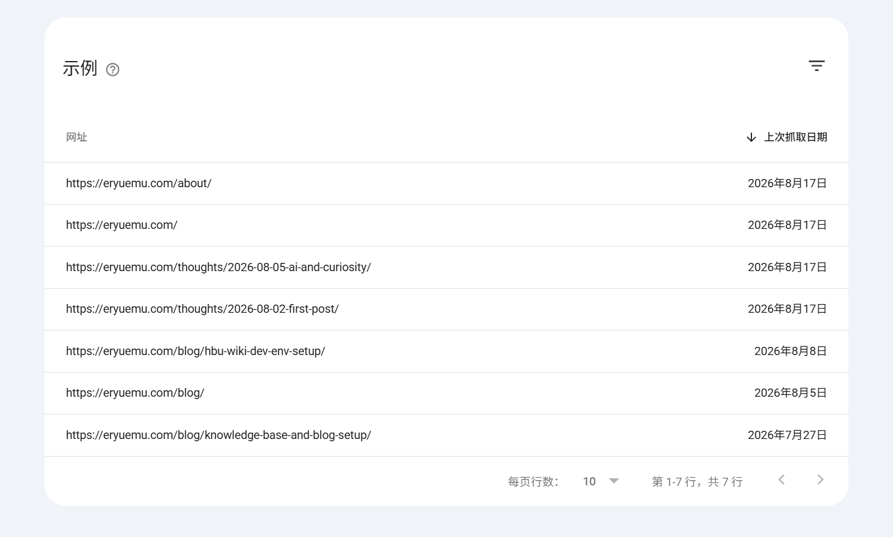
*图 14：受影响的 7 个重定向 URL 列表*

- **根因**：在 8 月 18 日之前，博客处于「根域名自动 308 跳转到 www」的历史配置状态，导致爬虫此前记录了重定向；而在 **8 月 18 日当天**，博客正式完成了向「唯一权威根域名 `eryuemu.com`（不带 www）」的反转配置与全量规范化调整。
- **状态**：**8 月 18 日当天**已在 GSC 中点击「验证修正情况」，目前 Google 的重新巡检正在进行中（通常需 1~2 周）。8 月 20 日的 GSC 邮件只是系统在验证过渡期内的例行汇总提醒，无需重复操作。

### 3.3 深入 URL 检查工具：Googlebot 的多路径发现机制

在 GSC 顶部搜索栏检查单篇文章 `https://eryuemu.com/blog/ai-translation-reflections-e-society/`：

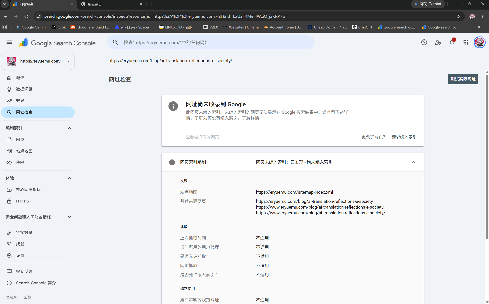
*图 15：单篇 URL 检查结果（网址尚未收录到 Google）*

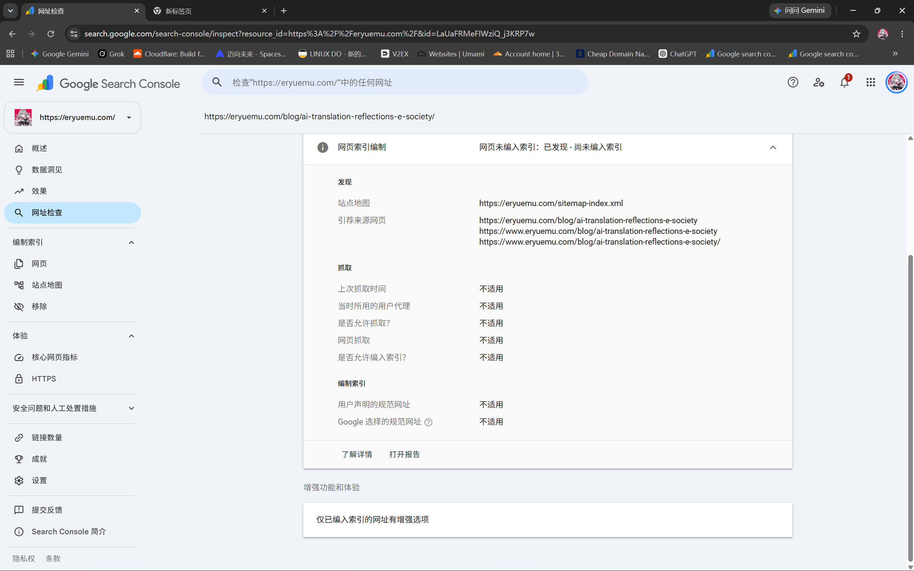
*图 16：引荐来源明细——Googlebot 探测到 www 与无尾斜杠等 4 种引荐路径*

- Googlebot 顺着外链和历史缓存发现了该文章的 4 种形式（带/不带 www、带/不带 `/`）；
- Google 正确锚定了 Sitemap 提供的权威带斜杠规范 URL，目前正排队等待正式爬取。

---

## 四、方案抉择与实战：VitePress 改造为 Clean URLs

在了解了知识库产生「备用网页」的根本原因是「侧边栏写无后缀 vs SEO 脚本拼接 `.html`」后，面临两种路线选择：

| 方案 | 规范 URL 形式 | 优势 | 劣势 |
| :--- | :--- | :--- | :--- |
| **方案 A：保持带 `.html`** | `.../academics/transfer.html` | 原生静态对应，无需改动 | GSC 会出现备用网页分流，不够美观 |
| **方案 B：Clean URLs（推荐）** | `.../academics/transfer` | **现代、简洁、全站 100% 统一、可移植性强** | 需要在 VitePress 中开启配置 |

**最终决策**：将 HBU Wiki 全面改造为 **Clean URLs**，使知识库与个人博客保持一致的现代极简规范。

---

## 五、代码落地：2 处改动实现 Clean URLs 规范化

在 `HBU-Wiki/.vitepress/config.mjs` 中进行两处优化：

```diff
 export default defineConfig({
   base: '/',
   title: "HBU Wiki - 河北大学生存指南",
+  cleanUrls: true, // 1. 开启 cleanUrls，生成干净无后缀 URL
 
   sitemap: {
     hostname: 'https://guide.hbuwiki.top'
   },
 
   transformHead({ pageData }) {
-    const canonicalUrl = `https://guide.hbuwiki.top/${pageData.relativePath}`
-      .replace(/index\.md$/, '')
-      .replace(/\.md$/, '.html')
+    const cleanPath = pageData.relativePath
+      .replace(/index\.md$/, '')
+      .replace(/\.md$/, '')
+    const canonicalUrl = `https://guide.hbuwiki.top/${cleanPath}`
```

### 5.1 本地编译验证

在 WSL 中执行 `npm run docs:build`：
1. **Sitemap 验证**（`.vitepress/dist/sitemap.xml`）：
   ```xml
   <url><loc>https://guide.hbuwiki.top/about</loc></url>
   <url><loc>https://guide.hbuwiki.top/academics/transfer</loc></url>
   ```
   所有 `.html` 后缀全部消失，完美收敛为无后缀 Clean URLs。
2. **HTML 头部验证**（`.vitepress/dist/about.html`）：
   ```html
   <link rel="canonical" href="https://guide.hbuwiki.top/about">
   <meta property="og:url" content="https://guide.hbuwiki.top/about">
   ```
   权威规范链接与站内链接 100% 吻合。

---

## 六、附加排坑：WSL2 中 Git Push 遇 Connection Refused

在 WSL2 中对 HBU-Wiki 提交代码执行 `git push` 时，遭遇了报错：

```bash
fatal: unable to access 'https://github.com/eryuemu/HBU-Wiki.git/': Failed to connect to github.com port 443: Could not connect to server
```

### 6.1 根因定位

1. 在 WSL2 中执行 `getent hosts github.com`，发现返回的 IP 竟然是 **`127.0.0.1`**；
2. 排查 Windows 主机的 `C:\Windows\System32\drivers\etc\hosts`，发现此前使用 **Steam++（Watt Toolkit）** 时，软件在 hosts 中写入了对 `github.com` 的本地加速重定向条目；
3. WSL2 默认共享了 Windows 的 DNS 解析，导致 WSL2 尝试向自身的 `127.0.0.1:443` 建立连接，直接触发 `Connection Refused`。

### 6.2 解决方案

在 WSL2 的 `/etc/hosts` 中显式指定 GitHub 的真实 IP：

```bash
sudo sh -c "echo '20.205.243.166 github.com' >> /etc/hosts"
```

配置后重新执行 `git push origin main`，代码秒级成功推送到 GitHub 远端仓库。

---

## 七、总结：多站 SEO 规范化的两步进阶体系

通过连续两篇的深度复盘与落地改造，我们构建了一套清晰的多站点 SEO 规范化演进体系：

```
【第一步：域名层规范化（前篇 8/18）】
解决博客主域名与 www 子域的权重割裂 ➔ 全量 308 重定向收敛至 eryuemu.com

【第二步：路径层规范化（本篇 8/20）】
解决知识库 .html 后缀与无后缀的双重分流 ➔ 开启 VitePress Clean URLs 彻底闭环
```

1. **看懂 GSC 的报警邮件**：邮件中凡是带有 *“如果这并非您有为之”* 的提示，大部分属于 SEO 规范化标签生效或历史重定向归集，不等于网站故障；
2. **Canonical 标签的核心价值**：它是站长给搜索引擎立的“权威路标”。当存在无后缀、带后缀、带 www 等多种入口时，Canonical 会把分散的权重牢牢锁死在主页面上；
3. **Clean URLs 是现代站点的最优解**：通过开启 VitePress `cleanUrls: true` 并统一规范标签，让内链、Sitemap 与 Canonical 达成 100% 闭环，彻底消除多版本分流困扰。

> 📖 **回到前篇**：[《GSC 提示「网页会自动重定向」未编入索引？根域名与 www 规范化全复盘》](/blog/gsc-page-redirect-and-domain-canonical-guide/)

