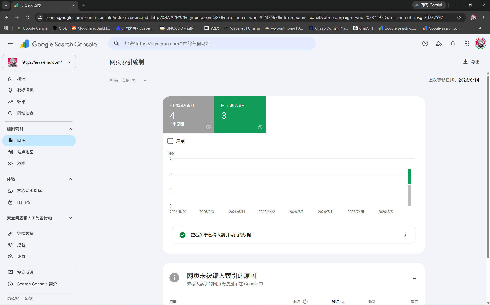
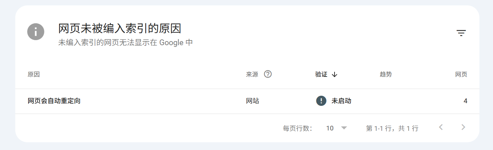
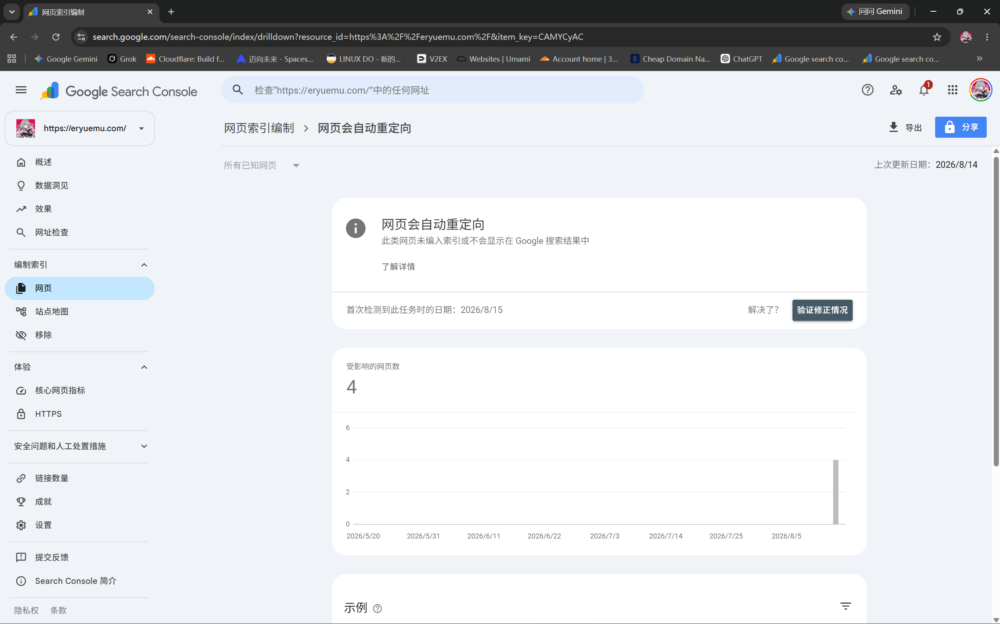
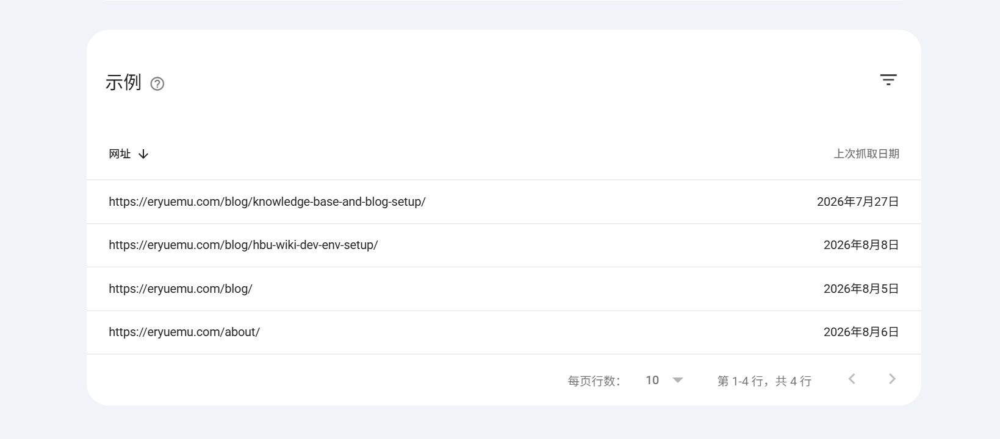
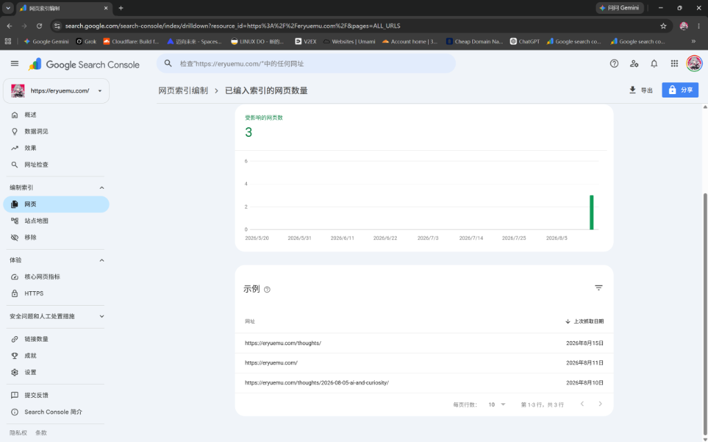
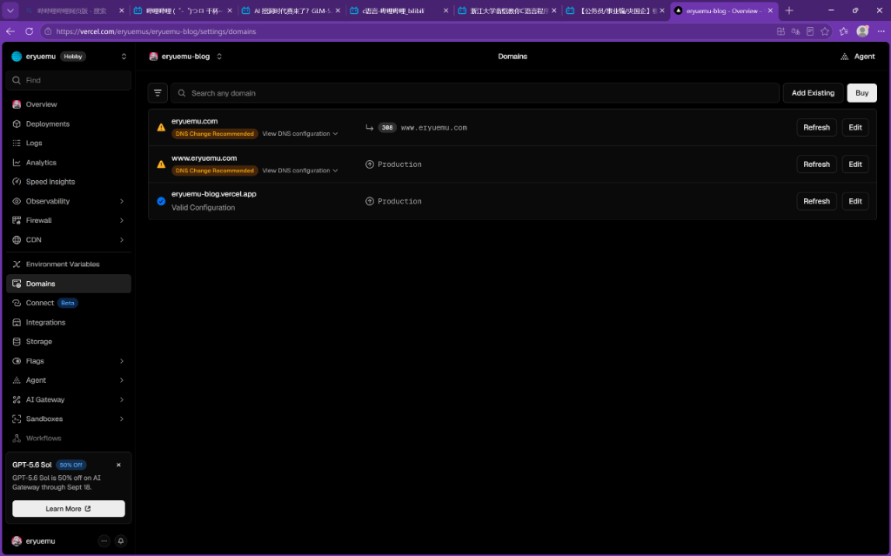
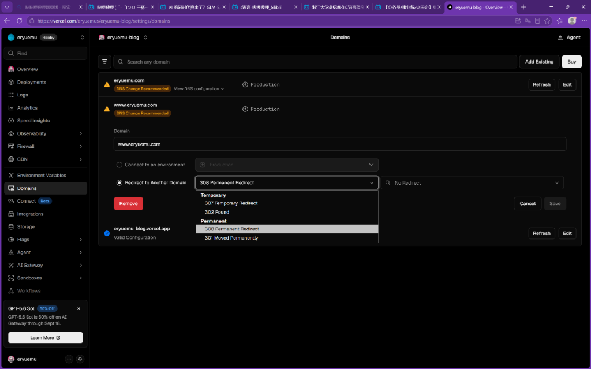
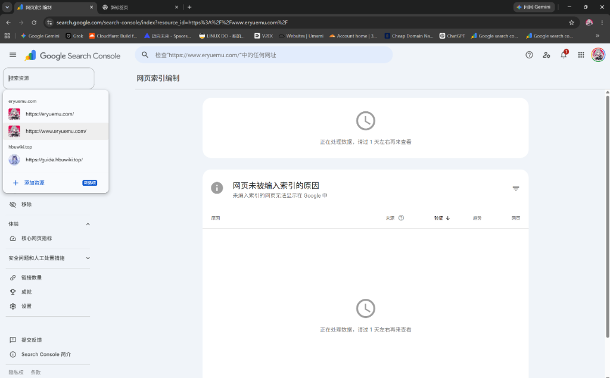
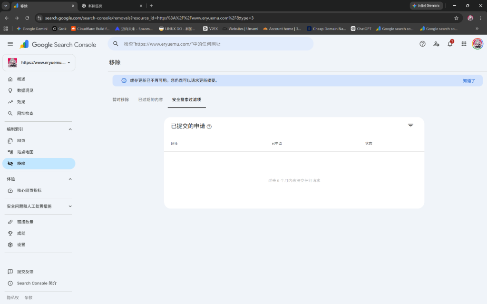
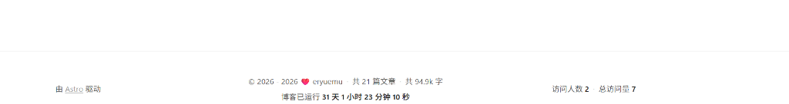

## 一、现象：GSC 后台突然报警「网页会自动重定向」

在日常维护站长工具时，Google Search Console（GSC）的「编制索引 -> 网页」报告中突然提示：**4 个网页未编入索引，原因为「网页会自动重定向」**。


*图：GSC 网页索引编制总览面板，显示 4 个网页因重定向未被编入索引*


*图：GSC 未编入索引原因明细列表，明确列出「网页会自动重定向」*

点击进入「网页会自动重定向」详情页，可以查看到受影响网页趋势与具体的示例网址：


*图：GSC 网页会自动重定向详情页及受影响趋势*


*图：受影响的 4 个示例 URL 列表明细*

受影响的具体 URL 为：
- `https://eryuemu.com/blog/knowledge-base-and-blog-setup/`
- `https://eryuemu.com/blog/hbu-wiki-dev-env-setup/`
- `https://eryuemu.com/blog/`
- `https://eryuemu.com/about/`

很多新手站长一看到“未编入索引”或标红报警，第一反应往往是“网站出 Bug 挂了”或者“被 Google 降权了”。其实，这背后隐藏着**现代 Web 规范化（Canonicalization）、DNS 架构与搜索引擎索引机制**的核心逻辑。

---

## 二、破案：为什么会出现「网页会自动重定向」？

### 2.1 网址前缀资源（URL-prefix）的视角局限
- 当初在 GSC 中添加的是 **`https://eryuemu.com/`**（不带 `www` 的 Apex 根域名网址前缀资源）。
- 网站托管在 Vercel 上，此前将主站（Production）设为了 `www.eryuemu.com`，服务器对所有非 www 请求（`eryuemu.com`）执行了 **308 Permanent Redirect** 永久重定向。
- 当 Googlebot 访问 `https://eryuemu.com/blog/...` 时，服务器返回了 308 跳转到 `https://www.eryuemu.com/blog/...`。
- **结论**：对于 `https://eryuemu.com/` 这个资源视角而言，这 4 个 URL 请求后确实发生了重定向。Google 正确识别并把索引权重传递给了带 `www` 的页面，因此不在当前不带 www 的资源下重复建立索引。**这属于符合预期的正常现象，绝非网站故障**。

### 2.2 隐藏的代码诱因：robots.txt 与内链泄露
为什么 Googlebot 会优先去抓取不带 `www` 的链接？
- 排查博客代码发现，根目录下的 `public/robots.txt` 遗留了一行旧配置：
  ```txt
  Sitemap: https://eryuemu.com/sitemap-index.xml
  ```
- 爬虫在读取 robots.txt 时，被引导去了不带 `www` 的地址，进而触发了整条重定向链。
- 此外，站内部分友链名片、头像硬编码了 `https://eryuemu.com/...`，也为爬虫提供了非规范 URL 的线索。

### 2.3 破案细节：为什么当时还有 3 个页面成功被收录？

查看 GSC「已编入索引」列表时，会发现有 3 个页面处于正常索引状态：


*图：GSC 中已编入索引的 3 个页面（上次抓取日期分别为 8月10日、8月11日、8月15日）*

破案的关键就在**抓取时间差**：
1. **8月10日~11日（初次收录期）**：站点刚上线提交时，Google 第一时间爬取了首页与第一条心迹动态，当时顺理成章直接编入了 `eryuemu.com` 的索引库。
2. **8月15日后（域名调整期）**：Vercel 开启向 www 跳转后，Google 爬虫后续去抓 `/blog/...` 文章时正好撞上了 308 跳转，被记录为重定向。
3. 搜索引擎全球爬虫并不是同一秒重新扫描全站，首页等旧快照尚未被周期性覆盖，因此形成了“3 个已收录 + 4 个重定向”的过渡状态。

---

## 三、核心科普：`www` 与「不带 www」到底有什么区别？

在普通用户眼里，输入 `eryuemu.com` 和 `www.eryuemu.com` 都能打开同一个博客，感觉“完全一样”。但在互联网协议和搜索引擎眼里，它们完全是两个东西：

```
eryuemu.com      ← 根域名（裸域名 / Apex Domain）
www.eryuemu.com  ← 子域名（Subdomain，与 guide.hbuwiki.top 属于同级概念）
```

| 维度 | 不带 www（根域名：`eryuemu.com`） | 带 www（`www.eryuemu.com`） |
| :--- | :--- | :--- |
| **视觉体验** | 极简、现代、干净，分享给他人时一目了然 | 传统稳重，多打 4 个字符 |
| **适用场景** | **个人博客、独立开发者、现代技术社区（强烈推荐）** | 大型企业门户、巨型跨子域系统 |
| **Cookie 隔离** | 根域名 Cookie 会默认广播到所有子域名 | 可通过子域独立隔离 Cookie |
| **行业趋势** | GitHub, Twitter/X, V2EX, 90%+ 现代博客 | 百度、传统政企与门户网站 |

### ⚠️ 致命大忌：如果两个都设为主站（都不做跳转）会怎样？

有些站长为了“省事”，在 Vercel 里把 `eryuemu.com` 和 `www.eryuemu.com` 都设为 `Production`，这在 SEO 领域属于**严重踩坑**：

1. **搜索权重腰斩（Link Juice Dilution）**：
   - 搜索引擎会判定互联网上出现了两个 **100% 重复的镜像站点**。
   - 外链和流量被拆成两半，原本能排第 1 名的页面可能被拆成两个各排第 10 名，甚至触发 Google 的「重复内容惩罚」导致全站降权。
2. **深色模式与缓存“人格分裂”**：
   - 浏览器的 `localStorage` 与 Cookie 是按完整域名隔离的。访客在 `eryuemu.com` 开启了 **🌙 深色模式**，下次通过 `www.eryuemu.com` 进入又会跳回 **☀️ 浅色模式**。
3. **评论系统与访问量割裂**：
   - 博客底部的 Waline 评论系统与访问量计数若按当前页面 URL 匹配，会导致在两个域名下看到的评论数据完全互不相通。

> [!IMPORTANT]
> **行业黄金准则**：无论选哪一个当主站，都必须做 **「一主一辅、301/308 自动跳转」**，让所有流量与权重 100% 汇聚到单一主域名！

---

## 四、最终架构决策：全面转正为「不带 www（`eryuemu.com`）」

综合个人博客的美观度与现代标准，最终决定：**全面确立 `https://eryuemu.com` 为唯一权威主域名，`www.eryuemu.com` 作为辅助跳转通道**。

---

## 五、全流程闭环实战：代码、服务器与 GSC 一网打尽

### 5.1 代码层面：全量规范化（Canonicalization）

#### 1. Astro 主站点配置（`astro.config.mjs`）
```javascript
export default defineConfig({
	site: 'https://eryuemu.com', // 统一收敛为根域名
	integrations: [mdx(), sitemap()],
});
```

#### 2. 爬虫路标（`public/robots.txt`）
```txt
User-agent: *
Allow: /

Sitemap: https://eryuemu.com/sitemap-index.xml
```

#### 3. 结构化数据与规范标签（`src/components/BaseHead.astro`）
- `<link rel="canonical" href={canonicalURL} />` 自动跟随 `Astro.site` 生成 `https://eryuemu.com/...`。
- 将 JSON-LD 中的 `WebSite` 与 `SiteNavigationElement` 统一收敛至 `https://eryuemu.com`。

#### 4. 友链名片与站内资源
- `src/pages/friends.astro` 中的博客名片 `link` 与 `logo` 统一改为 `https://eryuemu.com/`。
- 站内静态资源引用（如头像）统一改为站内相对路径 `/avatar.jpg`。

---

### 5.2 托管服务器层面（Vercel 域名重定向配置）

进入 Vercel 项目控制台 -> **Settings** -> **Domains**：


*图：调整前状态——`eryuemu.com` 显示 308 跳转，需将其设为主站*

#### 操作步骤：
1. 点击 `eryuemu.com` 右侧 **`Edit`** -> 选择 **`Production`** -> 保存。
2. 点击 `www.eryuemu.com` 右侧 **`Edit`** -> 勾选 **`Redirect to Another Domain`** -> 状态码选 **`308 Permanent Redirect`** -> 目标选择 **`eryuemu.com`** -> 保存。


*图：将 www.eryuemu.com 配置为 308 Permanent Redirect 重定向至 eryuemu.com*

---

### 5.3 Google Search Console 站长平台规范化

在 GSC 资源管理中，曾经因添加了带 www 与不带 www 导致面板混淆：


*图：GSC 资源下拉菜单中同时存在两个网址前缀资源*

#### ⚠️ 避坑警示：千万不要在「移除」页面申请删除资源！


*图：GSC 左侧菜单的「移除」是申请在搜索结果中紧急下架屏蔽网页，切勿在此提交删除资源申请！*

#### 正确删除冗余资源的步骤：
1. 在左上角下拉框切换选中 `https://www.eryuemu.com/`（待删除的多余资源）。
2. 点击左侧菜单底部的 **`设置`（Settings，齿轮图标）**。
3. 滚动到设置页面最下方，点击红色的 **`移除资源`（Remove property）** 并确认。
4. 回到主面板 **`https://eryuemu.com/`**，在「网页会自动重定向」详情页点击 **「验证修正情况」**（Validate Fix）。

---

### 5.4 访问量统计服务（Vercount）无缝数据继承排坑

主域名切换为 `eryuemu.com` 后，博客底部的访问量计数器突然出现了一个现象：原本 7 月以来积累的 **490 访问人数与 2500+ 总访问量**，在页面上突然重置显示为 **「访问人数 2 · 总访问量 7」**。


*图：域名切换后，底部 Vercount 访问计数器因新域名账本独立而重置*

#### 根因分析：
Vercount（`events.vercount.one`）统计接口是严格按照请求报文中的 `url`（即 `window.location.href` 的 Hostname）分别独立记账的：
- 原本在 `www.eryuemu.com` 下积累了 `site_uv: 490`、`site_pv: 2538`。
- 换到 `eryuemu.com` 后，Vercount 认为这是一个全新的独立站点，开辟了新账本。

#### 代码修复方案：
在 `src/components/Footer.astro` 中，将上报统计的 URL 显式映射到历史统计标识：
```typescript
// 将计数请求映射到历史统计标识（www.eryuemu.com），无缝继承 7 月以来积累的 490+ 人数与 2500+ 访问量
const statUrl = window.location.href.replace(/^https?:\/\/eryuemu\.com/, 'https://www.eryuemu.com');

const res = await fetch(API_URL, {
    method: 'POST',
    headers: { 'Content-Type': 'application/json' },
    body: JSON.stringify({
        url: statUrl,
        isNewUv: isNewUv
    })
});
```
修复部署后，页面刷新即可立即恢复 **490 访问人数 · 2538 总访问量**，后续所有新访问均在历史累计数据上继续自然递增。

---

## 六、复盘总结：老域名资产如何做到「零损耗无缝过渡」？

```
┌────────────────────────────────────────────────────────┐
│                   最终规范化架构                        │
│                                                        │
│  访客/爬虫访问 www.eryuemu.com                         │
│             │ (Vercel 308 永久重定向)                   │
│             ▼                                          │
│  统一汇聚于主站 https://eryuemu.com                      │
│             │ (Astro Canonical + Sitemap + JSON-LD)    │
│             ▼                                          │
│  Google & Bing 权威收录单一主库，权重 100% 聚焦          │
└────────────────────────────────────────────────────────┘
```

对于从 `www` 切换到根域名的站点，老域名的所有资产已按以下 4 个维度做到 **100% 继承与无损过渡**：

| 资产类型 | 处理机制 | 效果与保障 |
| :--- | :--- | :--- |
| **访问量与访客数据** | `Footer.astro` 接口统一映射历史 key | 7 月以来的 490 UV / 2538 PV 完好保留并继续累加 |
| **搜索引擎权重与外链** | Vercel 308 Permanent Redirect + Canonical | 老域名反向链接与搜索排名历史 100% 转移并合并至新主站 |
| **文章评论数据（Waline）** | 数据库按页面相对路径（`/blog/...`）匹配 | 历史读者留言完全不受域名切换影响，100% 正常展现 |
| **访客书签与外部老链接** | CDN 边缘节点 0.01 秒极速重定向 | 访客点击老链接无感滑入新主站，绝无 404 故障 |

