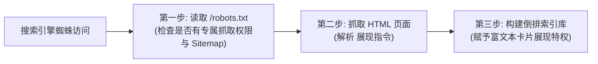

## 💡 简明省流版（30 秒速览）

> **一句话总括**：在日常搜索测试中发现，在搜索引擎中直接搜英文品牌词 `hbuwiki` 能稳定命中，但输入中文组合词 **`河北大学wiki`** 或 **`河北大学 wiki`** 时站点却未能展现。经过深度诊断与排查，问题根源在于全站子页面的 Title 模板仅包含英文 `HBU Wiki` 且缺少中文长尾关键词绑定。
> 
> 本文完整记录了从**中文关键词与后台 Meta 彻底重构**、**100% 还原前台原生视觉 UI（SEO 静默生效）**、**站点由「生存指南」更名为「生存指北」的平滑过渡**，到**显式点名国内各大蜘蛛爬虫协议**，以及**博客联动注入 BlogPosting 结构化数据**的全流程实战经验。

---

## 一、起因：为什么搜「hbuwiki」能搜到，搜「河北大学wiki」却搜不到？

在 8 月中旬完成初次收录部署后，HBU Wiki 已经成功被 Google 和 Bing 抓取建库。在测试检索时，出现了一个有趣的现象：

* 🟢 **搜索 `hbuwiki`**：不管是主站 `hbuwiki.top` 还是副站 `guide.hbuwiki.top` 都能稳居前列；
* 🔴 **搜索 `河北大学wiki` / `河北大学 wiki`**：搜索结果几乎找不到副站的踪影。

```
用户搜索 "hbuwiki"       ──> 命中全局独占域名 / 全站英文名 ──> 排名靠前 ✅
用户搜索 "河北大学wiki"   ──> 中文分词拆解为 ["河北大学", "wiki"] ──> 标题无强关联组合词 ──> 权重落空 ❌
```

### 深入剖析：搜索引擎的分词与权重机制

1. **英文品牌词的天然优势**：`hbuwiki` 是一个高度唯一的专有英文组合词，域名就是 `hbuwiki.top` / `guide.hbuwiki.top`，竞争度极小，引擎很容易做单点精确匹配；
2. **中文复合词的分词判定**：当用户在百度、必应或 Google 输入 `河北大学wiki` 时，分词引擎会将其切分为 **「河北大学」** 和 **「wiki」** 两个词元。
   * 查看当时的子页面 `<title>` 模板，写的是 `titleTemplate: ':title | HBU Wiki'`。
   * 导致所有内页（如转专业、选课避雷、周边生活）在浏览器标签页中的真实 Title 仅仅是 `转专业数据全解 | HBU Wiki`，**完全缺失了“河北大学”四个字**！
   * 搜索引擎在计算相关性时，判定该页面的主标题并不包含“河北大学”，因而将该页面在“河北大学”相关搜索词下大幅后置。

---

## 二、架构治理：纯后台 SEO 与 UI 原生性的博弈

在进行 SEO 代码优化的过程中，我们经历了一个极其重要的理念纠偏：**SEO 应当纯粹在底层元数据与 HTML 头部静默生效，绝不应破坏站长精心设计的前台 UI 和原有文案。**

```
┌─────────────────────────────────────────────────────────────┐
│                    前台展现层 (UI & Content)                 │
│  • 100% 保持原有 Hero 按钮、特色卡片布局与正文排版          │
│  • 保持纯净的用户阅读体验，不做任何“为爬虫写废话”的视觉堆砌 │
├─────────────────────────────────────────────────────────────┤
│                    后台元数据层 (Head & Meta)                │
│  • <title> 统一注入规范品牌全称                              │
│  • <meta name="keywords"> / <meta name="description">       │
│  • JSON-LD (Schema.org) 结构化数据                          │
│  • <meta name="robots"> 高级富摘要抓取指令                  │
└─────────────────────────────────────────────────────────────┘
```

### 1. 守住前端视觉边界
- **首页 UI**：保持干净清爽的 Hero 区域、原本的 3 个操作按钮（进入 Wiki、参与贡献、主站链接）以及精选特色卡片，坚决不向首页底部塞入多余的文字表格；
- **内页正文**：保持原有文档的一级大标题与正文字段（如《项目介绍》、作者信息等 100% 还原），不为了堆砌关键词而生硬更改页面正文展示。

### 2. 在后台彻底重构元数据
在 `.vitepress/config.mjs` 中，通过底层配置将搜索信号拉满：

```javascript
// .vitepress/config.mjs
export default defineConfig({
  title: "河北大学 Wiki (HBU Wiki) - 河北大学生存指北",
  titleTemplate: ':title | 河北大学 Wiki (HBU Wiki)',
  description: "河北大学 Wiki (HBU Wiki) 是由河大学子共同维护的非官方河北大学学生生存指北与校园知识库...",

  head: [
    // 覆盖全长尾的中英文组合词
    ['meta', { name: 'keywords', content: '河北大学wiki,河北大学 wiki,河北大学Wiki,河大wiki,河大Wiki,HBU Wiki,HBU-Wiki,hbuwiki,河北大学生存指北,河北大学生存指南,河北大学转专业,河北大学选课,河北大学绩点,河北大学,河大,保定河北大学,河北大学知识库,河北大学校园指北' }],
    ['meta', { name: 'robots', content: 'index, follow, max-image-preview:large, max-snippet:-1, max-video-preview:-1' }],

    // JSON-LD 结构化数据 (Schema.org)
    ['script', { type: 'application/ld+json' }, JSON.stringify({
      '@context': 'https://schema.org',
      '@graph': [
        {
          '@type': 'WebSite',
          '@id': 'https://guide.hbuwiki.top/#website',
          'url': 'https://guide.hbuwiki.top/',
          'name': '河北大学 Wiki',
          'alternateName': ['河北大学Wiki', '河北大学 wiki', 'HBU Wiki', 'HBU-Wiki', 'hbuwiki', '河大Wiki', '河北大学生存指北', '河北大学生存指南'],
          'description': '河北大学非官方学生生存指北与开源知识库',
          'inLanguage': 'zh-CN',
          'publisher': {
            '@id': 'https://guide.hbuwiki.top/#organization'
          }
        }
      ]
    })]
  ]
})
```

---

## 三、站点更名：从「生存指南」到「生存指北」的平滑过渡

在优化过程中，站长决定将项目副标题从「生存指南」更名为更具大学校园极客色彩的 **「生存指北」**。

对于已有一定收录基础的站点，更名容易引起历史关键词流量的短暂波动。为了保证搜索体验平稳过渡，我们采取了**双词兼容策略**：

1. **前台与主标题全面换新**：
   - 首页 Hero 主标语正式亮相为：`HBU Wiki · 河北大学生存指北`；
   - 站点主标题与默认 `<title>` 全量更新为：`河北大学 Wiki (HBU Wiki) - 河北大学生存指北`。
2. **后台保留历史词元兜底**：
   - 在全局 `<meta name="keywords">`、各子页 Frontmatter 以及 JSON-LD 的 `alternateName` 中，**同时保留「河北大学生存指北」与「河北大学生存指南」**；
   - 这样无论是习惯搜索旧词的老读者，还是按新名称检索的新生，搜索引擎都能通过语义关联快速定位到本站。

---

## 四、爬虫协议深度揭秘：Robots 与 Meta 到底做了什么？

很多站长以为配置了 Sitemap 就万事大吉，但在实际生产中，爬虫协议（`robots.txt`）和 Meta 爬虫指令是搜索引擎蜘蛛进站抓取的**首道安检门**。



### 1. `robots.txt` 从通用到显式点名

原先的 `robots.txt` 仅有一条 `User-agent: *`。虽然语法上允许所有蜘蛛，但百度（Baiduspider）、字节跳动（Bytespider）、搜狗等国内蜘蛛对海外 CDN 或静态托管节点策略较为保守。

为此，我们将协议升级为**显式点名国内主流爬虫**：

```txt
User-agent: *
Allow: /

User-agent: Baiduspider
Allow: /

User-agent: Googlebot
Allow: /

User-agent: Bingbot
Allow: /

User-agent: Bytespider
Allow: /

User-agent: Sogou web spider
Allow: /

User-agent: 360Spider
Allow: /

User-agent: YisouSpider
Allow: /

Sitemap: https://guide.hbuwiki.top/sitemap.xml
```

* **核心价值**：向各大搜索引擎的专用巡检节点传递明确的无障碍放行信号，并在底部引导爬虫直达最新的 Sitemap 索引。

### 2. Meta Robots 高级展现指令

在 HTML `<head>` 中注入的指令参数具有极高的实战价值：

```html
<meta name="robots" content="index, follow, max-image-preview:large, max-snippet:-1, max-video-preview:-1">
```

| 参数 | 具体技术含义 | 带来的实际收益 |
| :--- | :--- | :--- |
| **`index`** | 允许爬虫将此页面编入索引库 | 页面能够出现在搜索结果中 |
| **`follow`** | 允许爬虫顺着当前页面的所有 `<a>` 超链接继续爬取 | 权重在全站内页之间自然流动，加速深层文章被收录 |
| **`max-image-preview:large`** | 允许在搜索结果展示大尺寸缩略图 | 在 Google / Bing 搜索列表中以图文卡片形式展现 Logo 或插图，点击率大幅提升 |
| **`max-snippet:-1`** | 不限制搜索结果摘要字符长度（`-1` 为不限） | 搜索引擎会根据用户搜索的具体问题（如“二课密码怎么找回”），精准截取最匹配的正文解答 |

---

## 五、两站联动：个人博客（eryuemu-blog）同步进阶优化

在完成了 HBU Wiki 的全面梳理后，我们顺便对个人博客（`eryuemu.com`，Astro 架构）进行了规范对齐与进阶特性增强。

经过前几轮的深度打磨，博客在 **308 重定向平滑过渡**、**Trailing Slash 尾斜杠统一** 以及 **旧 Slug 301 搬家** 方面已经具备了非常成熟的技术体系。本次主要落地了两个“锦上添花”的细节增强：

### 1. 爬虫协议同步对齐
将 `public/robots.txt` 同步升级为包含各大蜘蛛显式声明的完整版本，确保两站规范统一。

### 2. 文章页注入 `BlogPosting` 结构化数据
此前博客仅在全局注入了 `WebSite` 导航数据。我们在 [`src/layouts/BlogPost.astro`](file:///home/eryuemu/workspace/eryuemu-blog/src/layouts/BlogPost.astro) 中为每一篇独立博文动态注入了专有的 **`BlogPosting`** Schema：

```astro
<!-- src/layouts/BlogPost.astro -->
<script type="application/ld+json" set:html={JSON.stringify({
  "@context": "https://schema.org",
  "@type": "BlogPosting",
  "headline": title,
  "description": description,
  "datePublished": pubDate ? pubDate.toISOString() : undefined,
  "dateModified": updatedDate ? updatedDate.toISOString() : (pubDate ? pubDate.toISOString() : undefined),
  "mainEntityOfPage": {
    "@type": "WebPage",
    "@id": Astro.url.href
  },
  "author": {
    "@type": "Person",
    "name": "eryuemu",
    "url": "https://eryuemu.com/about"
  },
  "publisher": {
    "@type": "Person",
    "name": "eryuemu",
    "url": "https://eryuemu.com"
  },
  ...(heroImage ? { "image": new URL(heroImage.src, Astro.url).href } : {})
})} />
```

* **带来的收益**：向 Google 和 Bing 清晰宣告了这是一篇具有完整元属性（标题、摘要、发布时间、最后更新时间、作者信息、文章配图）的正式博客文章，有助于在搜索引擎中触发“富媒体文章摘要卡片”与“时间戳徽章”展示。

---

## 六、全流程复盘清单与思考

| 治理环节 | 痛点 / 需求 | 落地解决方案 |
| :--- | :--- | :--- |
| **搜索命中精准度** | 搜 `hbuwiki` 能出，搜 `河北大学wiki` 不出 | 全站 Title 模板统一绑定 `河北大学 Wiki (HBU Wiki)`，补齐中文词库 |
| **前端设计保护** | 避免为了 SEO 破坏原有整洁 UI | 严格贯彻“静默 SEO 原则”，所有优化收敛在 Head、Meta 与后台配置中 |
| **站点品牌升级** | 「生存指南」变更为「生存指北」 | 页面前台焕新，Meta 与 Schema 同时保留新旧关键词实现平滑过渡 |
| **蜘蛛抓取友好度** | 国内蜘蛛策略保守，通用规则易受阻 | `robots.txt` 显式声明各大爬虫放行，Head 注入大图预览与完整摘要指令 |
| **博客文章元数据** | 博文缺少专属的文章级 Schema | Astro 博客文章布局动态注入 `BlogPosting` 结构化数据 |

> **站长心得**：
> 优秀的 SEO 从来不是靠在前台页面中生硬地堆砌关键词，而是通过**清晰的 URL 规范、精准的标题模板、丰富的语义化元数据与符合标准的爬虫协议**，向搜索引擎交出一份整洁规范的结构化答卷。把前台留给读者，把 SEO 留在后台，这才是独立站长优雅建站的最佳姿态。
