## 一、诊断：为什么 wiki 搜不到？

| 致命缺失 | 后果 |
|---------|------|
| 没有 `sitemap.xml`（VitePress 未配 `sitemap.hostname`） | 爬虫不知道有哪些页面 |
| 没有 `robots.txt` | 爬虫连 sitemap 地址都找不到 |
| `lang` 标成 `en-US` | 误导引擎把中文内容判成英文 |
| 内容页无独立 title/description | 即使爬到也无法精准展示 |
| 无 canonical | 爬到了也不确定哪个是正式 URL |

**为什么 blog 能自己收录？** blog 有 sitemap/robots 基础 + 已上线一段时间 + 有一定外链（GitHub 仓库公开等），所以搜索引擎能自然发现。

---

## 二、修复：代码层面做了什么

### HBU Wiki（`.vitepress/config.mjs` + 页面 frontmatter）

- `lang: 'zh-CN'` 修正语言
- 顶层 `sitemap.hostname: 'https://guide.hbuwiki.top'` → **开启 VitePress 自动生成 sitemap.xml**（全站 9 个页面）
- 新建 `public/robots.txt`：`Allow: /` + `Sitemap:` 指路
- `transformHead({ pageData })` 钩子 → 为每个页面**动态注入 canonical + og:title/description/url**（读 frontmatter，无重复标签）
- `srcExclude: ['**/CLAUDE.md', '**/README.md']` → 排除项目内部文档，防止污染搜索结果
- 6 个核心内容页（转专业/数据探索器/绩点分析/选课避雷/官方资料/周边指南）补 YAML `title` + `description`

### Blog（Astro：`src/consts.ts` + `src/components/BaseHead.astro`）

- `SITE_DESCRIPTION` 改为贴合实际的：**二月木的个人博客 — 建站折腾 · AI 工具 · Galgame**
- 补 `og:locale = zh_CN`、`og:site_name`、完整 Twitter Card（title/description/image）——主要影响**社交分享卡片**（发微信/推特时的预览），对排名影响不大
- 注入 JSON-LD 结构化数据：`WebSite` + `SiteNavigationElement`（首页/文章/心迹/友链/关于）
- **统一规范域名（Canonical）**：全站配置、sitemap、JSON-LD、内链统一收敛至更简洁现代的根域名 `https://eryuemu.com`（不带 www）

---

## 三、核心知识 ①：收录三件套

```
sitemap.xml（页面清单）  ← robots.txt 指路 ←  主动提交（登记户口）
```

1. **sitemap.xml**：全站页面清单，告诉爬虫"我有哪些页面"，防止它随缘瞎逛漏掉关键页。
2. **robots.txt**：爬虫的入口文件，`Sitemap:` 字段指到 sitemap 地址。VitePress 配 `sitemap.hostname` 即自动生成，Astro 用 `@astrojs/sitemap` 插件自动生成 `sitemap-index.xml`（索引地图，内含 `sitemap-0.xml` 子地图）。
3. **主动提交**：去 Search Console / Bing Webmaster 提交 sitemap 并验证所有权 = 在引擎那里"登记户口"。

**手动提交 vs 自然爬取**：最终收录效果和权重**完全一样**，引擎不区别对待。但新站手动提交一次明显更好：
- **速度**：手动 = 优先处理队列（几小时~2 天），自然爬取 = 可能几周甚至一个月才轮到你
- **仪表盘**：绑定 Search Console 后有官方后台，能看到哪些页面收录失败及原因、搜索词、点击量——不再是"黑盒"

---

## 四、核心知识 ②：展示三件套 —— 搜索结果每个字来自代码哪里

```
🌐 eryuemu.com                         ← [1] canonical URL
eryuemu's blog                         ← [2] <title> 标签（蓝色大标题）
二月木的个人博客 — 建站折腾 · AI 工具 · Galgame  ← [3] <meta name="description">（灰色摘要）
```

- **[1] 网址**：`<link rel="canonical">` —— 告诉引擎"我的正式地址是这个"
- **[2] 蓝色标题**：每页 `<title>`（VitePress/Astro 由 frontmatter 生成）
- **[3] 灰色摘要**：`<meta name="description">`，**Google 的行为差异**：Bing 倾向直接展示后台 description；Google 更智能——当搜索词（如"eryuemu 是谁"）与正文某段高度匹配时，会直接从**正文抓取段落**当摘要（首页 Hero 自我介绍被当作摘要就是这个原因）

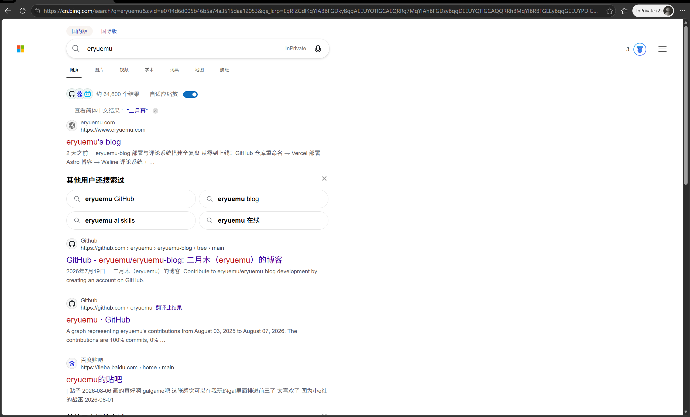
*图：Bing 搜索结果中展示的站点主标题与摘要*

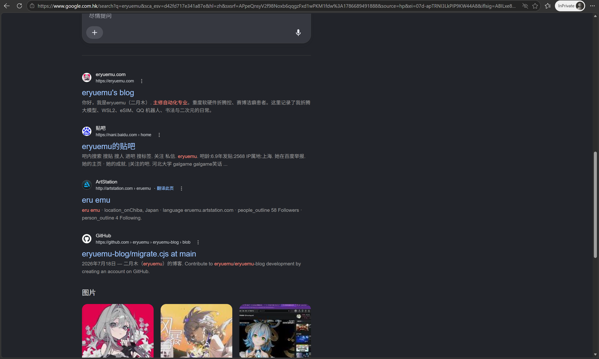
*图：Google 搜索结果优先提取首页 Hero 自我介绍正文作为动态摘要*

---

## 五、核心知识 ③：黑盒部分 —— Sitelinks 子链接卡片

友链那种搜索结果下方 6~8 个方块子入口（🐑薅薅羊毛、📷摄影相册……）叫 **Sitelinks**。

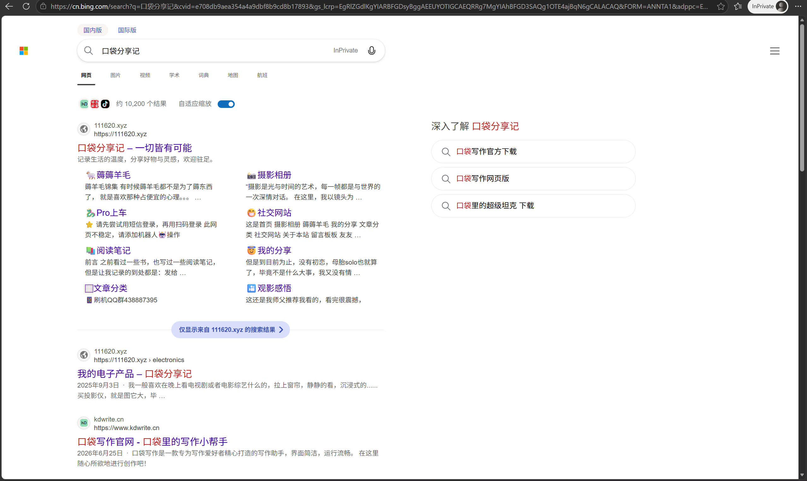
*图：友链博客「口袋分享记」在 Bing 搜索结果中展示的 Sitelinks 站内多格子快捷卡片*

- **没有代码能强制开启**，是引擎算法根据站点质量自动决定
- 只能"喂条件"提高概率：
  1. 搜品牌词排名第一
  2. 网站导航架构清晰（首页明确链接各栏目）
  3. 结构化数据 `SiteNavigationElement`（相当于递一张"官方导航清单"，不给的话引擎自己猜）
  4. 上线一段时间 + 点击量积累
- 时间预期：收录后 **1~3 个月**，满足条件会逐步展开

---

## 六、提交收录操作流程（Google + Bing）

### Google Search Console
1. `search.google.com/search-console` → 添加资源 → **网址前缀**（比"网域"省事：网域必须去 DNS 加 TXT 记录；网址前缀支持 HTML meta 标记验证，10 秒完成）

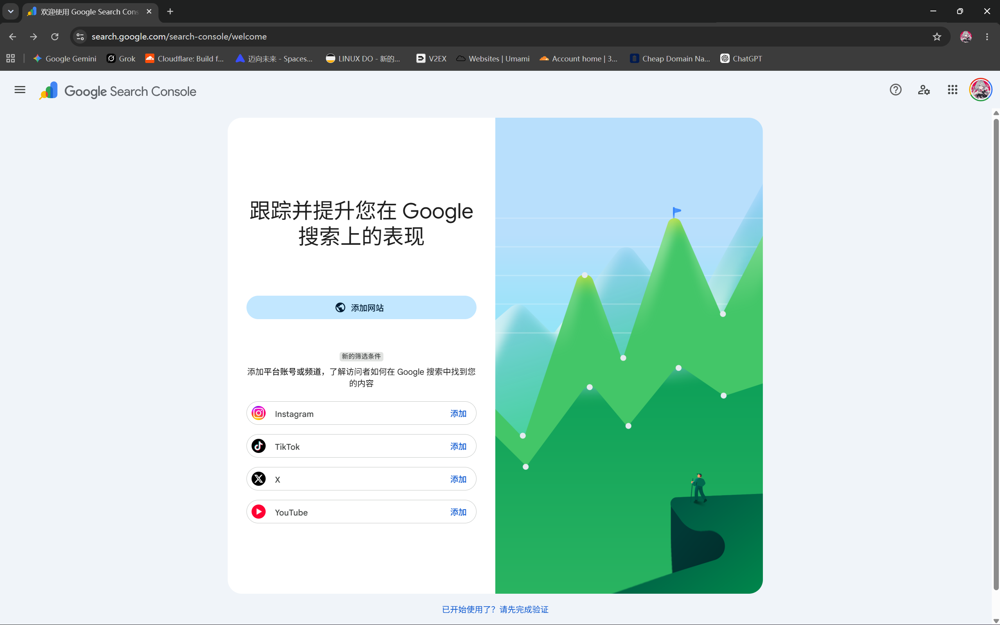
*图：Google Search Console 欢迎页添加资源*

2. 验证方式选 **HTML 标记** → 把 `<meta name="google-site-verification" content="...">` 写进站点 `<head>`（本案例：wiki 提交于 `89bdc94`，blog 提交于 `bea8c1d`）→ 点验证

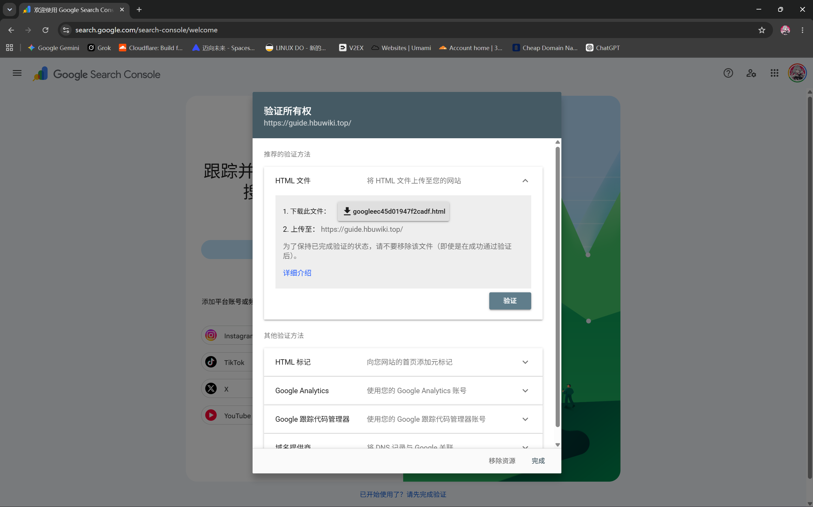
*图：Google Search Console 验证所有权弹窗（支持 HTML 标记与 HTML 文件验证）*

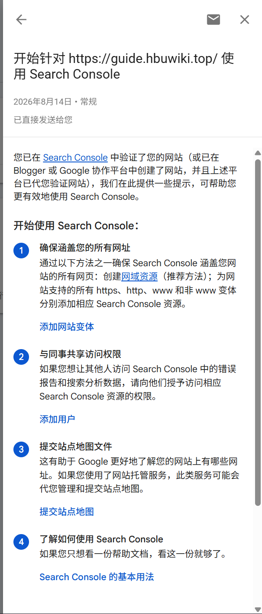
*图：所有权验证成功后 Google 发送的官方站长开通通知邮件*

3. 左侧「站点地图」 → 输入 `sitemap.xml`（wiki）/ `sitemap-index.xml`（blog）→ 提交

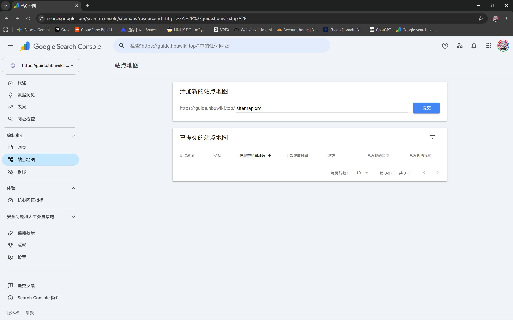
*图：HBU Wiki 提交站点地图 sitemap.xml 界面*

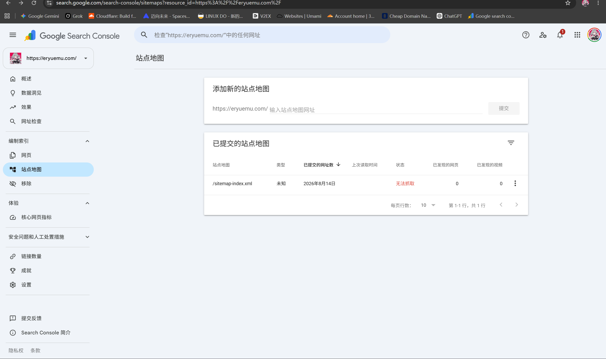
*图：博客 eryuemu.com 提交站点地图 sitemap-index.xml 界面*

4. 顶部搜索栏输入首页 URL → 先点「**测试实际网址**」（会派实时爬虫实测一次）→ 显示"网址可编入索引"后点「**请求编入索引**」

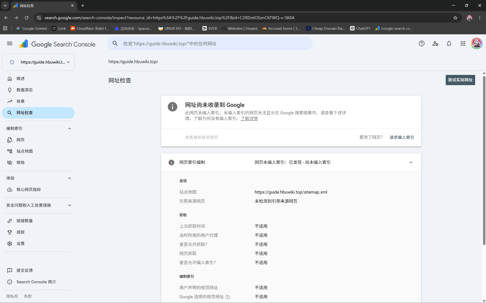
*图：Google Search Console 网址检查与申请编入索引（已发现 - 尚未编入索引）*

**常见现象**：
- 刚提交显示"**无法抓取**"：同步延迟的假报错，几小时~明天自动变绿
- "已发现 - 尚未编入索引"：正常中间状态

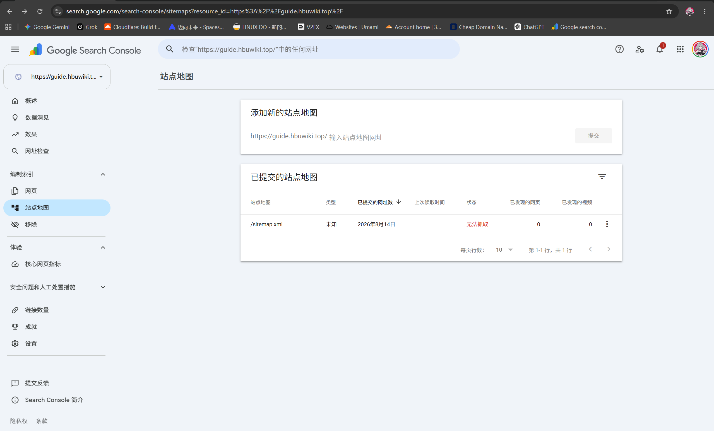
*图：刚提交站点地图时常见的同步延迟假报错「无法抓取」（正常现象，无需慌张）*

### Bing Webmaster Tools
- 支持**从 Google Search Console 一键导入**：授权 Google 账号 → 自动同步两个站的所有权验证 + sitemap
- 导入时若提示数据未同步（Google 刚绑定几分钟），手动添加 + HTML meta 验证同样 1 分钟搞定

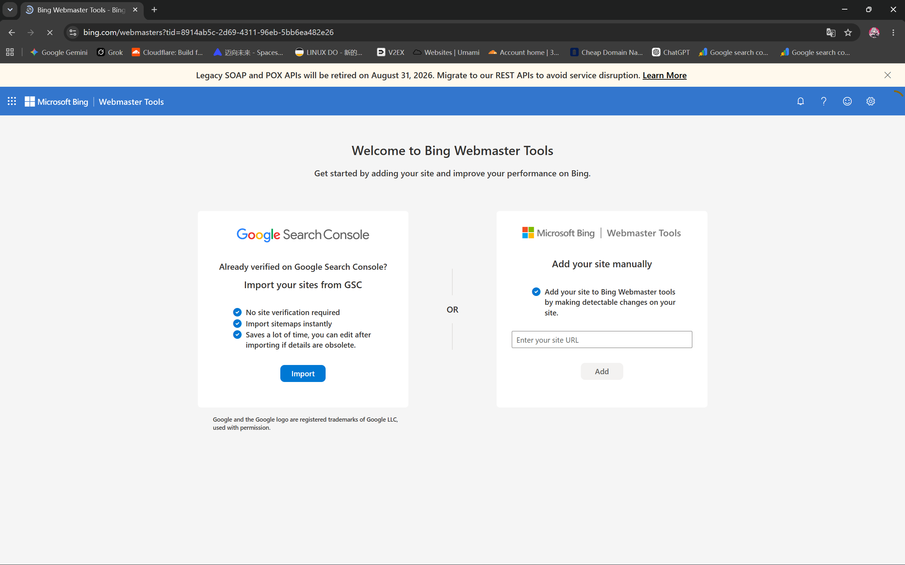
*图：Bing Webmaster Tools 支持从 Google Search Console 一键同步站点与 Sitemap*

### 为什么 Bing 里 wiki 显示 9、blog 显示 1？
- VitePress 生成**单层直属地图** `sitemap.xml`（直接列出 9 个页面）→ 一眼数出 9
- Astro 生成**地图索引** `sitemap-index.xml`（只含 1 个指向子地图的链接）→ 显示 1，等引擎翻开子地图后变 28

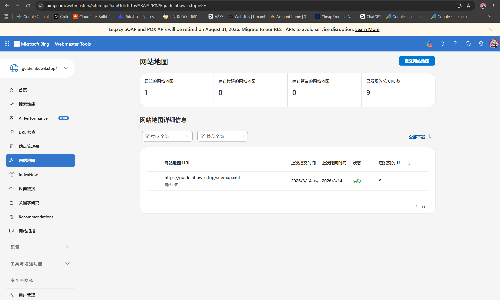
*图：Bing Webmaster Tools 成功读取 HBU Wiki 的 sitemap.xml（状态成功，已发现 9 个 URL）*

---

## 七、深度对比：Google 与 Bing 的收录哲学与 SEO 实战排坑

### 7.1 URL 检查实测：已成功编制索引 vs 前台 site: 延迟

提交第二天（8月15日早晨），在 Bing 站长工具的「URL 检查」中输入 `https://guide.hbuwiki.top/`，返回状态：

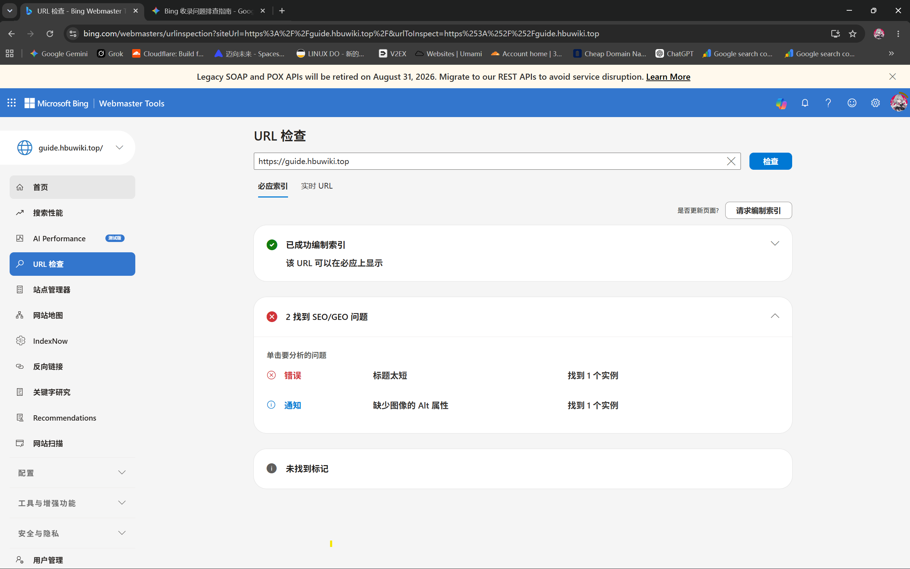
*图：Bing 站长工具 URL 检查显示「已成功编制索引」，同时提示 2 条 SEO 优化建议*

然而此时在 Bing 搜索前台输入 `site:guide.hbuwiki.top` 查询，依然显示暂无结果：

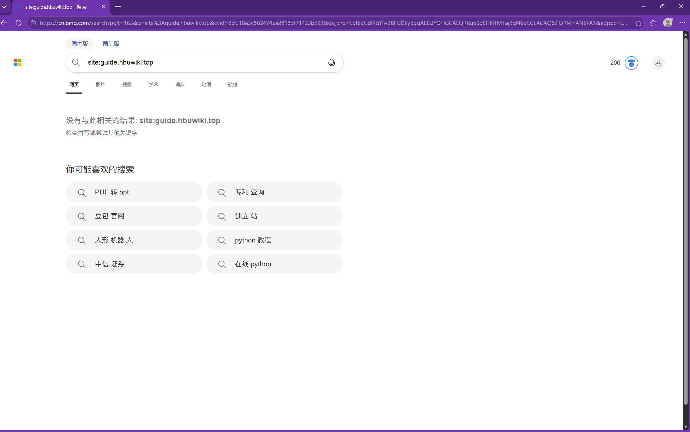
*图：前台 site:guide.hbuwiki.top 暂无结果（搜索引擎前后台数据同步周期的正常现象）*

#### 为什么“后台绿了，前台依然搜不到”？

这是所有新手站长最容易误判为“配置失败”的阶段。实际上，搜索引擎是由两个**完全解耦的子系统**构成的：

```
你的网站提交
    │
    ▼
【后端索引系统 (Indexing Engine)】─── 已完成 ✅
- 爬取页面、解析中文、生成倒排索引库
- 表现：后台 URL 检查亮起绿色「已成功编制索引」
    │
    ▼  （每天固定批次打包，向全球搜索分发集群广播 ⏳ 耗时 12~48 小时）
    │
【前台服务集群 (Serving Cluster)】─── 正在同步中 ⏳
- 响应全球用户实时搜索的分布式缓存切片节点
- 表现：前台 site: 查询暂未命中，等待下一次批处理广播推送到位后瞬间出现
```

- **结论**：后台既然已经打上绿色对勾，说明**技术与收录流程已 100% 通过**，无需做任何多余操作，静待 1~2 天让前台缓存切片广播完成即可。

#### ⚠️ 下方「2 找到 SEO/GEO 问题」是什么？
这是 Bing 内置的静态代码体检建议，**不影响已收录的事实**：
1. **标题太短（错误）**：首页 `<title>` 原为 `HBU Wiki`（8 个字符），Bing 建议 15~60 字符以覆盖更多搜索词。
2. **缺少图像 Alt 属性（通知）**：顶部导航栏 Logo 未设置 `alt` 文本。

### 7.2 针对性代码修复

在 `HBU-Wiki/.vitepress/config.mjs` 中进行三处优化：
1. **首页标题扩充**：`title: "HBU Wiki - 河北大学生存指南"`（8 → 16 字符，进入 Bing 建议的 15~60 区间），同时新增导航栏 `siteTitle: 'HBU Wiki'` 维持 UI 简洁。
2. **Logo Alt 补全**：`logo: { src: '/hbuwiki.png', alt: 'HBU Wiki Logo' }`。
3. **子页 Title 修正**：VitePress 的 `<title>` 由「frontmatter title | siteTitle」**自动拼接**（站点标题 = 全站签名后缀，改一次影响所有页面）。直接改 site title 会让所有子页 title 变成「xxx | HBU Wiki - 河北大学生存指南」（超长、且与 og:title 不一致）。`transformHead` 返回 title 标签**无效**（会产生两个 `<title>`，引擎只认 VitePress 默认的第一个）。改用官方 `titleTemplate`：
   ```js
   titleTemplate: ':title | HBU Wiki',   // 子页 → 「xxx | HBU Wiki」短格式
   ```
   首页 `index.md` frontmatter 加 `titleTemplate: false` → 保持完整「HBU Wiki - 河北大学生存指南」。全站 `<title>` 与 og:title 完全一致。
   **类比**：公司改邮件签名，老板改完自己的没发现，所有员工落款都拖了长签名——站点标题是全局的，只看首页改永远不够。

### 7.3 实战排坑 ①：代码修复上线后，为什么 Bing 诊断仍提示旧错误？

修复代码并重新部署后，过了 4~5 个小时再次进入 Bing 站长工具的「URL 检查」，很多站长会困惑：**代码明明修了，为什么后台依然标红提示那两个 SEO 错误？**

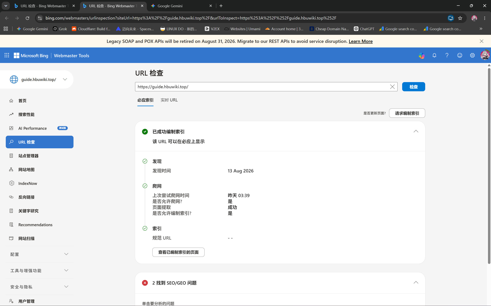
*图：查看后台「爬网」区域细节——上次尝试爬网时间仍停留在「昨天 03:39」，展示的是旧快照数据*

#### 根因剖析
- 默认打开的「**必应索引**」选项卡展示的是必应服务器上**历史沉淀的快照记录**。
- 爬虫尚未周期性回访前，后台数据库并不会自动感知线上的最新代码变更。

#### 标准应对与验证步骤
1. **切换「实时 URL」测试**：点击顶部「必应索引」右侧的「**实时 URL**」标签，点击「**测试实时 URL**」。必应会当场派遣一个沙盒爬虫节点直连你的网站进行即时体检。
2. **确认警告清空**：在实时测试结果中，确认 Title 长度、Logo Alt 等问题已全部消除，技术指标全绿。
3. **主动推送抓取队列**：测试通过后，点击右上角的「**请求编制索引**」按钮，正式将最新页面版本推入必应的优先更新队列。

---

### 7.4 实战排坑 ②：为什么点击「查看已编制索引的页面」全是一片空白？

在「必应索引」选项卡下点击「查看已编制索引的页面」，切换「HTTP 响应」与「HTML」标签页时，弹窗内部经常出现纯白空白：

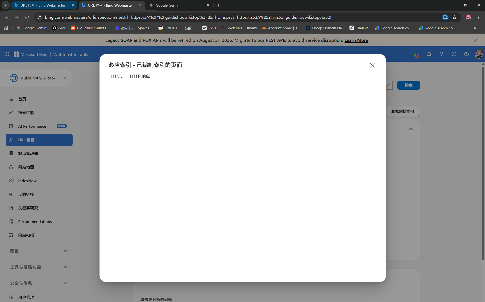
*图：点击「查看已编制索引的页面」，HTTP 响应标签页呈现纯白无内容*

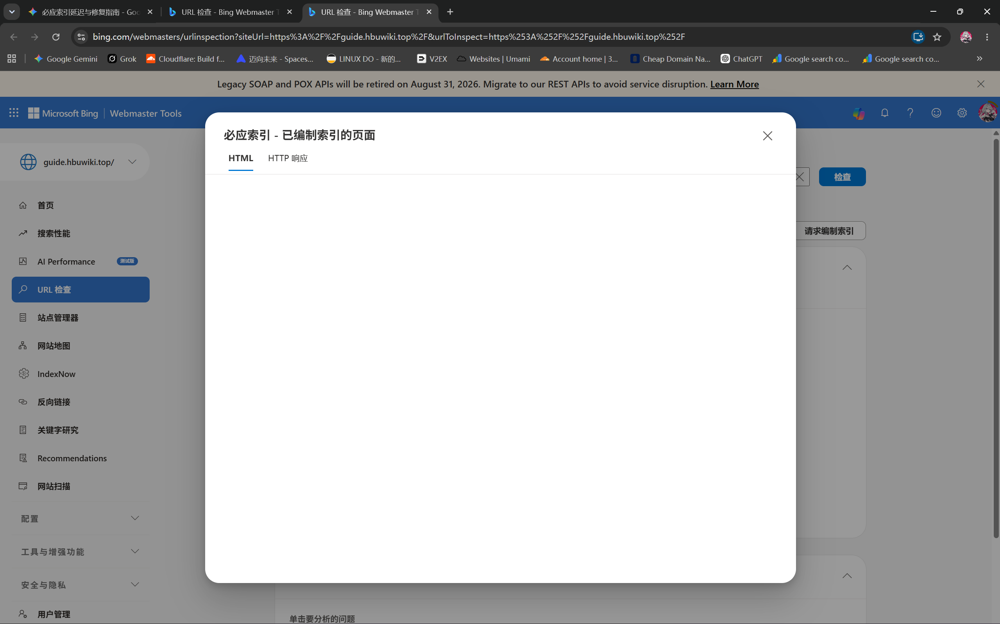
*图：切换到 HTML 标签页同样为空白*

#### 为什么会出现这种情况？
1. **轻量索引存储策略与系统解耦（推测原因，无官方文档证实）**：
   - 必应的底层索引系统在解析完页面关键信息（标题、正文文本、外链、结构化数据）并存入倒排索引库后，为了节省海量云存储空间，**据推测**不会长期持久化或不会将完整的原始 HTML 和 HTTP 响应报文同步至面向前端站长平台的查询节点**。
   - 特别是对新收录、轻量级抓取的页面，后台往往只有收录标记与索引元数据，没有保留全量历史快照文本。
2. **前端异步接口与浏览器插件拦截**：
   - 该弹窗的代码查看器由前端异步 API 动态加载渲染。
   - 浏览器中的广告拦截器（如 uBlock Origin、AdGuard）或隐私扩展有时会误将 BWT 拉取详情的内部 API 判定为跟踪请求予以阻断，导致内容无法注入文本框。

#### 核心认知
> [!NOTE]
> **弹窗空白绝对不等于“网页没被抓取”或“抓取内容为空”**。
> 只要外层状态显示 **「已成功编制索引（绿色对勾）」**，就代表技术与索引收录完全合法有效。若需审查实际抓取报文，只需在「实时 URL」下发起一次即时测试，即可当场查看到完整的 HTTP 响应头与网页 HTML 源代码。

---

### 7.5 深度剖析：为什么 Google 几小时就放榜，而 Bing 慢半拍？

很多站长实测发现：**同一个网站，Google Search Console 提交后几小时就能在 Google 搜到，而 Bing 即使后台全绿，前台搜 `site:guide.hbuwiki.top` 依然要等上一两天。**

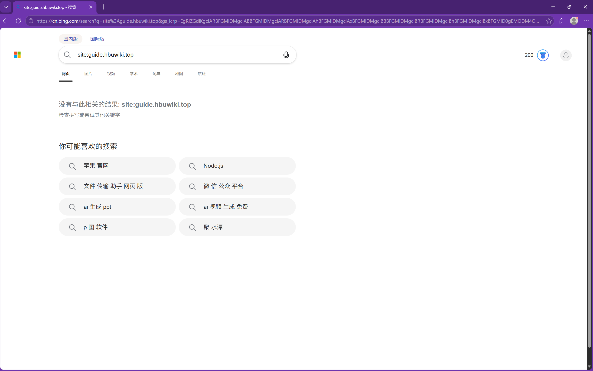
*图：前台 site:guide.hbuwiki.top 检索依然处于边缘节点批处理同步期*

两者的核心差异源于底层架构哲学与风控策略：

#### 1. 基建架构：流式处理 (Google) vs 批处理广播 (Bing)
- **Google 的即时流式流水线 (Stream Processing)**：
  Google 的爬虫渲染集群与前台搜索服务节点打通度极高。页面一旦爬取并完成质量打分，数据以流式管道近乎实时推送到全球检索集群，因此新页面在几小时甚至几十分钟内便能在 `site:` 指令中现身。
- **Bing 的分层批处理机制 (Batch Processing)**：
  Bing 的后端索引库（Indexing Engine）与面向公众的检索边缘节点（SERP Serving Edge）严格解耦。后台爬取判定通过（亮绿勾）只是第一步，前台放榜依赖固定周期的全局**批量同步作业（Batch sync）**，因此存在 12~48 小时的典型广播延迟。

#### 2. 新站信任风控与沙盒机制
- **Google 策略（宽松初审）**：“先放出来看表现，再根据用户反馈调整权重”。
- **Bing 策略（审慎准入）**：对新顶级域名、新二级子域名更为保守，页面入库前会多走几道自动化质量与反垃圾（Anti-Spam）过滤流，确保站点具备基础可信度后再对外公开展示。

#### 3. 进阶主动加速方案：IndexNow 协议
如果希望后续发布新文章时 Bing 能达到与 Google 相当的“秒级/小时级”收录速度，可以使用微软与 Yandex 联合主推的 **IndexNow 协议**：

```
传统 SEO 模式：  网站发布新内容 ──> 被动等待爬虫周期性回访（耗时数天~数周）
IndexNow 模式： 网站发布新内容 ──> 主动向 IndexNow API 发送一条轻量 Ping ──> 搜索引擎秒级调度爬虫立即拉取
```

- **Cloudflare 一键开启**：若站点接入了 Cloudflare，在后台 `Caching -> Configuration` 中找到 **Crawler Hints**（爬虫提示）勾选开启，Cloudflare 会通过 IndexNow 协议自动帮你的站点向 Bing 等引擎发送变更信号。
- **构建脚本自动化**：在 GitHub Actions 或部署 Webhook 中，构建完成后调用 `https://api.indexnow.org/indexnow` 提交变更 URL 清单。

#### 4. 实战放榜追踪（8月18日更新）：Bing 批处理广播完毕，前台成功登顶！
之前在 7.1 中提到的“后台绿勾但前台 site: 搜不到”的同步延迟，在经过 2~3 天后正式完成全球缓存切片广播。

在 Bing 搜索框直接输入核心关键词 `hbuwiki`：

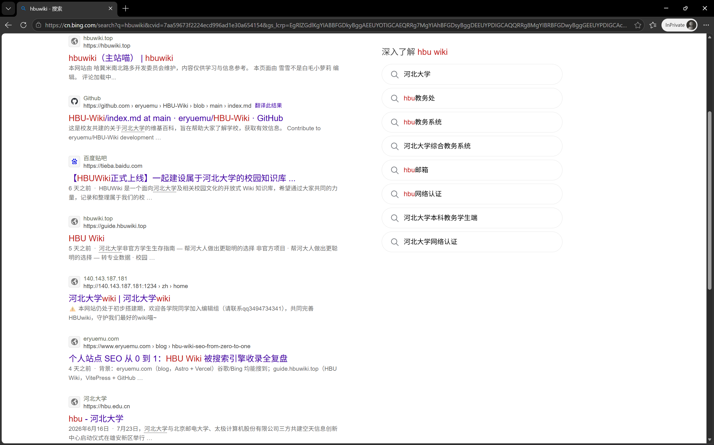
*图：Bing 搜索「hbuwiki」结果——主站 hbuwiki.top 稳居第一，GitHub、贴吧、指南站点与博客本篇 SEO 复盘文章全部聚合展现*

- **结果验证**：
  1. 主站 `hbuwiki.top` 稳定霸榜第 1 位。
  2. GitHub 开源仓库、百度贴吧发布贴、指南子站 `guide.hbuwiki.top` 紧随其后。
  3. 博客 `eryuemu.com` 本篇复盘文章也被 Bing 正确抓取并展示。
- **经验总结**：搜索引擎后端的倒排索引建立是第一步，前台 SERP 分发需要批处理周期。只要后台无硬性抓取报错，无需反复提交或焦虑修改，耐心理想等待即可。

---

### 7.6 Google Search Console vs Bing Webmaster Tools 的工具哲学

| 维度 | Google Search Console (GSC) | Bing Webmaster Tools (BWT) |
|---|---|---|
| **核心定位** | **极简底线**：只报硬性致命故障（能否抓取/索引/移动端体验） | **全科体检**：兼职 SEO 审计工具（类似 Lighthouse 打分） |
| **对待短标题** | 正常收录；前台由算法**动态提取网页正文最匹配段落**展示 | 正常收录；但后台面板会严格标红提示建议加长 |
| **对待图片 Alt** | 正常收录；不主动报警 | 报通知项，建议补充无障碍与图片搜索信息 |
| **快照展示** | 直接展示 Google 抓取渲染后的 DOM 与屏幕截图 | 分离「必应索引（历史精简）」与「实时 URL（全量直连）」 |
| **一句话总结** | “只要能看我就收录，展示时我靠算法动态优化” | “收录归收录，但我会按规范白纸黑字给你做代码体检” |

---

### 7.7 进阶排坑：GSC 提示「网页会自动重定向」未编入索引？

在站点上线运行一段时间后，若 Google Search Console（GSC）中提示某些网页因「网页会自动重定向」未编入索引，通常是由于**网址前缀资源（URL-prefix）视角差异、Apex 根域名与 www 规范化冲突、Vercel 308 重定向与 robots.txt Sitemap 引导链路**导致的。

该问题的完整成因分析、根域名规范化抉择、Vercel 重定向配置与 GSC 资源管理实战，已单独整理成深度复盘专文：

👉 **[GSC 提示「网页会自动重定向」未编入索引？根域名与 www 规范化全复盘](/blog/gsc-page-redirect-and-domain-canonical-guide)**

---

## 八、数据体系：GSC vs Umami vs Vercount（三层流量监控）

很多站长在搭建个人站点时容易把 SEO 工具、数据分析系统与访问量计数器混淆。在实际生产实践中，现代站长数据体系通常分为**三层分工**：

```
┌───────────────────────────────────────────────────────────┐
│                      用户全链路数据流                      │
└─────────────────────────────┬─────────────────────────────┘
                              │
  【第一层：进站前 · 搜索引擎内部】
  ► Google Search Console / Bing Webmaster Tools
    • 统计范围：用户在搜索引擎里搜索、还没进站前的行为
    • 核心指标：搜索曝光量、点击量、关键词搜索词、平均排名、收录状态
                              │ (用户点击搜索结果进入网页)
                              ▼
  【第二层：进站后 · 全景行为监控室】
  ► Umami Analytics (cloud.umami.is)
    • 统计范围：访客在站内的所有真实交互行为
    • 核心指标：实时在线人数、地理分布、来访渠道（Referrer）、停留时长、跳出率、设备/浏览器
    • 适用角色：站长深度运营与受众画像洞察（私密大屏）
                              │
  【第三层：前台展示 · 极简计数微服务】
  ► Vercount API (events.vercount.one)
    • 统计范围：全站独立访客数（UV）与总浏览量（PV）
    • 核心指标：`访问人数 490 · 总访问量 2538`
    • 适用角色：面向普通读者的极简门面展示（零运维、秒级加载）
```

### 三大工具全维度对比

| 维度 | Google Search Console (GSC) | Umami Analytics | Vercount 微服务 |
| :--- | :--- | :--- | :--- |
| **层级定位** | **进站前（上游生态）** | **进站后（深度分析）** | **前台门面（轻量回显）** |
| **管辖范围** | 仅搜索引擎内部渠道 | 全渠道进站访客（直接/搜索/外链） | 全站/单页访问累计 |
| **核心数据** | 搜索词、展示量、点击率、索引快照 | 实时访客、停留时长、国家、设备、路径 | 简单 UV 访客数、PV 浏览量 |
| **展示场景** | 站长后台管理控制台 | 独立可视化数据大屏（Dashboard） | 博客/文档底部极简徽章/文字 |
| **运维成本** | 零成本（官方提供） | 极低（Cloud 免运维或 Docker 自建） | 零成本（公共 Serverless API） |
| **一句话总结** | “别人怎么在搜索引擎里找到你” | “进站之后到底看了什么、看多久” | “给读者看这篇博客有多少人读过” |

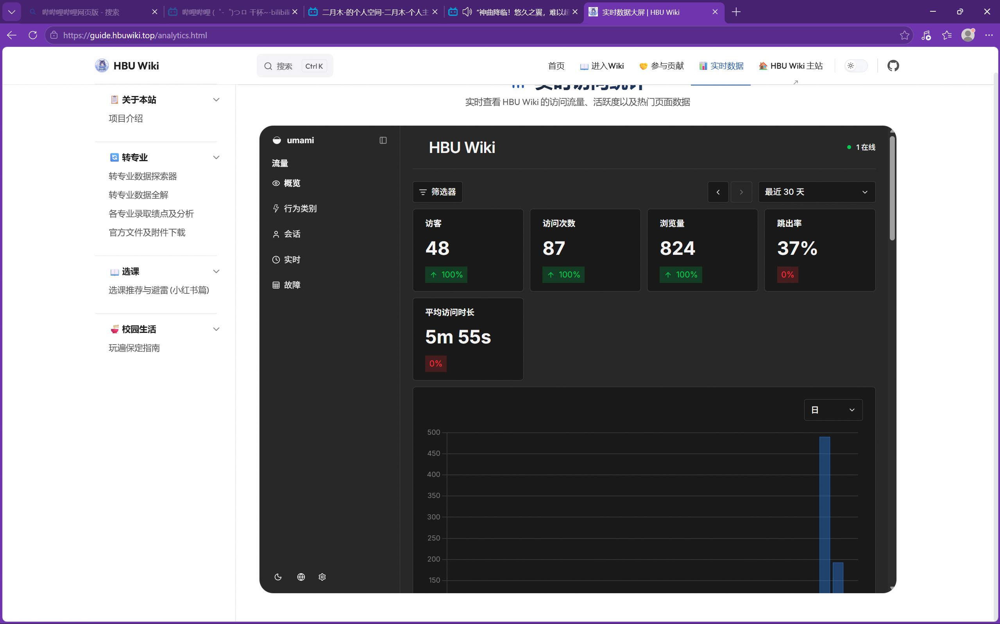
*图：HBU Wiki 接入的 Umami 实时数据大屏（统计进站后的真实访客、浏览量与停留时长）*

- **为什么博客和 HBU Wiki 都选用了 Vercount 作为前台计数器？**
  - Umami 侧重于后台分析，API 请求较重且涉及鉴权 Token，不适合高频匿名直接渲染在前台；
  - Vercount（现代化无服务器轻量计数 API）专为前端零配置回显而设计，体积小巧、响应迅速，通过 Cookie 与 IP 自动去重，非常适合个人博客与文档类站点。
- **关于域名切换时的注意事项**：
  - Vercount 是严格按请求域名（`Hostname`）作为隔离 key 独立记账的。若发生根域名与 `www` 域名的主辅切换，需在代码中将 API 请求 URL 显式映射回历史累计标识，以无缝继承历史积累的 UV/PV 资产。


---

## 九、生效时间表与验证方法

| 项目 | 预期时间 | 说明 |
|------|---------|------|
| Google 收录 | 几小时 ~ 2 天 | GSC 请求编入索引后流式极速上线 |
| Bing 收录 | 1 ~ 3 天 | 后台绿勾后等待全球 Serving 节点批处理同步 |
| Blog 描述更新 | 3 ~ 7 天 | 等待爬虫周期性回访重爬快照 |
| Sitelinks 子链接卡片 | 1 ~ 3 个月 | 积累一定品牌词搜索与稳定点击量后算法自动展开 |

**验证是否被收录**（浏览器地址栏直接搜）：
```
site:guide.hbuwiki.top
site:eryuemu.com
```
有结果列出即已入库；或者看 Search Console / Bing 站长工具左侧的已编入数量。

---

## 十、后续维护与持续加速

1. **日常发布无需额外操作**：
   - VitePress/Astro 在执行构建时会自动将新文章链接加入 `sitemap.xml`。
   - 搜索引擎爬虫会在下次周期回访时自然发现新页面。
2. **改动标题 / 描述**：
   - Blog 修改 `src/consts.ts` 的 `SITE_TITLE / SITE_DESCRIPTION`；Wiki 修改 `config.mjs`，`git push` 部署后 3~7 天内搜索引擎会自动更新搜索结果摘要。
3. **进阶加速（IndexNow）**：
   - 对于更新频繁的站点，接入 IndexNow 协议可跳过漫长的被动等待，让 Bing 在更新后数小时内主动回访抓取。
4. **搜索引擎权重认知**：
   - 搜索引擎**绝不会**因为“站长手动提交过”就给予额外权重。提交和验证仅仅是**加速爬虫发现**的通道，站点的最终排名永远取决于**内容原创度、结构规范性与真实访问留存**。
