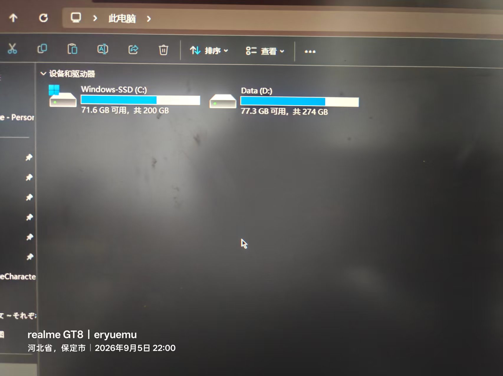
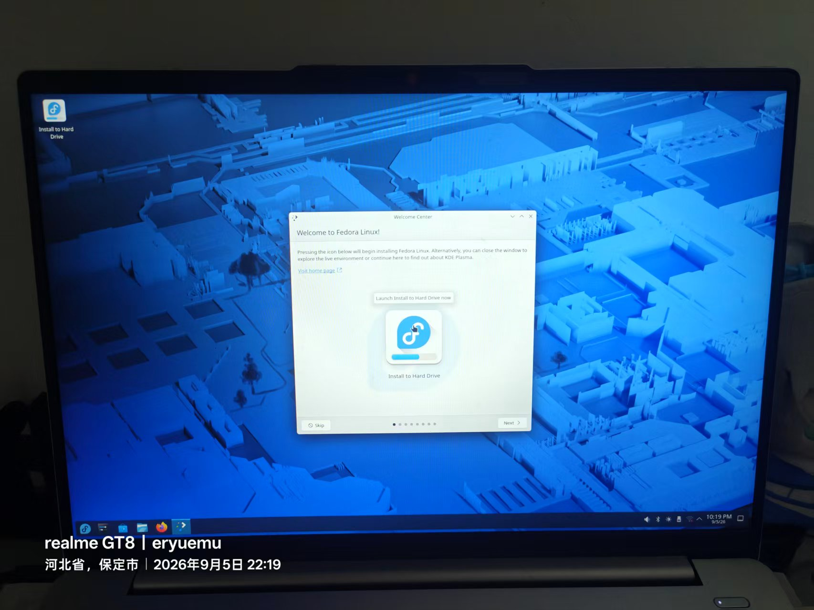
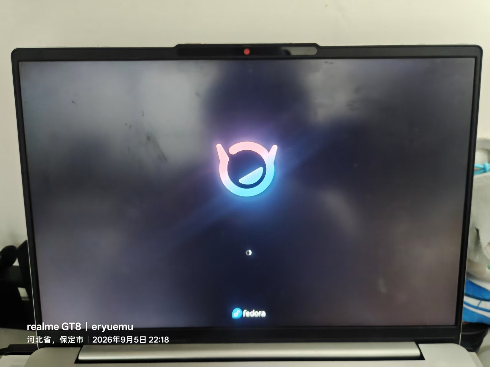
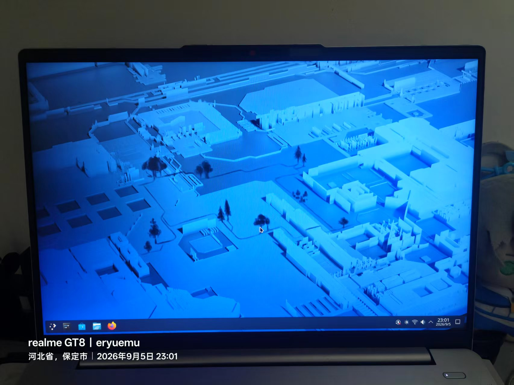

# 联想小新 14 装 Fedora 44 KDE 双系统全记录（上）：安装篇

> **机器**：联想小新 14（82XD），i5-13500H + 锐炬 Iris Xe 核显（无独显），512GB NVMe（UMIS RPJYJ512MKN1QWY），Realtek RTL8852BE 无线网卡。
> **原系统**：Windows 11 家庭中文版，C 盘剩 71.6 GB，D 盘剩 77.3 GB。
> **目标**：保留 Win11，划 60GB 装 Fedora 44 KDE Plasma Edition 组成双系统。
> **协作方式**：AI（Gemini）预演了完整四步流程，实际执行改为"一次回复只做一步、做完确认再做下一步"。
> **结果**：一次成功，GRUB 双引导正常，装机本体不到 1 小时，时间大头花在无损调整分区上。

关联阅读：[下篇：一次注销引发的血案](/blog/lenovo-xx14-fedora-kde-logout-black-screen-recap)（装完当晚因安装输入法引发 kwin/kscreenlocker ABI 脱节黑屏，排查全程见下篇）

---

## 0. 结论速览（先看这个）

| 项目 | 结论 |
|---|---|
| BitLocker / 快速启动 | 本机设备加密本来就关；休眠关闭导致快速启动选项不出现，等于已禁用，两项检查各花 1 分钟跳过 |
| 划分区工具 | Windows 磁盘管理只能从 D 盘压出 2.5GB（末端碎片），改用图吧工具箱自带 DiskGenius，D 盘被占用 → 自动重启进 WinPE 脱机调整，成功划出 60GB |
| U 盘引导 | 联想按 F12（实际 Fn+F12）；启动项显示为 "Linpus lite (VendorCoProductCode)" 即 Fedora U 盘 |
| 安装器版本 | AI 预演按老版 Anaconda 写的（Installation Destination + Reclaim space），实机是新版 WebUI 向导——流程更简单，全程默认选项 |
| 最终分区 | 复用 Windows EFI（p1）+ 新建 p6=/boot 2.15GB、p7=Btrfs 62.3GB（60 GiB ≈ 64.45 GB，一分不多） |
| 装后必做 | 时差修复 `timedatectl set-local-rtc 1`；DNF 提速；KDE Wayland 分数缩放直接可用 |
| 桌面选择 | 觉 KDE 乱有两条路：共存安装原生 GNOME，或给 KDE 瘦身；最终留在 KDE |
| 踩坑记录 | Trae 下错 arm64.deb（架构+格式双错），正确做法 x64 rpm + `dnf install` |

## 1. 装前检查：两项常规坑都天然跳过

AI 给出的预演流程分四步：**备份 BitLocker 密钥（约 5 分钟）→ 划出空闲分区（约 3 分钟）→ U 盘启动进 Live（约 3 分钟）→ 安装配置（约 10 分钟）**，并先确认了方向：保留 Win11 组建双系统，而不是抹盘单装。

双系统装机前两个高频翻车点是 BitLocker 锁盘和快速启动锁 NTFS 分区。

**设备加密（BitLocker）**：Win + I → 隐私和安全性 → 设备加密。本机显示**关闭**，无需备份 48 位恢复密钥，直接跳过。（若页面显示"不支持/未开启"同样直接跳过；若为开启状态，需备份恢复密钥到微软账户或关闭加密等解密完成。）

**快速启动**：Win + R → `powercfg.cpl` → 选择电源按钮的功能 → 更改当前不可用的设置。本机**该选项不出现**——系统休眠（Hibernate）本身是关闭的，快速启动依赖休眠文件运行，休眠关闭即等于快速启动彻底禁用。验证方法：关机设置区确认没有"启用快速启动"勾选框可勾。


*图 1：控制面板电源设置页——本机休眠已关，快速启动选项根本不出现（21:58）*

## 2. 划分区：磁盘管理失败 → DiskGenius 进 PE 脱机调整

### 2.1 从哪个盘划

C 盘 200GB 剩 71.6GB，D 盘 274GB 剩 77.3GB。第一反应是压 C 盘，被 AI 拦住：C 盘再划走 50G 以上系统盘会见底变红，影响后续系统运行和更新。确定**从 D 盘划 50~60GB**。


*图 2：此电脑界面——C 盘和 D 盘的剩余空间一目了然（22:00）*

容量测算：Fedora 系统本体约 12~15GB，50GB 就足够放开发工具链、日常软件和 Flatpak 应用；D 盘扣除 50GB 后还剩约 27GB 缓冲，解压大文件不会撑爆。最终按"想多给点"的思路取了 **60GB**。


*图 3：划盘前的磁盘管理全景（22:00）*

### 2.2 Windows 磁盘管理的限制

磁盘管理 → D 盘右键压缩卷，输入 61440（60GB）：**可用压缩空间只有 2526MB**。


*图 4：输入 61440MB（60GB）后只能压出 2526MB——分区末端存在不可移动的碎片（22:03）*

原因：分区末端存在被占用的数据碎片或系统文件，自带工具**不会自动迁移这些碎片**。解法是无损分区工具（自动将末端碎片前移，完全不伤数据），推荐傲梅分区助手或 DiskGenius。

### 2.3 DiskGenius 操作过程

1. 图吧工具箱自带 DiskGenius（硬件检测分类），不用额外下载；


*图 5：图吧工具箱自带 DiskGenius，无需额外下载分区工具（22:04）*

2. 右键 Data (D:) → 调整分区大小，在"分区后部的空间"填 60 GB，确认"调整后容量"没有变红，点开始；
3. 弹出磁盘底层修改的常规免责提示 → 插着电源线点"是"；
4. **D 盘被占用**（图吧工具箱自己就装在 D 盘），Windows 运行中锁定了分区，无法在线调整 → DiskGenius 提示重启进入临时内存微系统（WinPE）脱机执行。保持默认勾选"完成后：重启 Windows"，点确定；


*图 6：D 盘被锁定，需重启进 WinPE 脱机调整（22:07）*

5. 重启前有个打包 WinPE 的等待过程（从系统里抽取底层文件），卡绿条 2~3 分钟属正常；**超过 5 分钟完全不动**说明 WinRE 被系统优化禁用，可点 X 取消改从 Fedora Live 里缩盘。本次等到了，成功重启；
6. PE 蓝黑界面自动脱机调整，显示"剩余时间 0:00:53"，**全程不用动**，跑完自动二次重启回 Windows；


*图 7：WinPE 脱机调整进行中，全程无需干预（22:10）*

7. 磁盘管理确认 D 盘右侧出现 **60GB 黑色横条"未分配"空间**。保持原样：**不新建简单卷、不格式化**。

## 3. U 盘引导

1. 插入 Fedora 安装 U 盘，开始菜单 → 重启；
2. 联想 Logo 亮起瞬间连按 F12。**注意小新 14 的 F1~F12 默认为多媒体键，需按住 Fn 狂点 F12**（FnLock 开关在 Esc 键上）；
3. 备选方案（不拼手速）：按住 **Shift** 点"重启" → 高级选项界面 → 使用设备（Use a device）→ UEFI USB 启动盘；
4. 启动菜单里认准 U 盘项：通常显示 `EFI USB Device`、`USB HDD` 或 U 盘品牌名，这台联想显示为 **"Linpus lite (VendorCoProductCode)"**——部分主板识别 Fedora 的 EFI 引导文件时就显示这个怪名字，属正常现象；


*图 8："Linpus lite (VendorCoProductCode)" 就是 Fedora 安装 U 盘（22:16）*

5. U 盘 GRUB 菜单选第一项 **Start Fedora-KDE-Desktop-Live**——直接跳过漫长且没必要的 U 盘介质校验；


*图 9：选第一项跳过介质校验直接进 Live 系统（22:17）*

6. 屏幕刷过几行代码后出现 **Fedora logo 加载动画**，等 1~2 分钟进桌面。


*图 10：Fedora logo 加载动画——本文封面同款（22:18）*

镜像为 **Fedora KDE Plasma Edition**（官方 Spins 之一），非默认的 Workstation/GNOME 版。进入 Live 桌面后第一件事：右下角托盘点 Wi-Fi 连网——安装完成后的第一时间联网，可以立刻完成时间校准、软件源刷新和后续组件补全；终端里 `ping -c 3 baidu.com` 能看到正常延迟响应即网络连通。


*图 11：进入 Fedora KDE Live 桌面，右下角先连 Wi-Fi（22:19）*

## 4. Anaconda WebUI 安装：AI 预演的是老版，实机是新版向导

这里有个有意思的细节：AI 预演流程按**老版 Anaconda** 写的（Install to Hard Drive → Installation Destination → 存储配置选"自动" → Reclaim space 回收空间），而实机遇到的是**新版 WebUI 向导**——一个 Next 到底的网页式界面，比老版拼格子友好太多。语言页选简体中文，时区点地图选上海（地域 Asia / 时区 Shanghai），键盘布局保持美式默认，一路 Next。


*图 12：Fedora KDE Live 桌面与 Welcome Center（22:21）*

### 4.1 分区策略页

- 选 **Share disk with other operating systems**：保留现有系统布局，直接使用可用空间；自动复用 Windows 的 EFI 分区并注入 GRUB 引导项，不覆盖 Windows 引导文件；
- **Reclaim additional space 不勾**：该项用于未提前划分区时强制回收/删除分区，已有现成 60GB 未分配空间则不需要——"啥也不选直接 Next"；
- 安全保证：在最后点正式的 Install 之前，安装程序不会向硬盘写入任何数据；
- 到达分区确认页前若弹出 **LUKS 磁盘加密（Encrypt my data）**，保持不勾——勾了以后每次开机进入 Fedora 前都要先输磁盘解密密码，忘了数据无法恢复，双系统日常使用无加密必要。

### 4.2 EFI 260MB 黄色警告

摘要页弹出黄色警告：Windows 预装 EFI 分区 260MB 低于 Fedora 推荐的 500MiB。实际 GRUB 引导文件仅十几 MB，Windows 引导文件几十 MB，**260MB 对双系统绰绰有余**。警告框自带 `Click 'Next' again to proceed despite these warnings`，再点一次 Next 放行。


*图 13：EFI 分区黄色警告 + LUKS 加密不勾选，再点一次 Next 放行（22:24）*

### 4.3 分区摘要确认

摘要中 `nvme0n1p1 273 MB format as efi` 易被误解为要格式化 Windows 引导分区，实际是新版安装向导统一的**文本展示模板**，表示该分区的挂载类型；双系统模式是**复用** p1，仅把 Fedora 的 GRUB 引导文件添加进去，不执行清空重格，也不会抹掉 Windows Boot Manager。最终布局：

| 分区 | 大小 | 用途 |
|------|------|------|
| nvme0n1p1 | 273 MB | Windows EFI（复用，写入 Fedora 引导项） |
| nvme0n1p2~p5 | — | MSR 16MB / C 盘 / D 盘 / 恢复分区 1.95GB（原样保留） |
| nvme0n1p6 | 2.15 GB | /boot（Linux 内核） |
| nvme0n1p7 | 62.3 GB | Btrfs 主分区（/ 与 /home 子卷） |

两个当时追问过的疑点：

- **编号为什么是 p6/p7**：Windows 已占用 p1~p5（p1 EFI 260MB、p2 MSR 16MB、p3 C 盘、p4 D 盘、p5 恢复分区 1.95GB），新分区只能顺延；
- **容量加起来为什么是 64.45GB**：Windows 按 GiB（二进制）显示，安装器按 GB（十进制）显示，60 GiB × 1.074 ≈ 64.4 GB。p6（2.15GB）+ p7（62.3GB）= 64.45GB，恰好严丝合缝等于划出的 60 GiB，一点没多占。

语言列表仅有"简体中文（新加坡）"无"（中国）"选项——Linux 底层两者用同一套 UTF-8 简体中文字库与绝大部分翻译，界面显示无差别；装完在系统设置的区域与语言里可一键加回 zh_CN，无实际影响。

### 4.4 写入与重启

点 Install 后 **2~3 分钟完成**——Fedora 采用镜像整块写入方式，配合 PCIe NVMe 固态就是这个速度。之后点 "Exit to live desktop" → Live 桌面左下角开始菜单点 Restart → **屏幕彻底熄灭的一瞬间拔掉 U 盘**（防止再次从 U 盘引导）→ 自动进入 GRUB 菜单。


*图 14：Successfully installed——镜像整块写入 2~3 分钟完成（22:32）*

## 5. 首次开机与初始化

GRUB 菜单四项：**Fedora Linux**（进 Fedora）/ **0-rescue**（救援恢复模式，平时不用管）/ **Windows Boot Manager**（回 Win11）/ **UEFI Firmware Settings**（进主板 BIOS）。看到这个菜单，双系统引导已 100% 生成。


*图 15：GRUB 双系统菜单生成——双系统安装成功的标志（22:35）*

初始化向导配置：

- 用户名 `eryuemu`（全小写无空格，标准规范），**这个密码同时是后续 sudo 提权的最高管理员密码**，要牢记；
- 主机名：会直接显示在终端提示符和局域网设备列表里，要求全小写字母/数字/连字符。AI 给了三套命名参考——设备标识型（`eryuemu-xx14`、`fedora-laptop`、`xx14-fedora`）、极简型（`eryuemu-pc`、`box`、`node`）、浪漫意象型（`starlight` 星光、`aurora` 极光、`polaris` 北极星）。最终选了 **fedora-xx14**，终端提示符为 `[eryuemu@fedora-xx14 ~]$`；
- 时区选 **Shanghai**——tzdata 国际时区数据库中中国标准时间（UTC+8）的标准代号就是 Asia/Shanghai，保持地域 Asia / 时区 Shanghai 直接下一步；
- 若出现第三方软件源（Third-Party Repositories）页**建议勾选开启**，方便后续直接获取媒体解码器、专有驱动；隐私/定位服务按个人喜好勾选。


*图 16：初始化向导完成，欢迎使用 Fedora Linux（22:40）*

点完成后窗口关闭，短暂锁屏输入密码即进入桌面——双系统全流程至此大功告成。


*图 17：第一次进入 Fedora KDE 桌面（23:01）*

## 6. 装后必做配置

### 6.1 双系统 8 小时时差修复

Windows 默认把主板硬件时钟视为**本地时间**，Linux 默认视为 **UTC 世界协调时**，来回切换系统时间就错乱 8 小时。让 Linux 迁就 Windows：

```bash
timedatectl set-local-rtc 1 --adjust-system-clock
```

需要输入管理员密码——**终端内输入密码不显示字符也不显示星号，盲打完直接回车**（这台机器的所有 sudo 操作都是如此）。验证：执行 `timedatectl`，输出含 `RTC in local TZ: yes` 即成功。

### 6.2 DNF 提速

```bash
echo 'max_parallel_downloads=10' | sudo tee -a /etc/dnf/dnf.conf
echo 'fastestmirror=True' | sudo tee -a /etc/dnf/dnf.conf
```

多线程并发下载（最多 10 个包同时下）+ 最快镜像自动选择。因日常开代理（Clash Verge，本机 127.0.0.1:7897，TUN 全局接管），未额外更换国内软件源，官方源速度已够用。

### 6.3 高分屏分数缩放：KDE Wayland 直接可用

桌面空白处右键 → 配置显示设置 → 缩放（Scale）设为 125% 或 150% → Apply → 屏幕闪一下弹倒计时确认，点"保留此配置"。选值参考：2.2K/2.8K 屏推荐 150%，1080P 屏保持 100% 或微调 125%。**应用矢量栅格化，字体图标清晰，无需再单独调字号**。

原理对比（对同为 Wayland 的 Ubuntu GNOME）：

- **KDE (KWin)**：对 Wayland 原生分数缩放协议 `fractional-scale-v1` 适配更激进，直接通知应用"以 1.5 倍物理像素做矢量光栅化绘制"，Qt 6 桌面组件全矢量渲染，缩放时像素严丝合缝；
- **GNOME (Mutter)**：处理非整数倍缩放（125%/150%）时默认策略是"向上取整再缩"——先按 200%（2 倍）渲染再算法整体缩小，消耗额外 GPU 算力且字体发虚，因此 GNOME 用户往往被迫 100% 缩放 + 在辅助功能里单独调大"文本缩放因子（字号）"。这也是为什么游戏本上"调缩放还得调字号"。

### 6.4 Fn 快捷键开箱即用的原因

音量（F2/F3）、亮度（F5/F6）直接可用，同款流程在游戏本（七彩虹隐星 P16 Pro，Ubuntu GNOME）上不可用。差异来自四层：

1. 联想在 Linux 主线内核源码树中有官方维护的平台驱动 **ideapad_laptop**，Fn 组合键经 ACPI/WMI 固件转为标准内核事件（KEY_VOLUMEDOWN、KEY_BRIGHTNESSUP），桌面捕获即触发；
2. 纯核显机型背光走标准接口 `/sys/class/backlight/intel_backlight`，i915/xe 开源驱动支持完善，亮度直接走 GPU 硬件通道；
3. 游戏本多为公版模具（蓝天/同方方案）+ 私有 **EC（嵌入式控制器）**协议，键盘背光、风扇模式、Fn 组合键被 EC 拦截，厂商仅提供 Windows 闭源"控制中心"服务，Linux 收不到标准扫描码或只收到非标准 ACPI 事件；
4. Fedora 采用最新主线内核（6.19），主流轻薄本电源管理、ACPI 热键补丁合入快；传统 LTS 发行版内核保守时容易缺补丁。

### 6.5 KDE 与 GNOME：版本确认与"觉得乱怎么办"

版本确认：Fedora Workstation（官网默认大按钮下载的旗舰版）为未经魔改的**原生 GNOME**——无任务栏、无 Dock、无桌面图标，全靠左上角轻触/三指上滑/Super 键呼出活动概览；Ubuntu 则是深度魔改的 GNOME（Ubuntu Dock、桌面图标扩展、贴近 Unity 的交互）。本次镜像为 **Fedora-KDE-Desktop-Live**，属官方 Spins 独立桌面版本，U 盘菜单、安装器标题、GRUB 引导项均标注 KDE Plasma Desktop Edition。KDE 默认提供底部任务栏 + 开始菜单 + 系统托盘 + 最小化按钮，从 Win11 迁移学习成本最低。

初次上手 KDE 觉得"选项多、有点乱"，有两条直接的路：

**方案一：共存安装原生 GNOME**（不用重装系统，Fedora 允许多桌面环境共存）：

```bash
sudo dnf group install -y "GNOME Desktop"
```

装完注销，登录界面找"桌面会话"切换器（齿轮/下拉框），将会话从 Plasma (Wayland) 改选 GNOME 或 GNOME on Wayland 登录即可。

**方案二：给 KDE 瘦身，改出清爽感**：

- 换极简开始菜单：右击左下角开始菜单图标 → 显示替代方案（Show Alternatives...）→ 选"应用程序菜单"（Application Menu）切换，面板从宽大平铺变经典紧凑；
- 清理底部托盘：右键任务栏空白处 → 进入编辑模式（Enter Edit Mode），不需要的托盘项直接垃圾桶图标移除。

实际结论：体验下来觉得新奇多过混乱，**留在 KDE 继续用**。顺带确认了 Ubuntu 也能一条命令换 KDE 共存：`sudo apt install -y kde-plasma-desktop`（想要完整 Kubuntu 全家桶则装 `kubuntu-desktop`），安装问询框**保留 gdm3**，注销后在登录界面齿轮处切换 Plasma (Wayland) 会话；游戏本独显下若 Wayland 卡顿或休眠唤醒黑屏，切 Plasma (X11) 通常可解。

## 7. Trae 安装：arm64.deb 翻车与正确姿势

首次下载误选 **arm64.deb**，双重错误：

| 错误 | 说明 |
|------|------|
| 架构 | `arm64` 为手机/树莓派/Apple Silicon 架构，本机 Intel 处理器需 x86_64（标注 x64/amd64） |
| 格式 | `.deb` 为 Ubuntu/Debian 系格式，Fedora 原生为 `.rpm` |

删除后重下 `TraeCode_CN-linux-x64.rpm`，在下载目录空白处右键"在此处打开终端"（或按 `Shift + F4`）执行：

```bash
sudo dnf install -y ./TraeCode_CN-linux-x64.rpm
```

用 dnf 装本地 rpm 可自动补全缺失的底层依赖库。输出 `Complete!` 后，应用菜单"开发"分类出现 Trae 图标（也可终端直接输 `trae` 启动）。若官网只提供 .deb 和 .tar.gz 没有 .rpm，则下载 tar.gz 解压直接运行即可。

## 8. Discover 与 Flathub：Fedora 无 Snap

Discover（发现）是 KDE Plasma 的官方图形化应用商店（类似 Microsoft Store）：图形化搜索安装日常软件；一键系统与固件更新（还能通过 LVFS/fwupd 检测升级笔记本 UEFI 主板固件）；下载 KDE 主题、图标包、毛玻璃特效和桌面小部件。

Fedora 默认**不含 Snap**，主推 **Flatpak**（Red Hat 与开源社区主导，完全开源、冷启动更快、系统集成度更高）。Snap 是 Ubuntu 母公司 Canonical 主导的格式，商店服务端闭源、冷启动偏慢、每次挂载在系统磁盘列表里产生大量虚假 loop 分区，多数非 Ubuntu 发行版不推荐（确有需要可 `sudo dnf install -y snapd` 装上运行环境）。

给 Discover 接入最大的 Flatpak 仓库 Flathub（微信、QQ、网易云音乐、WPS、各类 IDE 都在上面）：

```bash
flatpak remote-add --if-not-exists flathub https://dl.flathub.org/repo/flathub.flatpakrepo
```

完成后重启 Discover，搜索 WeChat/QQ 即可直接一键安装。

## 9. 小结与遗留

本篇流程全部一次通过，系统进入可用状态：双引导正常、时差修复、缩放清晰、Trae 就位。

遗留一件事：中文输入法。Fedora KDE 无预装输入法，安装 Fcitx5 的过程引出了一场持续整晚的黑屏死锁故障，完整排查与根因分析见下篇《一次注销引发的血案》。
