# 联想小新 14 装 Fedora 44 KDE 双系统全记录（上）：安装篇

> **机器**：联想小新 14（82XD），i5-13500H + 锐炬 Iris Xe 核显（无独显），512GB NVMe（UMIS RPJYJ512MKN1QWY），Realtek RTL8852BE 无线网卡。
> **原系统**：Windows 11 家庭中文版，C 盘剩 71.6 GB，D 盘剩 77.3 GB。
> **目标**：保留 Win11，划 60GB 装 Fedora 44 KDE Plasma Edition 组成双系统。
> **结果**：一次成功，GRUB 双引导正常，装机本体不到 1 小时，时间大头花在无损调整分区上。

关联阅读：[下篇：一次注销引发的血案](/blog/lenovo-xx14-fedora-kde-logout-black-screen-recap)（装完当晚因安装输入法引发 kwin/kscreenlocker ABI 脱节黑屏，排查全程见下篇）

---

## 0. 结论速览（先看这个）

| 项目 | 结论 |
|---|---|
| BitLocker / 快速启动 | 本机设备加密本来就关；休眠关闭导致快速启动选项不出现，等于已禁用，两项检查各花 1 分钟跳过 |
| 划分区工具 | Windows 磁盘管理只能从 D 盘压出 2.5GB（末端碎片），改用图吧工具箱自带 DiskGenius，D 盘被占用 → 自动重启进 WinPE 脱机调整，成功划出 60GB |
| U 盘引导 | 联想按 F12（实际 Fn+F12）；启动项显示为 "Linpus lite (VendorCoProductCode)" 即 Fedora U 盘 |
| 安装器选项 | Share disk with other operating systems，不勾 Reclaim additional space，不勾 LUKS 加密；EFI 260MB<500MiB 黄色警告直接再点 Next |
| 最终分区 | 复用 Windows EFI（p1）+ 新建 p6=/boot 2.15GB、p7=Btrfs 62.3GB（60 GiB ≈ 64.45 GB，一分不多） |
| 装后必做 | 时差修复 `timedatectl set-local-rtc 1`；DNF 提速；KDE Wayland 分数缩放直接可用 |
| 踩坑记录 | Trae 下错 arm64.deb（架构+格式双错），正确做法 x64 rpm + `dnf install` |

## 1. 装前检查：两项常规坑都天然跳过

双系统装机前两个高频翻车点是 BitLocker 锁盘和快速启动锁 NTFS 分区。

**设备加密（BitLocker）**：Win + I → 隐私和安全性 → 设备加密。本机显示**关闭**，无需备份恢复密钥，直接跳过。若为开启状态，需备份 48 位恢复密钥到微软账户或关闭加密等解密完成。

**快速启动**：Win + R → `powercfg.cpl` → 选择电源按钮的功能 → 更改当前不可用的设置。本机**该选项不出现**——系统休眠（Hibernate）本身是关闭的，快速启动依赖休眠文件运行，休眠关闭即等于快速启动彻底禁用。跳过。

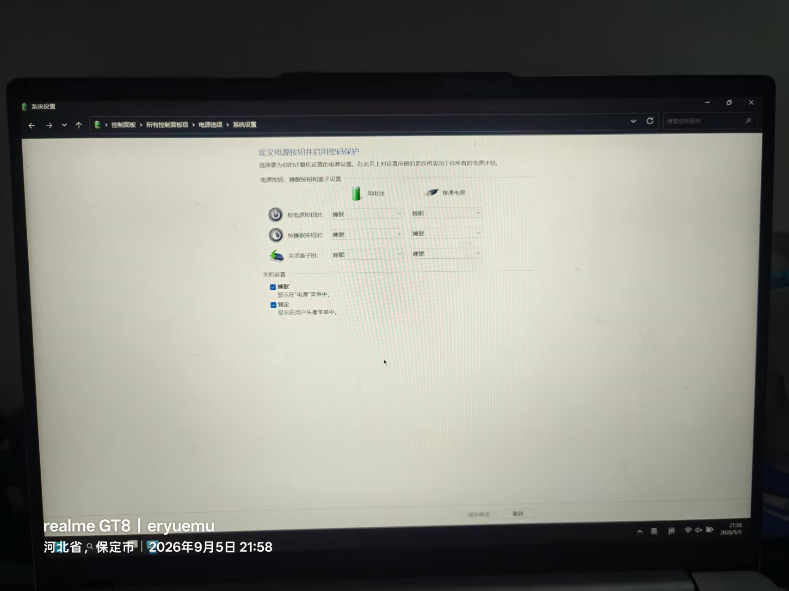
*图 1：控制面板电源设置页——本机休眠已关，快速启动选项根本不出现（21:58）*

## 2. 划分区：磁盘管理失败 → DiskGenius 进 PE 脱机调整

### 2.1 从哪个盘划

C 盘剩 71.6GB、D 盘剩 77.3GB。压 C 盘会导致系统盘见底变红，确定**从 D 盘划 60GB**。容量测算：Fedora 系统本体约 12~15GB，60GB 足够开发工具链 + Flatpak 应用；D 盘扣除后剩约 27GB 缓冲。

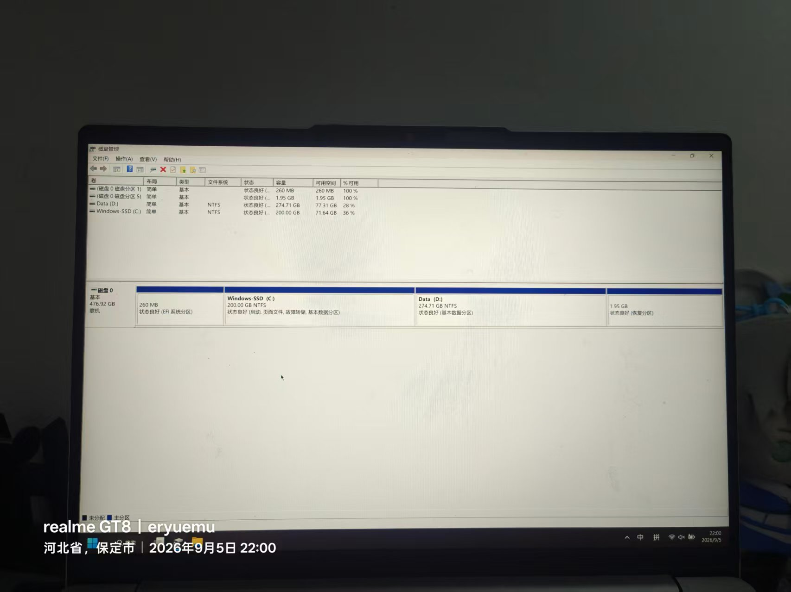
*图 2：划盘前的磁盘管理全景（22:00）*

### 2.2 Windows 磁盘管理的限制

磁盘管理 → D 盘右键压缩卷：**空闲 77GB，只允许压缩 2.5GB**。

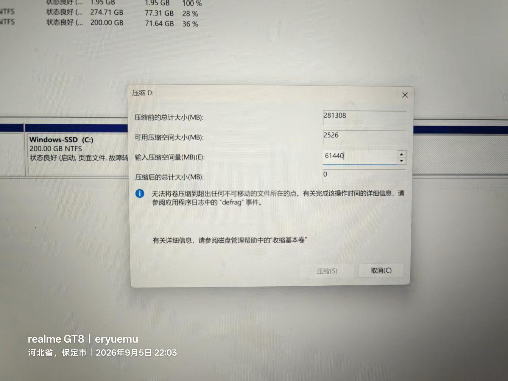
*图 3：输入 61440MB（60GB）后只能压出 2526MB——分区末端存在不可移动的碎片（22:03）*

原因：分区末端存在被占用的数据碎片或系统文件，自带工具不会自动迁移碎片。解法是无损分区工具（自动将末端碎片前移）。

### 2.3 DiskGenius 操作过程

1. 图吧工具箱打开 DiskGenius（硬件检测分类右上角），右键 Data (D:) → 调整分区大小；

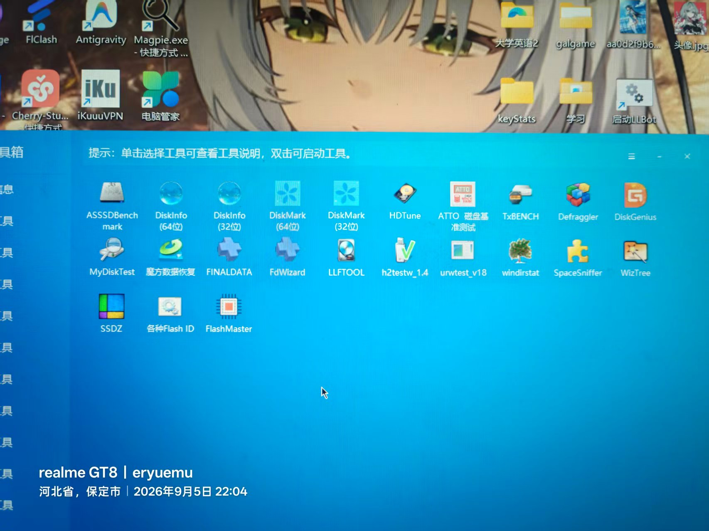
*图 4：图吧工具箱自带 DiskGenius，无需额外下载分区工具（22:04）*

2. "分区后部的空间"填 60 GB，确认"调整后容量"未变红，点开始；
3. 弹出底层修改免责提示 → 插电状态下点"是"；
4. **D 盘被后台软件锁定，无法在线调整** → DiskGenius 提示重启进入临时内存微系统（WinPE）脱机执行。保持默认"完成后：重启 Windows"，点确定；

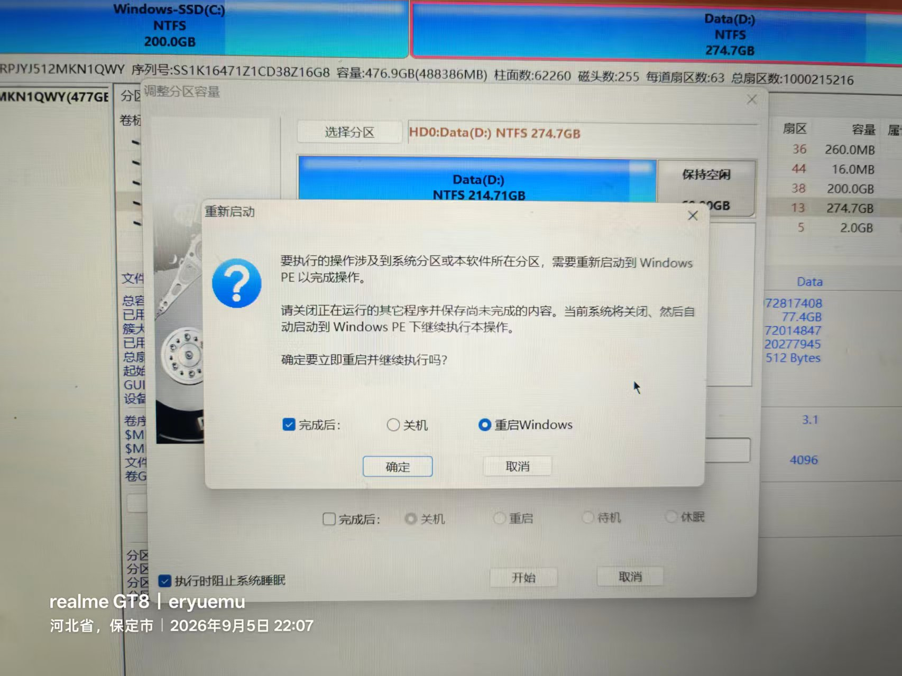
*图 5：D 盘被锁定，需重启进 WinPE 脱机调整（22:07）*

5. 重启前打包 WinPE 等待约 3~5 分钟（卡超 5 分钟说明 WinRE 被禁用，可点 X 取消改从 Fedora Live 里缩盘）；
6. PE 界面显示"剩余时间 0:00:53"，自动完成并二次重启回 Windows；

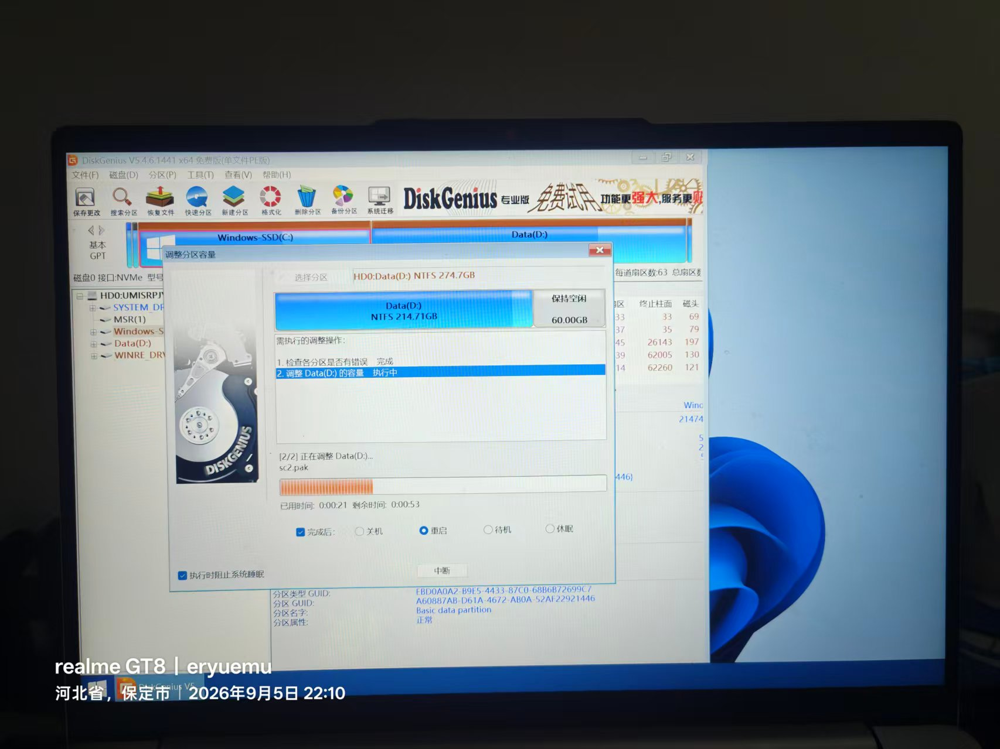
*图 6：WinPE 脱机调整进行中，全程无需干预（22:10）*

7. 磁盘管理确认 D 盘右侧出现 **60GB 黑色"未分配"空间**，保持原样，不新建卷不格式化。

## 3. U 盘引导

1. 插入 Fedora 安装 U 盘，开始菜单 → 重启；
2. 联想 Logo 亮起瞬间连按 F12。**注意小新 14 的 F1~F12 默认为多媒体键，需按住 Fn 狂点 F12**（FnLock 开关在 Esc 键上）；
3. 备选方案（不拼手速）：按住 Shift 点"重启" → 高级选项 → 使用设备（Use a device）→ UEFI USB 启动盘；
4. 启动菜单中 **"Linpus lite (VendorCoProductCode)"** 即 Fedora U 盘——部分主板识别 Fedora EFI 引导文件时显示此名称，属正常现象；

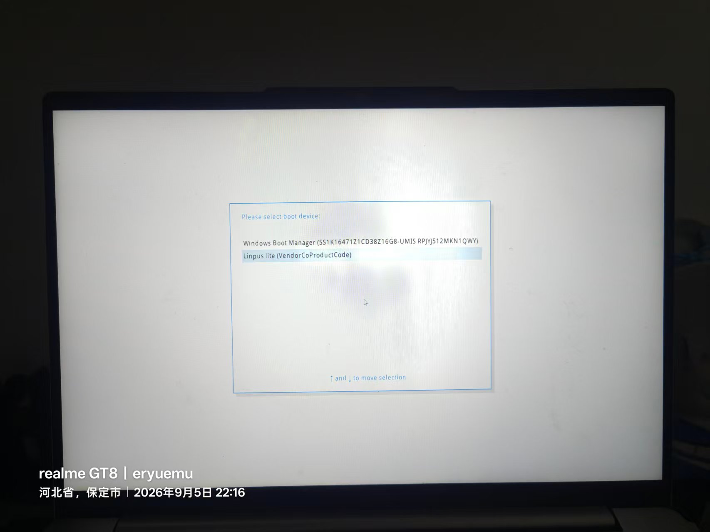
*图 7："Linpus lite (VendorCoProductCode)" 就是 Fedora 安装 U 盘（22:16）*

5. GRUB 菜单选第一项 **Start Fedora-KDE-Desktop-Live**（跳过介质校验），1~2 分钟进入 Live 桌面。

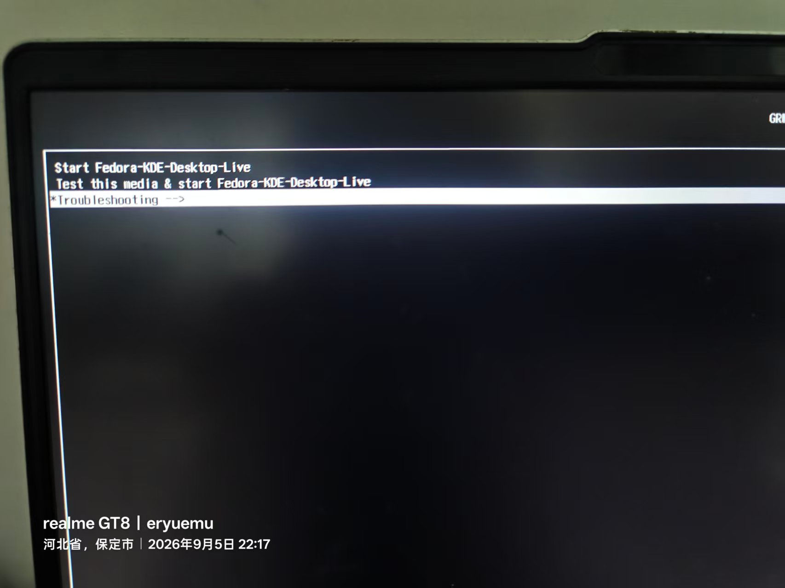
*图 8：选第一项跳过介质校验直接进 Live 系统（22:17）*

镜像为 Fedora KDE Plasma Edition（官方 Spins 之一），非默认的 Workstation/GNOME 版。

## 4. Anaconda WebUI 安装：全程默认 + 三个确认点

新版安装器为向导式页面，语言选简体中文后一路 Next，仅在三个位置确认。

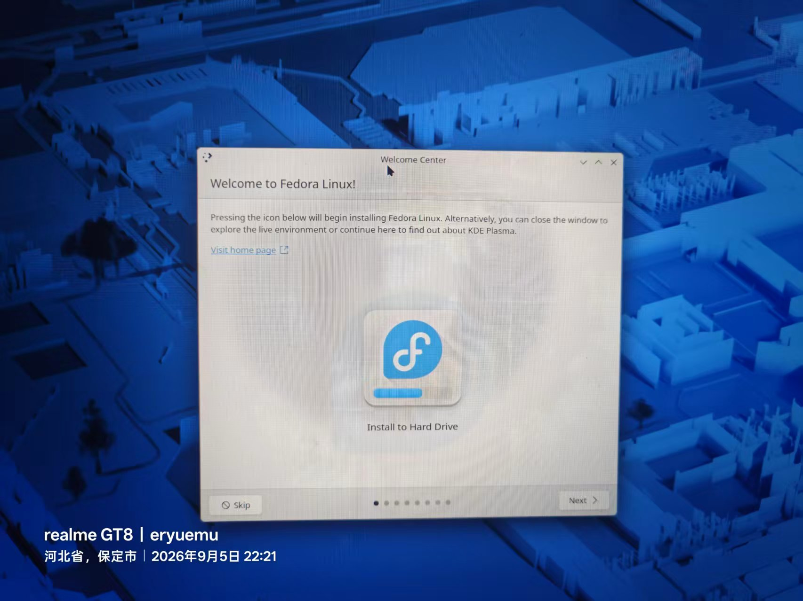
*图 9：Fedora KDE Live 桌面与 Welcome Center（22:21）*

### 4.1 分区策略页

- 选 **Share disk with other operating systems**：自动复用 Windows 的 EFI 分区并注入 GRUB 引导项，不覆盖 Windows 引导文件；
- **Reclaim additional space 不勾**：该项用于未提前划分区时强制回收空间，已有现成 60GB 未分配空间则不需要；
- 到达分区确认页前若弹出 **LUKS 磁盘加密（Encrypt my data）**，保持不勾——双系统日常使用无加密必要。

### 4.2 EFI 260MB 黄色警告

摘要页提示 Windows 预装 EFI 分区 260MB 低于 Fedora 推荐的 500MiB。实际 GRUB 引导文件仅十几 MB，Windows 引导文件几十 MB，**260MB 对双系统绰绰有余**。警告框自带 `Click 'Next' again to proceed despite these warnings`，再点一次 Next 放行。

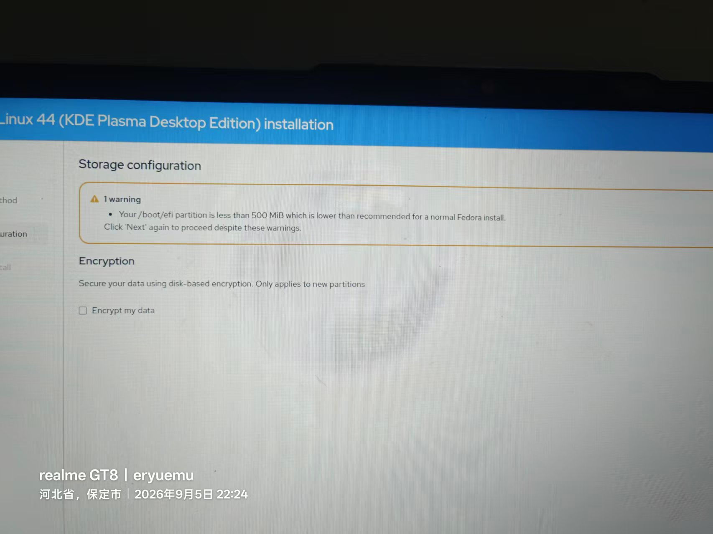
*图 10：EFI 分区黄色警告 + LUKS 加密不勾选，再点一次 Next 放行（22:24）*

### 4.3 分区摘要确认

摘要中 `nvme0n1p1 273 MB format as efi` 易被误解为格式化 Windows 引导分区，实际是 Anaconda WebUI 的统一文本模板，表示挂载类型；该模式为**复用** p1，仅添加 Fedora 引导项。最终布局：

| 分区 | 大小 | 用途 |
|------|------|------|
| nvme0n1p1 | 273 MB | Windows EFI（复用，写入 Fedora 引导项） |
| nvme0n1p2~p5 | — | MSR 16MB / C 盘 / D 盘 / 恢复分区 1.95GB（原样保留） |
| nvme0n1p6 | 2.15 GB | /boot（Linux 内核） |
| nvme0n1p7 | 62.3 GB | Btrfs 主分区（/ 与 /home 子卷） |

编号顺延到 p6/p7 是因为 Windows 已占用 p1~p5。p6+p7=64.45GB 恰好等于 60 GiB：Windows 按 GiB（二进制）显示，安装器按 GB（十进制）显示，60 GiB × 1.074 ≈ 64.4 GB。

语言列表仅有"简体中文（新加坡）"无"（中国）"选项，底层为同一套 UTF-8 中文字库与翻译，装完可在区域设置加回 zh_CN，无实际影响。

### 4.4 写入与重启

点 Install 后 **2~3 分钟完成**（镜像整块写入 + NVMe 速度）。Exit to live desktop → Live 桌面点重启 → **屏幕熄灭瞬间拔 U 盘**（防止再次 U 盘引导）→ 自动进入 GRUB 菜单。

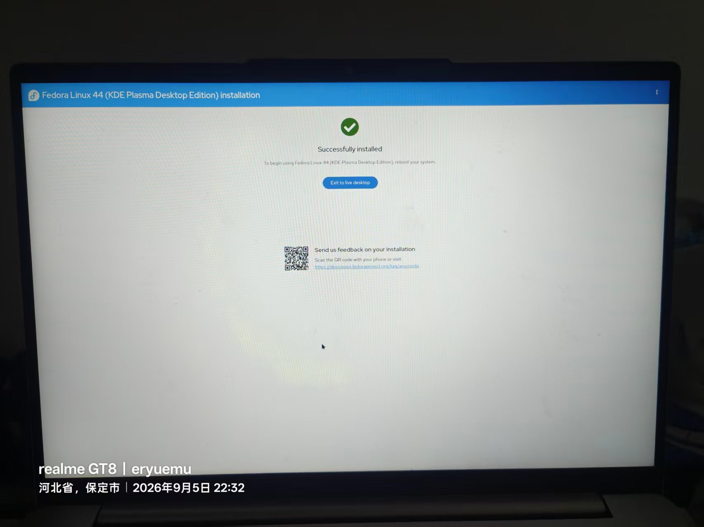
*图 11：Successfully installed——镜像整块写入 2~3 分钟完成（22:32）*

## 5. 首次开机与初始化

GRUB 菜单四项：Fedora Linux / 0-rescue（救援模式）/ Windows Boot Manager / UEFI Firmware Settings。

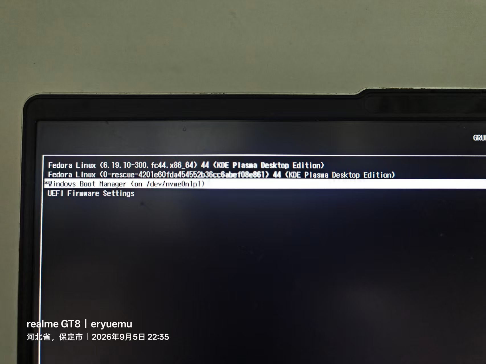
*图 12：GRUB 双系统菜单生成——双系统安装成功的标志（22:35）*

初始化向导配置：

- 用户名 `eryuemu`（全小写无空格），该密码同时是 sudo 密码；
- 主机名 `fedora-xx14`，终端提示符为 `[eryuemu@fedora-xx14 ~]$`；
- 时区选 **Shanghai**——tzdata 中中国标准时间的标准代号即 Asia/Shanghai，非选错城市；
- 若出现第三方软件源（Third-Party Repositories）页建议勾选开启。

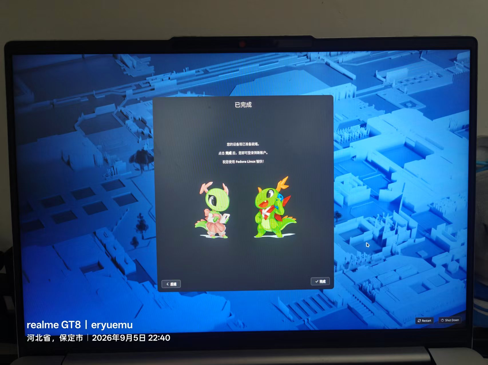
*图 13：初始化向导完成，欢迎使用 Fedora Linux（22:40）*

## 6. 装后必做配置

### 6.1 双系统 8 小时时差修复

Windows 将主板硬件时钟视为本地时间，Linux 默认视为 UTC，来回切换系统即错乱 8 小时。让 Linux 迁就 Windows：

```bash
timedatectl set-local-rtc 1 --adjust-system-clock
```

验证：`timedatectl` 输出含 `RTC in local TZ: yes`。

### 6.2 DNF 提速

```bash
echo 'max_parallel_downloads=10' | sudo tee -a /etc/dnf/dnf.conf
echo 'fastestmirror=True' | sudo tee -a /etc/dnf/dnf.conf
```

多线程并发下载 + 最快镜像自动选择。因日常开代理（Clash Verge，TUN 全局接管），未额外更换国内软件源。

### 6.3 高分屏分数缩放：KDE Wayland 直接可用

桌面右键 → 配置显示设置 → 缩放（Scale）设为 125% 或 150% → Apply → 倒计时内点"保留此配置"。**应用矢量栅格化，字体图标清晰，无需再调字号**。

原理对比（对同为 Wayland 的 Ubuntu GNOME）：

- **KDE (KWin)**：适配 Wayland 原生分数缩放协议 `fractional-scale-v1`，直接通知应用以目标倍率做矢量光栅化；Qt 6 桌面组件全矢量渲染；
- **GNOME (Mutter)**：非整数倍缩放策略为"向上取整再缩"——150% 时先按 200% 渲染再算法缩小，损耗性能且发虚，因此 GNOME 常见做法是 100% 缩放 + 单独调文本缩放因子。

### 6.4 Fn 快捷键开箱即用的原因

音量（F2/F3）、亮度（F5/F6）直接可用，同款流程在游戏本（七彩虹隐星 P16 Pro，Ubuntu GNOME）上不可用。差异来自四层：

1. 联想在 Linux 主线内核有官方维护平台驱动 **ideapad_laptop**，Fn 组合键经 ACPI/WMI 转为标准内核事件（KEY_VOLUMEDOWN、KEY_BRIGHTNESSUP）；
2. 纯核显机型背光走标准接口 `/sys/class/backlight/intel_backlight`，i915/xe 驱动支持完善；
3. 游戏本多为公版模具 + 私有 EC（嵌入式控制器）协议，Fn/背光/风扇被 EC 拦截，厂商仅提供 Windows 闭源控制中心，Linux 收不到标准扫描码；
4. Fedora 采用最新主线内核（6.19），新硬件 ACPI 补丁合入快。

### 6.5 关于 KDE 与 GNOME 的版本确认

Fedora Workstation（官网默认大按钮）为原生 GNOME（无任务栏/Dock，纯活动概览交互）；本次镜像为 **Fedora-KDE-Desktop-Live**，属官方 Spins 独立桌面版本，U 盘菜单、安装器标题、GRUB 引导项均标注 KDE Plasma Desktop Edition。KDE 默认提供底部任务栏 + 开始菜单 + 系统托盘，从 Windows 迁移学习成本最低。

Ubuntu 同样可加装 KDE 共存：`sudo apt install -y kde-plasma-desktop`，安装问询框保留 gdm3，注销后在登录界面齿轮处切换 Plasma (Wayland) 会话；游戏本独显下若 Wayland 卡顿，切 Plasma (X11) 通常可解。

## 7. Trae 安装：arm64.deb 翻车与正确姿势

首次下载误选 **arm64.deb**，双重错误：

| 错误 | 说明 |
|------|------|
| 架构 | `arm64` 为手机/树莓派/Apple Silicon 架构，本机需 x86_64（x64/amd64） |
| 格式 | `.deb` 为 Debian 系格式，Fedora 原生为 `.rpm` |

删除后重下 `TraeCode_CN-linux-x64.rpm`，在下载目录打开终端执行：

```bash
sudo dnf install -y ./TraeCode_CN-linux-x64.rpm
```

用 dnf 安装本地 rpm 可自动补全依赖。输出 `Complete!` 后，应用菜单"开发"分类出现 Trae 图标。

## 8. Discover 与 Flathub：Fedora 无 Snap

Discover 为 KDE 官方应用商店：图形化装软件、通过 fwupd/LVFS 更新 UEFI 固件、下载主题与小部件。

Fedora 默认**不含 Snap**，主推 Flatpak（Red Hat 与社区主导，全开源，冷启动更快；Snap 商店服务端闭源且挂载产生大量 loop 虚拟分区）。接入最大 Flatpak 仓库 Flathub：

```bash
flatpak remote-add --if-not-exists flathub https://dl.flathub.org/repo/flathub.flatpakrepo
```

完成后 Discover 可直接搜索安装微信、QQ、WPS 等国内常用软件。

## 9. 小结与遗留

本篇流程全部一次通过，系统进入可用状态：双引导正常、时差修复、缩放清晰、Trae 就位。

遗留一件事：中文输入法。Fedora KDE 无预装输入法，安装 Fcitx5 的过程引出了一场持续整晚的黑屏死锁故障，完整排查与根因分析见下篇《一次注销引发的血案》。
