# 联想小新 14 装 Fedora 44 KDE 双系统全记录（下）：一次注销引发的血案

> **症状**：Fedora 44 KDE 新装系统，安装中文输入法后第一次点击注销，进度卡死 → 强制断电后开机卡在 Fedora logo/黑屏白光标 → `Ctrl+Alt+F3` 切不出 TTY，键盘输入完全失效，但 CapsLk 灯能亮灭。
> **对比**：刚装完系统第一次开机可正常进桌面，仅"注销"这一动作触发崩溃。
> **排查方式**：Gemini 全程指导，前半程反复重启服务试错（约十几次强制断电），后半程改为纯文本模式只读取证。
> **根因**：kwin 已被事务连带升级至 6.7.4，其依赖的锁屏库 kscreenlocker 仍为 6.6.4——kwin 对 kscreenlocker 为**无版本号裸依赖**，ABI 不匹配，动态链接器报 `undefined symbol`，所有图形核心进程启动即 SIGABRT。
> **修复**：`dnf upgrade` 对齐两者至 6.7.4 + 全系统 1730 包全量更新。
> **最终状态**：系统还原为出厂默认（plasmalogin 登录管理器，排查期安装的 sddm 六包全部卸载），输入法 fcitx5 正常自启。

关联阅读：[上篇：安装篇](/blog/lenovo-xx14-fedora-kde-dual-boot-install-recap)

---

## 0. 结论速览（先看这个）

| 项目 | 结论 |
|---|---|
| 崩溃表现 | kwin_wayland / plasmashell / kded6 / plasma-login-greeter 启动即 SIGABRT，屏幕黑屏白光标 |
| 直接报错 | `kwin_wayland: symbol lookup error: /lib64/libkwin.so.6: undefined symbol: _ZN12ScreenLocker7KSldApp14inhibitSuspendEv` |
| 根因 | kwin 6.7.4 与 kscreenlocker 6.6.4 版本脱节；kwin → kscreenlocker 是无版本号裸依赖，事务升级时未同步 |
| 版本脱节来源 | 安装输入法时的大事务（一次性 305 包）连带升级 kwin；非后台自动更新（本机未装 PackageKit/dnf-automatic） |
| 为什么第一次注销才炸 | 旧桌面进程驻留内存正常运行；注销 = 结束内存进程 + 从硬盘重新拉起登录界面，读到新 kwin + 旧 kscreenlocker 组合即崩 |
| 为什么键盘全失灵 | 显示管理器启动时先独占 DRM/KMS 显示输出与 evdev 输入设备，渲染进程随后崩溃，控制权未归还 |
| 修复命令 | `sudo dnf upgrade --refresh -y kwin kscreenlocker plasma-workspace` → 验证 `kwin_wayland --version` |
| 排查关键转折 | 放弃重启试错，GRUB 加 `3` 进纯文本 + `coredumpctl list` + 直接运行二进制让动态链接器报真错 |
| 次日修正 | Gemini 两个结论被推翻：sddm 并非出厂默认（出厂为 plasmalogin，已还原）；不存在后台自动更新 |

## 1. 起因：装完输入法，第一次点注销

承接上篇：系统装完、基础配置完成，进入输入法安装。Fedora KDE 无预装中文输入法，KDE Plasma 下集成度最好的方案是 **Fcitx5（小企鹅输入法 5）**。AI 最初给的是精简版三条（`fcitx5 fcitx5-chinese-addons kcm-fcitx5`），后来补全为完整五件套（加 GTK/Qt 桥接，保证在非 Qt 应用里也能正常唤起）：

```bash
sudo dnf install -y fcitx5 fcitx5-chinese-addons fcitx5-gtk fcitx5-qt kcm-fcitx5
```

配置三步：System Settings → Keyboard → **Virtual Keyboard** → 选中 Fcitx 5 → Apply；**Input Method** 页确认含 **Pinyin**，没有就 Add；**注销重新登录生效**，之后 `Ctrl + 空格` 切换中英。装完托盘区出现键盘/小企鹅图标即成功，后续微调可用 `fcitx5-configtool`。

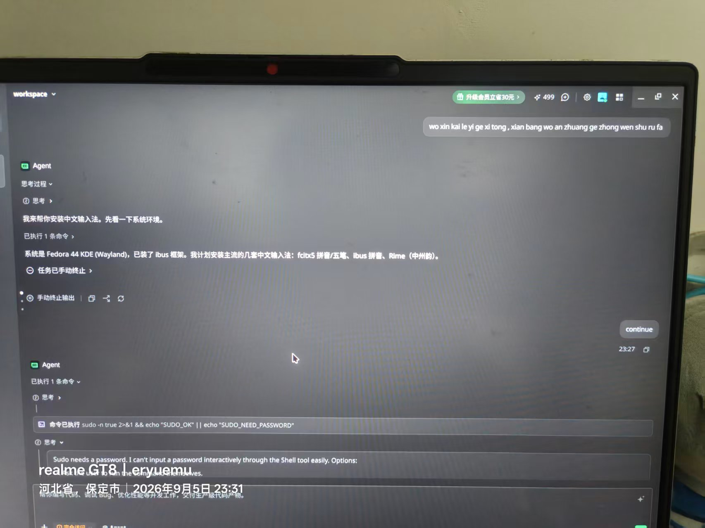
*图 1：装输入法的请求本身平平无奇，AI 连 sudo 都先探测了一圈（23:31）*

事后看，这一步的安装事务就是伏笔：它一次性拉起 **305 个包**（输入法框架 + GTK/Qt 桥接 + 大量连带依赖），kwin 在其中被连带升级到 6.7.4，而 kscreenlocker 停在 6.6.4。注销是这套残缺组合第一次被从硬盘完整加载的时刻。

## 2. 第一回合：注销卡死与常规三板斧

注销进度卡住。按轻中重处置：

1. **按 Esc** 看是否出现 `A stop job is running for... (XXs / 1min 30s)` 的等待超时——正常情况下等 90 秒倒计时结束会自动完成退出，这次没有；
2. `Ctrl + Alt + F3` 切 TTY —— 失败；
3. 长按电源键 8~10 秒强制断电。

重启后**开机卡在 Fedora logo 动画**，黑屏。图形登录器在拉起 Wayland 会话时受阻，内核与底层服务实际已启动。进入长达数小时的排查。

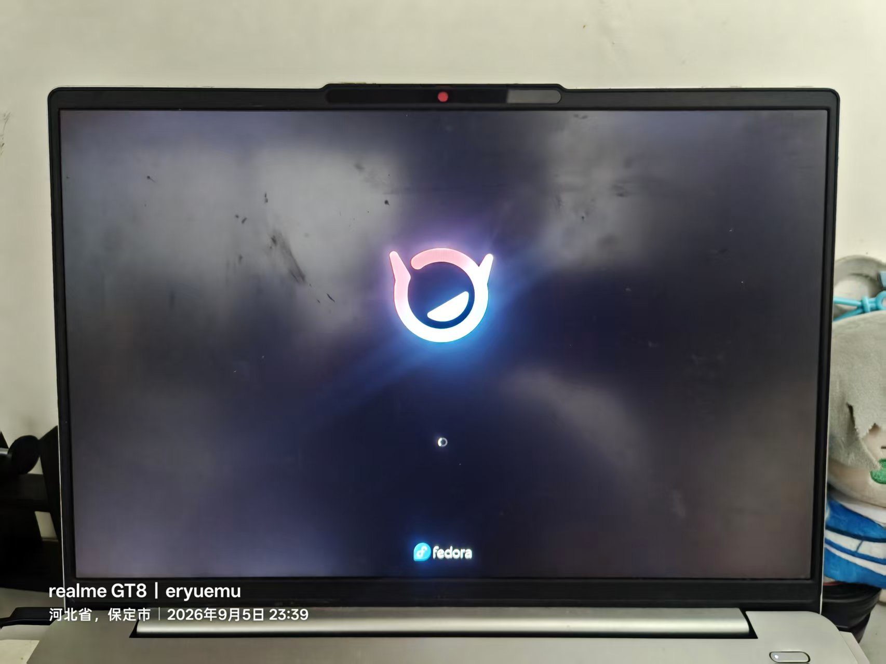
*图 2：开机卡 logo，图形登录器拉起 Wayland 会话受阻（23:39）*

## 3. 第二回合：TTY 恢复尝试与两个关键现象

### 3.1 FnLock 陷阱：组合键按了没反应的第一个原因

小新 14 的 Esc 键带 FnLock 指示灯。灯灭 = F1~F12 默认为多媒体键，按 `Ctrl + Alt + F3` 实际发出的是 `Ctrl + Alt + 音量减`，自然毫无反应。正确姿势二选一：

- **方法 A**：加 Fn 一起按，`Fn + Ctrl + Alt + F3`；
- **方法 B**：先按 `Fn + Esc` 点亮 FnLock（切为标准 F 键模式），再按 `Ctrl + Alt + F3`。

### 3.2 CapsLk 判断法：内核是死是活

按 CapsLk 看指示灯：**能正常亮灭 → 内核活着，只是输入被拦截；完全不亮 → 显卡驱动/内核真死锁，只能强制断电**。后续排查中该判断法反复使用，多数时候灯能亮灭——系统没死，但按键被吞。

### 3.3 找到真正的显示管理器：plasmalogin

`Fn + Ctrl + Alt + F3` 进 TTY，看到久违的黑底白字：

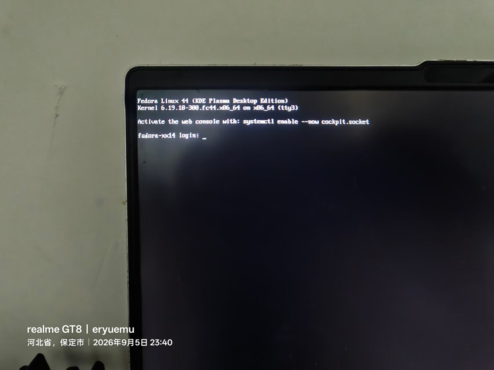
*图 3：TTY 文本登录界面——键盘在这里 100% 正常（23:40）*

输入用户名 `eryuemu`、密码盲打（不回显）登录后，按"AI 给的直觉方案"重启显示服务：

```bash
sudo systemctl restart sddm
```

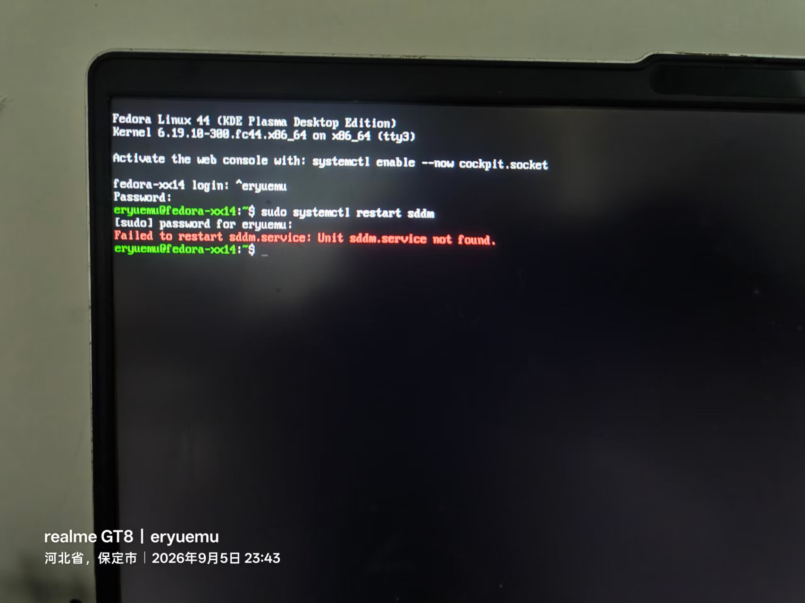
*图 4：sddm.service 不存在——这套系统的登录管理器另有其人（23:43）*

红字 `Failed to restart sddm.service: Unit sddm.service not found.`——Fedora 44 新版 KDE 换用了全新的登录管理器。改用 Linux 通用代称：

```bash
sudo systemctl restart display-manager
systemctl status display-manager
```

状态页显示真身是 **plasmalogin.service**（Plasma Login Manager），日志尾部一行关键报错：

```
plasmalogin-helper[1701]: Auth: plasmalogin-helper exited with 64
```

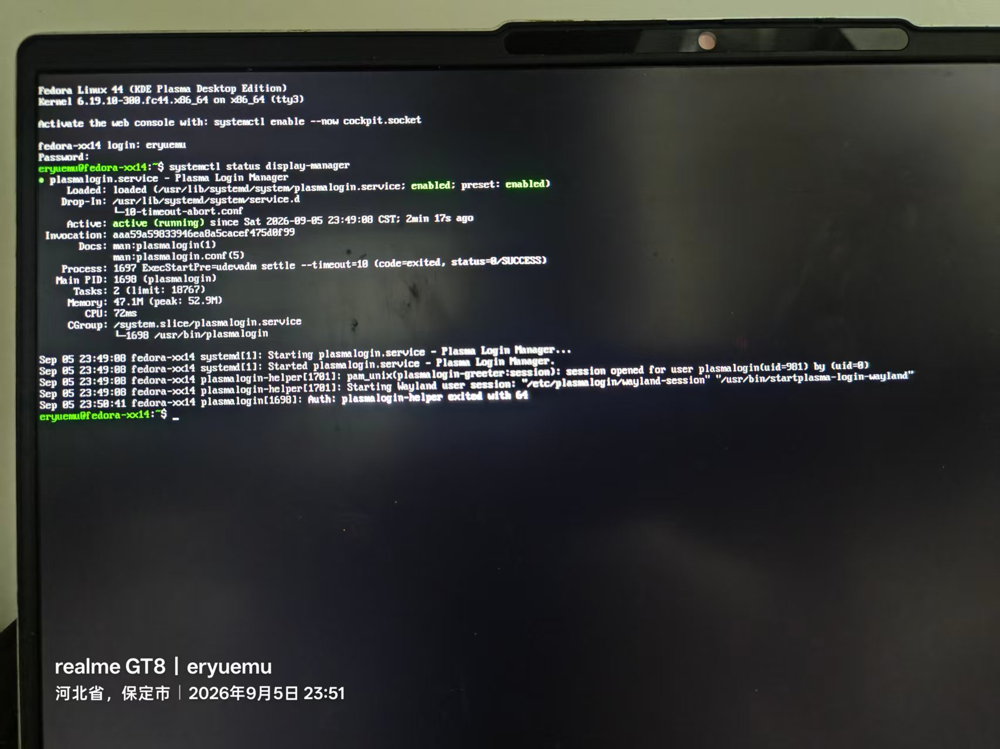
*图 5：真身是 plasmalogin.service，日志尾部 exited with 64（23:51）*

即图形登录组件在注销后重新拉起 Wayland 画面时异常退出，而开机动画（Plymouth）又把屏幕占住了，两头堵死。对应处置：

```bash
sudo plymouth quit                  # 杀开机动画，释放显卡通道
sudo systemctl restart plasmalogin  # 重启正确服务
sudo chvt 1                         # 手动切回图形通道（1 号黑屏再试 chvt 2）
```

中间还有个手滑插曲：把 `plymouth` 敲成了 `playmouth`，得到 `sudo: playmouth: command not found`。

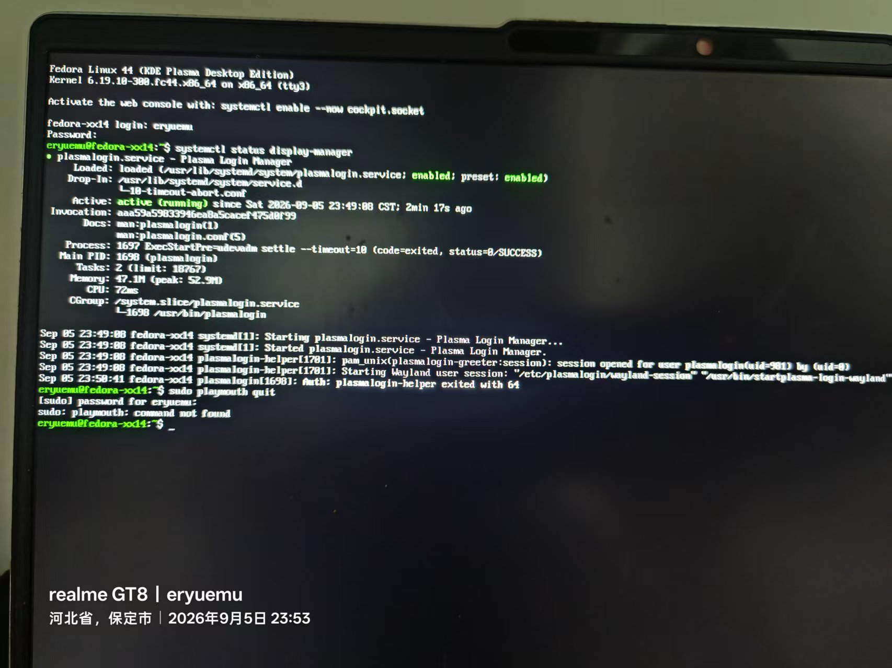
*图 6：playmouth: command not found——TTY 手打命令记得逐字符核对（23:53）*

### 3.4 键盘假死的原理

执行 `restart plasmalogin` 之后诡异的事情来了：命令行"卡住"敲不了字，`Ctrl + Alt + F1/F2` 也没反应，但 **CapsLk 灯还能亮灭**——内核活着，键盘输入却被吃了。

原因：显示管理器启动第一步就向内核**独占接管 DRM/KMS 显示输出与 evdev 输入设备**，随后其 Wayland 组件崩溃（exited with 64），进程死在半空中，控制权没人归还——表现为"整机假死"，实际内核存活。此时退出方式：**轻按一下电源键（1 秒内松开）**，内核还活着时会收到 ACPI 电源键事件走正常安全关机流程；等 10~15 秒无动静再长按 8~10 秒强制断电。

## 4. 第三回合：纯文本模式 + 手动拉起桌面

### 4.1 GRUB 加 3 进文本模式

为绕开图形登录器抢键盘，重启时在 GRUB 菜单（光标停第一项 Fedora，**不要按回车**）按字母 `e` 进入编辑，方向键找到 `linux` 开头那行，按 **End 键**（或一直按右方向键）跳到行尾，空格后加一个数字 `3`，按 `Ctrl + X`（无反应按 `Fn + F10`）引导——跳过一切图形登录器，开机跑完日志直接停在 TTY，键盘 100% 正常。备选：行尾删掉 `rhgb quiet` 看滚屏日志，或加 `plymouth.enable=0` 禁用开机动画。

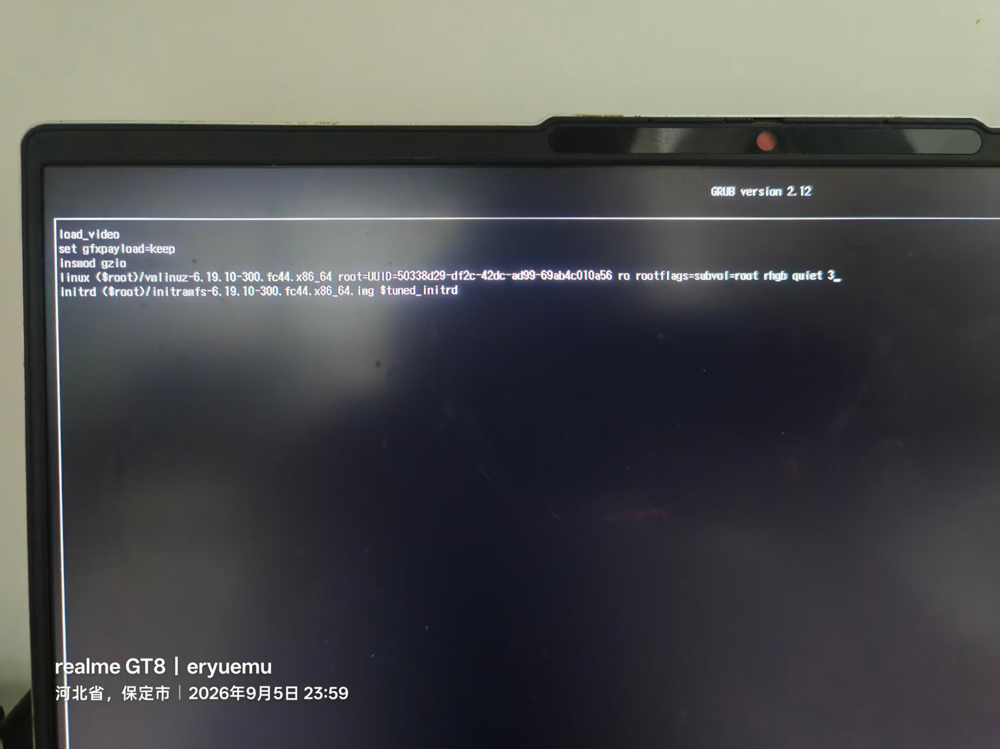
*图 7：GRUB 按 e 编辑启动参数，行尾加 3 进入纯文本模式（23:59）*

> 注意：GRUB 按 `e` 的修改**只对本次启动生效**，写在内存里不落盘，每次重启后恢复原样——这是机制不是故障。

### 4.2 startplasma-wayland 秒退

TTY 中直接执行 `startplasma-wayland` → `Shutting down... Done.` 秒退。原因：KDE Plasma 6 深度依赖后台 **D-Bus 会话总线**，裸敲检测不到会话环境。换：

```bash
dbus-run-session startplasma-wayland
```

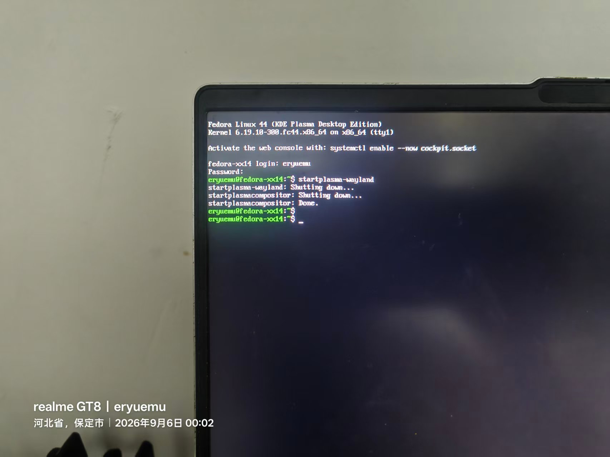
*图 8：裸敲 startplasma-wayland 秒退——缺 D-Bus 会话总线（00:02）*

这次不秒退了，改为日志刷屏占住前台（xdg-desktop-portal 一路 CRITICAL/WARNING：`Failed to create global_shortcuts prog!`、`screen cast prog`、`USB prog` 全部 StartServiceByName 失败），`Ctrl + C` 退出。此时 AI 给出一条后来成为翻盘关键的建议：**直接验证组件本身**——`kwin_wayland --version`，看输出版本号还是缺库报错。

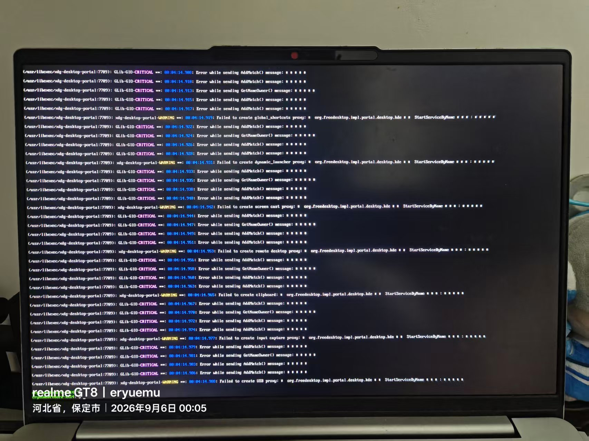
*图 9：手动拉桌面时 xdg-desktop-portal 报错刷屏（00:05）*

## 5. 第四回合：换装 SDDM 与连环排除

AI 判断 plasmalogin 过新存在冷启动时序 Bug（"显卡节点还没完全就绪时过早启动导致闪退"），方案为替换为业界最成熟的 SDDM：

```bash
sudo dnf install -y sddm
sudo systemctl disable plasmalogin && sudo systemctl enable --now sddm
```

重启仍卡。原因：Fedora 44 已彻底移除旧时代 X11 图形通道，纯靠 Wayland 运行，光装 sddm 本体缺少专属 Wayland 接口，且接管软链接需要 `--force` 强制覆盖：

```bash
sudo dnf install -y sddm sddm-kcm sddm-wayland-plasma
sudo systemctl enable --force sddm.service
```

TTY 里没网的话先连 Wi-Fi 再装：`ping -c 3 baidu.com` 测连通性，不通则 `nmcli device wifi connect "WiFi名" password "WiFi密码"`。

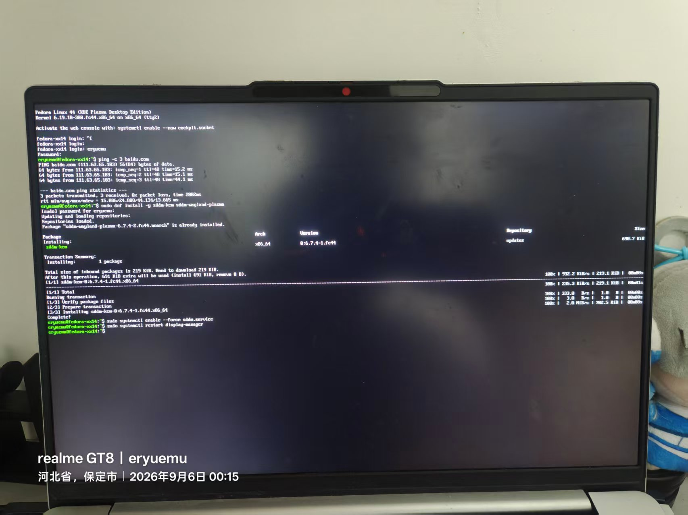
*图 10：补齐 SDDM 的 Wayland 配套组件（00:15）*

期间把问题截图发到了群里（群聊时间 00:06~00:18，一边排查一边还惦记着"修完明天还早八"）：

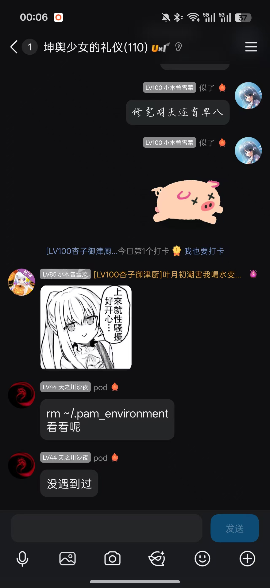
*图 11：把症状发到群里求援（00:06）*

群友"天之川沙夜"给出 Linux 圈的高频经验建议——`rm -f ~/.pam_environment`。逻辑很合理：90% 的"登录界面闪退（Exit 64 报错）"都是新手配置 Fcitx5 时把 `GTK_IM_MODULE=fcitx` 这类环境变量写错位置导致的。

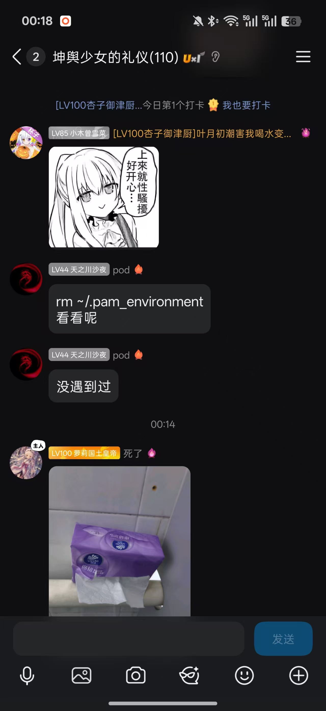
*图 12：群友建议的完整上下文（00:18）*

顺手完成的一组排除（均非根因，但属于标准清理项）：

| 排除项 | 操作 | 结果 |
|---|---|---|
| pam_environment | `rm -f ~/.pam_environment` | 文件本就不存在——本机从未配置过输入法环境变量，经验主义背锅侠 |
| Plasma 缓存 | `rm -rf ~/.cache/plasma*` | 无效，缓存会自动重建；首跑 `rm -f` 还报 `Is a directory`（目录要加 `-r`） |
| /etc/environment | `cat /etc/environment` | 空文件。冷知识：PAM 读取该文件**不支持 `export` 关键字**，写入会导致登录器加载环境时瞬间崩溃——这是配置 Fcitx5 的高频雷区，因此清理它是正确的防御操作，只是这次问题比配置文件更深一层 |

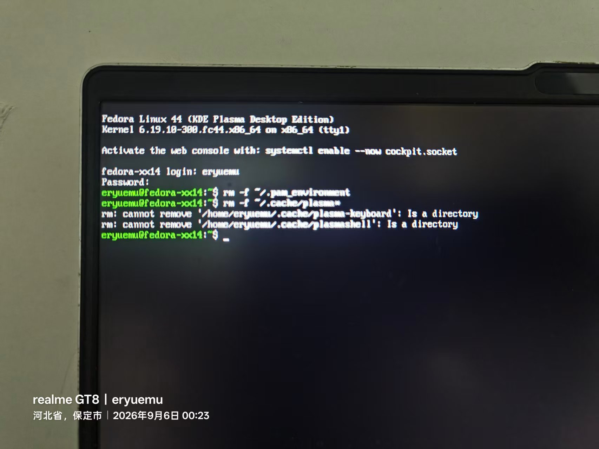
*图 13：按群友建议清理环境变量文件与桌面缓存（00:23）*

SDDM 路线最大的干扰项藏在日志里——多个 Boot 会话反复出现同一组记录：

```
The configured theme "01-breeze-fedora" doesn't exist, using the embedded theme instead
pam_unix(sddm-greeter:session): session opened
pam_unix(sddm-greeter:session): session closed
```

`session opened` 与 `session closed` 出现在**同一秒**——greeter 刚打开就崩了。补上缺失的主题包 `sudo dnf install -y sddm-breeze`（`ls /usr/share/sddm/themes` 确认），依然崩。这是个真实存在的伴生小 bug，但不是桌面完全无法启动的根本死因。AI 还准备了 GDM 兜底方案（`dnf install -y gdm && systemctl enable --now --force gdm`），尚未走到即迎来转折。

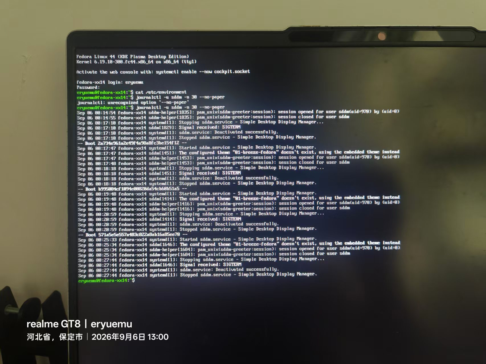
*图 14：反复出现 "01-breeze-fedora doesn't exist"，sddm-greeter 同秒开关（13:00）*

排查期的开机滚屏里还有满屏红色 ACPI 报错（`ACPI Error: No handler or region resolution...`、`AE_NOT_FOUND`）——这类固件层噪音在联想机器上很常见，与本案无关，但第一眼很容易把它当元凶。

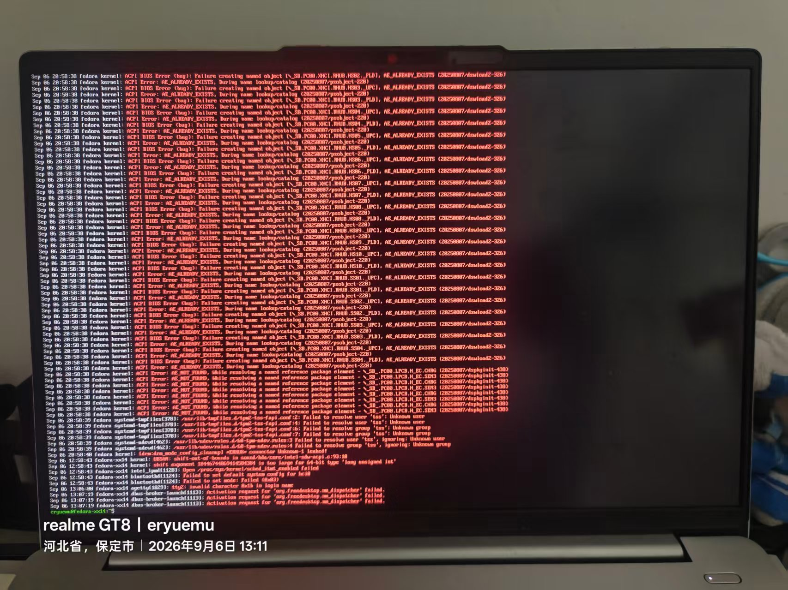
*图 15：滚屏红字吓人，但 ACPI 报错是干扰项（13:11）*

## 6. 转折点：停止试错，只读取证

多轮盲目重启、强制断电十余次后，终于说出"我们能不能别瞎猜啊"。策略随之改变：**不再启动任何图形界面**，把开机默认目标固定在纯文本，然后只读取证：

```bash
sudo systemctl set-default multi-user.target   # 开机默认固定为文本模式，杜绝反复被图形抢占

journalctl -b -1 -u sddm -n 40 --no-pager      # 上一次开机周期的 sddm 日志
journalctl -b -1 -p 3 --no-pager               # 上一次开机所有 Error 级事件
coredumpctl list                               # 核心转储列表
```

`-b -1` 表示读**上一次开机周期**的记录，直接打印黑屏那一次崩溃前的日志。

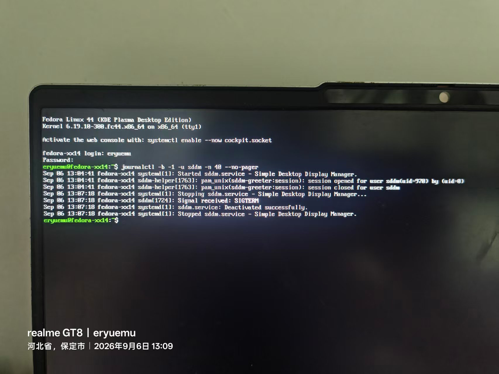
*图 16：读上一轮开机周期的日志——greeter 刚打开就关闭（13:09）*

两个决定性证据：

**证据一：coredumpctl list 显示全家崩溃。**

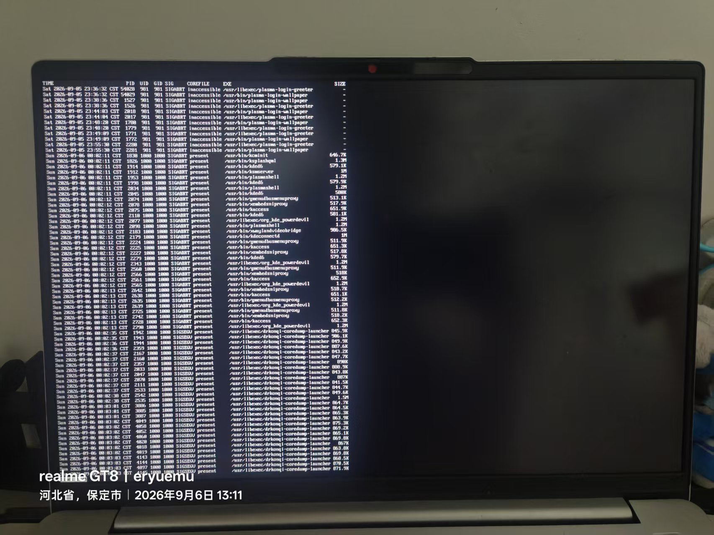
*图 17：核心转储列表——从 plasma-login-greeter 到 kwin_wayland 全家 SIGABRT（13:11）*

```
kwin_wayland           SIGABRT
plasmashell            SIGABRT
kded6                  SIGABRT
plasma-login-greeter   SIGABRT
```

几乎所有 KDE 核心组件步调一致 SIGABRT。SIGABRT 不是硬件卡死，而是程序在启动初始化阶段主动中止（典型于 Qt `qFatal` 报错、缺失底层 .so 动态库、Qt 平台插件加载失败）。显卡、配置文件、单一服务故障全部排除——问题指向公共依赖层。

**证据二：脱离服务包装直接运行二进制。**

```bash
kwin_wayland --version
```

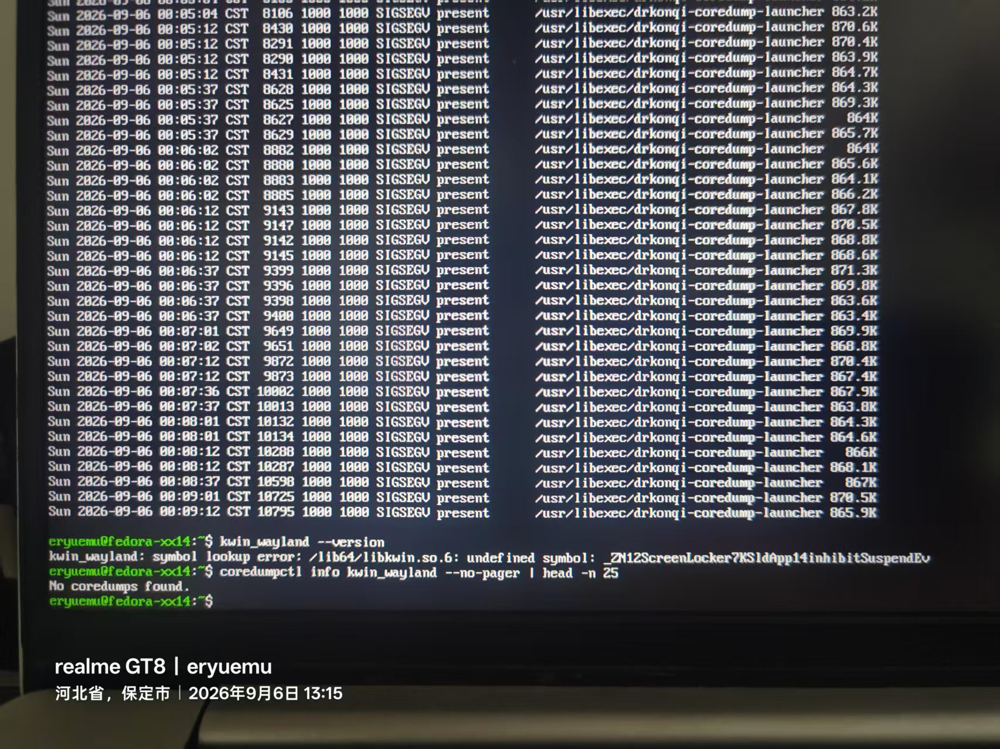
*图 18：动态链接器亲口报出缺失符号——锁屏库版本脱节实锤（13:15）*

```
kwin_wayland: symbol lookup error: /lib64/libkwin.so.6:
undefined symbol: _ZN12ScreenLocker7KSldApp14inhibitSuspendEv
```

`_ZN12ScreenLocker7KSldApp14inhibitSuspendEv` 是 C++ 名字修饰（mangled name），翻译过来就是 ScreenLocker 命名空间里 `KSldApp::inhibitSuspend()` 这个函数——6.7 版 kwin 启动时按新版暗号呼叫锁屏库，6.6 版旧库听不懂，动态链接器当场拒绝。附带一提：紧接着跑的 `coredumpctl info kwin_wayland --no-pager` 返回 `No coredumps found`——转储明细没留存，但 list 的信号列表已足够定性。

## 7. 根因与修复

### 7.1 根因链

```
安装输入法 → 大事务一次性 305 包 → kwin 被连带升级至 6.7.4
→ kwin 对 kscreenlocker 为无版本号裸依赖 → kscreenlocker 停留 6.6.4
→ 6.7.4 kwin 启动调用新版锁屏接口 → 旧库无此符号 → undefined symbol
→ 全部图形核心进程 SIGABRT → 登录器/锁屏无法渲染 → 黑屏死锁
```

关键设计缺陷：kwin 与 kscreenlocker 是强 ABI 耦合组件，但依赖声明**不带版本约束**，包管理器不保证两者同步升级。叠加 Fedora 44 为开发分支、仓库组件逐包推送的时间窗口，构成完整的翻车条件。

### 7.2 修复三步

```bash
# 1. 对齐核心组件
sudo dnf upgrade --refresh -y kwin kscreenlocker plasma-workspace

# 2. 验证（关键检验点）
kwin_wayland --version
# 输出 kwin 6.7.4，不再报 symbol lookup error

# 3. 恢复图形启动并重启
sudo systemctl set-default graphical.target
sudo reboot
```

若升级时提示 `Nothing to do`（已是最新），改用 `sudo dnf reinstall -y kwin kscreenlocker` 重新覆盖脱节的库。

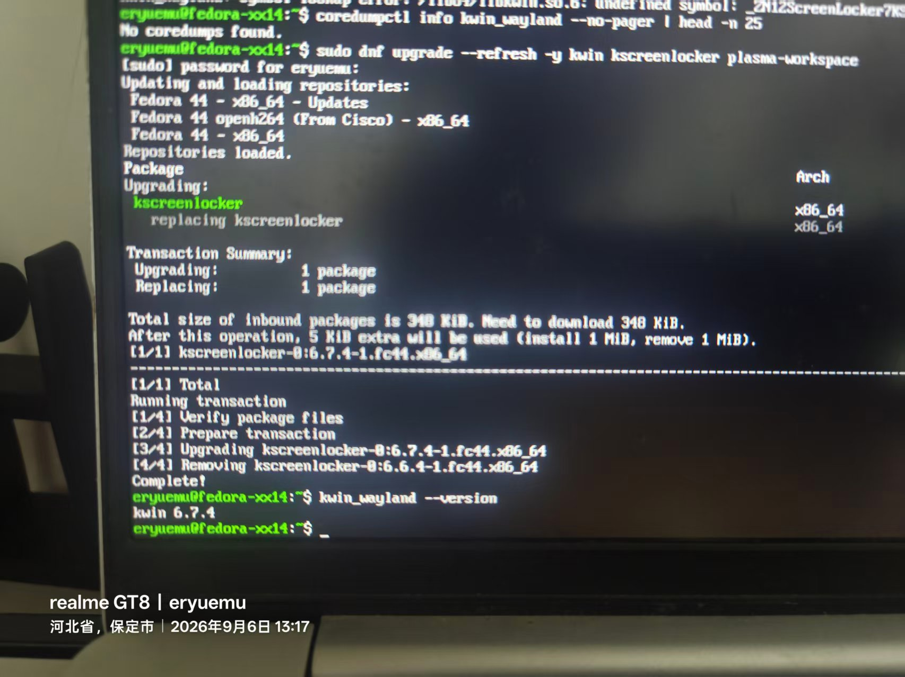
*图 19：kscreenlocker 6.6.4 → 6.7.4，kwin_wayland --version 恢复正常输出版本号（13:17）*

重启后正常进入桌面，系统已从 6.6 整体升到 Plasma 6.7。开机弹出的两扇窗：**欢迎中心**（版本更新引导，右上角 × 关闭）与 **DrKonqi 问题报告**——里面"13 小时之前"的一整列 plasma-workspace、plasmashell、powerdevil、klipper-kded 崩溃记录全是此前几十次启动失败留下的历史核心转储，删掉关闭即可，不用理会。

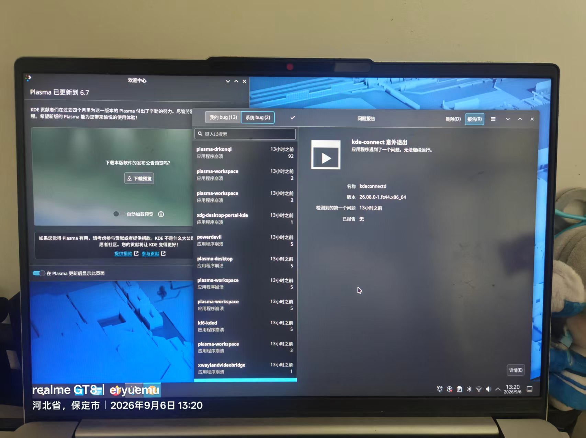
*图 20：桌面恢复，欢迎中心 + 一整屏历史崩溃报告（均为过去式）（13:20）*

### 7.3 全量收尾

为消除其他组件存在同样"半截更新"的可能，跑一次全量同步：

```bash
sudo dnf upgrade --refresh -y
```

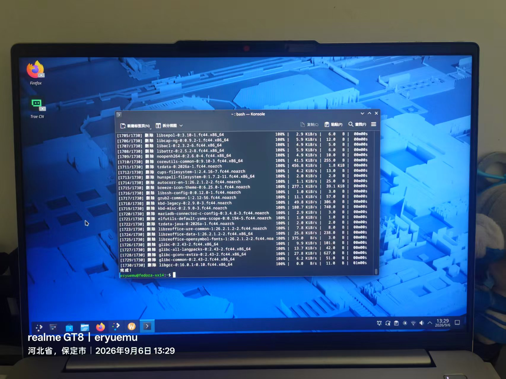
*图 21：1730 个包全量更新完毕，系统进入一致状态（13:29）*

共更新 **1730 个包**（含 glibc、显示协议栈、内核依赖），重启一次让所有新库在内存中全面接管，此后注销、锁屏均不再复现。

## 8. 故障复盘：三个机制问题

**为什么第一次开机正常，第一次注销就崩？** 程序只认其启动那一刻加载进内存的代码。刚装完时镜像自带整套配套的 6.6 旧组件，驻留内存正常运行；随后硬盘上的 kwin 被事务替换为 6.7.4，内存中的旧桌面毫无感知。注销 = 结束内存进程 + **从硬盘重新拉起**登录界面——此刻才加载新 kwin + 旧 kscreenlocker 的残缺组合，当场崩溃。

**为什么键盘彻底失灵？** 见 3.4：显示管理器先独占 DRM/KMS 与 evdev，渲染进程再崩溃，控制权无人归还。这是"看起来像整机冻结、CapsLk 却有反应"的完整解释。

**为什么排查前期全部落空？** 三个干扰项（主题缺失、pam_environment、满屏 ACPI 红字）与一个方法论问题：图形服务崩溃现场随每次启动重建，反复重启服务只能反复得到同样黑屏；转为纯文本 + 只读取证（journalctl -b -1 / coredumpctl / 直接运行二进制）后，两步锁定根因。

## 9. 次日复盘：从"还原 sddm"的疑问开始

黑屏修复后的第二天，回看整个排查过程会产生一个自然的疑虑：为了修这个 bug，系统跟着 AI 动了太多地方——装了 sddm 全家桶、改了开机默认目标、删过缓存和配置文件，其中真正对修复有用的只有对齐 kscreenlocker 的那一条升级命令，其余大多是试错的副产品。疑虑里还有一个具体问题：sddm 是排查时装上去的，现在系统好了，它还需要换回去吗？

于是定下一条还原原则：**除修 bug 必需的改动外，其余全部还原**。带着这个疑问逐项核对（这次的复盘阵型是两台电脑两套 AI 接力：游戏本跑 Antigravity 交叉验证结论，小新 14 本机跑 Trae 执行核对与还原），结果发现 Gemini 收尾时给出的两个结论本身就不成立，还原范围因此比预想的更大。以下是逐项修正。

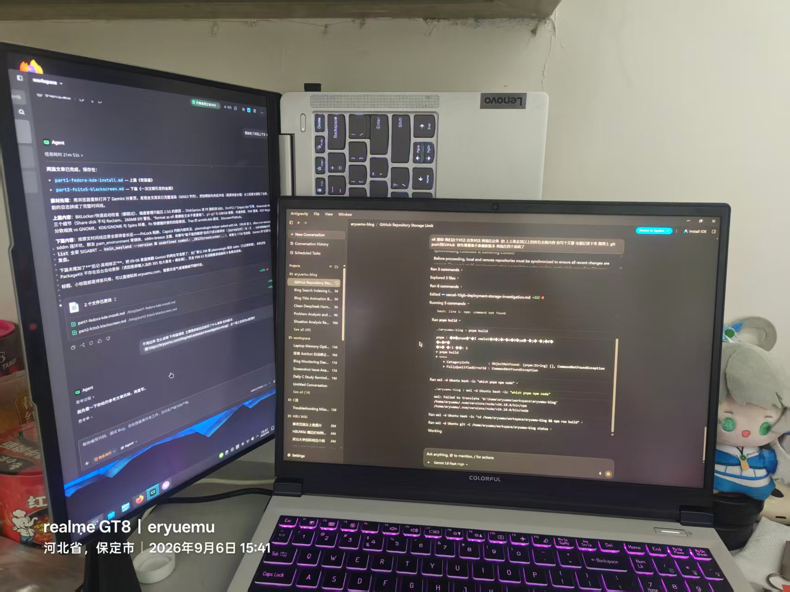
*图 22：两台 AI 接力复盘的现场（15:41）*

### 9.1 "SDDM 本来就是出厂默认" —— 错

关于"sddm 要不要换回去"的疑问，核对后的答案是：不存在"换回去"——sddm 本身就是排查期引入的外来组件，正确做法是彻底移除。Gemini 收尾称 sddm 为 Fedora KDE 出厂默认显示管理器、无需还原（"系统从最开始记录的就是 sddm.service"），实际 **Fedora 44 KDE 出厂默认为新一代 plasmalogin**（plasma-login-manager，`plasmalogin.service`）——即第一轮日志中 `plasmalogin-helper exited with 64` 的主角。systemctl status 里那个 `Drop-In: /usr/lib/systemd/system/service.d/10-timeout-abort.conf` 与 `man:plasmalogin(8)` 的出处也早已说明一切。

还原操作：

```bash
sudo systemctl disable sddm
sudo systemctl enable plasmalogin
sudo dnf remove -y sddm sddm-kcm sddm-wayland-plasma sddm-breeze \
  kde-settings-sddm desktop-backgrounds-compat
```

6 个 sddm 相关包全部卸载零残留，切回出厂的 plasmalogin，重启验证登录正常（根因已修复，出厂组件无再崩理由）。

### 9.2 "后台 PackageKit 自动更新替换了 kwin" —— 也不成立

Gemini 把 kwin 版本被顶上去的原因归给"PackageKit 与 Discover 的后台自动更新"（这也解释了"为什么硬盘文件被替换了当时毫无感觉"）。但检查发现本机**未安装 PackageKit，也无 dnf-automatic，不存在任何后台自动更新**——Gemini 说的那个待办"关闭后台自动更新"实际上无事可做。

翻 dnf 事务历史：kwin 的升级来自安装输入法时那次一次性 **305 包**的大事务。二者结合，诱因就是"装输入法"这个普通操作本身。

### 9.3 附带发现：63 个被连坐删除的 PIM 包

核对包状态时发现此前一次依赖清理中，AI 执行 `dnf remove -y kmime`，因 kmime 是 KDE PIM（个人信息管理）组件的底层依赖，**连坐删除 63 个包**（kmail、kontact、korganizer、kaddressbook、akregator、kleopatra 等）。已全部重装（66 包，约 194MB），并将该套组件列为永不再动项。

### 9.4 输入法与其他收尾

- fcitx5 设为 systemd 用户服务自启，`Ctrl + Space` 切中英，`Ctrl + Shift` 换方案；方案：拼音 / 双拼 / 五笔 / 中州韵（Rime），另装 ibus 智能拼音备用；配置全程**未写入 `/etc/environment`**（环境变量经安全途径注入）；
- Firefox 每次启动跳转 `fedoraproject.org/start`——这是 Fedora 打包时设置的默认主页，不是劫持。地址栏进 `about:preferences#home` → 主页与新窗口改为"Firefox 主页"或"空白页"，启动选项设为"打开先前的窗口和标签页"即可恢复日常习惯；
- 左下角"全部应用程序"约 70 个（KDE 全家桶 + LibreOffice 套件 + PIM 套件 + 系统工具）看着臃肿，但这些应用**不运行就不占内存和后台资源**，体验后再按需卸载即可——KDE 与 GNOME 的设计哲学差异，不是系统负担；
- Clash Verge 已就位（本机 127.0.0.1:7897，TUN 全局接管），后续 1730 包全量更新下载顺畅。

## 10. 教训清单

1. **Fedora 44 为开发分支**，仓库组件逐包推送，存在"A 更新了、B 没更新"的时间窗口；大版本刚发布就装机等于赌仓库同步状态。
2. **强 ABI 耦合组件可能只有裸依赖**（kwin → kscreenlocker 无版本约束），装大组件前后跑 `dnf upgrade --refresh` 拉平全系统可显著降险。
3. **图形全灭的标准排查路径**：CapsLk 灯判内核死活 → GRUB 加 `3` 进纯文本（键盘必可用）→ `coredumpctl list` 看谁 SIGABRT → 直接运行可疑二进制（如 `kwin_wayland --version`）让动态链接器报真错。此链路 20 分钟内可锁定根因，比重启试错快一个数量级。
4. **"键盘失灵"≠死机**：显示管理器独占 DRM/KMS 与输入设备后崩溃，输入信号无人接管；CapsLk 有反应即内核存活，此时轻按电源键（1 秒）可触发安全关机，比直接长按强断更温和。
5. **注销/锁屏是从硬盘重新加载组件的时刻**——"装完好好的、一注销就炸"高度指向硬盘上的库文件版本脱节，而非运行态问题。
6. **小新 14 的 F1~F12 默认多媒体键，FnLock 在 Esc 上**；TTY 组合键失灵先查它。GRUB 按 `e` 的修改仅单次启动生效。
7. **勿向 `/etc/environment` 写 `export`**（PAM 不识别，登录器直接崩），配置 Fcitx5 的高频雷区。
8. **TTY 手打命令逐字符核对**：一个 playmouth（正确是 plymouth）就浪费一轮来回。
9. **经验主义要核对前提**：群友的 pam_environment 建议在 90% 的案例里是对的，但本机根本没配置过那个文件。症状相似 ≠ 病因相同，先取证再用药。
10. **AI 给出的结论也要核对**：本次"sddm 是出厂默认"与"后台自动更新"两个论断均与事实不符；对系统改动保留事务记录（`dnf history`）与还原路径，是第二天能 20 分钟完成修正的前提。

全文完。上篇《[联想小新 14 装 Fedora 44 KDE 双系统全记录（上）：安装篇](/blog/lenovo-xx14-fedora-kde-dual-boot-install-recap)》记录安装与基础配置全流程。
