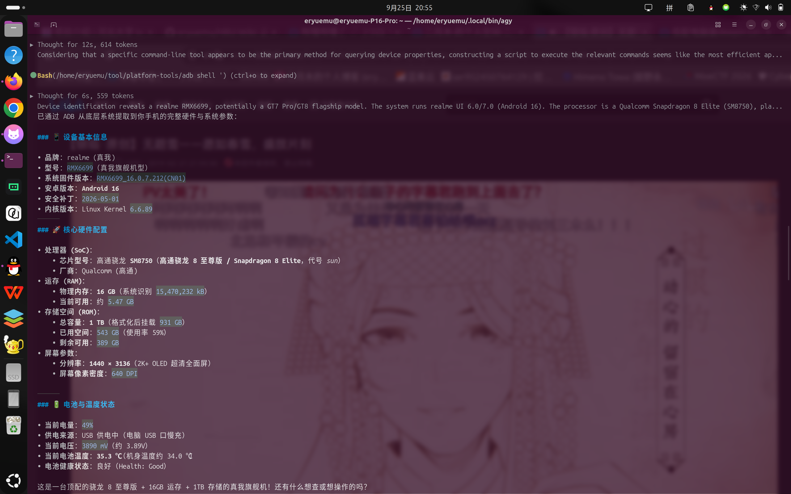

本文记录了一次在 Linux 环境下，通过 USB 数据线将安卓手机（真我 GT8 / RMX6699）接入电脑，利用 Android Debug Bridge (ADB) 实现屏幕捕获、硬件透视，并深度探讨移动端 AI Agent 实现机制的完整技术讨论。针对讨论中提出的所有疑问，逐一说明具体的技术机制与底层原理。

---

## 一、 过程还原：从物理连接到屏幕捕获

### 1. 认知前提：AI 如何“看”到手机
* **疑问**：AI 现在能看到我的手机吗？
* **技术原理**：
  * AI 模型本身运行在计算机终端或云端软件层，没有任何物理摄像头、光学传感器或外部视觉设备的直接访问权限，无法感知物理现实空间中的手机硬件外形与机身。
  * 当手机通过 USB 数据线插入主机后，Linux 内核的 USB 核心子系统（USB Core）负责处理硬件层枚举。通过读取设备的设备描述符（Device Descriptor），操作系统获取到了厂商 ID（Vendor ID: `0x22d9`）与产品 ID（Product ID: `0x2764`），并通过 `lsusb` 命令打印出来：
    ```text
    Bus 001 Device 008: ID 22d9:2764 OPPO Electronics Corp. 真我GT8
    ```
  * 此时仅完成了底层硬件总线的电气连接与设备识别，手机与电脑之间尚未建立应用层数据传输协议。AI 必须依赖 Android Debug Bridge (ADB) 搭建软件通信桥梁，将手机屏幕渲染内容数字化为图像字节流，才能获取针对该手机的“数字视觉”。

### 2. 免安装 ADB 的部署与授权验证机制
* **疑问**：为什么刚开启 USB 调试时，设备状态显示为 `unauthorized`？
* **技术原理**：
  * 本次部署采用了 Google 官方提供的独立免安装版 Android Platform-Tools，直接解压到工作目录即可使用，无需通过 `sudo apt` 提权安装到系统目录。
  * ADB 本质上是一个典型的三层 C/S 架构系统：
    1. **ADB Client（客户端）**：在电脑终端运行的命令行工具，负责接收并解析用户或 AI 的指令。
    2. **ADB Server（服务端）**：电脑后台常驻的守护进程，默认监听 `tcp:5037` 端口，管理所有连接的客户端与目标设备通信。
    3. **adbd（手机守护进程）**：在 Android 系统用户空间运行的后台服务，负责执行来自电脑的指令并回传结果。
  * 为了防止手机遗失或插入不受信任的公共电脑（如充电桩）时数据被静默窃取，Google 从 Android 4.2.2 起引入了基于 **RSA 4096 位非对称加密** 的双向认证协议：
    1. 电脑端 ADB 服务首次启动时，会在本地生成 RSA 密钥对（私钥 `~/.android/adbkey`，公钥 `~/.android/adbkey.pub`）。
    2. 建立连接后，电脑将公钥发送至手机，手机系统检测到该公钥不存在于白名单中。
    3. 手机框架层的 `UsbDebuggingActivity` 会触发系统弹窗，向机主展示该电脑公钥的 SHA256 指纹，强制要求在屏幕解锁状态下人工确认。
    4. 用户勾选“始终允许来自此计算机”并点击确定后，系统将该公钥保存至 `/data/misc/adb/adb_keys` 文件中，连接状态由 `unauthorized` 转为 `device`。在此之前，`adbd` 会死锁所有 Shell 交互与端口转发功能。

### 3. 免 Root 捕获屏幕画面的底层通道
* **疑问**：只插数据线、不进行 Root，为什么能直接截图并识别界面？
* **技术原理**：
  * Android 依托 Linux 内核构建了一套精细的权限分层体系：
    * **普通应用（UID 10000+）**：运行在独立的受限沙盒中，默认无法读取其他应用数据或系统级全局状态。
    * **Shell 用户（UID 2000）**：专为开发者和系统调试预留的特权级别。
    * **Root 用户（UID 0）**：系统级超级管理员。
  * `adbd` 在未 Root 的设备上默认以 `shell` 用户身份运行。在 Android 的图形架构中，所有窗口的渲染图层最终汇集到系统服务 `SurfaceFlinger` 进行帧合成，合成后的图像送入硬件抽象层（HWC）与显示缓冲区（Framebuffer）。
  * Android 系统原生自带的 `/system/bin/screencap` 二进制程序拥有调用 `ISurfaceComposer::captureScreen` 的 Binder IPC 权限。
  * 通过执行 `adb exec-out screencap -p`，电脑端绕过了手机闪存写入（相比传统的先截图存入 `/sdcard/` 再通过 `adb pull` 拉取，避免了不必要的存储介质读写损耗），直接将 `SurfaceFlinger` 的 Framebuffer 实时编码为 PNG 字节流，经由 USB 管道流式传输至电脑本地。随后，多模态大模型直接读取该图像的 RGB 像素矩阵，完成了对屏幕上“开发者选项菜单”、“USB 调试蓝色开关”、“49% 充电状态”、“双 5G 信号”以及“QQ 状态栏通知”的高精度空间定位与文字识别。

### 4. 底层硬件与系统信息采集
* **疑问**：为什么不需要在手机上手动翻找“关于手机”，就能秒级提取详细硬件参数？
* **技术原理**：
  Android 系统基于 Linux 内核，其底层状态直接映射在内核虚拟文件系统与系统属性池中，通过命令行查询比人工在图形界面翻找更直接、信息更无损：
  * **系统属性字典（Property Service）**：Android 的 `init` 进程在启动时，会通过共享内存（`/dev/__properties__`）加载并维护全局系统属性。执行 `getprop ro.soc.model` 能直接返回硬件级代号 `SM8750`（高通骁龙 8 至尊版，内部平台代号 *sun*），`getprop ro.build.display.id` 则直接返回完整的出厂固件构建号（`RMX6699_16.0.7.212`，基于 Android 16）。
  * **内核内存与存储状态**：通过直接读取 Linux 内核虚拟文件系统的 `/proc/meminfo`，绕过所有应用层统计偏差，精准提取出物理 RAM 总容量（`15,470,232 kB`，约 16GB LPDDR5X）。通过 `df -h /data` 查询手机用户数据分区挂载块设备（dm-crypt 加密块），获取格式化后 931GB 的总容量与 389GB 的实际可用空间。
  * **硬件传感器与电源管理**：执行 `dumpsys battery` 会直接向常驻系统的 `batterystats` 服务发起 IPC 查询，实时获取电量计芯片（Fuel Gauge IC）上报的物理传感器参数，包括 `voltage: 3890`（当前电池电压 3.89V）、`PhoneTemp: 340`（机身温度 34.0℃）、`temperature: 353`（电芯温度 35.3℃）以及充电控制器状态。



---

## 二、 核心技术疑问深度解析

### 疑问 1：安卓内核明明是 Linux，为什么给用户的权限这么低？

在桌面 Linux（如 Ubuntu）上，用户是系统的合法主人，终端敲入 `sudo` 即可成为无所不能的 `root`。但在同为 Linux 内核的 Android 手机上，物理持有者却被剥夺了 Root 权限，甚至无法直接查看自己手机的底层目录。这是操作系统设计哲学、安全攻防以及商业博弈共同作用的结果：

#### 1. 权限机制颠倒：“App 即独立 Linux 用户”的沙盒设计
* **桌面 Linux 的用户模型**：所有由当前机主运行的图形软件，其 UID 均继承自登录用户（如 UID 1000）。这意味着你下载运行的任意桌面软件，默认都能读取你的 `~/Documents`、`~/Desktop` 和个人文件。
* **Android 的革命性颠倒**：Google 彻底重构了用户空间设计——**将每一个安装的 App，直接视作一个独立的、互不相识的 Linux 物理用户**。
  * 例如：微信的 UID 被分配为 `u0_a150`（UID 10150），支付宝为 `u0_a151`（UID 10151）。
  * 依托 Linux 原生的自主访问控制（DAC），微信的私有目录权限被强制设为 `rwx------`，其所有者只有 UID 10150。根据操作系统内核规则，UID 10151 试图访问时会直接触发内核级的 `EACCES`（权限拒绝）。
  * 在这套模型下，**真正的“机主（人）”在操作系统层根本没有独立的 Root Shell 账户**。如果开放机主身份，就意味着必须打破这套坚固的 UID 隔离网。

#### 2. 人性防范与“防傻设计”（Grandma Test）
* 电脑的使用者多具备基本的认知能力；而智能手机面向的是全球数十亿完全没有计算机背景的普通大众（老人、儿童）。
* 如果 Android 预留一键 Root 或开放类似 `sudo` 的功能：恶意流氓软件只需设计一个伪装成“系统加速”或“免费领取话费”的弹窗，诱导用户随手点击一次【允许】，恶意进程就会瞬间拿到 UID 0 权限。随之而来的将是静默读取短信验证码、导出相册私照、后台转账的灾难性后果。Google 为了“让任何不懂技术的人使用手机也不会被轻易黑掉”，从出厂策略上直接焊死了用户提权的入口。

#### 3. SELinux 强制访问控制（MAC Enforcing）的内核铁壁
* 哪怕黑客利用系统漏洞暂时取得了普通进程的 UID 0 提权，Android 还部署了第二道防线——**SELinux（安全增强型 Linux）**，且默认处于严格的 `Enforcing` 模式。
* SELinux 采用“默认全拒绝”的类型强制（Type Enforcement）机制：系统内核为每个进程与文件打上安全上下文标签（Security Context）。即使拥有 Root UID，但如果策略规则中没有声明允许该域访问特定资源标签，内核仍会直接拦截并记录审计日志。

#### 4. 商业信任链条：金融机构与数字版权（DRM）的逼迫
* 移动设备承载了当今人类最核心的金融资产（微信支付、支付宝、手机银行）与高价值数字版权（Netflix、Disney+、Apple Music）。
* 金融机构和版权商要求设备必须具备“不可篡改性”：
  * **如果手机开放 Root**：外挂软件可以轻松 Hook 内存篡改转账目标账号；黑客可以抓取 4K 蓝光流媒体在内存中的实时解密密钥。
  * 因此，各大芯片与系统厂商联合建立了 **TEE（硬件可信执行环境）+ AVB（Android 验证启动）+ BL 锁** 的信任体系。设备一旦被 Root，硬件级可信密钥熔断，所有高等级金融支付与高清版权认证即刻失效。

---

### 疑问 2：电脑端 Agent 与手机端独立软件（如 Operit）有什么区别？

在 B 站等极客社区中，常见有开发者使用手机端 App **Operit**（由开发者 AAswordman 开源），通过挂载 MCP（Model Context Protocol）扩展协议对接 DeepSeek 或 Claude，实现让 AI 监控手机屏幕自动完成“B 站硬核会员 100 题”挑战或各类日常打卡任务。两者在系统层面的架构与特性对比如下：

#### 1. 宿主与执行拓扑
* **电脑端 Agent（外部控制器模式）**：
  * **大脑位置**：大模型、任务规划引擎和自动化脚本全部运行在 PC 终端或外部服务器上。电脑拥有独立供电和充沛的 CPU/内存资源，具备完整的 Linux Bash 环境与 Python 工具链。
  * **连接通路**：依赖 USB 物理链路或局域网 Wi-Fi，通过 ADB 协议与手机底层的 `adbd` 通信，手机仅作为“受控终端与传感器源”。
* **Operit（手机内部管家模式）**：
  * **大脑位置**：本身是一个安装在手机内部的 Android `.apk` 应用，在手机本地维护任务生命周期，并通过网络向大模型 API 发起请求。
  * **连接通路**：完全在手机操作系统内部自闭环，依赖 Android 的无障碍服务（AccessibilityService）、媒体投影录屏（MediaProjection）或利用本地无线调试的 Shizuku 服务实现对自身的控制。

#### 2. 屏幕感知方式的技术分水岭
* **UI 控件树解析（Operit 的主打优势）**：
  作为内部应用，Operit 可以直接通过无障碍接口抓取当前界面的 `AccessibilityNodeInfo` 层次树。它拿到的是结构化的文本字段、控件 ID 及坐标边界（Bounds）。
  * *优点*：直接向大模型传递轻量级的纯文本/JSON，响应迅速，极度节省大模型的视觉 Token 消耗。
  * *缺点*：强依赖应用的标准化 Android 原生控件。一旦遇到非原生绘制的页面（如使用 Unity/Unreal 引擎渲染的手游、复杂的 Flutter/Canvas 页面、或者直接将文字绘制在位图上的题目），无障碍树会变成一个无法分解的空节点，此时必须降级为截屏模式。
* **多模态视觉理解（电脑端 ADB 的通用性）**：
  电脑端主要通过抓取无损屏幕位图交由多模态大模型（VLM）进行分析。
  * *优点*：彻底摆脱了应用实现框架的限制，具有完全的通用性，只要人眼能识别的内容（手绘图、验证码、游戏界面、冷门字体），视觉模型均能理解。
  * *缺点*：全分辨率位图传输与高分辨率图像分块（Image Patching）会产生较高的 Token 消耗与网络延迟。

#### 3. 国产系统严苛的“杀后台”机制
* **Operit 面临的生存危机**：
  主流国产系统（如 ColorOS、HyperOS、OriginOS）内置极度激进的功耗与发热监控机制（如智能休眠、应用墓碑、冻结守护）。当 Operit 在手机后台执行高强度的自动化任务（例如调用内置 PRoot Linux 容器、持续监听屏幕事件、并发网络请求）时，极易被系统内核的 Low Memory Killer (LMK) 强制终结，其无障碍服务也常被系统自动撤销。
* **电脑端 Agent 的进程绝对隔离**：
  控制主进程驻留在电脑的内存空间中，手机操作系统无法干预电脑端程序的运行状态，只要物理数据线保持连接，通信链路坚固稳定，不存在被手机系统查杀后台的可能。

#### 4. 风控与账号安全对抗
* 大多数商业 App（如微信、各类手游平台及答题防作弊系统）的客户端 SDK 都会主动扫描系统当前已开启的 `AccessibilityService` 列表与本地运行特征。一旦检测到无障碍辅助高频操作，极易判定为外挂或辅助脚本，导致验证码拦截、答题成绩作废甚至账号封禁。
* 外部 ADB 注入的输入事件由 Linux 内核驱动直接派发，对于 App 进程来说呈现为底层的硬件触摸事件，抗检测能力相对更强。

---

### 疑问 3：解 BL 锁并获取 Root 权限，到底能多做些什么？代价是什么？

“解 BL 锁（Bootloader）”与“Root”常被视作玩机上限，它们在自动化控制场景中的技术分水岭非常明确：

#### 1. BL 锁的作用机制
Bootloader 是设备主板上电后在 CPU 安全区（IROM）初始化完成后加载的第一段引导程序。锁定状态下，它依据 Android 验证启动（AVB 2.0）规范，利用硬件内置的根证书严格校验后续启动链各分区（boot、init_boot、vendor_boot、system）的数字签名。签名异常则直接拒绝加载，防止系统被外部物理刷入后门。解 BL 锁是修补内核（KernelSU）、替换 boot 镜像（Magisk）或刷入第三方恢复环境（TWRP/OrangeFox）的唯一物理前置条件。

#### 2. Root（UID 0）赋予 AI Agent 的 6 大质变能力
取得完整的超级用户权限后，相比当前受限的 ADB（UID 2000），AI Agent 的能力边界会实现质的飞跃：

1. **穿透应用私有数据沙盒（跨应用底层数据库直读）**：
   * 在当前 ADB 权限下，Linux DAC 严格禁止跨越 `/data/data/<package_name>/`。
   * 取得 Root 权限后，Agent 无需在屏幕上翻找界面，可直接利用 SQLite 引擎静默读取各大应用的本地数据库（如直接读取微信本地聊天历史数据库、提取本地 Session Cookie 与免密鉴权 Token）。
2. **强制解除 `FLAG_SECURE` 防截屏黑屏限制**：
   * 金融应用、加密聊天或版权内容界面会声明 `FLAG_SECURE` 标志，导致系统输出纯黑截屏。
   * Root 配合 LSPosed 模块可以在 `WindowManagerService` 框架层劫持并强制抹除该标记，确保 AI 视觉面对任何敏感界面均无死角。
3. **从物理手点跃迁为函数级 Hook 注入（内存级意念调用）**：
   * 模拟手点（`input tap`）受制于页面渲染耗时与网络卡顿，易发生误触。
   * Root 配合 Frida 或 Xposed 可以直接注入目标应用的 ART（Android Runtime）虚拟机内存，直接调用其内部 Java/C++ 函数（如直接调用 `sendMessage()` 逻辑），实现无需图形界面渲染的毫秒级静默操作。
4. **彻底免疫“杀后台”，实现真·全天候息屏静默运行**：
   * 手机端的守护进程可以直接提升为 Linux 内核级 Daemon 或挂载至 Zygote 根进程。国产系统的电量优化守护进程无法将其杀死，甚至在手机处于黑屏休眠状态下，Agent 依然可以在后台全速自动化作业。
5. **系统级“复活币”与全盘快照回滚**：
   * 解锁 BL 后可刷入第三方 Recovery（TWRP/OrangeFox）。系统在执行风险极高的高危实验、动态篡改系统分区前，可以对 boot、system、data 分区进行全盘镜像备份。一旦脚本玩崩溃陷入无限重启（Bootloop），通过电脑 Fastboot 或 Recovery 一键回滚还原。
6. **设备指纹伪装与系统属性热篡改**：
   * 通过 `resetprop` 等内核级工具，Agent 可以在不重启手机的情况下，动态热修改 `ro.product.model`、IMEI、MAC 地址与 Android ID，为多账号切换测试与风控绕过提供终极伪装。

#### 3. 伴随代价与设备策略（为什么选择二手红米 Note 9 Pro 当折腾机）
* **主力机（真我 GT8）不宜 Root 的原因**：
  解锁 BL 会永久触发硬件熔断安全机制（如 Qualcomm KeyMint / TEE 硬件密钥失效）。这会导致 Google Play 完整性认证失败，微信/支付宝的系统级生物识别支付（指纹/人脸）降级为手动输入密码，多数银行类 App 直接风控拦截或闪退；同时 Widevine DRM 数字版权安全级别会从 L1 降为 L3，导致主流流媒体无法调用硬件级安全解码器播放 4K/HDR 内容。此外，OPPO 系设备解 BL 必须通过官方“深度测试”限制资格。
* **备用机（二手红米 Note 9 Pro，6+128G）的技术选型优势**：
  * **高通底层高可靠性（高通 9008 EDL 模式）**：搭载骁龙 750G 平台，具备底层应急下载模式（Emergency Download Mode）。即使在折腾内核模块、刷入改版系统过程中出现分区损坏、无限重启（Bootloop）等深度变砖故障，只要硬件未损，电脑即可通过 9008 端口无条件刷回官方固件，具备极高的容错上限。
  * **避开新机型的解锁限制**：老款 MIUI 时代的机型享有完全成熟的官方快速解锁机制，不存在当前小米澎湃 OS（HyperOS）社区 5 级账号、答题考核及限量申请的严格限制，社区内基于 Android 11~13 的 TWRP、Magisk、KernelSU 方案高度成熟。
  * **物理层面的安全隔离**：以两三百元成本实现一台专用的“AI 自动化肉鸡”，彻底与个人真实资产账户、实名社交和通讯录进行物理隔离，规避了高权限运行实验性脚本带来的任何资产与隐私泄露风险。

---

### 疑问 4：手机厂商有模型、有算力芯片、拥有最高系统权限，为什么不做全自动跨 App 的手机 Agent？

手机厂商内置的系统应用拥有系统级签名（System Signature），权限远在 ADB 之上。厂商至今未推出像 PC 端那样能自由操作手机各项 App 的全功能 Agent，核心阻碍并非技术不可行，而是商业格局、法律风险与成本结构的约束：

#### 1. 澄清用户疑问：既然各大厂商都接了云端大模型（小爱接 MiMo、蓝绿厂接 DeepSeek），高端机又有端侧 NPU，为什么做不到？
* **“纯文本问答”与“连续视觉动作闭环（VLA Agent）”在计算成本上存在巨大鸿沟**：
  * 普通语音助手回答“今天天气如何”或“写一封请假条”，仅涉及几百个纯文本 Token 的单次输入输出，单次推理成本微乎其微。
  * 若要让 Agent 自主在第三方 App（如美团、京东、携程）中完成一次复杂业务（例如“帮我订一张明天上午去北京的高铁票，挑靠窗二等座”），这是一个典型的多步视觉决策循环（Vision-Language-Action, VLA）：
    1. 截取当前屏幕并编码为高清位图（耗费带宽）；
    2. 大模型进行空间视觉推理，识别按钮、输入框并生成点击坐标（消耗数千视觉 Token）；
    3. 模拟点击后等待应用网络加载与动画过渡；
    4. 重新截取屏幕验证状态并进行下一步决策……
  * 一个基础流程通常需要迭代 10 至 15 次，单次任务累计消耗数万个视觉 Token，整体耗时 30 至 50 秒。
  * **商业模式差异**：PC 端的代码与工作流 Agent（如 Claude Code、Cursor）采用高价值的付费订阅制（用户每月支付 20 美元或按 Token 计费），成本由用户买单；而手机助手是作为硬件附赠的免费公共服务，若面对几亿活跃用户提供免费且高频的跨应用视觉操作，厂商每月的云端 GPU 基础设施开销将无法维持。同时，当前端侧手机 NPU（参数量通常受限于 3B~7B）在长推理链、多步逻辑规划及复杂界面泛化识别上，其推理能力仍无法独立支撑复杂闭环。

#### 2. 移动互联网巨头的商业壁垒与生态反垄断博弈
* 微信、抖音、淘宝、美团等现代 App 本质上是高度封闭的“围墙花园”。其商业盈利的核心依托于**开屏广告曝光量、信息流驻留时长以及平台内的推荐算法闭环**。
* 若手机厂商内置一个全自动的上帝级 Agent，使用户一键跳过所有开屏广告、屏蔽推荐信息流、直接跨平台比价下单并完成结算，直接瓦解了互联网大厂的核心商业变现路径。
* **历史先例**：2017 年第一代荣耀 Magic 手机搭载的系统级智慧助手尝试通过底层无障碍监听微信聊天内容，并自动推荐电影票和餐厅信息。该功能立即引发腾讯向工信部强硬抗议，指责其越权拦截和窃取应用数据，最终在监管调停下厂商不得不关闭该功能并作出妥协。
* 依据《中华人民共和国反不正当竞争法》第十二条（互联网专条），经营者不得利用技术手段，妨碍、破坏其他经营者合法提供的网络产品或者服务的正常运行。厂商若在操作系统层越权模拟用户行为截流第三方流量，将面临重大的法律诉讼风险与互联网巨头的反制（如 App 主动对抗、限制登录、增加复杂滑块验证码）。

#### 3. 容错成本与法律归责困境
* **代码 Agent（生产力场景）**：生成错误代码有编译器报错拦截、单元测试以及 Git 版本控制可以随时一键回滚，试错成本接近于零。
* **手机 Agent（消费与社交场景）**：直接涉及真实货币扣划（扫码支付、订票、转账）与严肃的人际社交关系。一旦大模型发生视觉幻觉导致点错金额、买错车次、或向错误联系人发送敏感私信，引发的经济损失和法律纠纷是硬件厂商无法承受的。
* **当前厂商的妥协产物**：目前部分旗舰机宣传的“一键点咖啡”、“一键打车”，本质上不是基于通用屏幕视觉规划的 Agent，而是手机厂商逐一与特定企业（如瑞幸、滴滴）通过商务合作签署专门的商业协议，接入了官方定制的私有受限 API。一旦脱离白名单合作应用，系统便无法进行任何自动化操作。

#### 4. 隐私合规的法律红线
依据我国《个人信息保护法》与欧盟 GDPR，屏幕流属于极度敏感个人信息（包含私人聊天、身份证件、账户余额）。若手机助手在后台不间断截屏并流式传输至云端集群处理，极易触碰监管高压线，任何厂商都无法承担由此带来的合规处罚。

---

### 疑问 5：个人通过 ADB 调试，能否独立构建完整的手机操作 Agent？具体怎么运行？

**结论是完全可行，且技术路线已经标准化。**

#### 1. 标准自动化闭环（OODA Loop）
一个完整的纯 ADB 手机 Agent 仅由以下四个基础环节构成循环：
1. **感知（Observe）**：
   * 视觉方式：`adb exec-out screencap -p` 获取屏幕图像。
   * 结构方式：`adb shell uiautomator dump /dev/tty` 获取当前控件布局与文字坐标。
2. **理解与规划（Orient & Decide）**：
   * 将图像或文本 UI 树输入大语言模型，附带当前目标提示词。
   * 模型推理得出下一步原子操作（如：`TAP(x, y)`、`SWIPE(...)`、`INPUT('text')`）。
3. **执行（Act）**：
   * 点击：`adb shell input tap <x> <y>`
   * 滑动：`adb shell input swipe <x1> <y1> <x2> <y2> <duration>`
   * 导航：`adb shell input keyevent 4`（返回键） / `adb shell input keyevent 3`（主页键）
4. **验证（Verify）**：
   * 重新拉取屏幕状态，比对操作后页面是否符合预期跳转。

#### 2. 中文输入与环境初始化的全自动解决
* **疑问**：原生 `adb shell input text` 无法输入中文，安装第三方输入法是手机端的事情，怎么由电脑端的 ADB 来完成？
* **技术原理**：
  * 原生的 `adb shell input text "hello"` 仅能处理 ASCII 字符，其底层原理是向 Linux 输入子系统模拟物理键盘的键码映射（Keycode），遇到非 ASCII 字符（如汉字、特殊符号）时系统无法生成对应的标准扫描码，从而导致乱码或输入丢失。
  * ADB 具备完整的系统级包管理与输入法管理权限（`Package Manager` 与 `Input Method Manager`）。Agent 可以在完全不经由人工在手机上点击的前提下，通过命令行全自动完成环境配置：
    1. 电脑端拉取开源输入法安装包：
       `curl -L -O https://github.com/senzhk/ADBKeyBoard/raw/master/bin/ADBKeyboard.apk`
    2. 电脑端向手机静默推流安装：
       `adb install ADBKeyboard.apk`
    3. 电脑端通过系统命令激活该输入法服务：
       `adb shell ime enable com.android.adbkeyboard/.AdbIME`
    4. 电脑端将其设置为系统当前的活动默认输入法：
       `adb shell ime set com.android.adbkeyboard/.AdbIME`
    5. 当需要输入任何汉字时，Agent 触发带 Base64 编码的 Intent 广播：
       ```bash
       adb shell am broadcast -a ADB_INPUT_B64 --es msg "今天下午两点去取红米手机"
       ```
    * `ADBKeyBoard` 的常驻 `BroadcastReceiver` 拦截到该广播后，直接调用 Android 输入法框架的 `InputConnection.commitText()` 接口，将中文字符串直接写入当前聚焦的编辑框中，兼具稳定性与无剪贴板污染的优势。

#### 3. 屏幕分辨率与相对坐标自适应
* 真实硬件的分辨率存在差异（真我 GT8 为 1440×3136，红米 Note 9 Pro 为 1080×2400）。
* 在构建 Agent 时，大模型视觉解析输出标准化的归一化浮点坐标 $(x_{norm}, y_{norm}) \in [0.0, 1.0]$。
* 驱动脚本在启动时通过 `adb shell wm size` 获取当前连接设备的实际物理尺寸（$W \times H$），实际点击坐标直接按映射计算：
  $$X = \lfloor x_{norm} \times W \rfloor, \quad Y = \lfloor y_{norm} \times H \rfloor$$
  从而实现脚本在不同型号、不同比例的手机之间无缝迁移复用。

#### 4. 角色分工与交互本质（用户 vs Agent）
* **疑问**：这些复杂的命令到底是谁在运行？
* **技术原理**：
  * **用户角色**：仅需在聊天窗口中使用日常自然语言表达意图（例如：“帮我打开备忘录，记录明天下午开会”）。
  * **Agent 角色**：具备工具调用（Tool Use）的大模型充当调度中枢。它依据用户意图与当前屏幕感知结果，自主规划并按序调用后端的系统终端工具，自动执行 Shell 命令（计算坐标、模拟触控、发送广播、捕获画面进行前后对比）。用户不需要接触任何底层 ADB 命令细节。

#### 5. 无线化脱离数据线束缚
在初次通过 USB 数据线配对后，仅需在电脑端执行一次：
```bash
adb tcpip 5555
```
手机底层的 `adbd` 即会将监听端口从 USB 驱动抽象层切换至本地 TCP/IP 协议栈的 5555 端口。拔掉数据线后，只要手机与电脑接入同一局域网 Wi-Fi，电脑端执行：
```bash
adb connect <手机IP>:5555
```
即可建立完全无线化的持久 ADB 连接。电脑端的 Agent 可在手机息屏或放置在充电底座的情况下，随时随地在后台唤醒并远程调度该设备。

---

### 疑问 6：用电脑控制手机，Linux 系统好还是 Windows 系统好？各自有什么技术差异与优劣？

在实际开发与自动化落地中，控制端操作系统的选择直接决定了系统的稳定性与部署摩擦力。两者的优劣并非单纯的主观习惯，而是根植于两套操作系统内核对底层硬件、进程调度和 I/O 数据流模型的设计差异：

#### 1. 底层 USB 驱动体系与设备识别（免驱直通 vs 驱动碎片化）
* **Linux（内核级血脉同源）**：
  * Android 本质上是基于 Linux 内核构建的操作系统，两者共享相似的 USB 驱动抽象与总线协议。
  * Linux 系统利用内核的 `usbcore` 模块和 `udev` 设备管理器直接枚举物理设备。无论是处于正常开机状态的 ADB 模式、引导加载程序的 Fastboot 模式、还是主板底层的高通 9008 EDL 模式，Linux 均无需安装任何专有厂商的“手机助手”或驱动包，直接在终端识别物理总线。
* **Windows（驱动冲突与签名地狱）**：
  * Windows 依赖一套碎片化的 WinUSB、MTP 与专有厂商驱动协议。手机在普通开机状态被识别为可移植媒体设备（MTP），重启进入 Fastboot 模式后系统会重新枚举硬件，常因缺少对应的 Google USB Driver 而在设备管理器中出现“黄色未知设备感叹号”。
  * 处于高通 9008 模式时，Windows 经常需要重启电脑进入“禁用驱动程序强制签名”模式才能安装专用的 QDLoader 驱动，极易因版本不匹配导致底层握手失败。

#### 2. 二进制数据流与终端重定向（无损管道 vs CRLF 换行符破坏）
* **Linux（严格遵守 Unix 管道哲学）**：
  * 在自动化控制中，截屏命令 `adb exec-out screencap -p > screen.png` 会高频执行。
  * Linux 遵循“一切皆文件”，标准输出（stdout）的二进制流直接通过重定向管道写入磁盘或内存中的 Python/AI 进程，数据不会经过任何字符集转换，耗时仅几毫秒且数据完全无损。
* **Windows（隐形文本转换导致的位图破坏）**：
  * Windows 传统的 CMD 与 PowerShell 默认会对终端输入输出流应用行终止符转换，自动将 Unix 规范的 `\n`（LF）篡改为 Windows 规范的 `\r\n`（CRLF）。
  * 若在 PowerShell 中直接运行上述二进制流重定向命令，输出的 PNG 图像中所有原本代表像素数据的 `0x0A` 都会被强行插入 `0x0D`，导致整张图片数据结构被破坏而无法解析。在 Windows 上实现纯流式截屏必须额外依赖繁琐的编码包装参数，或者退化为低效的“先落盘手机、再通过 `adb pull` 传输”的旧模式。

#### 3. AI Agent 运行时生态的亲和度（首等公民 vs 虚拟机抽象开销）
* **Linux（现代 Agent 的原生宿主）**：
  * 当前主流的 AI Agent 框架（包括 Claude Code、Antigravity CLI、各类学术开源的 Mobile-Agent）均以 POSIX 环境为核心开发基准。
  * Linux 下 Agent 可以极为顺畅地进行子进程派生（Fork）、后台 Daemon 守护、Cron 定时轮询与命名管道通信，没有任何操作系统抽象层的阻碍。
* **Windows（WSL2 虚拟化带来的物理设备穿透阻碍）**：
  * 在 Windows 上部署现代开发环境通常依托 WSL2（基于 Hyper-V 的轻量虚拟机）。
  * 然而，WSL2 虚拟机默认无法直接穿透访问宿主机的物理 USB 端口。若要在 WSL2 中让 Agent 操控通过 USB 接入的手机，必须在宿主机单独安装第三方工具 `usbipd-win`，且每次插拔手机都必须在 PowerShell 中执行命令手动将 USB 设备绑定并共享注入到虚拟机中，链路繁琐且偶发断连。

#### 4. 端口独占与后台进程竞争
* 在 Windows 桌面环境下，各类模拟器（雷电、MuMu）、商业手机助手乃至部分网银防护插件，常在后台私自拉起各自绑定的旧版 `adb.exe` 进程，常驻并抢占 `5037` 默认端口。这会导致开发者的 ADB 频繁抛出 `adb server version (x) doesn't match this client (y)` 的版本冲突错误并中断执行。
* Linux 环境下进程命名空间与端口管理极为干净透明，不存在后台第三方软件隐蔽抢占开发端口的问题。

#### 5. 结论对比
* **Windows 的适用边界**：适合仅需开箱即用的图形化桌面投屏（如基于 Qt 的投屏客户端）、常规照片备份与日常媒体消费。
* **Linux 的适用边界**：是搭建自动化脚本流水线、高频截屏数据流处理、运行无头 AI Agent 以及进行深度底层玩机救砖（Fastboot/EDL）的绝对首选与黄金环境。

---

## 三、 总结

1. **权限的本质**：ADB 是 Android 原生提供给开发者的官方调试规范，其具备的 `shell` 权限已足够支撑屏幕抓取、输入模拟与应用管理的全部刚需，无需破坏系统安全信任链（Root）。
2. **Agent 的定位**：Agent 是思考与规划的大脑，ADB 是延伸至手机的物理执行机构。两者的结合使普通电脑获得了直接操控移动设备的能力。
3. **生态的割裂**：手机系统厂商由于商业利益同盟与法律防线无法放开做跨 App Agent，但对于具备开发调试能力的个人开发者而言，利用 ADB 接口构建专属的自动化流水线不存在技术阻碍。
