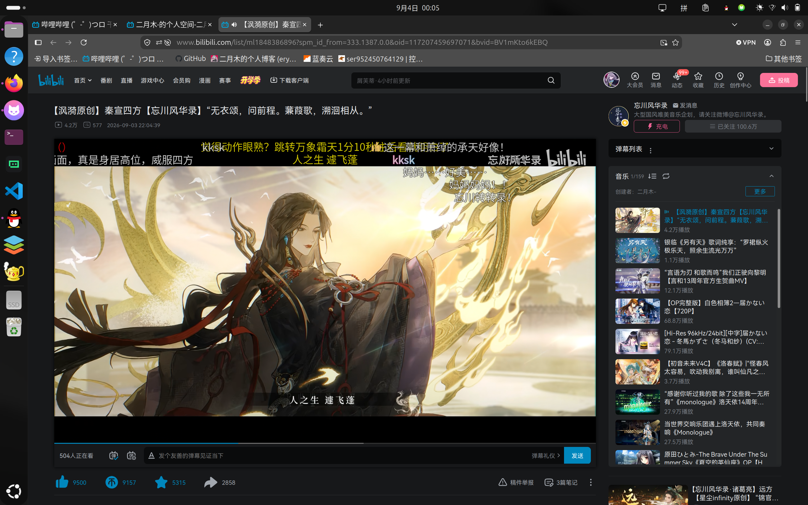
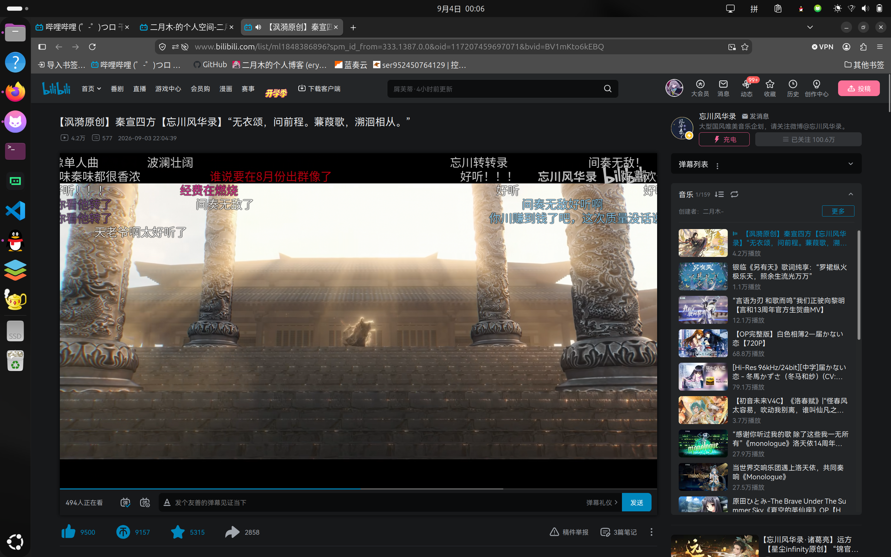
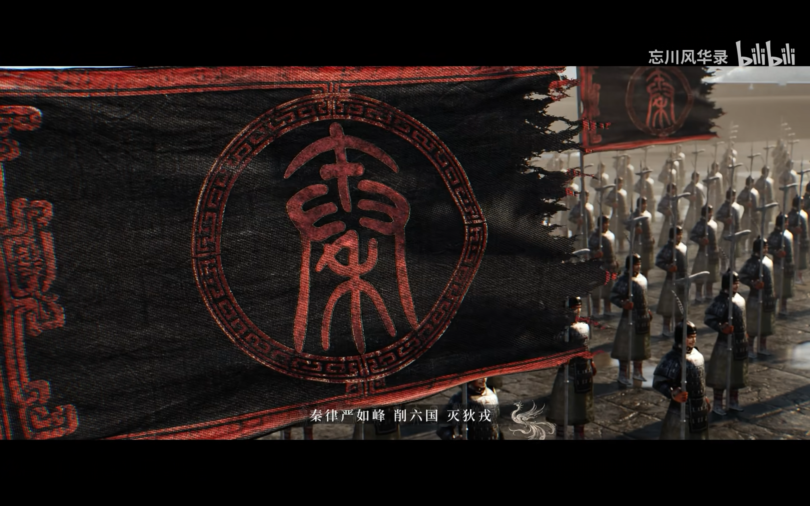
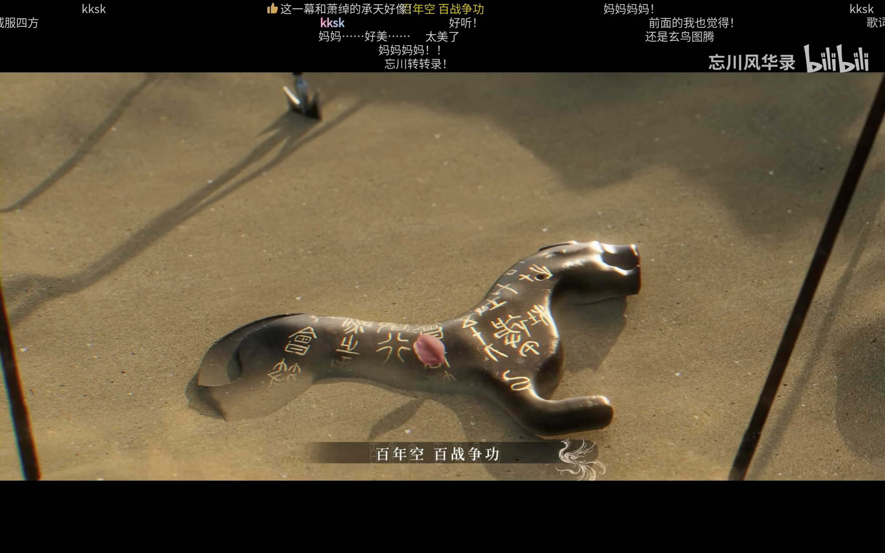

> 每当我丢失某些初心的时候，听到忘川的新歌，我总会找到一些我静置许久却又倾盖如故的东西，这是这个企划带给我的最大的幸福与财富。

---

## 一、 发现新世界的少年

时隔半年，忘川出新歌了。

这是我从高中，高一还是高二发现的音乐企划，从当时听的第一首就彻底迷上了，当时感觉就如发现了新世界一样。

记得当时高中，每个月放假一两天的精神支柱之一就是听忘川新歌，因此也是听出感情来了。游戏是没怎么玩的，歌是一首不落的。

*时隔半年，在 B 站再次点开忘川的新歌*

我甚至想过自己以后能进入网易的这个工作室，参与到忘川的创作之中：PV 制作，或者说自己有一手填词的能力，或者自己能给歌名题字。不过其实都是想想吧，目前看来。

这个企划对我而言，其实更多是让我对人文社科，尤其是历史、文学产生了浓厚的兴趣。可惜衡水模式的高中对于人的个性和爱好是泯灭性的打击，我想假如是在南方的那些较为宽松和素质教育的学校，我能更好地发展自己的爱好。

*波澜壮阔的秦宫画面与场景制作*

---

## 二、 历史的厚重感与故事感

其实我本身作为一个理工科学生，不是对历史很了解，很多人物都是只知道个名字，这首歌讲的宣太后，我是更加不了解了。我可能还是喜欢这种歌曲的故事感吧，有历史的厚重感。

这与 Galgame 的 OP 主题曲是一样的，是服务于剧情的一部分，听者会联想到剧情，故事如幻灯片一样在脑中一张张闪过。

*“秦律严如峰 削六国 灭狄戎”*

---

## 三、 从人文旧梦到 AI 浪潮

不过在我上大学后，对于这个文学、历史之类的兴趣渐渐淡了许多，包括书法。不得不承认，一个人的爱好是会变化的，会跟随一个人不同成长时期而发展。

我这大一下学期到现在大二开学初几天，大部分的时间和精力都倾向了 AI 编程、大模型的发展、Agent 开发之类的，看哪家大模型跑分高，哪家公司又出新模型了，平时比较爱刷 B 站博主的黑鸦Heya和橘鸦Juya的 AI 早报和晚报，以及一些比较优质的 AI 博主。

今天听到忘川新歌，有种熟悉的感觉，就像与一位相隔许久的挚友重逢，想起来了自己的高中的初心，令人感慨。

*风沙中的杜虎符：“百年空 百战争功”*

其实这个忘川风华录的作用，对我来说就在于这里。好的历史，好的故事，不应被遗忘，这些都是瑰宝，也正是课本上一直提到所谓的爱国教育。一个人需要了解自己国家的历史，爱生养自己的这片土地，才会更爱自己的国家。

当然，扯得有点远了。只能说，每当我丢失某些初心的时候，听到忘川的新歌，我总会找到一些我静置许久却又倾盖如故的东西，这是这个企划带给我的最大的幸福与财富。

---

## 四、 课堂的低头族与人文的思考

联想到我刷到的一篇文章，“郑宗义：放任人文学科萎缩，社会将付出沉重代价”。这是我在刷抖音看到的，不过只有标题和开头，我没有去搜具体文章内容，不过也是引发了我的一些思考。

其实我一直不否认人文社科的价值，最近和一位较为深耕人文社科的群友交流了很多，古诗词、现代诗、包括国画，都是有所涉猎和擅长的，带给我的感觉确实和我之前接触的所有人都不一样。

恰巧，今天（过了凌晨了，应该是昨天了）上一位老师的毛概课，半听半玩吧。老师讲的还是很好的，没仔细听到，不过职位蛮高的。我看着和我一样坐在底下的学生（土木和自动化专业的学生），几乎没有几个人抬头听讲；再换位思考到老师，对着这一大片低着头的学生，机械地讲着课，这是怎么讲得下去的。

其实倒也正常，我理应见怪不怪了，大学水课，毕竟都已经来了一年了，上的水课也不少了。老师没有问题，学生也没有问题，那么问题出在哪里呢？我想还是和这个社会的价值观风向和实际环境离不开的，具体我也不想深究了，只能说，做好一个学生的本职工作，能上课给老师一点反馈，抬抬头，那就已经比大多数要强了。

---

## 五、 结语

社会自然不能只有理工科，不然社会只会是冰冷的机器，碾压着滚滚向前，那世界会糟糕透顶的吧。

忘川风华录的意义，可能就在于此吧。
