这是我第一次来这种线下漫展，也许是来之前对上海这座城市和 galonly 展的期待值拉得太高了，我其实是有些失望的。

## 出行

总体上花了得有 2000，车费 500，住宿 312，周边 500，交通 200＋，吃饭 300＋。

往返是乘坐 1461、1462 火车卧铺，22 中午从村里出发，23 早上六点多到达，27 日中午火车，28 日早上到达沧州站，再坐个长途汽车回县里，最后打车回到村里。

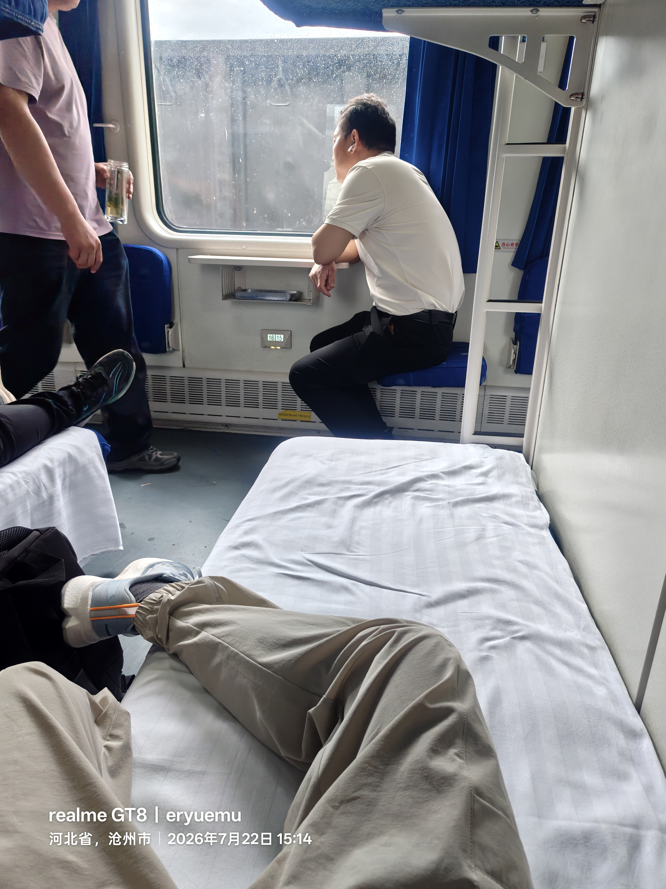
*往返乘坐的 1461/1462 火车卧铺*

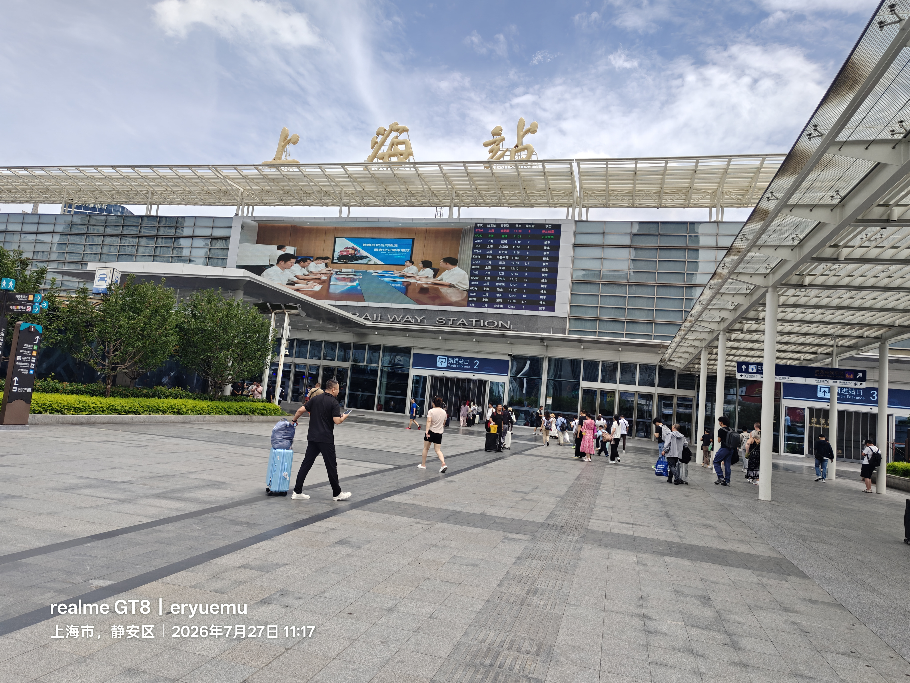
*到达上海站*

住宿是和几个群友一起住的上海的一个民宿，四天才 312。这么便宜的代价就是——位置很偏，基本上离地铁站两公里多了，出行不是很方便。

来上海的一大目的，是参加这个由玲夏学园举办的 galonly 展，是从我们学校的 gal 同好群里面了解到的，再就是见识一下上海，我没怎么出去过，南方我只在高考后和朋友跟团去过一次贵州。

## 群友

和群友聊天，简单认识了几位。一位是天津大学的 gal 群群主，聊天的时候透漏道，东北人，会裁缝，还带来了快板，会打快板，走的强基计划上的天大的能动，强制读研，但是只要不挂三科就能保研，一个班只要小 20 人，读博可读可不读。老实说，我还是头一次体会到，不同学校所带来的资源的差距，其实我还是对泥河有一些想吐槽的，毕竟我来到这个学校，至今没有获得什么资源，除了自己卷绩点转了个专业。也就是说，即便我没来河大，我凭借现在 AI 时代的东风和主动的自学能力，我一样可以做到和现在这样一样的水平，和学校没关系，我没有得到学校的一点机会和资源，我所能依靠的只有我自己。

另一位是吉林大学 gal 群的群主，相处下来可以看出来家里条件不错，湖北十堰人，考到了吉大。还有一位是中央民族大学的，相处下来感觉比较外向。其他两位就是本校河大的 gal 群群主和本校的群友，这是我这趟旅程唯一认识的俩个人，之前团建见到过。

## 展会

展会开两天，25 号和 26 号，我本来是打算 25 号用自己买的高校社团 VIP 票，26 号用一个群友的摊主证（那个群友有事来不了），但是我 25 号一天逛完，突然兴尽悲来了，我不愿意第二天把自己宝贵的时间和精力消耗在这个展子上了，在群里把原本给我的摊主证推掉了，让群主留给需要的人了。

我是第一次参加这种线下的活动，这个展子引导很差，我还漏了两项 VIP 权益。抽奖的号码没给我，蛋糕饮料的券也没有，我也找不到地方去领。之后我回来发了小黑盒和小红书的帖子里说了这个问题，主办方玲夏学园看到了，道歉还是很诚恳的，再就是 day1 的专属周边当时货没到，会在大群里收集信息表格补寄，会补偿一个钥匙扣，其实这个权益什么的倒也不是特别重要。

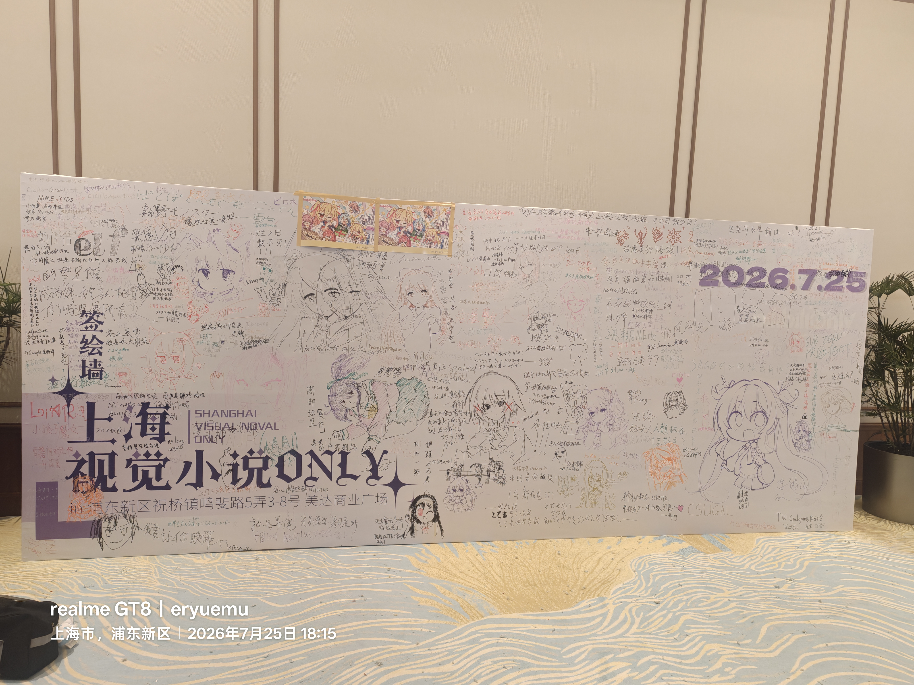
*galonly 展会现场签绘墙*

### 为何兴尽悲来

我之所以感到兴尽悲来，一点原因是因为我不是很能融入进去这个展会。

前文提到我是第一次来线下活动，我对这些圈内术语大部分都是第一次听说，我不知道"无料"是什么意思，也不知道"集邮""返图"这是干什么，吃饭和棉花娃娃一起拍照又是何意味。

再就是旮旯歌曲串烧节目的时候，舞台上放着 OP，前面一堆人搁那挥舞手臂，手舞足蹈，我当时看不懂这是在干什么，我只觉得这群人真的很神，后来查了查，这个行为艺术叫做"打艺"，我只能说我不是很能理解这种行为艺术。

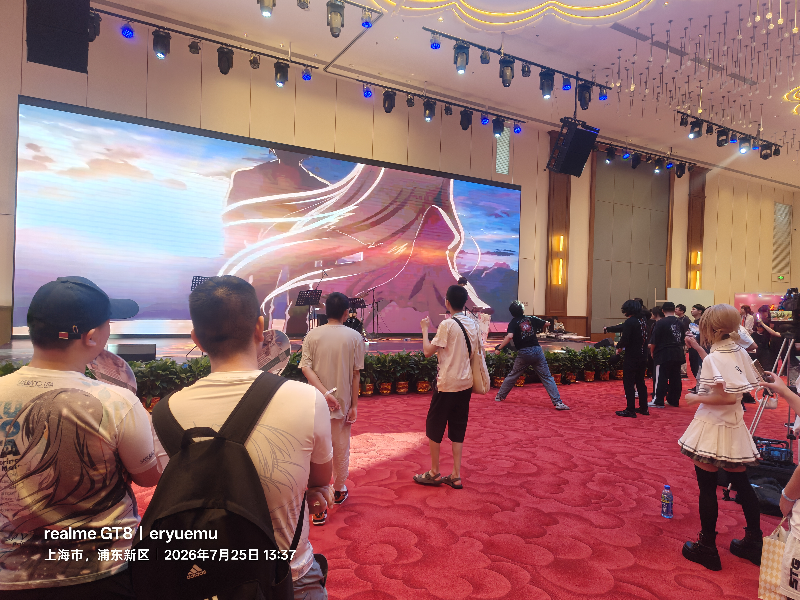
*展会舞台播放 minori（中二社）《ef - a tale of memories》OP 现场*

除此原因外，也是我根本不认识几个群友，虽然说我也偶尔经常在河联群（河北高校旮旯联合会）里水水群吧，但是这不代表我线下认识这些人，其实好像各自都有小团体的，线下我看他们都认识，我完全是个局外人，再加上我比较社恐，也没认识人基本上，当时就兴尽悲来了。

这与我所期待的还是差别太大了吗？老实说我也不知道我在期待什么，我来这个上海和 galonly 展的目的就是缓解一下自己的空虚，放空自己，体会人与人联结的感觉，但是我大概是事与愿违了。

在我发的小黑盒帖子下面，有一位网友评论说：

> 其实这种 only 本质就是 xxt（小团体）团结，正常人去了也只能一头雾水，所以我从来不去 only 展，对于不混圈的人来说毫无体验。

其实在来这个展之前，我以为自己也算是个圈内人，但是现在我发现其实我并不算是。没有人和我一样，是个纯粹的 galgame 玩家，一部动画和轻小说也不看，包括二游我也不玩，兴趣不大，唯一玩点的是鸣潮，只玩剧情，当成 galgame 在玩。我不知这样算不算是一个二次元，我也不想去纠结这一点，或许单一维度的标签确实很难定义我。

最后一点让我兴尽悲来的原因，大抵是我意识到我和这几个摊主来的目的是不一样的，他们是摊主，是来卖周边赚钱的，我是个普通游客，我是来游玩的，以自私自立的角度来看，我是消费者，他们是创作者，我来无偿的帮忙看摊子，我赚不到一分钱，这是在陈述事实，并不是说有多么重要。

### 消费主义的陷阱

加之，我没忍住，买了一堆周边，这与我一向性价比为导向的实用主义的购物习惯产生明显的矛盾和偏差，我的底层代码冲突了。我的理智告诉我，这些色纸、明信片、镭射票、吧唧等诸如此类的二次元周边，都是暴利，我由此反思自己陷入了消费主义的陷阱，叠加之前的具体情况，我陷入了深深的自责和空虚，于是我认为我来这一趟没有意义，这都是无效社交，不如把更多时间和精力放在学习代码和技术上面，这是有价值和意义的事情，也是我如同喜欢玩 galgame 一样喜欢的领域。

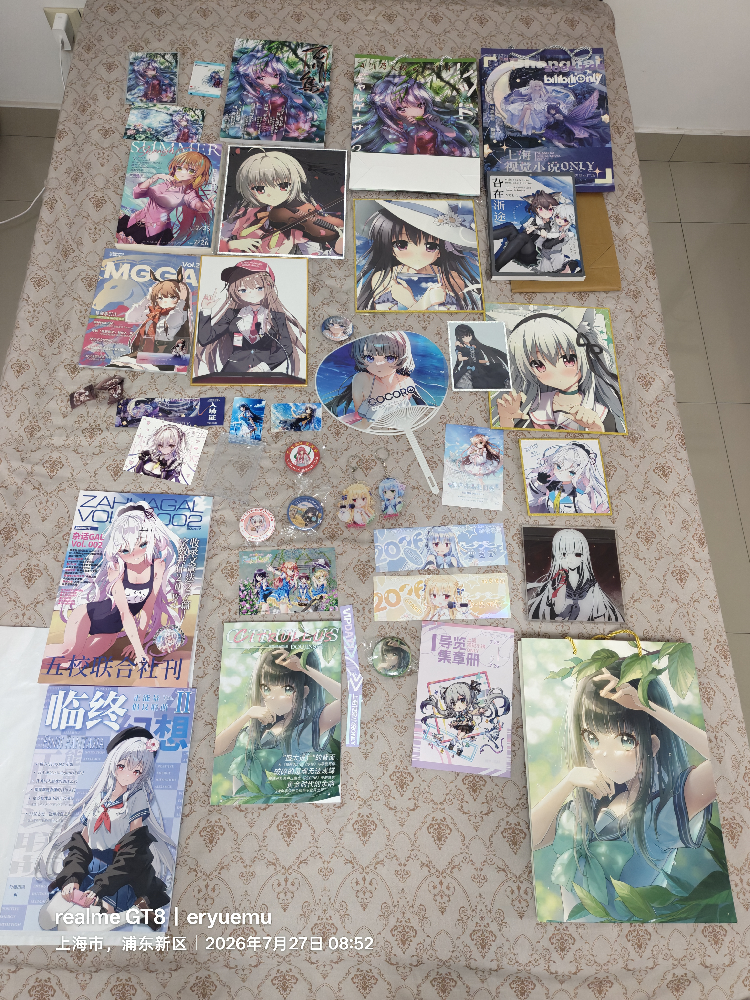
*展会上买的一堆周边*

不过这个展我能买到喜欢的角色姬野永远的色纸周边还是非常开心的，这是我最喜欢的一个制品，我对我喜欢的角色包容度还是很高的。

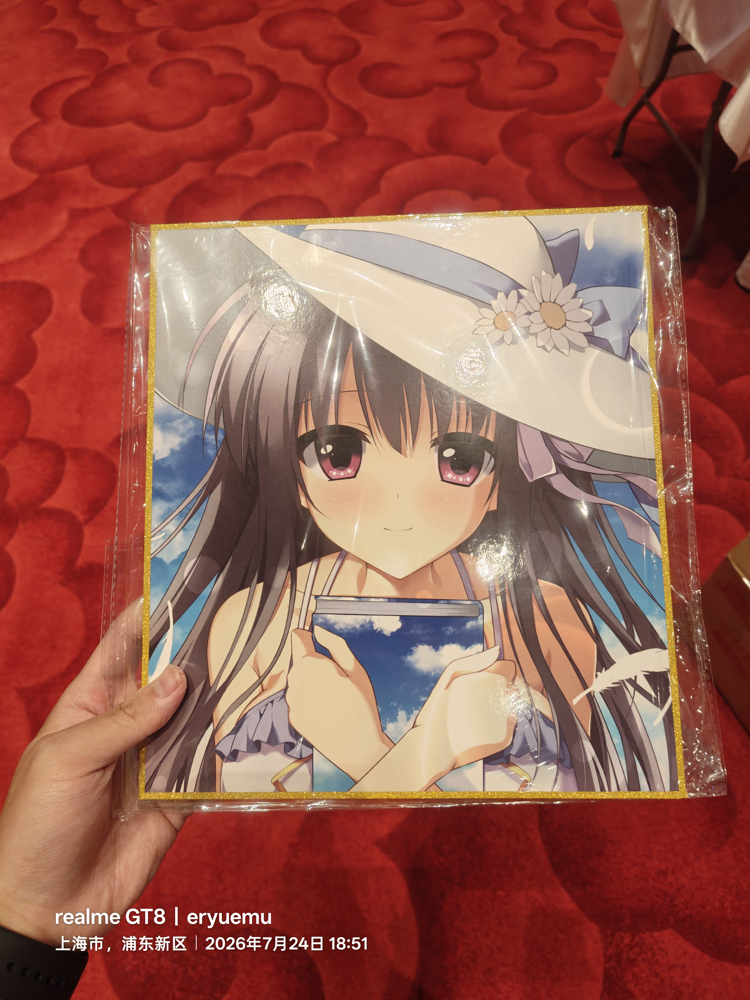
*最喜欢的角色 姬野永远 色纸周边*

## 独自逛上海

26 日推掉了展会，我自己去逛了上海，体验感觉还可以吧，逛了百联 zx、大悦城、世贸大楼、五角场，主要是在看二次元相关的店，没有上百个店，也看了大几十个谷子店了，因为我不看动漫，不玩二游，也不看小说，基本上从头到尾没有一个认识的，倒是有一两家店有 gal 相关的周边，不过很少见就是了。

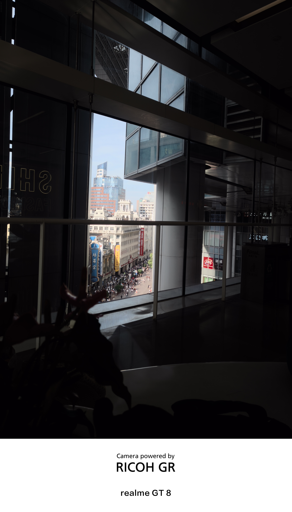
*逛上海世贸大楼*

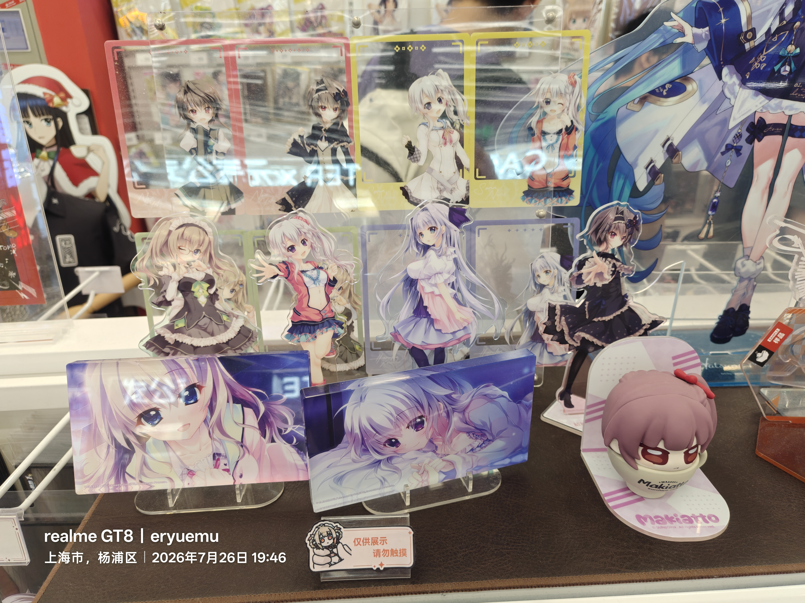
*谷子店里难得一见的《9-nine-》周边*

### 人生第一次麦当劳

中午吃饭吃了人生中第一次麦当劳，老实说我在大一上点外卖点过一次，但是不是在店里，那就不算了吧。

当时我坐在一个四人桌位置（因为当时没有其他空位置了），来了一个老外，问我 ok 不 ok，意思是能不能坐在这里，我当然是说 ok，之后走的时候还说了一声谢谢，顺便把餐盘带走了，给我感觉很有素质。这些都是我在我的家乡所经历不到的。

在麦当劳/KFC 这种店，团个平价的套餐，然后找个靠窗的位置，刷刷手机或者带个 macbook 在桌子上 vibecoding，享受难得的静谧和惬意，这种感觉让我舒适和痴迷，我好像找到了一个我非常喜欢的生活方式。

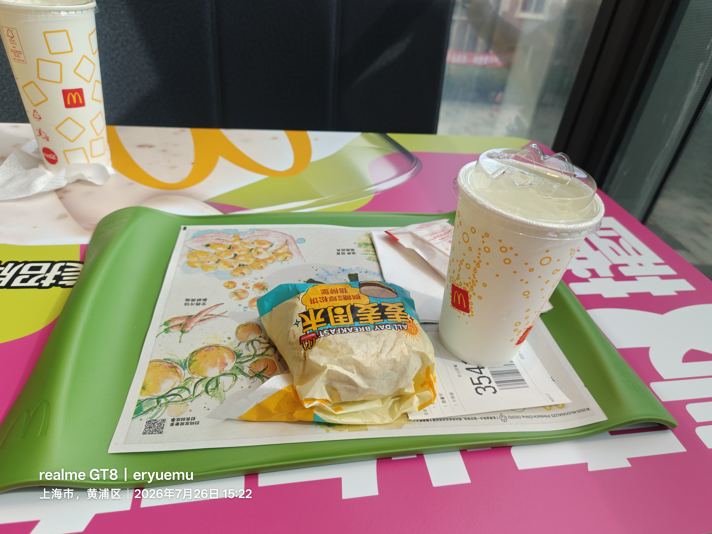
*在麦当劳靠窗位置享受静谧时刻*

### 社交压抑

由此想到自己大一下这一整个学期，除了和我唯一的一个初中好友约过两次饭，出去玩，我好像没有任何社交了，我把自己闷在宿舍里，整天和 AI 对话，和代码打交道，真是压抑完了。也是我这个学期刚转来这个新专业新班级的原因，除了和我一起转专业到自动化的三四个人，我在班上没有一个认识的同学，即便一起转专业的那几个人，我也基本上不说话。

我是个物欲很低的人，但是我看我下个学期至少不能这样了，我规定自己两周必须出去吃一顿饭，即便自己一个人，即便没有人约自己，或者和麦当劳一样，找个书店，买个奶茶，在书店坐一下午，这也是极好的放松方式。

这让我思考到，自己根本不会娱乐，人是环境的产物，我出身于农村是这样，自小就比大城市的人缺乏这方面的经验和经历。我自打从村里小学到初中市里排名前三的初中以来，就很少见到和我一样的农村同学了，我的小学同学基本上大部分都没上高中或者没上大学，要么早早混社会打工进厂，中考五五分流早早进职校，或者即便到了我们县唯二的高中县一中也是去了大专，没几个上本科的。只不过这次上海之行提前给我拉到了一个不属于我的圈子和高度，也让我更加认清自己，自己只不过是个从村里出来的普通人罢了，这在我正式工作，成家立业之前，结论依旧成立。

在巨大的落差感和沮丧下，我在备忘录写下：

> 人与人的差距比人与猪的差距都大
> 人与人的差距超越了生殖隔离

## 纯 K

随后 26 日晚上和一堆其他同好会的群友去纯 K，这也是我第一次去纯 K，我同样也不是很融的进去。

群友成分都很高，连日文歌都会唱，因为是按照一圈逆时针的顺序一个个点歌投屏唱的，最开始我硬着头皮水了四首，后面就直接推掉了。群友们点的歌曲的大部分其实都是我没玩过的，一是因为我玩的不多，也就 40 多部，再就是 galgame 这东西包含的作品还是很广泛的，有很多不同的分类，也是有不同的小圈子，自然不好统一一个曲子所有人都听过，老实说其实是有的，不过还是在少数。

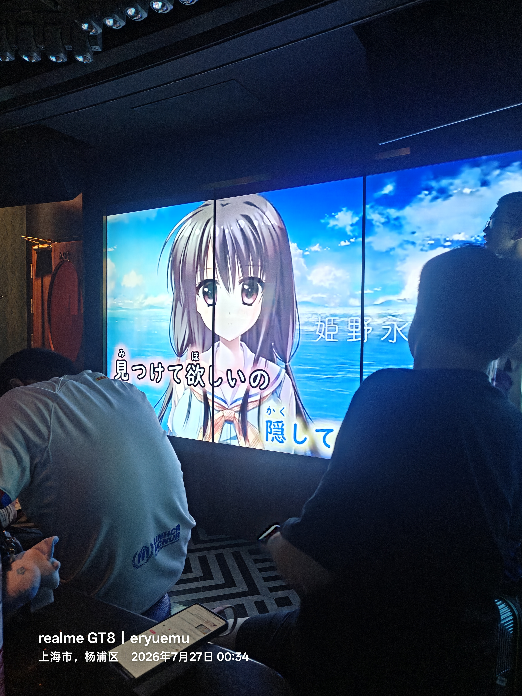
*晚上和群友在纯 K 唱歌*

至于以后这种线下活动，我大概只会一个人去了，打算逛逛，买完自己喜欢的角色的周边就走，活动和演出都是次要的，这种氛围其实是有种违和感的，对我来说。

## 关于上海

上海是一个极度开放和包容的城市，你可以见到数不清的二次元谷子店，大街商场上数不清的 coser，数不清来上海游玩的游客，数不清的大厂公司，数不清的不同行业不同领域的展会活动。

上海也是一个没有本地特色的城市，我感觉不出任何文化底蕴，有的只是极重商业气息，如果让我选择长期居住地，我不会去选择上海这座城市。

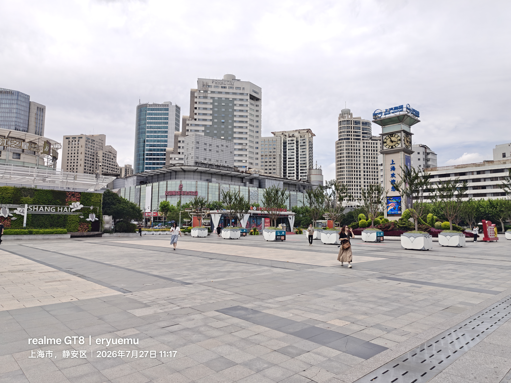
*上海站前广场*