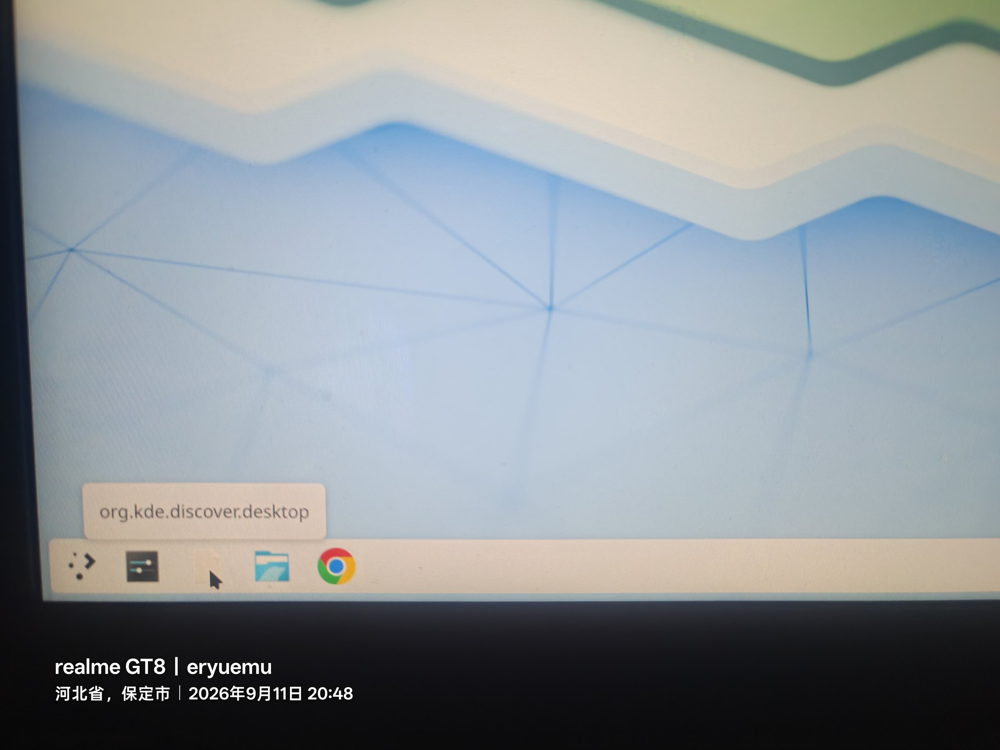
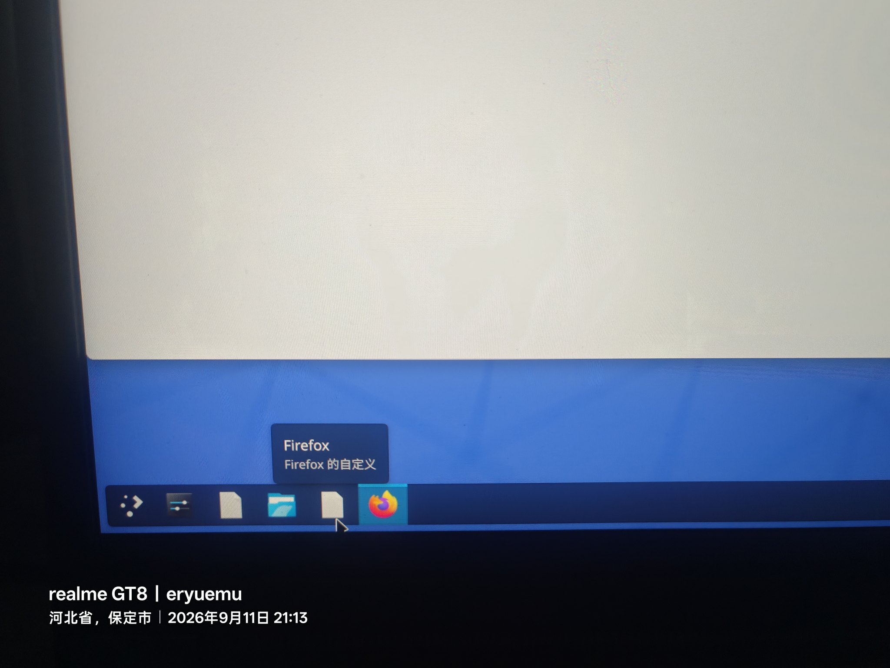
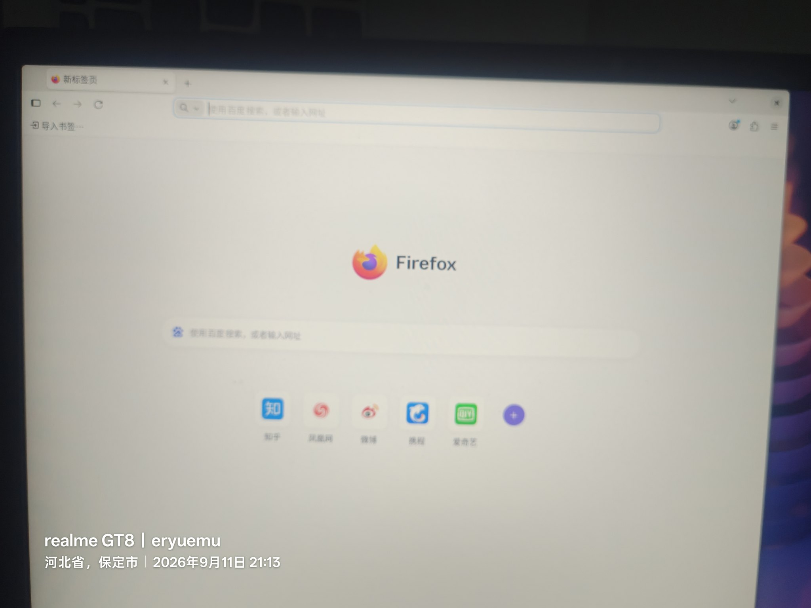
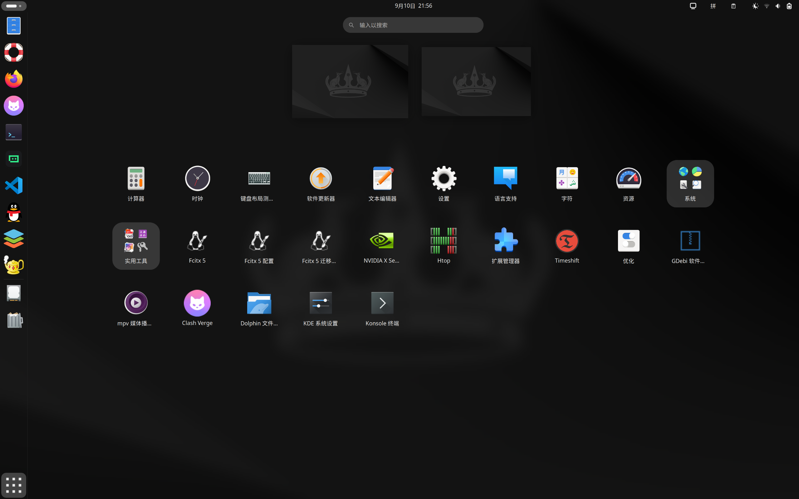
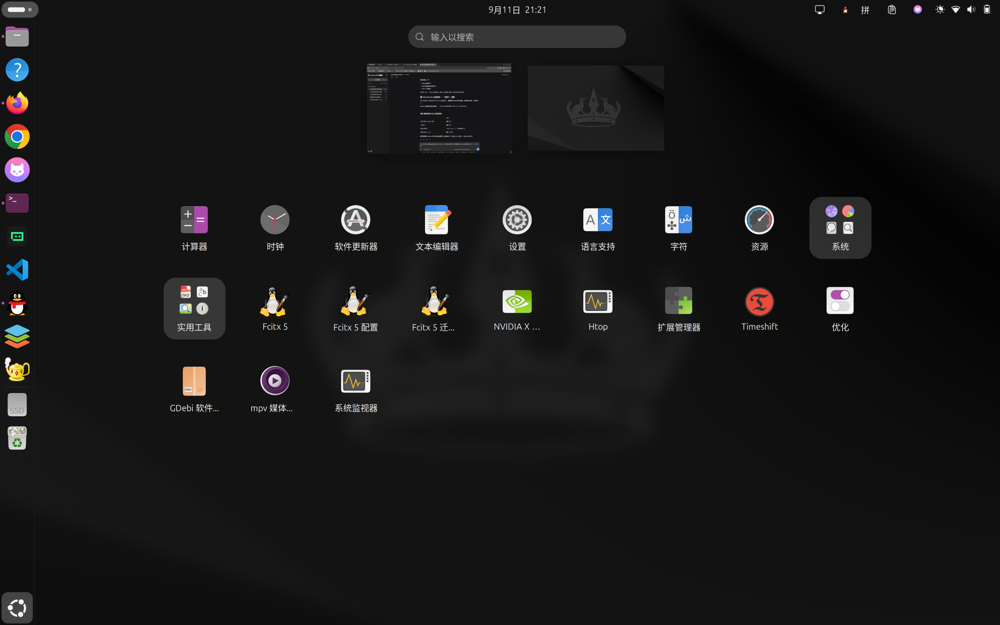

# 【折腾向】Ubuntu 26.04 让 KDE 与 GNOME 完全隔离的实战全记录：专用系统用户 + 343 包精选方案 + 双向菜单隐藏

> **目标**：**不重装系统、不用虚拟机**，让 KDE Plasma 和 GNOME 共存，且 **GNOME 的配置一个字节都不被改动**。
> **环境**：Ubuntu 26.04 LTS (Resolute Raccoon) · GNOME Shell 50.1 · Wayland · gdm3 · NVIDIA 595.91.07 · 2560×1600 · 磁盘 98G
> **前情**：前两次把 KDE 装在主账户下，两次都污染了 GNOME（详见[上一篇](/blog/ubuntu-kde-two-failed-installs-recap/)）
> **方案**：新建系统用户 `eryuemu-kde`（uid 1001），软件包系统级共享、`$HOME` 物理隔离
> **结果**：✅ 两个桌面完全隔离。菜单互不相见（GNOME 39 个可见 / KDE 35 个可见，对方各 0 个），GNOME 有 **44637 个文件的指纹**证明未被改动。
> **本文定位**：可复用的操作手册 + 方法论。重点不是"装成功了"，而是**为什么这样做、怎么验证做到了、哪一层最可靠**。

关联笔记：[【折腾向】Ubuntu 26.04 装 KDE 两次翻车全复盘](/blog/ubuntu-kde-two-failed-installs-recap/) · [【折腾向】Ubuntu 26.04 动态壁纸扩展改造全记录](/blog/gnome-live-wallpaper-engine-two-bugs-fix-recap/)

---

## 0. 结论速览（先看这个）

| 项目 | 结论 |
|------|------|
| 两个账户 | `eryuemu`（uid 1000）→ 只能进 GNOME ／ `eryuemu-kde`（uid 1001）→ 进 Plasma |
| 新建用户命令 | `sudo useradd -m -s /bin/bash -c "KDE Plasma 专用账户" eryuemu-kde` + 家目录权限 `750` |
| 安装命令 | `apt install --no-install-recommends kde-plasma-desktop` + 17 个手工挑选的组件 |
| 包数量 | 首装 **343**，最终 **375**（占 690 MB），**卸载 0 个**；包总数 **1975 → 2350** |
| 登录器 | **仍是 gdm3**，`sddm` **未装** ✅ |
| 三个污染源 | `sddm` / `kde-config-gtk-style` / `xdg-desktop-portal-kde` —— **全是推荐包，一个都没装** |
| 隔离手段的核心 | **用户目录覆盖法**（改 `~/.local/share/applications/`，不改系统文件）→ apt 升级冲不掉 |
| 永久加固 | Dolphin 抢注用 **`dpkg diversion`**，apt 升级也不会复发 |
| 改动量 | 修改系统文件 **0 个**；移动系统文件 **1 个**；新建用户级文件 **26 + 28 个** |
| 验证 | 44637 个文件的指纹 diff + Timeshift 快照 diff + `gsettings` 13 项逐条核对 |
| 关键认知 | 真正的危害不是"对方建了文件"，而是"**对方建的文件会不会被这边读到**" |

---

## 1. 前两次失败给出的三个结论

前两次事故（316 包 + 536 包）复盘出三条硬结论，直接决定了第三次的方案。

### 结论 1：同一个 `$HOME` 下没有可靠的隔离手段

污染走的是 **5 条共享通道**：

| # | 通道 | 为什么堵不住 |
|---|---|---|
| 1 | `$HOME` 里的标准 XDG 路径被两个桌面共用（`~/.gtkrc-2.0`、`~/.config/gtk-3.0/`、`~/.config/fontconfig/fonts.conf`、`~/.local/share/user-places.xbel`、`~/.var/`） | 这些文件**不属于任何软件包**（`dpkg -S` 查不到）→ 事后 `apt purge` 也删不掉 |
| 2 | dconf / GSettings 是共用数据库 | KDE 直接改 `cursor-theme` → `breeze_cursors`、`sound theme-name` → `ocean` |
| 3 | 会话环境变量跨登录存活 | KDE 往 `GTK_MODULES` 挂 `appmenu-gtk-module`，注入 `GTK_RC_FILES` / `QT_WAYLAND_RECONNECT` |
| 4 | KDE 组件有"不靠进 Plasma"也能被拉起的路径 | `kded6` 带 `org.kde.kded6.service`（D-Bus 按需激活，无桌面守卫） |
| 5 | "禁用某个模块/路径"这条路不可靠 | KDE 是几十个组件，模块名与 API 随版本变 |

最根本的是第 1 条：

> 两个桌面的配置文件都放在 `$HOME` 的**同样位置**：
> ```
> ~/.config/gtk-3.0/settings.ini
> ~/.gtkrc-2.0
> ~/.config/dconf/            ← GNOME 的设置数据库
> ~/.config/fontconfig/
> ```
> **若共用一个 `$HOME`** → 两个桌面抢着写同一批文件 → 互相覆盖。
> 而且这些文件**不属于任何软件包**（`dpkg -S` 查不到）→ **卸载 KDE 也删不掉**。

**→ 唯一出路：让两套桌面不共用 `$HOME`。**

### 结论 2：核心污染源可以"物理消除"，不需要"封印"

拆包核对后发现，写 GTK 配置的 `gtkconfig` 模块由 **`kde-config-gtk-style`** 提供——而它**只是一个 `Recommends`（推荐包）**。

| 待验证问题 | 实测结论 |
|---|---|
| `gtkconfig` kded 模块由哪个包提供？ | **`kde-config-gtk-style`** |
| 它能否同时写 gtkrc + 改 dconf？ | **能** —— 依赖 `libgtk-3-0t64` **和** `gsettings-desktop-schemas` |
| `plasma-integration` 会写 GTK 配置吗？ | **不会**（拆包后无任何 gtk/xsettings 文件） |
| `plasma-desktop` 会吗？ | **不会**（kded 模块只有 keyboard / touchpad / device_automounter） |

**→ 不装它就行了。** 这是整个方案的转折点：**别靠"封印"堵，要靠"不装"消除。**

### 结论 3：`kde-plasma-desktop` 的推荐包会拉进三个危险品

```bash
$ apt-get -s install kde-plasma-desktop
Inst sddm ...                    ← 抢登录器
Inst kde-config-gtk-style ...    ← GTK 污染元凶
Inst xdg-desktop-portal-kde ...  ← 抢 GNOME 门户
```

**→ 必须用 `--no-install-recommends` + 手工挑选需要的包。**

---

## 2. 阶段一：动手前的只读勘察

第三次动手前先做了一轮**全程只读**勘察，原则明确：

> **勘察方式**：**全程只读**。无任何 `apt install` / `purge` / 配置写入 / 用户新建。
> 仅使用：`dpkg -l`、`apt-cache`、`apt-get -s`（纯模拟，不下载不安装）、`findmnt`、`journalctl`、
> `find`/`diff`（对 Timeshift 快照）、`dpkg-deb -x`（解包到 `/tmp` 查看文件清单）。
> **唯一被写入的位置**：`/tmp/`（拆包分析用的临时目录）与勘察报告本身。

### 2.0 本次勘察执行的命令（全部只读）

```bash
# ── ① 复核基线：包层 ──
python3 - <<'EOF'
import gzip,re
def p(f):
    op=gzip.open if f.endswith('.gz') else open
    t=op(f,'rt',errors='replace').read(); s=set()
    for b in t.split('\n\n'):
        m=re.search(r'^Package: (.+)$',b,re.M); st=re.search(r'^Status: (.+)$',b,re.M)
        if m and st and 'install ok installed' in st.group(1): s.add(m.group(1).strip())
    return s
old=p('/var/backups/dpkg.status.1.gz')      # 2026-09-09，KDE 之前
cur=p('/var/lib/dpkg/status')
print("缺失:", sorted(old-cur)); print("新增:", sorted(cur-old))
EOF

# ── ② 系统目录对快照 ──
S=/timeshift/snapshots/2026-09-10_23-33-04/localhost
sudo diff -rq $S/etc /etc | grep -vE "cups|group-|gshadow-|passwd-|shadow-|xml/catalog"
for d in usr/share/applications usr/share/wayland-sessions usr/share/dbus-1 \
         usr/share/mime usr/share/xml var/lib/AccountsService; do
  echo -n "$d: "; sudo diff -rq $S/$d /$d >/dev/null && echo "一致" || echo "有差异"
done

# ── ③ 家目录 KDE 残留（应为 0）──
find ~/.config ~/.local ~/.cache ~/桌面 -maxdepth 3 \
  \( -iname "*kde*" -o -iname "*plasma*" -o -iname "*kwin*" -o -iname "*breeze*" \
     -o -iname "*baloo*" -o -iname "*dolphin*" -o -iname "*konsole*" \) 2>/dev/null \
  | grep -v kimpanel || echo "0 项"

# ── ④ 排除两个"假警报" ──
findmnt /run/user/1000
touch /run/user/1000/__wtest && rm -f /run/user/1000/__wtest  # 实际可写 → dconf 报错是并发竞争
lsmod | grep nvidia
nvidia-smi                                                    # 重测正常 → 之前是瞬时故障

# ── ⑤ 拆包验证污染源到底是谁（下载 deb 到 /tmp 拆开看文件清单）──
cd /tmp
apt-get download kde-config-gtk-style plasma-integration plasma-desktop kded6
dpkg-deb -x kde-config-gtk-style_*.deb /tmp/kgts/
find /tmp/kgts -path "*kded*"                                 # → gtkconfig.so（由此包提供）
dpkg-deb -c plasma-integration_*.deb | grep -iE "gtk|xsettings"  # → 无输出，它不写 GTK 配置
dpkg-deb -x kded6_*.deb /tmp/kd6/
cat /tmp/kd6/usr/share/dbus-1/services/org.kde.kded6.service  # → 三行，无任何桌面守卫

# ── ⑥ 模拟安装（dry-run，不下载不安装）──
apt-get -s install kde-plasma-desktop                    # 默认会装 536 包，且拉进 sddm
apt-get -s --no-install-recommends install kde-plasma-desktop \
  systemsettings konsole dolphin plasma-nm plasma-pa kscreen powerdevil \
  kde-style-breeze breeze-gtk-theme kde-config-screenlocker kde-inotify-survey \
  khelpcenter kinfocenter kmenuedit kwalletmanager kfind kwrite
# 逐项断言（都应为 0）
apt-get -s --no-install-recommends install <上面的清单> | grep -cE "^Inst sddm"
apt-get -s --no-install-recommends install <上面的清单> | grep -cE "^Inst kde-config-gtk-style"
apt-get -s --no-install-recommends install <上面的清单> | grep -cE "^Inst xdg-desktop-portal-kde"
```

### 2.1 复核基线

**⚠️ 先说清两个容易混的数字**：

| 口径 | 数值 | 含义 |
|---|---|---|
| **参照快照** `dpkg.status.1.gz`（2026-09-09 06:13，KDE 之前） | **1981** 个已安装包 | 那时系统里装了多少 |
| **动手前实测**（2026-09-11 20:0x） | **1975** 个已安装包 | 此刻系统里装了多少 |

**差的 6 个不是 KDE 造成的**：09-09 到 09-11 之间清理了 **8 个旧内核包**（`linux-*7.0.0-30`）、
又新增了 2 个，净 **−6** → 1981 − 6 = **1975** ✓

把差异逐包列出来（共 10 个）：

```
现在缺失(8): linux-headers-7.0.0-30, linux-headers-7.0.0-30-generic,
            linux-image-7.0.0-30-generic, linux-main-modules-zfs-7.0.0-30-generic,
            linux-modules-7.0.0-30-generic, linux-tools-7.0.0-30,
            linux-tools-7.0.0-30-generic, nvidia-firmware-595-595.84
后来新增(2): google-chrome-stable, nvidia-firmware-595-595.91.07
```

**全部是过期内核清理与驱动自动升级的正常变动，与 KDE 无关 —— 缺失 0 个意外项。**

另外确认：KDE 包 **0 个**；只剩 **9 个 `libkf6*`**——经核对是 **`fcitx5-config-qt` 的合法依赖，绝对不能删。**

### 2.2 排除两个"假警报"

勘察初期有两处报错**看起来像系统故障**，实测都是瞬时现象。登记下来能避免重复排查：

**① `dconf` 报"只读文件系统"**

```
dconf-CRITICAL **: unable to create file '/run/user/1000/dconf/user': 只读文件系统
```

排除依据：`findmnt` 显示 `/run/user/1000` 挂载标志是 `rw`；`touch /run/user/1000/__wtest` **成功** → 目录实际可写；单条重测 `gsettings get` **退出码 0**。
**根因：批量循环里多条 `gsettings` 并发竞争同一 dconf 库导致的瞬时告警。**

**② `nvidia-smi` 报"couldn't communicate with the NVIDIA driver"**

排除依据：`lsmod` 显示 nvidia 系列模块**全部已加载**；`nvidia.ko.zst` 版本 = 595.91.07，与用户态一致；**重测正常输出**。
**结论：瞬时故障**，未触发"驱动升级未重启"那条铁律。

> **这条经验值得单独记：假警报也要查清，别急着修。**
> 如果照着"dconf 只读"去修权限、照着"nvidia 驱动坏了"去重装驱动，
> 就会在一个根本不存在的故障上浪费时间，甚至引入真故障。

### 2.3 ⚠️ 修正前一版文档的判断

勘察推翻了一份交接文档里的判断。**这是整个流程里最有价值的一步**：

| 交接文档原文 | 勘察实测 |
|---|---|
| "封印没用是因为**路径写错了**（`/etc/xdg/kded6.d/` 不是 kded6 读配置的地方）" | 路径确实写错了（应该是 `kded6rc`），**但真正的问题是那个封印压根没必要打** —— `kde-config-gtk-style` 只是推荐包，默认可以不装 |

**→ 核心污染面可以直接物理消除，不必依赖封印。**

同时也确认了交接文档里**判断正确**的一条。拆开 `kded6_6.24.0-0ubuntu1_amd64.deb`：

```
/usr/share/dbus-1/services/org.kde.kded6.service   ← 全局 D-Bus 激活入口
/usr/lib/systemd/user/plasma-kded6.service
```

`org.kde.kded6.service` 全文只有三行，**没有任何桌面环境守卫**：

```ini
[D-BUS Service]
Name=org.kde.kded6
Exec=/usr/bin/kded6
```

`plasma-kded6.service` 里也没有 `ConditionEnvironment=XDG_CURRENT_DESKTOP=KDE` 之类的限制。

**→ 通道 4 成立**：任何用户在会话里调用 `org.kde.kded6`，`kded6` 都会被拉起。所以一份写对位置的 `kded6rc` 封印**仍值得打**（零成本双保险）。

### 2.4 ⚠️ 发现文档没提到的新风险：sddm 抢登录器

交接文档建议的安装命令是 `sudo apt install kde-plasma-desktop`。模拟一下：

```
$ apt-get -s install kde-plasma-desktop
Inst sddm ...
Inst budgie-sddm-theme ...
Inst kde-config-sddm ...
```

**`sddm` 是被 `kde-plasma-desktop` 的 `Recommends` 拉进来的。** 而这正是上一次踩的坑。被推荐拉进来的**不止 sddm 一个**：

| 污染项 | 危害 | 带推荐包 | 精选方案 |
|---|---|---|---|
| `sddm` + `budgie-sddm-theme` + `kde-config-sddm` | **抢登录器**（debconf 弹窗改 display-manager） | ⚠️ 装 | ✅ **不装** |
| `kde-config-gtk-style` | **GTK 污染元凶**（写 gtkrc / 改 dconf） | ⚠️ 装 | ✅ **不装** |
| `xdg-desktop-portal-kde` | 会与 GNOME 的门户服务竞争 | ⚠️ 装 | ✅ **不装** |
| 包总数 | — | 536 | **343** |
| 卸载包数 | — | 0 | **0** |

### 2.5 精选方案的 dry-run 验证

```bash
apt-get -s --no-install-recommends install kde-plasma-desktop \
  systemsettings konsole dolphin plasma-nm plasma-pa kscreen powerdevil \
  kde-style-breeze breeze-gtk-theme kde-config-screenlocker kde-inotify-survey \
  khelpcenter kinfocenter kmenuedit kwalletmanager kfind kwrite
```

`apt-get -s`（dry-run，不下载不安装）结果逐项断言：

| 指标 | 值 |
|---|---|
| 新安装 | **343** 包 |
| 卸载 | **0** 包 ✅ |
| `^Inst sddm` | **0** ✅ |
| `^Inst kde-config-sddm` | **0** ✅ |
| `^Inst kde-config-gtk-style` | **0** ✅ |
| `^Inst xdg-desktop-portal-kde` | **0** ✅ |
| `^Inst (gdm3\|sddm\|lightdm\|lxdm\|greetd)` | **0** ✅ 登录器完全不动 |
| 核心会话组件 | `plasma-desktop` ✅ `plasma-workspace` ✅ `kwin-wayland` ✅ `plasma-session-wayland` ✅ `plasma-integration` ✅ |
| 常用应用 | `konsole` ✅ `dolphin` ✅ `systemsettings` ✅ `plasma-nm` ✅ `plasma-pa` ✅ `powerdevil` ✅ `kscreen` ✅ |

> 唯一残留项：`breeze-gtk-theme` 会被装上。它只是往 `/usr/share/themes/` 放一个 GTK 主题目录，
> **不会改任何 GNOME 设置**（当前 `/usr/share/themes/` 已有 Yaru 全系列，多一个目录无副作用）。

### 2.6 如实登记剩余不确定性（不打保票）

勘察报告专门写了一节"剩余不确定性"：

| # | 不确定性 |
|---|---|
| 1 | **`kded6` 仍可能在 GNOME 会话被拉起**。通道 4 无法物理消除（`kded6` 是 `plasma-workspace` 的**硬依赖**，必装）。它能写的 `~/.config/kded6rc` 是无害文件 |
| 2 | **"KDE 组件绝不碰 `eryuemu` 的 `$HOME`"无法 100% 保证。** 独立用户只是把**主要**通道堵死，**不是数学证明** → 因此建议动手前做 `$HOME` 指纹快照，事后逐文件 diff |
| 3 | `/usr/share/*` 等系统级共享目录的改动是**可枚举的** —— 对快照 `diff -rq` 即可精确列出 |
| 4 | KDE 用户首次登录需**重设网络**（`plasma-nm` 的连接配置在各自 `$HOME`，不共享） |
| 5 | `~/.config/user-dirs.dirs` 等 XDG 用户目录在 KDE 用户下会重新生成（各自的，不互相影响） |

> **这一节是整份勘察报告里最重要的部分。** 承认"无法保证 100%"，然后给出**可验证的方法**，
> 比拍胸脯说"绝对没问题"有用得多——因为后者无法证伪，前者可以拿数据检验。

---

## 3. 阶段二：建立安全网

### 3.1 配置备份（16MB）

| 文件 | 作用 |
|---|---|
| `home-config/` | **真实文件备份**：`.config`、`.local/share/gnome-shell`（含壁纸扩展补丁）、各 dotfile |
| `home-fingerprint-before.tsv` | **指纹清单**：44637 个文件的 路径 + 大小 + 修改时间 |
| `gnome-settings-before.txt` | gsettings 逐项 + `dconf dump /` 全量导出 |
| `gnome-extensions-before.txt` | 扩展启用清单 |
| `dpkg-status-before.txt` | 安装前的完整包状态 |
| `env-before.txt` | 会话环境变量 + `systemd --user` 环境 |

> ⚠️ **为什么必须手工备份**：**Timeshift 排除了 `/home/eryuemu/**`** ——
> 用户级配置**没有快照兜底**。这是前两次事故里最痛的教训。

**备份是怎么做的**：

```bash
B=~/workspace/系统维护文档/kde-安装前备份
mkdir -p "$B"

# ① 真实文件副本：先全量 cp -a，再剔除纯数据目录
cp -a ~/.config "$B/home-config/"
cp -a ~/.local/share/gnome-shell "$B/home-config/.local-share/"   # 含壁纸扩展的两处补丁
cp -a ~/.gtkrc-2.0 ~/.bashrc ~/.profile "$B/home-config/" 2>/dev/null
# 剔除纯数据（.local/bin 407M、.local/jdk 345M、壁纸素材 169M…）→ 从 1002MB 精简到 16MB

# ② 带 mtime 的文件指纹（这是事后 diff 的基准）
python3 - <<'PY'
import os
H=os.path.expanduser("~")
B=os.path.expanduser("~/workspace/系统维护文档/kde-安装前备份")
SKIP={".cache",".npm",".nvm",".gemini",".trae-cn",".vscode",".dsh",".copilot",
      ".antigravity-ide",".ai_completion",".U盘备份"}
with open(f"{B}/home-fingerprint-before.tsv","w") as f:
    f.write("# path\tsize\tmtime\n")
    for dp,dns,fns in os.walk(H):
        rel=os.path.relpath(dp,H)
        if rel.split(os.sep)[0] in SKIP: dns[:]=[]; continue
        for fn in fns:
            p=os.path.join(dp,fn)
            try:
                st=os.lstat(p)
                if os.path.islink(p): continue
                f.write(f"{os.path.relpath(p,H)}\t{st.st_size}\t{int(st.st_mtime)}\n")
            except OSError: pass
PY
# → 44637 条（44638 行 = 44637 条 + 1 行表头）

# ③ gsettings + dconf 全量导出
{ for k in font-name document-font-name monospace-font-name gtk-theme icon-theme \
           cursor-theme accent-color text-scaling-factor; do
    printf "org.gnome.desktop.interface %-22s = %s\n" "$k" \
      "$(gsettings get org.gnome.desktop.interface $k)"; done
  gsettings get org.gnome.desktop.sound theme-name
  gsettings get org.gnome.desktop.wm.preferences titlebar-font
  echo "--- dconf dump ---"; dconf dump /
} > "$B/gnome-settings-before.txt"          # → 13 项 + 455 行 dconf 全量

# ④ 包状态 / 扩展清单 / 会话环境
dpkg -l > "$B/dpkg-status-before.txt"                     # 1975 项
gnome-extensions list --enabled > "$B/gnome-extensions-before.txt"
{ env; echo "--- systemd --user ---"; systemctl --user show-environment; } > "$B/env-before.txt"
```

### 3.2 权威配置基线

把"验证过的正常状态"逐条固化，**任何与此表不符的变动都视为异常**：

| 项目 | 权威值 | ⚠️ 历史事故值（出现即异常） |
|---|---|---|
| 界面字体 | `Ubuntu Sans 12.5` | `Noto Sans 10` |
| 文档字体 | `Ubuntu Sans 12.5` | — |
| 等宽字体 | `Ubuntu Sans Mono 12.5` | `Hack 10`（无效字体名，未安装） |
| 标题栏字体 | `Ubuntu Sans Bold 12.5` | — |
| GTK 主题 | `Yaru-magenta-dark` | `Breeze` / `Breeze-Dark` |
| 图标主题 | `Yaru-magenta-dark` | `breeze-dark` |
| 光标主题 | `Yaru` | `breeze_cursors` |
| 声音主题 | `Yaru` | `ocean` |
| 强调色 | `pink` | — |
| `text-scaling-factor` | `1.0` | — |
| `monitors.xml` scale | `1.3333333730697632` | **从头到尾没变过** |
| DING `show-trash` | `false`（永久偏好） | `true` |
| 默认浏览器 | Firefox | — |

> 💡 **一个容易误判的点**：原始字号偏大（12.5），是"看起来正常"的关键。
> **字号缩水会被误判成"界面比例变小"** —— 实际上显示缩放从没变过，
> 是靠"字体 12.5 + text-scaling 1.0"达到约 150% 观感的。
> 这一条是用**截图 + PIL 像素测量**反推出来的：`monitors.xml` 的 1.333x 是原始值，
> Dock 图标物理尺寸对比完全一致，唯一变的是字体。

### 3.3 验证脚本

一个**全程只读**的健康检查脚本，随时可跑，用数据核对 GNOME 有没有被动过：

```bash
bash ~/workspace/系统维护文档/verify-after-kde.sh
```

最终结果：**通过 30 / 警告 6 / 失败 0**（警告均为装 KDE 的正常变化）。

---

## 4. 阶段三：创建专用用户

```bash
sudo useradd -m -s /bin/bash -c "KDE Plasma 专用账户" eryuemu-kde
```

**这是整个方案的基石**：`$HOME` 物理隔离后，第 1 节那 5 条通道里的前 3 条（共用 XDG 路径、共用 dconf、共用会话环境）**全部自然消失**——因为两个桌面读的根本不是同一个目录。

### 4.1 账户最终状态

| 账户 | uid | 家目录 | 会话 | 家目录权限 |
|---|---|---|---|---|
| `eryuemu` | 1000 | `/home/eryuemu` | ubuntu（GNOME） | 750 |
| `eryuemu-kde` | 1001 | `/home/eryuemu-kde` | plasma（KDE） | 750 |

```bash
# 家目录权限 750（只有属主能进）→ 两个用户互相看不到对方的配置
chmod 750 /home/eryuemu-kde
```

> 📌 **容易漏掉的细节**：`useradd -m` 默认按 `/etc/adduser.conf` 的 `DIR_MODE` 建目录。
> 收尾时发现 `eryuemu-kde` 家目录原为 `755`（其他用户可列目录），已改为 `750` 与 `eryuemu` 保持一致 ——
> **想真正做到"互相看不见"，得确认两边权限一致。**

### 4.2 会话怎么切换

新建用户时系统给了 `Session=ubuntu`（GNOME），所以**第一次登录进的是 GNOME**。修正：

```bash
# 改 /var/lib/AccountsService/users/eryuemu-kde → Session=plasma
```

会话是**跟用户绑定**的：

| 账户 | `Session=` | 进去是什么 |
|---|---|---|
| `eryuemu` | `ubuntu` | GNOME（**不受影响**，照旧） |
| `eryuemu-kde` | `plasma` | KDE Plasma |

> ⚠️ 手动选会话的方式：注销 → 登录界面点右下角**齿轮** ⚙️ → 选 `Plasma (Wayland)` → 点 `eryuemu-kde`。
> **齿轮选的会话会写进 `AccountsService`，跟用户绑定** —— 给 `eryuemu-kde` 选了 Plasma，
> 以后它就默认进 Plasma，`eryuemu` 那边完全不受影响。

### 4.3 GECOS 字段也要改

登录界面显示的是 `AccountsService` 里的 **GECOS 注释**，不是用户名。原值"KDE Plasma 专用账户"不好认，改成 `eryuemu-kde`。

---

## 5. 阶段四：343 包精选方案安装

实际安装（首装 343 包，后续追加 4 包 + KDE 原生工具 28 包，**最终共 375 包**）：

```bash
sudo apt install --no-install-recommends kde-plasma-desktop \
  systemsettings konsole dolphin plasma-nm plasma-pa kscreen powerdevil \
  kde-style-breeze breeze-gtk-theme kde-config-screenlocker kde-inotify-survey \
  khelpcenter kinfocenter kmenuedit kwalletmanager kfind kwrite
```

**关键就是那个 `--no-install-recommends`**，一次排除三个危险品：

```
sddm                     ← 登录器不会被抢，gdm3 保持原样
kde-config-gtk-style     ← GTK 污染元凶，直接不存在
xdg-desktop-portal-kde   ← GNOME 门户不会被竞争
```

安装后立刻断言：

```bash
dpkg -l sddm kde-config-gtk-style xdg-desktop-portal-kde    # 三个都不该有输出
cat /etc/X11/default-display-manager                         # 应仍是 /usr/sbin/gdm3
ls /usr/share/wayland-sessions/                              # plasma.desktop + ubuntu.desktop
```

### 5.1 落地时额外处理的三件事（原方案未预见）

**① `kde-baloo` 全局自启已屏蔽**

`plasma-workspace` 安装时往 `/etc/systemd/user/graphical-session.target.wants/` 建了 `kde-baloo.service` 软链接——而 **`graphical-session.target` 是所有桌面通用的**。

其 `ExecCondition` 在配置不存在时**默认放行**，会导致 **GNOME 会话里启动 KDE 文件索引器**，并生成 `~/.config/baloofilerc` + `~/.local/share/baloo/`。

> 📌 顺带核对过：同目录下 `/etc/systemd/user/plasma-core.target.wants/*` 是 **KDE 专属目标** → ❌ 不会在 GNOME 触发。
> **`graphical-session.target` 是这批单元里唯一有风险的一个。**

→ 为 `eryuemu` 单独屏蔽：

```bash
ln -sf /dev/null ~/.config/systemd/user/kde-baloo.service
```

（`eryuemu-kde` 不受影响，baloo 在 KDE 侧正常工作。）

**② 封印改为不需要**

`kde-config-gtk-style` 未装 → `gtkconfig` 模块不存在 → 打 `kded6rc` 封印**无意义且会削弱 Plasma 功能**，故未打。

**③ fcitx5 已为 KDE 用户配好**

环境变量在 `~/.config/environment.d/`（**用户级**），新用户拿不到 → 需要复制 **4 处**：

```
~/.config/environment.d/95-fcitx5.conf          ← 环境变量
~/.config/fcitx5/profile                         ← 输入法方案（含拼音）
~/.config/autostart/org.fcitx.Fcitx5.desktop     ← 自启（⚠️ 这一处一开始漏了）
~/.config/kcminputrc → InputMethod=fcitx5        ← KDE 侧声明用 fcitx5（⚠️ 也漏过）
```

> **教训**：环境变量级联**有层级**（`environment.d/` 是用户级的），跨用户复制配置时
> 要按"环境变量 / 程序配置 / 自启 / 桌面侧声明"四类**逐类检查**，
> 少任何一类都会表现为"输入法不生效"，而症状看起来都一样。

### 5.2 后续追加安装（共 +4 包）

首装 343 包之后，用户实测反馈了几个问题，对应追加了 4 个包：

```bash
# ① 修任务栏三个"白纸图标"
#    根因：KDE 默认固定了 Discover / 系统监视器 / 信息中心，而这 3 个包当初故意没装
#          → 没有对应程序，就只能画成一个空白文档图标
#    处理：前两个装包补上，Discover 不装（见下）
sudo apt install plasma-systemmonitor kinfocenter      # 带 3 个包，不含 snap/flatpak/discover

# ② 让 GTK 应用（火狐/Chrome）在 KDE 下也能套用 KDE 外观
#    ⚠️ 这就是前两次事故的元凶包 —— 但此时两套桌面已用独立账户隔离，
#       已实测未影响 GNOME（见 9.1 节指纹 diff：改动数为 0）
#    🔑 它同时修好了"没有放大缩小按钮"—— 见 5.3 节第 5 条详解（21:40 装，21:58 生效）
sudo apt install kde-config-gtk-style

# ③ 给 KDE 侧补原生工具（隐藏了 GNOME 程序之后，KDE 里双击文件得有得用）
sudo apt install -y --no-install-recommends gwenview kcalc ark
```

#### 📌 第 3 条佐证：任务栏 tooltip 显示 `org.kde.discover.desktop`



**这张图就是"白纸图标 + 乱码 tooltip"的现场**：任务栏上那个空白方块，
悬停后 tooltip 直接写出了它的内部 ID —— **说明 KDE 找不到这个程序，只能拿标识符代替名字。**

> 📌 **关于 Discover**：它**没有被安装**，而是**交给用户右键把那个固定项移除**。
> 理由和第 6.3 节的"给替代品"逻辑相反 —— 这里不是"缺一个程序"，而是"KDE 默认钉了一个不需要的软件中心"，
> 所以**删条目比装程序更合适**（Discover 会拖进 snap 相关依赖，与"不用 Snap"的偏好冲突）。
>
> 📌 **② 这一条值得单独说明**：`kde-config-gtk-style` 在第三次被**装上了**——
> 因为这次它是装在**系统层**、而 KDE 跑在**独立账户**下，
> 它写的是 `eryuemu-kde` 的 `$HOME`，**不会碰 `eryuemu`**。
> 这正好反证了第 1 节的结论：**隔离靠的是"账户层"，不是"不装某个包"。**

### 5.3 用户实测反馈后的一轮修复

首次登录 Plasma 后，用户陆续反馈了几类问题，逐条处理：

| # | 反馈 | 根因 | 命令 / 修法 |
|---|---|---|---|
| 1 | **第一次登录进的是 GNOME** | 新建用户默认 `Session=ubuntu` | 改 `/var/lib/AccountsService/users/eryuemu-kde` → `Session=plasma` |
| 2 | **没有火狐** | GNOME 早先生成的 `~/.local/share/applications/userapp-Firefox-W57IU3.desktop` 带 `NoDisplay=true`，把火狐从菜单隐藏了；且 `~/.config/mimeapps.list` 里 12 处默认关联指向这个文件 | 删除该文件 + `mimeapps.list` 全改为 `firefox.desktop` |
| 3 | **任务栏出现 `org.kde.discover.desktop`（白纸图标）** | KDE 默认收藏夹（`kactivitymanagerd-statsrc`）写死了**未安装**的软件：<br>`ordering=preferred://browser,org.kde.discover.desktop,systemsettings.desktop,`<br>`org.kde.plasma-systemmonitor.desktop,org.kde.dolphin.desktop,`<br>`org.kde.konsole.desktop,org.kde.kate.desktop,org.kde.kontact.desktop`<br>其中 **`discover` / `kde-contacts` 这两个包特意没装** → KDE 报 `kicker: Entry is not valid`，并把内部 ID 当 tooltip 显示 | 从收藏夹删掉未装的项；现为 `preferred://browser → 系统设置 → Dolphin → Konsole → Kate`，**全部真实存在** |
| 4 | **火狐图标空白** | KDE 用户目录的 `userapp-Firefox-BXFCV3.desktop` **缺 `Icon=` 字段**（与 GNOME 侧那个坏启动器同款毛病） | 补上 `Icon=firefox` |
| 5 | **火狐/Chrome 没有放大缩小按钮** | 表面是 Wayland 的 CSD 规则，**真因是 GTK 设置 `gtk-decoration-layout` 缺席**（没有组件提供 `xsettings`/`gtkconfig` 桥 → 应用只能画一个 `✕`） | 见下方"第 5 条详解" |
| 6 | **火狐/Chrome 是「GNOME 风格」** | 同一个根因：缺 `xsettings` 桥 | 装 `kde-config-gtk-style`（见 5.2 ②）—— ⚠️ **这一个包同时修好了第 5 条和第 6 条** |
| 7 | **输入法不生效** | 只配了环境变量，**漏配自启动** | 补两处：<br>`~/.config/autostart/org.fcitx.Fcitx5.desktop`<br>`~/.config/kcminputrc` → `InputMethod=fcitx5` |
| 8 | **GNOME 菜单里全是 KDE 应用** | 系统级 `.desktop` 对所有用户可见（本身正常），但需要 GNOME 干净 | `hide-kde-apps.sh` 让 KDE 应用不在 GNOME 菜单显示（见 6.1 节，**可一键撤销**） |

#### 📌 第 4 条详解：图标为什么不显示，以及怎么修的

**根因**：KDE 侧火狐的启动器 `~/.local/share/applications/userapp-Firefox-BXFCV3.desktop`
**缺 `Icon=` 字段** —— 没有这一行，桌面/任务栏就找不到图标可画，只能显示空白。



**图上能看出两件事**：

1. **tooltip 写着「Firefox 的**自定义**」** —— 这个名字不是 Firefox 官方的（官方的叫 "Firefox Web Browser"），
   说明它来自一个**用户自定义生成的启动器**，也就是那个坏文件
2. **它左边那个白纸方块** = 缺 `Icon=` 的结果 —— **图标画不出来，系统只能给个通用文档图标**

```bash
# 补上图标字段
# ~/.local/share/applications/userapp-Firefox-BXFCV3.desktop
Icon=firefox
```

> 💡 **注意这和 GNOME 侧那个坏启动器是"同款毛病但不同文件"**：
> - GNOME 侧是 `userapp-Firefox-W57IU3.desktop`，**带 `NoDisplay=true`** → 把火狐从菜单藏起来了（第 5.3 节第 2 条）
> - KDE 侧是 `userapp-Firefox-BXFCV3.desktop`，**缺 `Icon=`** → 图标空白
> **两个文件、两种病，都在修"火狐看起来不对"这一个症状。**

#### 📌 第 5 条详解：为什么没有放大/缩小按钮，最后是怎么修好的

**表面现象**：窗口右上角只有一个 `✕`，没有最小化、没有最大化。

**第一层原因（协议层，这部分是设计不是 bug）**：

```
窗口如果"自己画标题栏"（CSD，客户端装饰）
   → 合成器（KWin）就不该再往上加一套按钮（SSD）
   → 否则会出现两层标题栏

而 Firefox 和 Chrome 在 Wayland 下都自绘标题栏
   → KWin 不会给它们补按钮
```

**但"KWin 不给"不等于"没办法有"** —— 因为**按钮本来就该由应用自己画**，而"画哪几个"是由
**GTK 的设置 `gtk-decoration-layout`** 决定的。当时缺的正是这个设置（没有任何组件提供
`xsettings` / `gtkconfig` 这个桥），所以应用只能画出一个 `✕`。

→ **所以真正的根因是"GTK 侧设置缺席"，而不是"Wayland 不给按钮"。**
这条区别很关键，它决定了该往哪个方向修（见下面的时间线）。



**上图是现场**：窗口右上角**只有 `✕`**，最小化/最大化按钮**根本不存在**。

**处理过程：先走了个弯路，然后一步到位**

| 时间 | 动作 | 结果 |
|---|---|---|
| **21:26** | 先按"Wayland 限制"的思路，给火狐加 `MOZ_ENABLE_WAYLAND=0`（KDE 账户专属），并给 Chrome 做了个 X11 版启动器 | ⏳ 对症状的猜测性处理 |
| **21:40** | 装 **`kde-config-gtk-style`**（1 包 0 依赖） | ✅ **真正的解法** |
| **21:58** | 它写出 `~/.config/gtk-3.0/settings.ini`，其中两行是关键 | ✅ **两个浏览器同时恢复正常** |

```ini
# eryuemu-kde/.config/gtk-3.0/settings.ini   ← 由 kde-config-gtk-style 的 gtkconfig 模块写出
gtk-decoration-layout=icon:minimize,maximize,close                 # ← 决定标题栏上有哪几个按钮、什么顺序
gtk-modules=colorreload-gtk-module:window-decorations-gtk-module   # ← 把按钮画成 Breeze 样式
```

> 🔑 **关键就是 `gtk-decoration-layout` 这一行。**
> 火狐和 Chrome 都是**自绘标题栏、自绘按钮**的，而"画哪几个按钮"正是由这个 GTK 设置决定 ——
> **它缺席时，只能画出一个 `✕`。**
> `kde-config-gtk-style` 补上的就是这个桥（`xsettings` / `gtkconfig`），于是**两个浏览器一起好了**。

**那 X11 那两条后来怎么处理了？**

| | 处置 |
|---|---|
| **Chrome 的 X11 版启动器** | **已删除** —— 用户实测**系统原版（Wayland）就带按钮**，两个重复没必要留。<br>⚠️ 这本身就是个证据：**按钮是 GTK 侧修好的，不是 X11 带来的** |
| **火狐的 `60-firefox-x11.conf`** | ✅ **已于 2026-09-13 删除**（备份在 `系统维护文档/备份/environment.d/`）—— 它创建于 21:26，比真正的解法早 14 分钟 |

> 💡 **这段最值得记的是"临时手段忘了撤"**：
> 21:26 那个 X11 兜底是**对症状的猜测**；21:40 装包后问题已从根上解决 ——
> 于是 Chrome 那份被撤了，**火狐那份忘了撤**，一直留了两个月才清掉。
> **能少一处自定义就少一处**，但前提是**先搞清哪一处才是真正起作用的那一处**。

**那它当时到底有没有生效？—— 有，而且可以只读验证**

`environment.d` 是给 systemd 的**环境生成器**读的，所以直接跑那个生成器就能看到它注入了什么：

```bash
# 以 KDE 用户身份跑（删除前）
sudo -u eryuemu-kde env HOME=/home/eryuemu-kde \
  XDG_CONFIG_HOME=/home/eryuemu-kde/.config \
  /usr/lib/systemd/user-environment-generators/30-systemd-environment-d-generator
# → MOZ_ENABLE_WAYLAND=0        ← 确实注入了 ✅
# 删除后同一条命令 → 这一行消失 ✅
```

> 📌 这个技巧通用：**想确认某个 `environment.d/*.conf` 有没有生效，别等登录，直接跑生成器。**

**所以两个火狐的后端是分开的**（同一条命令实测）：

| 会话 | 火狐走 | 依据 |
|---|---|---|
| **KDE**（`eryuemu-kde`） | **X11 / XWayland** —— 从 09-11 21:26 起，每次登录 KDE 都生效（直到 2026-09-13 删除） | 生成器输出含 `MOZ_ENABLE_WAYLAND=0` |
| **GNOME**（`eryuemu`） | **Wayland**（一直是） | 生成器输出**没有**那一行 |

> 📌 **这是一处很值得记的"隔离副产品"**：同一个 Firefox 程序，在两个会话里跑在**不同的显示协议**上 ——
> 因为决定它的不是程序本身，而是**各自 `$HOME` 里的 `environment.d`**。

> ⚠️ **待确认（下次登 KDE 顺手看一眼）**：删掉那个文件后，**重登 KDE**，
> 看火狐右上角三个按钮**还在不在**：
> **还在** → 删除成功，配置更干净（火狐回到原生 Wayland）；
> **消失** → 说明那个文件仍在起作用，从备份还原即可：
> `sudo cp ~/workspace/系统维护文档/备份/environment.d/60-firefox-x11.conf /home/eryuemu-kde/.config/environment.d/`

#### 📌 5.3.1 两处"临时手段"为什么都活到了最后（原因完全不同）

这次收尾一共清掉两处遗留：`user-places.xbel`（见 [A.9.5](#a95-勘误与复核2026-09-13-复测后修正)）
和本节这个 `60-firefox-x11.conf`。**它们看着像同一类问题，其实原因完全相反**，值得分开记：

| | `user-places.xbel` | `60-firefox-x11.conf` |
|---|---|---|
| 怎么来的 | Dolphin 抢注 `FileManager1` 时顺手写的（**意外**） | 为修窗口按钮手动加的（**有意**） |
| **为什么一直没清** | **被误判成"GNOME 自己的文件" → 从残留扫描的关键词里划掉了 → 之后所有检查都不看它**<br>（**检查被弄瞎**） | **它一直在改动清单里（D5），撤销方法也写着"删文件" —— 从没漏记，只是没人回头问一句"它还有没有用"**<br>（**惰性，不是漏记**） |
| 性质 | **事故**：检查有了盲区，后来的"0 项残留"是假的 | **惰性**：记录齐全，缺的是一次复盘 |
| 怎么被抓到 | **逐条点名核对 7.1 节的残留清单**（清单里有、脚本里没有） | 用户问了一句"火狐到底走 Wayland 还是 X11" |

**共同点只有一条**：都是**临时的东西没被撤掉**，而且**都只有等到有人专门回头问一句"这到底是干嘛的"，才会被发现**。

**→ 两条可以直接用的做法：**

1. **临时手段要带"过期条件"**。加的时候顺手写一句"如果 X 成立，这处就该删"。
   本例里那句本该是——"**装完 `kde-config-gtk-style` 后如果按钮还在，这个文件就没用了**"——
   当时没人写，也就没有任何东西会触发它被清理。
2. **"知道该验证" ≠ "真的去验证"**。本项目文档**早就**写了对照实验方法
   （`操作全记录` 的「归因的不确定性」一节），但从写下到执行隔了一个多月。
   **写下来的待办，要放到"下次登录顺手做"的位置，否则等于没写。**

> 💡 顺带记一条**用户原则**（本次删除的直接依据）：
> **"按系统本身的默认来，能跑就不动。"**
> 系统默认是 Wayland，X11 是人为补的 —— 所以这次删除**不是"做减法"，而是"回归默认"**。
> 判断一处自定义该不该留，先问一句：**这是系统默认行为，还是我额外加的东西？**

### 5.4 ⚠️ 一个"文档自己预警过、执行时又踩了"的坑

后来补装 KDE 原生工具（`gwenview` / `kcalc` / `ark`）时，**忘了把它们加进隐藏名单**——
GNOME 菜单里立刻冒出了这几个 KDE 应用。

**而这正是文档自己预警过的坑**（第 6.1 节："新增 KDE 应用时要补名单"）。

> **这说明：写下来 ≠ 记住。** 真正可靠的做法是把检查**脚本化**
> （比如"新增应用后重跑 `hide-kde-apps.sh --check`"），而不是依赖记忆。

---

## 6. 隔离机制清单（本文核心）

前面是"怎么装"，这一节是"**怎么隔离**"。

### 6.1 双向菜单隐藏：用户目录覆盖法

**问题**：系统级 `.desktop` 文件对**所有用户**可见，所以装完 KDE 后，GNOME 菜单里会冒出 Dolphin、Konsole、Kate……



**失败的方案**：直接改 `/usr/share/applications/` 里的 `.desktop`（加 `OnlyShowIn=GNOME`）。问题：**apt 升级会冲掉、改的是系统文件、影响所有用户**。

> 📌 这个旧机制**真的被 apt 静默冲掉过** —— 文档里留了记录，这是后来改用用户目录覆盖的直接原因。

**采用的方案**：**用户目录覆盖**——在 `~/.local/share/applications/` 放一个**同名**的 `.desktop` 覆盖文件：

```
/home/eryuemu/.local/share/applications/org.kde.dolphin.desktop        ← 隐藏 Dolphin
/home/eryuemu-kde/.local/share/applications/org.gnome.Nautilus.desktop ← 隐藏 Nautilus
```

四个好处：

| 好处 | 说明 |
|---|---|
| **apt 升级不会冲掉** | 它在用户目录，不在包的管辖范围 |
| **不需要 root** | 纯用户级操作 |
| **只影响本用户** | `eryuemu` 的覆盖文件对 `eryuemu-kde` 无效 |
| **回退就是删文件** | 没有"撤销脚本"，删掉即恢复 |

同样的机制也用来**屏蔽几个"不分桌面"的后台服务**（GNOME 侧 3 个 autostart + KDE 侧 3 个 autostart + 5 个 systemd 屏蔽）。

配套脚本：

```bash
bash ~/workspace/系统维护文档/hide-kde-apps.sh --check    # 检查（不需要 sudo）
bash ~/workspace/系统维护文档/hide-kde-apps.sh --undo     # 撤销

sudo bash ~/workspace/系统维护文档/hide-gnome-apps.sh --check   # 反向：GNOME 应用不在 KDE 菜单显示
sudo bash ~/workspace/系统维护文档/hide-gnome-apps.sh --undo
```

**双向隔离的最终效果**：

| 在 GNOME 里 | 在 KDE 里 |
|---|---|
| 看不到 Dolphin、Konsole、Kate 等 KDE 程序（**39 个可见，KDE 的 0 个**） | 看不到 文件、终端、看图、PDF 等 GNOME 程序（**35 个可见，GNOME 的 0 个**） |
| **两边都能用的**（跨桌面通用工具）：输入法、mpv、htop、GDebi、Timeshift、网络设置、NVIDIA 设置 | |

**两侧各隐藏了多少**：

| 方向 | 数量 | 机制 |
|---|---|---|
| KDE 应用不在 GNOME 菜单显示 | **共 27 项** = 脚本新加 **13 项** + 包自带 **14 项** | `OnlyShowIn=KDE;` |
| GNOME 面板不在 KDE 菜单显示 | **共 33 项** | `OnlyShowIn=GNOME;` |
| 附带：两边都不显示 | **3 项** | `NotShowIn=KDE;` —— `fcitx5-configtool`、`gnome-language-selector`、`user-dirs-update-gtk` |
| 用户目录覆盖文件 | GNOME 侧 **23 个** / KDE 侧 **20 个** | 实际放置的文件数 |

> ⚠️ **注意"隐藏 18 个 ≠ 菜单少 18 项"**：
> 其中 `Yelp`、`Settings`、`tweaks`、`gnome-language-selector` 这 4 个 **系统原版就带 `OnlyShowIn=GNOME`**，
> 在 KDE 里**本来就不显示** —— 所以新建了 18 个覆盖文件，**实际只减少 14 个可见项**。



**上面这两张图放在一起看，就是这个方案的全部意义。**

> ⚠️ **判断"应用抽屉里该不该有某软件"要查 `org.gnome.shell app-picker-layout`** ——
> **不要**只看 `Gio.AppInfo.should_show()`。
> 前者是 GNOME Shell **抽屉的布局记录**，后者只是"文件层面有无 `NoDisplay` 标记"，是两个层面。
> （另外：固定在 Dock（`favorite-apps`）的软件**不进抽屉的布局记录**。）

**新增 KDE 应用时要补名单**（踩过的坑）：

```bash
# ① 先看它是否自带 OnlyShowIn=KDE（自带的话就不用管，它在 GNOME 里本来就不显示）
# ② 若没有 OnlyShowIn，把文件名加进 hide-kde-apps.sh 的 APPS=() 列表
#    例：  org.kde.falkon.desktop
# ③ 重跑脚本
```

> 📌 **这个坑真的复现过**：后来补装 KDE 原生工具（Gwenview / KCalc / Ark）时，
> **忘了把它们加进隐藏名单**，GNOME 菜单里立刻冒出来 —— 正好是文档自己预警过的坑。

### 6.2 屏蔽 `kde-baloo` 全局自启

见 [5.1 ①](#51-落地时额外处理的三件事原方案未预见)。核心：

> `graphical-session.target` 是**所有桌面通用**的，而 `kde-baloo.service` 的 `ExecCondition`
> 在配置不存在时**默认放行** —— 不屏蔽的话，**GNOME 会话里会跑起 KDE 的文件索引器**。

```bash
ln -sf /dev/null ~/.config/systemd/user/kde-baloo.service
```

### 6.3 隐藏应用之后：KDE 侧还要"有得用"

双向隐藏有个副作用：**KDE 侧把 GNOME 程序藏了，那 KDE 里双击文件用什么开？**

→ 为 `eryuemu-kde` 补装 KDE 原生工具（Gwenview 看图、KCalc 计算器、Ark 压缩包），并把文件关联改成 KDE 程序：

```
双击图片   → Gwenview
双击文本   → Kate
双击文件夹 → Dolphin
双击压缩包 → Ark
```

⚠️ **只差 PDF** —— 仍用 GNOME 的 Papers（KDE 的 Okular 会连带拖进 **11 个 VLC/phonon 包（总 33 个）**，不划算）。需要的话：`sudo apt install --no-install-recommends okular`

> **这一节是隔离的必要配套**：隔离不能只做"减法"（藏起来），
> 还得做"加法"（给另一边补上能用的程序），否则会自己去点对面的程序，**隔离立刻破功**。

### 6.4 永久加固：Dolphin 抢注 `org.freedesktop.FileManager1`

**这是整个方案里最隐蔽的一个坑。**

**现象**：在 GNOME 里用浏览器下载完，点"打开所在文件夹"，**弹出来的却是 KDE 的 Dolphin**。

**根因**：两个 D-Bus 服务定义**抢同一个名字**：

```
[D-BUS Service]
Name=org.freedesktop.FileManager1        ← Nautilus 的
Exec=/usr/bin/nautilus --gapplication-service

[D-BUS Service]
Name=org.freedesktop.FileManager1        ← Dolphin 的（把上面那个盖住了）
Exec=/usr/bin/dolphin --daemon
```

浏览器点"打开所在文件夹"时，是经 D-Bus 喊"谁是 `org.freedesktop.FileManager1`"——回答的变成了 Dolphin。

**第一次修复（手工，会被 apt 冲掉）**：把 Dolphin 的定义从 `/usr/share/dbus-1/services/`
**挪到 KDE 账户自己的目录** `eryuemu-kde/.local/share/dbus-1/services/`。

**这样两边就各用各的了**：

| 在哪个桌面 | 点"打开所在文件夹"弹出的 |
|---|---|
| **GNOME**（`eryuemu`） | **Nautilus**（GNOME 原生）✅ |
| **KDE**（`eryuemu-kde`） | **Dolphin**（KDE 原生）✅ |

> 💡 **注意这不是"把 Dolphin 的功能干掉"，而是"把抢注的文件挪到该在的地方"** ——
> D-Bus 的“用户级服务目录”本来就会覆盖系统级的同名定义，
> 所以**只要把 Dolphin 那份放进 KDE 用户自己的目录，它就只对 KDE 生效**。
> 这正是整套方案"用户目录覆盖法"的同一个思路（见 [6.1 节](#61-双向菜单隐藏用户目录覆盖法)）。

**问题**：那个文件是 **`dolphin` 包自带**的（`dpkg -S` 可查），**任何一次 `apt upgrade dolphin`（含每天无人值守升级）都会把它装回原位**，抢注复发。

**最终修复（dpkg diversion，永久）**：

```bash
sudo dpkg-divert --add --rename \
  --divert /usr/share/dbus-1/services/org.kde.dolphin.FileManager1.service.disabled-by-guard \
  /usr/share/dbus-1/services/org.kde.dolphin.FileManager1.service
```

**为什么用 diversion 而不是 apt 钩子**：

| 方案 | 机制 | 评价 |
|---|---|---|
| **dpkg diversion** ✅ | dpkg 数据库登记"该文件一律装到转移目标" | **采用**。dpkg 安装/升级/重装/purge 时**直接写到转移目标，没有任何时间窗口**，无竞态 |
| apt 钩子（`DPkg::Post-Invoke`） | 装完之后再跑脚本挪走 | 否决。"先装上再补救"，文件存在过一小段时间 |
| 定时检查脚本 | 定期扫描并修正 | 否决。有窗口期，且要常驻 |

**转移目标为什么这样命名**：

```
org.kde.dolphin.FileManager1.service.disabled-by-guard
                                     ^^^^^^^^^^^^^^^^^^
```

故意**不以 `.service` 结尾** —— dbus-daemon 只加载 `*.service` 文件，放在这里等于彻底失效。

**实测验证（两个决定性实验）**：

**实验 1**：从软件源下载 dolphin 的 deb，强制重装：

```bash
apt-get download dolphin
dpkg-deb -c dolphin_*.deb | grep FileManager1
#   -rw-r--r-- root/root  119  ./usr/share/dbus-1/services/org.kde.dolphin.FileManager1.service
sudo dpkg -i dolphin_*.deb
```

结果：

```
活动位置  org.kde.dolphin.FileManager1.service                      → 不存在 ✅
转移目标  org.kde.dolphin.FileManager1.service.disabled-by-guard    → 文件在（119 字节）✅
```

**dpkg 把文件直接写到了转移目标，压根没碰活动位置。**

**实验 2**：证明 dbus **真的忽略**那个转移文件（不能只靠"文件名看着不像"）。起一个临时 dbus-daemon 做对照实验：

| 测试文件名 | 声明的服务名 | dbus 是否加载 |
|---|---|---|
| `aaa.service` | `com.example.ShouldLoad` | ✅ **加载了** |
| `aaa.service.disabled-by-guard` | `com.example.ShouldBeIgnored` | ❌ **没加载** |

**附带好处**：登记 diversion 后，`dpkg -V dolphin` 不再报"文件缺失"（dpkg 自己知道该文件被转移了）。

配套脚本：

```bash
sudo bash ~/workspace/系统维护文档/guard-dolphin-fm1.sh --check    # 只读体检（8 项）
sudo bash ~/workspace/系统维护文档/guard-dolphin-fm1.sh            # 安装/修复
sudo bash ~/workspace/系统维护文档/guard-dolphin-fm1.sh --undo     # 撤销
```

### 6.5 隔离机制小结

| 问题 | 机制 | 层级 |
|---|---|---|
| 两套桌面共用 `$HOME` → 配置互相污染 | **专用系统用户** | 账户层 |
| KDE 应用出现在 GNOME 菜单（反之亦然） | **用户目录 `.desktop` 覆盖** | 用户层 |
| GNOME 会话里被拉起 KDE 文件索引器 | **`kde-baloo.service` → `/dev/null`** | 用户层 |
| Dolphin 抢注 D-Bus 名称 | **`dpkg diversion`** | dpkg 数据库层 |
| GTK 污染（字体/主题被改写） | **不装 `kde-config-gtk-style`** | 包层 |
| 登录器被抢 | **不装 `sddm`**（`--no-install-recommends`） | 包层 |
| GNOME 门户被竞争 | **不装 `xdg-desktop-portal-kde`** | 包层 |

**注意这个清单的分层结构**：从上到下是**账户层 → 用户层 → dpkg 层 → 包层**。
越靠上越"物理"，越可靠；**包层是最脆弱的**（一次 `apt install <推荐包>` 就可能破功）。
所以关键防护放在账户层（专用用户），包层只是"顺手不装"。

### 6.6 ⚠️ 另一个会复发的问题：GNOME 反复生成"火狐坏启动器"

**这不是 KDE 造成的，但它会一直复发**，所以必须单独记一笔。

**收尾复验时（21:51）指纹对比又抓到 2 个新文件**：

```
21:34  ~/.local/share/applications/userapp-Firefox-TZHKV3.desktop   ← 又生成了一个！
       内容带 NoDisplay=true（菜单里隐藏该启动器）
       且 ~/.config/mimeapps.list 里【20 处】默认关联又指向了它
```

**根因**：GNOME 的「**自定义启动器**」功能 —— 只要你**在 GNOME 里改过火狐的启动方式或图标**，
它就会生成一个 `userapp-Firefox-<随机ID>.desktop`，**并把这个随机 ID 写进 `mimeapps.list` 当默认浏览器**。
而这个文件**带 `NoDisplay=true`** → 菜单里就看不到火狐了。

**症状（下次遇到照这个判断）**：

| 现象 | 说明 |
|---|---|
| **火狐从应用菜单消失** | 因为坏启动器带 `NoDisplay=true`，且它覆盖了官方 `firefox.desktop` 的 ID |
| **点网页链接打不开浏览器** | `mimeapps.list` 的默认关联指向了这个坏文件 |
| `xdg-settings get default-web-browser` 显示一串乱码 ID | 如 `userapp-Firefox-TZHKV3.desktop` —— **这就是确诊依据** |

**⚠️ 同样的毛病 KDE 侧也有，但表现不同**：

```
eryuemu-kde/.local/share/applications/userapp-Firefox-BXFCV3.desktop
   → 这个不缺 NoDisplay，而是【缺 Icon= 字段】
   → 症状是"任务栏火狐图标变成空白页"（见 5.3 节第 4 条）
```

**两边同一个成因（GNOME 生成的自定义启动器）、两种病**（一边菜单消失、一边图标空白）。

**处理：专门写了个幂等脚本**

```bash
bash ~/workspace/系统维护文档/fix-firefox-launcher.sh          # 检查并修复
bash ~/workspace/系统维护文档/fix-firefox-launcher.sh --check  # 只看不修
```

> 💡 **为什么它是"会复发"而不是"一次修好"**：
> 触发条件是"**你在 GNOME 里改火狐的启动方式/图标**"——
> 这是个很自然的操作，**只要做一次就会重新生成坏启动器**。
> 所以这个脚本设计成**幂等**（反复跑无害），
> 遇到症状时**先跑 `--check` 确认，再跑一次修复**即可。

> 📌 **这一节和 [6.4 的 Dolphin 抢注](#64-永久加固dolphin-抢注-orgfreedesktopfilemanager1) 是同一类问题**：
> **"一次性手工修复"是不够的，得问一句"它会不会自己长回来"** ——
> - Dolphin 抢注：**apt 升级**会装回来 → 用 `dpkg diversion` 堵死
> - 火狐坏启动器：**正常操作**会生成回来 → 用幂等脚本 + 明确症状判断法应对
>
> 前者能彻底堵，后者只能"备好工具、认得症状"。**分清这两类，是运维文档该有的诚实。**

---

## 7. 隔离的边界：哪些通道还开着、哪些已经关上

**这是本次操作最有价值的发现**：`$HOME` 隔离解决了前两次事故，但**不是终点**。

隔离做完后又专门梳理了一遍"还有哪些路能让对方的程序跑起来 / 写进来"，一共找出 **7 条通道**。下表是**截至 2026-09-13 的实测状态**：

| # | 通道 | 状态 | 见 |
|---|---|---|---|
| 1–3 | 共用 `$HOME` / 共用 dconf / 共用会话环境 | ✅ **账户隔离后自然消失** | [A.2](#a2-隔离机制做完这-7-条才算完全隔离) |
| **4** | **在 GNOME 里运行 KDE 程序** | ⚠️ **仍然存在**（红线） | [7.1](#71-通道-4️-仍然存在在-gnome-里运行-kde-程序--照样污染-gnome) |
| **5** | **反向通道**：GNOME 程序跑到 KDE 里 | ⚠️ **仍然存在**（对称的） | [7.2](#72-通道-5️-仍然存在反向通道--gnome-程序跑到-kde-里也会留下文件) |
| **6** | **MIME 关联**（双击文件拉起对面程序） | ✅ **已关闭**（14 类里 13 类指向 KDE 程序） | [7.3](#73-通道-6-已关闭mime-关联) |
| **7** | **`~/.config/autostart/` 里没写门牌的项** | ✅ **KDE 侧已关闭**（GNOME 侧是打包问题） | [7.4](#74-通道-7已在两侧关闭--configautostart-里没写门牌的跨桌面自启项) |

> 📌 **注意第 6 条的结论变化**：早期记录里它被标为"⚠️ 还开着（最主要）"，
> 那是**装 KDE 原生工具之前**的评估；后续补装 Gwenview/Kate/Dolphin/Ark 并改好关联之后，
> 这条通道**已经关上了**（例外只有一个，见 7.3）。

### 7.1 通道 4（⚠️ 仍然存在）：在 GNOME 里运行 KDE 程序 → 照样污染 GNOME

> **原因**：KDE 程序有个特点 —— **跑到哪，就往哪个用户的家目录写配置**。
> 它不管当前是什么桌面，只要在那个用户会话里运行了，就会往**那个用户的** `$HOME` 写东西。

**这条实证的意义**：即使有 `$HOME` 隔离，只要**主动在 GNOME 里运行 KDE 程序**，污染照样发生——因为写的是**运行者的**家目录。

所以红线"**别用 `eryuemu` 进 KDE**"必须扩展成：

> ### 🔴 也别在 GNOME 里运行 KDE 程序
> （Konsole / Dolphin / 系统监视器…… 点一下就会往 `eryuemu` 的 `$HOME` 写 KDE 配置）

**这不是理论推演 —— 收尾验证时抓到了 15 项这样的残留**，时间戳对应四次实际操作，每一项都能对上"当时点了哪个 KDE 程序"：

| 时间 | 留下的文件 | 触发者 |
|---|---|---|
| 20:58 | `dolphinrc`、`.local/share/{baloo,dolphin}`、`user-places.xbel` | 火狐里点"打开所在文件夹" → Dolphin |
| 20:59 | `konsolerc`、`konsolesshconfig`、`.local/share/konsole`、`kactivitymanagerdrc`、`.cache/ksycoca6*` | 从 GNOME 菜单打开 Konsole |
| 21:00 | `.local/state/dolphinstaterc` | Dolphin 再次运行 |
| 21:19 | `.local/share/plasma-systemmonitor`、`.cache/plasma-systemmonitor` | 从 GNOME 菜单打开系统监视器 |

> 🔎 **一个漂亮的旁证**：`baloo` 目录建于 **20:58**，而 `kde-baloo` 屏蔽是 **20:38** 生效的
> → 说明 baloo 是**作为 Dolphin 的依赖被拉起**，不是自己启动的。**屏蔽确实起作用了。**

### 7.2 通道 5（⚠️ 仍然存在）：反向通道 —— GNOME 程序跑到 KDE 里，也会留下文件

**这条是用户自己提出的质疑**：

> GNOME 程序跑到 KDE 里，不也会在 KDE 家目录生成 GNOME 的文件吗？

**实测结论：用户是对的，这是对称的。** `eryuemu-kde` 家目录里确实有 GNOME 程序留下的：

```
~/.config/org.gnome.Ptyxis/     ← GNOME 终端（从 KDE 菜单打开过）
~/.config/evolution/            ← GNOME 邮件组件（自动启动）
~/.config/goa-1.0/              ← GNOME 在线账户
~/.config/dconf/                ← GNOME 设置数据库（KDE 的 gtkconfig 也会往里写）
```

而且有**溯源证据链**，证明这些不是"自己冒出来的"：

| 残留物 | 证明什么 |
|---|---|
| `dconf` 里曾有 `[org/gnome/Ptyxis]`、`window-size=(80,24)` | **在 KDE 里运行过 GNOME 终端** |
| `systemmonitorrc`（`lastVisitedPage=overview.page`） | **运行过 GNOME 的系统监视器** |

> ⚠️ **另外两个容易被误当成证据的**（本文档自己先搞错过）：
> - `.config/ibus/bus/<机器ID>-unix-0` —— **不是 GNOME 程序的证据**。`plasma-desktop` 依赖 `libibus`，
>   **KDE 自己就会建这个文件**。
> - `user-places.xbel` —— **曾被误判为"GNOME 的书签文件"并删过两次，实为 KDE/Dolphin 的**。

> ⚠️ **这里有两个很容易搞错的坑（本文档自己都先搞错过）**：
>
> **坑 1：`~/.config/gtk-3.0/`、`gtk-4.0/`、`xsettingsd/` 不是 GNOME 留下的，是 KDE 自己写的！**
>
> 实测 KDE 家目录里 `gtk-3.0/settings.ini` 的内容：
> ```ini
> [Settings]
> gtk-application-prefer-dark-theme=true
> gtk-cursor-theme-name=breeze_cursors      ← Breeze 的值
> gtk-decoration-layout=icon:minimize,maximize,close
> ```
> **这是 `kde-config-gtk-style` 的 `gtkconfig` 模块写出来/维护的** —— KDE 必须靠这套通道
> 才能让 Firefox/Chrome 在 Plasma 下变成 Breeze 风格。
>
> **所以这两个目录要保留，删了 KDE 侧的浏览器会毁容。**
>
> **坑 2：`~/.config/ibus/` 也不是 GNOME 留下的** —— 它是 **KDE 自己写的**。
> 实测依赖关系：
> ```
> libibus-1.0-5 的依赖方：
>   ✅ plasma-desktop         ← KDE 自己的桌面组件依赖它
>   ✅ gnome-control-center
>   ✅ gnome-initial-setup
> ```
> **`plasma-desktop` 依赖 `libibus`** → KDE 侧一启动就会建这个目录。

**2026-09-13 复核**：真正属于 GNOME 的那几个目录里，
`org.gnome.Ptyxis` / `evolution` / `goa-1.0` **已被后续清理掉**；
当前 KDE 家目录里剩下的 `gtk-3.0/`、`gtk-4.0/`、`xsettingsd/`、`ibus/`、`dconf/`
**全是 KDE 自己需要的东西**（前三个供 GTK 程序取 KDE 外观、`ibus` 是 `plasma-desktop` 的依赖、`dconf` 里也含 KDE 写的值）——
**都不能删**。

> **这条通道的价值**：它把"隔离"从"单向防护"变成了"双向审视"。
> 只想着"防 KDE 污染 GNOME"是不够的 —— **两边都会往运行者的家目录写东西**。
>
> 而按[第 8 节](#8-最重要的一条洞察危害不在建文件而在谁的值会赢)的判据，
> **这条通道的危害较小**——理由见第 8 节（**不是"KDE 不读"，而是"KDE 会用自己的 Breeze 值覆盖"**）。

### 7.3 通道 6（✅ 已关闭）：MIME 关联

**这条曾经是 KDE 侧最隐蔽的污染源**：菜单可以藏，但"双击文件"也会拉起程序——而且根本意识不到自己"启动了对面桌面的程序"。

**当时的评估**（补装 KDE 原生工具之前）：

| 路径 | 状态 |
|---|---|
| **菜单点击** | ❌ **已堵**（GNOME 应用已从 KDE 菜单隐藏） |
| **登录时自启** | ❌ **已堵**（Evolution 提醒、Ubuntu 上报等已屏蔽） |
| **GNOME 会话服务**（`gnome-session.target` 下的） | ❌ **不触发**（KDE 不走这个 target） |
| **① MIME 关联** | ⚠️ **还开着（最主要）** |
| **② D-Bus 按需激活**（40+ 服务） | ⚠️ 理论开着，但**不主动调用不会起** |
| **③ `gnome-keyring-daemon`** | ⚠️ 唯一被 enable 的，一度判定"**必须保留**"（Chrome/Firefox 密码靠它）<br>→ **后来改判并在 KDE 侧屏蔽**，见下方说明 |

> **→ 那时在 KDE 里双击一张图，就会拉起 GNOME 的 Loupe，它随即往 KDE 家目录写配置。**

> ### 📌 第 ③ 条后来的反转：`gnome-keyring` 最终被屏蔽了
>
> 一开始的判定是"**不能停**" —— 理由很硬：
> ```
> Chrome 保存的网站密码  ┐
> Firefox 保存的网站密码 ├─→ 都存在 gnome-keyring 里
> 其他程序的凭据        ┘
> 停掉它 → 上述密码全部无法解密 → 需要重新登录所有网站
> ```
> 而且它是**跨桌面的事实标准**：KDE 自带的 `kwallet` 只管 KDE 程序，**管不了 Chrome/Firefox**。
>
> **但随后用户澄清了一件事**：
> > 所以说我好像没有浏览器存密码的习惯 是我这次理解的那个存密码吗
>
> #### 先查证，别只信"我感觉"
>
> 光听用户说"好像没有"不够，**实测两个浏览器到底存没存过密码**：
>
> | 浏览器 | 实测 | 结论 |
> |---|---|---|
> | **Firefox** | **没有 `logins.json` 文件** | **从没存过密码** ✅ |
> | **Chrome** | `Login Data` 里**密码条数 = 0** | **从没存过密码** ✅ |
>
> → 因此"停了密码会打不开"这个顾虑**对这台机器不成立**，原判断偏重，此处更正。
>
> #### 它到底是不是"GNOME 专属包袱"？不是
>
> | | 普通 GNOME 组件（Loupe / Papers / Ptyxis…） | **gnome-keyring** |
> |---|---|---|
> | 定位 | **GNOME 桌面的组成部分** | **通用的"密码服务"** |
> | 谁在用 | 只在 GNOME 里用 | **任何桌面、任何程序**（走 D-Bus 的 **Secret Service** 协议） |
> | KDE 有无替代 | 有（Gwenview / Okular / Konsole） | 有（**KWallet**），**但只服务 KDE 程序** |
> | 是否跨桌面事实标准 | ❌ | ✅ **是** |
>
> **打个比方**：
> - **Loupe（GNOME 看图）** = GNOME 自家的一把剪刀 → KDE 有自己的剪刀（Gwenview），换掉即可
> - **gnome-keyring** = 小区里的**公共快递柜** → 虽是 GNOME 物业装的，但**所有住户的快递都放这儿**
>
> #### 再实测一次：KDE 侧那个 keyring 是不是空的
>
> ```
> /home/eryuemu-kde/.local/share/keyrings/
>   ├ login.keyring    105 字节
>   └ user.keystore    207 字节
> ```
>
> **105 字节 = 只有骨架、没有任何实际条目** → 该用户的 keyring **从未被真正使用过**。
> （对比：`eryuemu` 的 `login.keyring` 为 **2681 字节**，含 1 条条目）
>
> #### 屏蔽操作（仅 KDE 侧）
>
> ```bash
> sudo -u eryuemu-kde systemctl --user mask \
>     gnome-keyring-daemon.service \
>     gnome-keyring-daemon.socket
> ```
>
> **2026-09-13 复核：这两个屏蔽仍在生效 ✅**
>
> 💡 **这条值得记的是"例外清单是会变的"** ——
> "必须保留"这个判断依赖"用户是否使用浏览器存密码"这个**事实前提**；
> 前提一变，结论就翻。
> **所以文档里写例外时，最好把"依赖的前提"一起写上** ——
> 否则将来的人只会看到一条没有理由的例外，不敢动它。

**后来怎么关上的**：补装 KDE 原生工具（`gwenview` / `kcalc` / `ark`），并在 KDE 账户里写 `mimeapps.list`：

```bash
# 先模拟，确认不会拖进重依赖
#   okular（PDF）       → 连带 11 个 VLC/phonon 包（总 33 个）   ❌ 不装
#   kde-spectacle（截图）→ 拖 7 个重依赖                      ❌ 不装
#   gwenview（看图）     → 无重依赖                            ✅
#   kcalc（计算器）      → 仅 1 个包                           ✅
#   ark（压缩包）        → 仅 1 个包                           ✅
sudo apt install -y --no-install-recommends gwenview kcalc ark
```

然后在 **KDE 用户目录**写 `mimeapps.list`（用户级优先级最高）：

```ini
# eryuemu-kde/.local/share/applications/mimeapps.list
[Default Applications]
image/jpeg=org.kde.gwenview.desktop
image/png=org.kde.gwenview.desktop
image/gif=org.kde.gwenview.desktop
image/webp=org.kde.gwenview.desktop
image/bmp=org.kde.gwenview.desktop
image/tiff=org.kde.gwenview.desktop
image/svg+xml=org.kde.gwenview.desktop

text/plain=org.kde.kate.desktop
inode/directory=org.kde.dolphin.desktop
application/zip=org.kde.ark.desktop
application/x-tar=org.kde.ark.desktop
application/x-7z-compressed=org.kde.ark.desktop
application/x-rar=org.kde.ark.desktop
application/x-compressed-tar=org.kde.ark.desktop
```

**改动前后的实测对比**（`xdg-mime query default <类型>`）：

| 类型 | 改之前 | **改之后** |
|---|---|---|
| `image/jpeg` | `org.gnome.Loupe` | **`org.kde.gwenview`** ✅ |
| `image/png` | `org.gnome.Loupe` | **`org.kde.gwenview`** ✅ |
| `text/plain` | `org.gnome.TextEditor` | **`org.kde.kate`** ✅ |
| `inode/directory` | `org.gnome.Nautilus` | **`org.kde.dolphin`** ✅ |
| `application/zip` | `org.gnome.Nautilus` | **`org.kde.ark`** ✅ |

**2026-09-13 复测**（`gio mime <类型>` 以 KDE 用户身份查询，扩大范围到 14 类）：

| 文件类型 | 默认程序 | |
|---|---|---|
| `image/png` / `jpeg` / `gif` / `webp` / `svg+xml` | `org.kde.gwenview.desktop` | ✅ |
| `text/plain`、`application/x-shellscript` | `org.kde.kate.desktop` | ✅ |
| `inode/directory` | `org.kde.dolphin.desktop` | ✅ |
| `application/zip`、`x-7z-compressed` | `org.kde.ark.desktop` | ✅ |
| `video/mp4`、`audio/mpeg` | `mpv.desktop`（跨桌面通用） | ✅ |
| **`application/pdf`** | **`org.gnome.Papers.desktop`** | ⚠️ **唯一例外** |

**14 个常见类型里，13 个指向 KDE 程序。唯一例外是 PDF。**

> 📌 **PDF 这个例外是主动决定的，不是没修**：
> KDE 的 `okular` 会连带拖进 **11 个 VLC/phonon 相关包（总计 33 个包）**（因为它支持嵌入视频），性价比太低，所以保留 GNOME 的 Papers。
> 需要的话一条命令：`sudo apt install --no-install-recommends okular`

> 🔴 **验证这条通道时有个陷阱（值得单独记）**：
> **必须用 `xdg-mime query default <类型>` 或 `gio mime <类型>` 查"实际生效值"** ——
> **直接 `grep mimeinfo.cache` 会看到旧值，从而得出"没修好"的错误结论。**
>
> 原因：隐藏 GNOME 应用用的那些覆盖 `.desktop` 文件**自带 `MimeType=` 字段**，
> `update-desktop-database` 会把它们写进 `mimeinfo.cache`；
> 而 KDE 用户的 `applications/` 目录里**只有这些覆盖文件**，所以缓存重建后内容看起来还是 GNOME 的。
>
> **实际优先级**：
> ```
> ~/.local/share/applications/mimeapps.list
>   > /etc/xdg/mimeapps.list
>     > mimeinfo.cache
> ```
> （实测确认过：`mimeinfo.cache` 里的 `image/png=org.gnome.Loupe.desktop` **不生效**，
> `mimeapps.list` 里的 `image/png=org.kde.gwenview.desktop` **才是实际值**。）


### 7.4 通道 7：已在两侧关闭 —— `~/.config/autostart/` 里"没写门牌"的跨桌面自启项

**问题**：`/etc/xdg/autostart/` 是**所有桌面共用**的目录，下面这些项**没写桌面守卫**，所以 KDE 会话里也会被拉起：

| 服务 | 为什么会启动 | 有无守卫 |
|---|---|---|
| `gnome-keyring-daemon` | 单元文件写着 `WantedBy=graphical-session-pre.target` —— **该 target 是所有桌面通用** | ❌ 无 |
| `gcr-ssh-agent` | 同上 | ❌ 无 |
| `org.gnome.Evolution-alarm-notify` | 在 `/etc/xdg/autostart/`，**没写 `OnlyShowIn`** | ❌ 无 |
| `ubuntu-report-on-upgrade` | 同上 | ❌ 无 |
| `ubuntu-advantage-notification` | 同上 | ❌ 无 |

**对比：KDE 自己的组件都老老实实写了守卫**：

```
✅ org.kde.plasmashell.desktop                OnlyShowIn=KDE;
✅ polkit-kde-authentication-agent-1.desktop  OnlyShowIn=KDE;
✅ kglobalacceld.desktop                      OnlyShowIn=KDE;
```

> **→ 结论：这是 GNOME/Ubuntu 的打包质量问题，与 KDE 无关。**

#### 7.4.1 ⚠️ 先纠正一个说法：这五个里"是遥测的"只有一个

一开始把这几个统称"GNOME/Ubuntu 后台服务"是对的，但**把后两项都叫"遥测"不准确**：

| 组件 | 真实身份 | 是遥测吗 |
|---|---|---|
| `org.gnome.Evolution-alarm-notify` | GNOME 邮件/日历的**提醒后台** | ❌ 与遥测无关 |
| **`ubuntu-report-on-upgrade`** | 系统升级时**上报系统信息** | ✅ **是遥测** |
| `ubuntu-advantage-notification` | **Ubuntu Pro 的订阅推销提醒**（未订阅时催订阅） | ❌ **不是遥测** |

#### 7.4.2 做法：用户目录放 `Hidden=true` 覆盖，**不改系统文件**

**两个账户都做**（做法完全对称）：

```bash
# eryuemu 与 eryuemu-kde 各放一份覆盖：
~/.config/autostart/org.gnome.Evolution-alarm-notify.desktop   → Hidden=true
~/.config/autostart/ubuntu-report-on-upgrade.desktop           → Hidden=true
~/.config/autostart/ubuntu-advantage-notification.desktop      → Hidden=true
```

| 项目 | GNOME 侧（`eryuemu`） | KDE 侧（`eryuemu-kde`） |
|---|---|---|
| 屏蔽数量 | 3 个 | 3 个 |
| 屏蔽内容 | 同 3 项 | 同 3 项 |
| **系统文件改动** | **无** | **无** |
| 备份位置 | `kde-安装前备份/autostart-原始/` | `~/autostart-备份/` |

**为什么 GNOME 侧也要屏蔽**（这是用户提出的关键质疑）：

> "那这不是单单 KDE 需要屏蔽吧？GNOME 不是也没用吗？"

**完全正确 —— 一开始只做了 KDE 侧，思路不完整。** 实测证据证明 GNOME 里也用不上：

| 组件 | GNOME 里有用吗 | 证据 |
|---|---|---|
| `org.gnome.Evolution-alarm-notify` | ❌ **没用** | `evolution` **未装**、`gnome-calendar` **未装**、`gnome-contacts` **未装** —— 只装了被依赖拖进来的 `evolution-data-server` |
| `ubuntu-report-on-upgrade` | ❌ 没用 | 与桌面无关，纯上报 |
| `ubuntu-advantage-notification` | ❌ 没用 | 纯推销提醒 |

> ⚠️ **注意区分**：这 3 个**既不是 KDE 组件、也不是 GNOME 组件**，
> 而是 **Ubuntu 默认桌面自带的组件**（只是没写"该在哪个桌面跑"）。
> **所以屏蔽它们不涉及红线**（红线是"别在 GNOME 里跑 KDE 程序"）。

#### 7.4.3 刻意**不**屏蔽的两项

| 项 | 为什么不屏蔽 |
|---|---|
| `gnome-keyring-daemon` | ⚠️ **Chrome / Firefox 存密码要用它** —— 屏蔽了会导致已保存的密码打不开（**后来改判，见 [7.3 节](#73-通道-6-已关闭mime-关联)**） |
| `gcr-ssh-agent` | **SSH 密钥代理**，多数桌面都在用，**留着无害** |

**另外两项根本不用管**：`gnome-keyring-pkcs11` / `gnome-keyring-secrets` 这两个 autostart 项
**自带 `OnlyShowIn=GNOME;Unity;MATE;`** —— KDE 里本来就不启动。

#### 7.4.4 ⚠️ 重要发现：`ubuntu-insights` 是"没同意就不上报"

这是本节最有价值的一条 —— **系统里真正的遥测组件清单**：

| 组件 | 作用 | 最终处理 |
|---|---|---|
| `ubuntu-report` | 升级时上报系统信息 | **两侧都已屏蔽** ✅ |
| **`ubuntu-insights`** | **Ubuntu 现行遥测服务**（收集平台信息 + 每周上传） | ⚠️ **不用处理**，见下 |
| `ubuntu-pro-client` | Ubuntu Pro 订阅状态管理 | 保留 |
| `whoopsie` | **崩溃上报**（程序崩溃时上传） | **建议保留** |
| `apport` | 崩溃收集（本地） | **建议保留** |
| `popularity-contest` | 统计已安装软件 | ❌ **未装** |

**`ubuntu-insights` 的实测日志原文**：

```
WARN Consent file not found, will not write insights report to disk or upload.
```

**三个"同意文件"位置，全部不存在**：

```
❌ /etc/ubuntu-insights/consent.toml
❌ /var/lib/ubuntu-insights/consent.toml
❌ ~/.local/share/ubuntu-insights/consent.toml
```

**→ 从未同意过，所以它只是空跑定时器，数据一个字节都没外传。**

**它的定时器状态**（看着像在跑，其实什么都不做）：

```
ubuntu-insights-collect.timer   下次收集：2026-10-12
ubuntu-insights-upload.timer    下次上传：2026-09-18
```

**处理决定：不处理。** 没同意就等同于关闭，无需额外操作。

> 📌 **但 KDE 侧还是把它 mask 了**（`ubuntu-insights-collect.timer` / `ubuntu-insights-upload.timer` → `/dev/null`）——
> 因为**报错日志会污染 journal**，而且 KDE 账户本来也用不到它。
> **`whoopsie` / `apport` 则明确建议保留** —— 崩溃收集对事后排查有用
> （这个项目此前的事故取证，就依赖日志与崩溃记录）。

#### 7.4.5 `ubuntu-report`：「屏蔽自启动」vs「显式拒绝」的区别

**它到底怎么工作（比想象的"客气"）** —— 自述原文：

```
This tool will collect and report metrics from current hardware,
partition and session information.
This information can't be used to identify a single machine
and is presented BEFORE being sent to the server.
                                          ↑ 发送前会先展示给你看
```

**三个子命令**：

| 命令 | 行为 |
|---|---|
| `ubuntu-report`（无参数） | **交互模式** —— 展示收集到的内容，问你要不要发 |
| `ubuntu-report send yes\|no` | **不交互**，直接发 / 直接拒绝 |
| `ubuntu-report show` | 只收集并显示，**不发** |

**而 autostart 那一行用的正是"不问你"的模式**：

```ini
Exec=/usr/bin/ubuntu-report send upgrade
                                ↑ 非交互式：升级时直接按预设行为处理
```

**关键证据：它从没上报过**

```
/var/lib/ubuntu-report/      ← 存放"你的选择"（同意/拒绝）的目录
    不存在                    ← 说明从来没运行成功过
```

原因：本次装机后**尚未升级过大版本**，所以这个 autostart 项**一次都没触发**。

**两种做法对比**：

| | **① 屏蔽自启动**（本方案采用） | **② 显式拒绝** |
|---|---|---|
| 做法 | `~/.config/autostart/` 放 `Hidden=true` 覆盖 | 运行 `ubuntu-report send no` |
| 升级后会上报吗 | ❌ 不会 | ❌ 不会 |
| 会弹窗问吗 | ❌ 不会 | ❌ 不会 |
| 留下"拒绝"记录吗 | ❌ 无记录 | ✅ 写入 `/var/lib/ubuntu-report/` |
| 若日后**手动**运行 | 仍会**弹窗问你** | 直接按"拒绝"处理 |
| 撤销方式 | 删覆盖文件（回到"会问你"） | 需改状态文件 |

**实际效果完全相同（都不上报）**，区别只是"是否留一条拒绝记录"。

**本方案选 ① 的理由**：①效果相同 ②屏蔽更干净（连弹窗都不会出现）③撤销更容易（删个文件即可）。

> 📌 若日后想留一条明确的"拒绝"记录，一条命令即可：`ubuntu-report send no`。**非必需。**

---

#### 7.4.6 2026-09-13 复核

```
✅ KDE 侧：3 个 autostart 覆盖（Hidden=true） + 5 个 systemd 屏蔽（→ /dev/null）全部生效
✅ GNOME 侧：同样 3 个 autostart 覆盖在位
✅ 系统文件 /etc/xdg/autostart/ 未被修改（Hidden 计数 = 0）
✅ GNOME 权威设置全部原值（字体/主题/光标/声音）
```

### 7.5 一句话总结这 7 条

```
✅ 已关闭：共用 $HOME / 共用 dconf / 共用会话环境 / 菜单 / 自启 / systemd 单元 / MIME 关联
⚠️ 仍开着：① 在 GNOME 里运行 KDE 程序   ② 反方向：GNOME 程序跑到 KDE 里
⚠️ 主动保留：PDF 用 GNOME 的 Papers（Okular 要拖 11 个 VLC/phonon 包，不划算）
```

> **两条"仍开着"的本质是同一条**：**任何一个桌面环境，程序跑起来就会往运行者的家目录写配置**。
> 这一条没法靠配置堵死，只能靠"**别跨桌面运行对方的程序**"这个使用习惯。
> 这也正是[第 6.3 节](#63-隐藏应用之后kde-侧还要有得用)要为 KDE 侧补齐原生工具的原因——
> **给了替代品，才不需要去点对面的程序。**

---

## 8. 最重要的一条洞察：危害不在"建文件"，而在"**谁的值会赢**"

隔离做完后，记录里有一处**自我纠正**，是整件事最值得记住的一段：

> **之前把"会建文件"当成了问题本身，这是不准确的。**
> **真正的区别是"建的文件会不会被对面读到"：**

| 方向 | 关键文件 | 对面会读吗 | 后果 |
|---|---|---|---|
| **KDE 程序 → GNOME** | `~/.gtkrc-2.0`、`~/.config/gtk-3.0/settings.ini`、**dconf 数据库** | ⚠️ **GNOME 会读** | **GNOME 外观被改坏**（前两次事故的直接原因） |
| **GNOME 程序 → KDE** | `~/.config/dconf/`、`~/.config/gtk-3.0/` | ⚠️ **KDE 也读** | 危害较小 |

### 8.1 ⚠️ 但"KDE 不读"这个说法是错的

上面这条洞察后来又被**再修正了一次**——因为把它理解成"KDE 不读 GNOME 的文件"是**站不住脚的**：

> **❶ 最要紧：「KDE 不读 GNOME 的文件」是错的** —— 这条被用来支撑"双向隐藏只是纯美观"，而它是错的。
>
> `gtk-3.0/settings.ini`、`gtk-4.0/`、`xsettingsd/` 这些**正是 KDE 自己（`kde-config-gtk-style` 的 `gtkconfig` 模块）在读、写、生成的** ——
> KDE 必须走这套通道才能让 Firefox/Chrome 变成 Breeze 风格。
> **所以 GNOME→KDE 不是惰性的**：KDE 会话里的 GTK 程序会消费 `gtk-3.0/` 和 `dconf/`。
>
> **真正的差别不是「不读」，而是「KDE 会用自己的 Breeze 值覆盖、优先级更高」。**
> 危害确实比 KDE→GNOME 小，但理由得改，不能写「KDE 不读」。

**→ 修正后的准确表述**：两个方向**都会被读到**，区别在于**谁的值最终生效**：

| 方向 | 机制 | 谁赢 |
|---|---|---|
| **KDE → GNOME** | KDE 把值写进 `$HOME` 的**物理配置文件**，而 GTK 读这些文件的**优先级高于 dconf** | ❌ **KDE 赢** → GNOME 外观被改坏 |
| **GNOME → KDE** | KDE 也读这些文件，但它会**用自己的 Breeze 值覆盖回去** | ✅ **KDE 赢** → 对 KDE 无影响 |

**这就是为什么"KDE→GNOME 是灾难、GNOME→KDE 基本无害"** ——
不是因为一边"没人看"，而是因为**两边都是"KDE 说了算"**。

**打个比方**（修正版）：

> - KDE 像"到处贴告示"的邻居 —— 贴到你家门上，**你照着做了** → 出事
> - GNOME 像"把东西放你车库"的邻居 —— **你确实会看，但你早就有自己的一整套，直接盖过去了** → 没事

### 8.2 两条可直接应用的推论

1. **单向隐藏是"美观 + 防污染"双收益**：把 KDE 应用从 GNOME 菜单藏掉，既是好看，也**实质性减少了"点了 KDE 程序 → 污染 `eryuemu` 家目录"的机会**。
2. **双向隐藏主要是美观**：把 GNOME 应用从 KDE 菜单藏掉，收益是消除多余文件、界面干净；**防污染意义较小**——因为 GNOME 留下的东西会被 KDE 覆盖掉。
   > ⚠️ 但注意**"较小"不等于"没有"**：GNOME 程序在 KDE 里跑，仍会往 KDE 家目录写文件（见 [7.2 节](#72-通道-5️-仍然存在反向通道--gnome-程序跑到-kde-里也会留下文件)）。
   > 而且实测发现：**隐藏 18 个 GNOME 应用，实际只减少了 14 个菜单项** ——
   > 其中 `Yelp`、`Settings`、`tweaks`、`gnome-language-selector` 这 4 个**系统原版就带 `OnlyShowIn=GNOME`**，在 KDE 里本来就不显示。

> **这一节的意义**：它把"隔离"从"一刀切的禁止"变成了**有优先级的分级防护**。
> 知道哪条流向真正有害，才知道该把力气花在哪。

---

## 9. 阶段六：怎么证明"GNOME 没被动过"

安装完成后，用与勘察阶段同一套方法做对比，**用数据证明**而不是"看了没问题"。

### 9.1 家目录指纹 diff（最关键）

```bash
python3 - <<'PY'
import os
B=os.path.expanduser("~/workspace/系统维护文档/kde-安装前备份")
H=os.path.expanduser("~")
old={}
for line in open(f"{B}/home-fingerprint-before.tsv"):
    if line.startswith("#"): continue
    p,s,m=line.rstrip("\n").split("\t"); old[p]=(int(s),int(m))
new={}
for dp,dns,fns in os.walk(H):
    rel=os.path.relpath(dp,H); top=rel.split(os.sep)[0]
    if top in {".cache",".npm",".nvm",".gemini",".trae-cn",".vscode",".dsh",".copilot",
               ".antigravity-ide",".ai_completion",".U盘备份"}:
        dns[:]=[]; continue
    for fn in fns:
        p=os.path.join(dp,fn)
        try:
            st=os.lstat(p)
            if os.path.islink(p): continue
            new[os.path.relpath(p,H)]=(st.st_size,int(st.st_mtime))
        except OSError: pass
chg=[k for k in old if k in new and old[k]!=new[k]]
print(f"被修改: {len(chg)}   被删除: {len([k for k in old if k not in new])}   新增: {len([k for k in new if k not in old])}")
for k in chg[:40]: print("  改:",k)
PY
```

**结果**：`44637` 个文件里，**非 Firefox / 非备份文件的改动只有 2 个，均与 KDE 无关**（Clash 日志、音频状态）。

> 📌 **这个脚本本身也踩过坑**：早期版本里 `sudo -n` 失败时输出为空，
> 结果导致对比**恒报"一致"**——一个只会亮绿灯、永远不会报警的检查。
> **教训：验证脚本必须能失败。** 一个从未报过错的检查，和没有检查是一回事。

### 9.2 系统目录 vs Timeshift 快照

| 目录 | 结果 |
|---|---|
| `/etc` | 仅 `cups` 与 dpkg 备份文件的正常变动 |
| `/usr/share/applications` | **完全一致 ✅** |
| `/usr/share/wayland-sessions` | **完全一致 ✅**（`plasma.desktop` 是新装带来的，属预期） |
| `/usr/share/dbus-1` | **完全一致 ✅** |
| `/usr/share/mime` | **完全一致 ✅** |
| `/usr/share/xml` | **完全一致 ✅** |
| `/var/lib/AccountsService` | **完全一致 ✅** |

### 9.3 GNOME 权威设置逐条复核

```bash
for k in font-name document-font-name monospace-font-name gtk-theme icon-theme cursor-theme; do
  printf "%-24s = " $k; gsettings get org.gnome.desktop.interface $k; done
gsettings get org.gnome.desktop.sound theme-name
gsettings get org.gnome.desktop.wm.preferences titlebar-font
```

**13 项全部吻合** ✅，历史事故值一个都没出现（光标是 `Yaru` 而不是 `breeze_cursors`，声音是 `Yaru` 而不是 `ocean`）。

### 9.4 进程与服务

```
✅ 双向 0 个对方的进程/服务在跑
✅ 双方家目录内 0 项对方残留（历史上仅剩 1 个 KDE 写的书签库，已于 2026-09-13 清除，见 A.9.5）
```

---

## 10. 隔离的边界与改动总账

### 10.1 隔离到底做到了什么程度

| 层面 | 状态 |
|---|---|
| **功能隔离** | ✅ **完全** —— 各桌面只用各自的程序，互不干扰 |
| **配置隔离** | ✅ **完全** —— 各写自己的 `$HOME`，互不可见（权限 750） |
| **文件隔离** | ✅ **完全** —— 双方家目录内 0 项对方残留（唯一的 `user-places.xbel` 已于 2026-09-13 清除，见 A.9.5） |
| **进程隔离** | ✅ **完全** —— 0 个对方的进程/服务在跑 |
| **菜单隔离** | ✅ **完全** —— 互不相见（35 / 39 个，对方 0 个） |
| **关联隔离** | ✅ **完全** —— 双击文件都开各自的程序 |
| **软件包层面** | ⚠️ **共享** —— `/usr` 下的软件包两用户共用 |
| **例外 1 处** | PDF（仍用 GNOME 的 Papers，见 7.3 节；密钥环的例外已在 7.3 节撤销） |

> **打比方**：两个房间各自的家具、衣物、日用品已完全分开 ——
> 但**共用同一套房子的水电管道**（`/usr` 下的软件包）。
> **这是建筑结构决定的（Linux 设计如此），不是隔离没做好。**

### 10.2 改动总账

| 类别 | 数量 | 可撤销吗 |
|---|---|---|
| **新装软件包** | **375 个**（占 690 MB） | ✅ `apt purge` |
| **卸载软件包** | **0 个** | — |
| **新建系统用户** | 1 个（`eryuemu-kde`，uid 1001） | ✅ `deluser --remove-home` |
| **修改系统文件** | **0 个** | 无需撤销 |
| **移动系统文件** | 1 个（Dolphin 的 D-Bus 定义） | ✅ `guard-dolphin-fm1.sh --undo` |
| **`eryuemu` 家目录新建文件** | **26 个**<br>　· 23 个 `.desktop` 覆盖<br>　· 3 个 autostart 屏蔽 | ✅ 删文件即恢复 |
| **`eryuemu-kde` 家目录新建文件** | **28 个**<br>　· 20 个 `.desktop` 覆盖<br>　· 3 个 autostart 屏蔽<br>　· 5 个 systemd 屏蔽 | ✅ 删文件即恢复 |
| **改动 `eryuemu` 的 GNOME 配置** | **0 项** | — |

> **核心承诺**：`eryuemu` 用户的 GNOME 配置**一个字节都没被 KDE 改过**，有 44637 个文件的指纹为证。

### 10.3 磁盘开销

```
KDE 家目录         218 MB（仅为 GNOME 家目录 14 GB 的 1.6%）
KDE 桌面自身包     ≈55 MB（新增行为 ≈960 MB 里，浏览器数据占 75%）
```

> ⚠️ **注意单位**：上面用的是 `du` 输出的 **MB/GB**，而磁盘工具（如 GNOME「磁盘」）
> 显示的是 **MiB/GiB** —— **两者差约 7%**（因为前者按 1000 进制、后者按 1024 进制）。
> 所以「磁盘已用 47.38 GiB」和「本次新增 960 MB」**不是同一把尺子**，
> 直接相减会得出"怎么占了 1G 多"的错误印象（这个坑当时真的踩过一次，被用户当场质疑后重新核账）。

---

## 11. 踩过的坑与自我修正

这一节记录**操作中出现过、后来被纠正的判断错误**。价值在于：下次遇到类似的，能少走一遍。

### 11.1 判断层面的坑

| # | 错误判断 | 纠正 |
|---|---|---|
| 1 | **隐藏机制一开始改的是系统文件**（`/usr/share/applications/` 里的 `.desktop` 加 `OnlyShowIn`） | 改为**用户目录覆盖法**。系统文件已**全部还原为发行版原样**。而且旧机制**真的被 apt 静默冲掉过** |
| 2 | 一度以为"隐藏应用"只要加 `NoDisplay` 就行 | 判断依据应该是 **`org.gnome.shell app-picker-layout`**（Shell 抽屉的布局记录），不是 `Gio.AppInfo.should_show()` |
| 3 | 交接文档判断"封印错在路径" | 路径确实错了，**但真正的问题是那个封印没必要打** —— `kde-config-gtk-style` 是推荐包，直接不装即可 |
| 4 | `.config/gtk-3.0/`、`gtk-4.0/`、`xsettingsd/` 一度被当成 **GNOME 的残留** | ❌ **实为 KDE 自己写的**（`kde-config-gtk-style` 的 gtkconfig 模块）。实测 `settings.ini` 里是 `breeze_cursors` 等 Breeze 值。**删了它，KDE 侧的火狐/Chrome 会毁容** |
| 5 | 把"会建文件"本身当成污染 | 判据要更进一步：**不是"对面读不读"，而是"谁的值会赢"**（见[第 8 节](#8-最重要的一条洞察危害不在建文件而在谁的值会赢)） |
| 6 | **"KDE 不读 GNOME 的文件"** —— 这个说法被用来支撑"双向隐藏只是纯美观" | ❌ **错的**。KDE 会话里的 GTK 程序（Firefox/Chrome）**照样消费** `gtk-3.0/` 和 `dconf/`。**差别在于 KDE 会用自己的 Breeze 值覆盖回去** |
| 7 | 以为"隐藏 18 个应用 = 菜单少 18 项" | **实际只减少 14 项** —— `Yelp`、`Settings`、`tweaks`、`gnome-language-selector` 这 4 个**系统原版就带 `OnlyShowIn=GNOME`**，在 KDE 里本来就不显示 |
| 8 | 用 `grep OnlyShowIn=KDE` 判断"系统文件是否被旧机制改过" | ❌ **误报** —— KDE **自己的包本来就带这个字段**。**权威判据是 `dpkg -V`**（比对包内 md5）。本目录脚本已改为 `dpkg -V` |
| 9 | **按"名字里带 KDE/Qt"来判定哪些是 KDE 应用** | ❌ 误把 **「键盘布局测试器」**（`kbd-layout-viewer5`）当 KDE 应用隐藏了 —— 它其实是 **`fcitx5-config-qt` 提供的输入法工具**，GNOME 里也用得上。**已恢复**（可见应用从 38 回到 39） |
| 10 | 误报"覆盖文件没写入" | 自己复核后发现是读取方式的问题，实际已写入 |
| 11 | `.config/ibus/` 当成 GNOME 的残留 | ❌ **是 KDE 自己写的** —— `plasma-desktop` 依赖 `libibus`，KDE 侧一启动就建这个目录 |
| 12 | 把"磁盘占用"算错（把整盘用量当成了 KDE 占用） | 用户质疑「才占 1G 吗」后重新核账，**承认算式错了**：KDE 实际约 **1 GB** 量级，用户直觉是对的 |
| 13 | `user-places.xbel` 当成"GNOME 的书签文件" | ❌ **实为 KDE/Dolphin 的文件**，而且**被误删过两次** |

### 11.2 测量方法层面的坑（这一节最值得看）

光"检查过"不够 —— **检查方法本身可能是错的**。这一节记录了 5 个"量出来是假数字"的实例。

| # | 坑 | 教训 |
|---|---|---|
| 1 | **用 root 身份读 `Gio.AppInfo`** —— `sudo python3 -c "…should_show()"` 读的是 **root 的 Gio 数据库** | 报出"GNOME 菜单里有 **10 个** KDE 应用"的**假结果**。**必须切换到目标用户身份**（`su - <用户>`）运行 |
| 2 | 用 `su - <用户>` 时 **`XDG_DATA_DIRS` 不完整** | 当前会话是 `/usr/share/ubuntu:/usr/share/gnome:/usr/local/share/:/usr/share/`；`su -` 模拟时**少了 `/usr/share/ubuntu`** → 可见应用数**少算 4 个**（`ExtensionManager`、`Settings`、`tweaks`、`Yelp` 来自 ubuntu 目录） |
| 3 | 临时脚本**忘了传参数** | 脚本用 `$1` 作桌面名，忘传 → 判定逻辑错乱 → 报出假的"KDE 菜单里有 **14 个** GNOME 应用" |
| 4 | 用 `ls ~/.local/share/applications/org.gnome.*.desktop \| wc -l` 数"能点到的应用" | 得到 **17** —— 而那恰恰是**我们放置的隐藏覆盖文件**，**结论完全反了** |
| 5 | `verify` 脚本 `sudo -n` 失败时输出为空 → **恒报"一致"的假绿** | **验证脚本必须能失败**。一个从未报过错的检查等于没有检查 |
| 6 | 脚本里硬编码 sudo 明文密码 | **任何以该用户身份运行的代码都能直接拿到 root**。已改为依赖 `sudo -v` 凭据缓存，`grep -c 123456 *.sh` → **0** |
| 7 | 查 keyring 条目时用 `$(export…; gdbus… \| grep -c)` 单行管道 | **假阴性**（subshell 里 export 不生效）。必须两步走：先取 Items 再循环逐条取 Label |
| 8 | 用批量循环跑多条 `gsettings` | 并发竞争同一 dconf 库 → 弹出"只读文件系统"的**假警报** |
| 9 | 判断"界面比例变小"靠肉眼 | 必须用**截图 + PIL 像素测量**反推（Dock 图标物理尺寸、顶栏日期字高），才能区分"缩放假象"与"字号真被改" |
| 10 | 统计脚本里 **glob 的 `~` 写在引号里没展开** | 数出来的文件数不对 → 后来改用**最原始的方法**（`find` + `wc -l`）精确核对 |
| 11 | 统计脚本里 **`HOME` 解析错误**、**同一条命令跑两次结果不同**（环境变量在多次 `su` 之间叠加） | 直接**从目标用户角度逐个验证**，不再依赖多层 `su` 嵌套 |
| 12 | **同一个"菜单可见数"量出 3 个不同结果**（38 → 206 → 41） | 🔴 **同一指标出现多个互相矛盾的数字，必须先怀疑测量方法，而不是选一个信** |

> 🔴 **第 1–4 条是同一类错误的四个变种**：**测量环境与被测对象不一致**（身份、环境变量、参数、文件来源）。
> 它们的共同特征是 —— **结果看起来"有具体数字"，所以特别容易被当成事实**。
>
> **菜单可见数的正确测法**（后来写成了独立脚本，可复现）：
> 1. 按 `XDG_DATA_DIRS` 顺序扫描系统目录（后者优先）
> 2. 再扫 `~/.local/share/applications`（最高优先级，覆盖同名文件）
> 3. 排除 `NoDisplay=true` / `Hidden=true`
> 4. `OnlyShowIn` 不含目标桌面 → 排除
> 5. `NotShowIn` 含目标桌面 → 排除
> 6. **以目标用户身份、带完整 `XDG_DATA_DIRS` 运行**

### 11.3 方案层面的坑

| # | 坑 | 处理 |
|---|---|---|
| 1 | `kde-baloo` 全局自启（交接文档没提） | `ln -sf /dev/null ~/.config/systemd/user/kde-baloo.service` |
| 2 | Dolphin 抢注 `org.freedesktop.FileManager1`（交接文档没提） | `dpkg diversion` 永久加固 |
| 3 | KDE 默认收藏夹指向**未安装**的软件（`org.kde.discover.desktop` 等 3 个） | KDE 报 `kicker: Entry is not valid` 并把内部 ID 显示成 tooltip。从收藏夹删除 |
| 4 | 补装 KDE 原生工具后**忘了加隐藏名单** | GNOME 菜单里立刻冒出 **10 个** KDE 应用（含新装的 `gwenview`/`kcalc`/`ark`）—— **正好是文档自己预警过的坑**。补进名单后回到 **0 个** ✅<br>**→ 结论：每次装新 KDE 应用后都要重跑一次 `hide-kde-apps.sh`** |
| 5 | `eryuemu-kde` 家目录权限原为 `755` | 改 `750`，否则"互相看不见"不成立 |
| 6 | 新建用户 `Session=ubuntu`，第一次登录进的是 GNOME | 改 `/var/lib/AccountsService/users/eryuemu-kde` → `Session=plasma` |
| 7 | fcitx5 配置跨用户复制漏了 2 处 | 要按"环境变量 / 程序配置 / 自启 / 桌面侧声明"**四类逐查** |
| 8 | `kdesystemsettings.desktop` **同时带 `OnlyShowIn=KDE` 与 `NotShowIn=KDE`** | 两边都不显示（自相矛盾的打包问题）—— 已知怪癖，无实际影响 |

> **这 33 条里，有相当一部分是"文档自己预警过、执行时又踩了"的。**
> 这说明：**写下来 ≠ 记住**。真正可靠的做法是把检查**脚本化**
> （比如"新增应用后重跑 `hide-kde-apps.sh --check`"），而不是依赖人的记忆。

---

## 12. 方法论总结：怎么做到"可靠隔离"

抛开具体命令，这次成功靠的是五条方法。**它们比命令更有复用价值。**

### 12.1 先勘察，再动手（只读阶段的价值）

动手前有一轮**全程只读**的勘察，产出三个关键成果：

| 成果 | 内容 |
|---|---|
| **推翻了前一版文档的错误判断** | 封印 vs 物理消除（第 2.3 节） |
| **发现了文档没提到的风险** | sddm 会抢登录器，且不止它一个（第 2.4 节） |
| **用 `apt-get -s` 验证了精选方案** | 343 包 / 0 卸载 / 三个危险品全为 0（第 2.5 节） |

> **只读勘察的成本是"多花半小时"，收益是"避免第三次翻车"。**

### 12.2 把"记忆"变成"证据"

前两次失败的共同点是：**靠"记忆"和"说法"交接**，而记忆会错、说法会冲突。这次全部改成**可验证的产物**：

| 而不是… | 改成 |
|---|---|
| "我记得字体是 12.5" | `GNOME权威配置-基线.md` + `gsettings get` 实测 |
| "我恢复好了" | 44637 个文件的指纹逐文件 diff |
| "系统目录没动" | Timeshift 快照 `diff -rq` |
| "封印能挡住" | 拆包核对 + 11 秒时间戳实证 |
| "应该没问题" | `apt-get -s` 逐项断言（卸载数=0、三个污染项=0） |

### 12.3 承认不确定性，并给出验证方法

勘察报告的"剩余不确定性"一节明确写了：

> **"KDE 组件绝不碰 `eryuemu` 的 `$HOME`"无法 100% 保证。**
> 独立用户只是把**主要**通道堵死，不是数学证明。
> → 因此建议：动手前先做指纹快照，事后逐文件 diff，**用证据说话**。

**这个态度比"绝对没问题"有价值得多**——因为它是**可证伪**的，所以能被检验、能被改进。

### 12.4 分层防护，把关键防线放在最可靠的那一层

回到 [6.5 的清单](#65-隔离机制小结)：**账户层 → 用户层 → dpkg 层 → 包层**。

- **账户层**（专用用户）是**结构性**的，不依赖任何组件的配合；
- **包层**（不装某几个包）是**最脆弱**的——一次 `apt install` 带进推荐包就可能破功。

**所以真正的隔离靠账户层，包层只是"顺手不装"。** 这个优先级排序，是本次方案和前两次的本质区别。

### 12.5 隔离要做"减法"也要做"加法"

第 [6.3 节](#63-隐藏应用之后kde-侧还要有得用) 那件事值得单独强调：

> **藏掉**了 KDE 侧能打开 PDF 的 GNOME 程序，就会去别处找；
> 要么**补上** KDE 原生的工具，要么接受会点回 GNOME 的程序（然后隔离破功）。

**只做"禁止"的隔离方案，一定会被正常使用习惯破坏。**
真正稳的方案是"**给替代品**"——这也正是把隔离从"技术约束"变成"能长期用下去"的关键。

---

## 附录 A：完整命令速查表（从零到"完全隔离"）

> **这一节是可直接照抄的操作清单。** 按顺序做一遍就能复现整套隔离。
> 全部命令都在 Ubuntu 26.04 + GNOME 50.1 上实跑验证过。

### A.1 建账户 + 装 KDE（4 条核心命令）

| # | 目的 | 命令 |
|---|---|---|
| 1 | **建 KDE 专用用户** | `sudo useradd -m -s /bin/bash -c "KDE Plasma 专用账户" eryuemu-kde`<br>`echo 'eryuemu-kde:密码' \| sudo chpasswd` |
| 2 | **家目录权限收紧**（两侧都 750，互相看不见） | `sudo chmod 750 /home/eryuemu-kde`<br>`chmod 750 /home/eryuemu` |
| 3 | **会话绑到 Plasma** | `sudo sed -i 's/^Session=.*/Session=plasma/' /var/lib/AccountsService/users/eryuemu-kde` |
| 4 | **装 KDE**（关键：`--no-install-recommends`） | `sudo apt install --no-install-recommends kde-plasma-desktop systemsettings konsole dolphin plasma-nm plasma-pa kscreen powerdevil kde-style-breeze breeze-gtk-theme kde-config-screenlocker kde-inotify-survey khelpcenter kinfocenter kmenuedit kwalletmanager kfind kwrite` |

> ⚠️ **第 4 条的 `--no-install-recommends` 是整个方案的关键**，它一次排除三个污染源：
> `sddm`（抢登录器）、`kde-config-gtk-style`（GTK 污染元凶）、`xdg-desktop-portal-kde`（抢 GNOME 门户）。

### A.2 隔离机制（做完这 7 条才算"完全隔离"）

| # | 隔离什么 | 命令 | 层级 |
|---|---|---|---|
| **I1** | 两套桌面共用 `$HOME` → 配置互相污染 | 见 A.1 第 1、2 条（专用用户 + 权限 750） | **账户层** |
| **I2** | KDE 应用出现在 GNOME 菜单 | `bash ~/workspace/系统维护文档/hide-kde-apps.sh`<br>（在 `~/.local/share/applications/` 放同名 `.desktop` 覆盖） | 用户层 |
| **I3** | GNOME 应用出现在 KDE 菜单 | `sudo bash ~/workspace/系统维护文档/hide-gnome-apps.sh`<br>（在 `eryuemu-kde/.local/share/applications/` 放覆盖） | 用户层 |
| **I4** | GNOME 会话里被拉起 KDE 文件索引器 | `mkdir -p ~/.config/systemd/user`<br>`ln -sf /dev/null ~/.config/systemd/user/kde-baloo.service`<br>`systemctl --user daemon-reload` | 用户层 |
| **I5** | 反方向：KDE 侧屏蔽"不分桌面"的自启项 | 在 `eryuemu-kde` 侧同样屏蔽 3 个 autostart + 5 个 systemd 单元 | 用户层 |
| **I6** | **Dolphin 抢注 `org.freedesktop.FileManager1`** | `sudo bash ~/workspace/系统维护文档/guard-dolphin-fm1.sh`<br>（内部执行 `dpkg-divert`，永久生效） | **dpkg 层** |
| **I7** | GTK 污染 / 登录器被抢 / 门户竞争 | 见 A.1 第 4 条（`--no-install-recommends` 不装那三个包） | 包层 |

### A.3 KDE 侧配置（让 KDE 好用的 7 条）

| # | 目的 | 命令 / 文件 |
|---|---|---|
| K1 | **中文输入法**（环境变量） | 复制 `~/.config/environment.d/95-fcitx5.conf` 到 KDE 用户 |
| K2 | **输入法方案**（含拼音） | 复制 `~/.config/fcitx5/profile` 到 KDE 用户 |
| K3 | **输入法自启**（⚠️ 最容易漏） | 复制 `~/.config/autostart/org.fcitx.Fcitx5.desktop` |
| K4 | **KDE 侧声明用 fcitx5** | `~/.config/kcminputrc` → `InputMethod=fcitx5` |
| K5 | **补 KDE 原生工具**（隐藏 GNOME 程序后要有替代品） | `sudo apt install -y --no-install-recommends gwenview kcalc ark` |
| K6 | **装 xsettings 桥**（让火狐/Chrome 用 KDE 外观，**同时也修好了"没有放大缩小按钮"** —— 密钥就在它写的 `gtk-decoration-layout=icon:minimize,maximize,close`） | `sudo apt install kde-config-gtk-style`<br>⚠️ 装完必须验证 GNOME 未被污染（见 A.5 V4） |
| **K7** | **改文件关联为 KDE 程序**（这是关闭"MIME 关联"通道的关键一步） | 写 `eryuemu-kde/.local/share/applications/mimeapps.list`，见下方 |

> 📌 **K6 是个绝佳的验证**：这个包正是前两次事故的元凶。
> 第三次装上后逐项验证 —— `~/.gtkrc-2.0` 仍不存在、gsettings 全是原值、GNOME 会话里没有 `kded6` 进程。
> **→ 证实了核心判断：同一用户才会污染；`$HOME` 隔离之后不会。**

**K7 的完整内容**：

```ini
# ~/.local/share/applications/mimeapps.list   （KDE 账户）
[Default Applications]
image/jpeg=org.kde.gwenview.desktop
image/png=org.kde.gwenview.desktop
image/gif=org.kde.gwenview.desktop
image/webp=org.kde.gwenview.desktop
image/bmp=org.kde.gwenview.desktop
image/tiff=org.kde.gwenview.desktop
image/svg+xml=org.kde.gwenview.desktop

text/plain=org.kde.kate.desktop
inode/directory=org.kde.dolphin.desktop
application/zip=org.kde.ark.desktop
application/x-tar=org.kde.ark.desktop
application/x-7z-compressed=org.kde.ark.desktop
application/x-rar=org.kde.ark.desktop
application/x-compressed-tar=org.kde.ark.desktop
```

**验证（必须用这个命令，别去 grep 缓存文件）**：

```bash
# 以 KDE 用户身份查"实际生效值"
sudo -u eryuemu-kde env HOME=/home/eryuemu-kde \
  XDG_DATA_HOME=/home/eryuemu-kde/.local/share \
  XDG_CONFIG_HOME=/home/eryuemu-kde/.config \
  xdg-mime query default image/png
# 期望输出：org.kde.gwenview.desktop
```

> ⚠️ **别用 `grep mimeinfo.cache`** —— 那个缓存里会残留 GNOME 程序（见 [7.3 节的说明](#73-通道-6-已关闭mime-关联)）。

### A.4 GNOME 侧配置与清理（3 条）

| # | 目的 | 命令 / 文件 |
|---|---|---|
| G1 | **修"火狐不见了"**（GNOME 生成的坏启动器） | `bash ~/workspace/系统维护文档/fix-firefox-launcher.sh`（幂等，可反复跑） |
| G2 | **MIME 关联改回火狐** | `~/.config/mimeapps.list` 里指向已删除坏文件的关系全改为 `firefox.desktop` |
| G3 | **清理"在 GNOME 里跑 KDE 程序"留下的残留** | 删 `~/.config/{dolphinrc,konsolerc,kactivitymanagerdrc}`<br>删 `~/.local/share/{baloo,dolphin,konsole,plasma-systemmonitor}`<br>删 `~/.local/state/{dolphinstaterc,konsolestaterc,...}` |

> ⚠️ **G3 这条是"红线"的产物**：即使在独立账户下，**在 GNOME 会话里运行 KDE 程序照样会往 `eryuemu` 的家目录写配置**。
> 收尾验证时抓到了 **15 项**这样的残留，时间戳能对上"当时点了哪个 KDE 程序"。

### A.5 验证（6 组命令）

| # | 查什么 | 命令 |
|---|---|---|
| **V1** | **全部检查**（9 大类，只读） | `sudo bash ~/workspace/系统维护文档/verify-after-kde.sh`<br>⚠️ **要加 `sudo`**，否则 6 项系统目录检查会跳过 |
| **V2** | **家目录指纹 diff**（最关键） | 见 [9.1 节](#91-家目录指纹-diff最关键) 的 python 脚本，对比 44637 条指纹 |
| **V3** | 系统目录对快照 | `S=/timeshift/snapshots/<快照>/localhost`<br>`sudo diff -rq $S/etc /etc \| grep -vE "cups\|group-\|shadow-\|passwd-"`<br>`for d in usr/share/applications usr/share/wayland-sessions usr/share/dbus-1; do sudo diff -rq $S/$d /$d; done` |
| **V4** | GNOME 权威设置 13 项 | `for k in font-name document-font-name monospace-font-name gtk-theme icon-theme cursor-theme; do gsettings get org.gnome.desktop.interface $k; done`<br>`gsettings get org.gnome.desktop.sound theme-name` |
| **V5** | 登录器 / D-Bus 抢注 / 菜单 | `cat /etc/X11/default-display-manager`（应为 `/usr/sbin/gdm3`）<br>`sudo bash ~/workspace/系统维护文档/guard-dolphin-fm1.sh --check`<br>`bash ~/workspace/系统维护文档/hide-kde-apps.sh --check` |
| **V6** | **系统文件有没有被改**（权威判据） | `sudo dpkg -V`（全系统）或 `sudo dpkg -V <包名>`（单个包）<br>**无输出 = 包内文件全部与发行版逐字节一致** |

> ⚠️ **V6 为什么单独列**：**不要用 `grep OnlyShowIn=KDE` 之类的启发式判断"系统文件是否被改过"** ——
> KDE **自己的包本来就带 `OnlyShowIn=KDE` 字段**，那样判会把一堆原版文件误报成"被改过"
> （实测误报 5 个：`kaccess.desktop`、`settings.desktop`、`kinfocenter`、`khelpcenter`、`kmenuedit`）。
> **权威判据只有 `dpkg -V`**（比对包内 md5）。
> 📌 本目录的 `hide-kde-apps.sh --check` 已于 2026-09-13 修正为使用 `dpkg -V`。

**本机实测结果**（2026-09-13 复跑）：

```
V1  → 通过 30 / 警告 6 / 失败 0（加 sudo；6 条警告全是装 KDE 的正常变化）
V2  → 44637 个文件里，改动只有 2 个，均与 KDE 无关（Clash 日志、音频状态）
V3  → /etc + 6 个系统目录 全部一致 ✅
V4  → 13 项全部吻合 ✅
V5  → gdm3 ✅ / diversion 已登记 ✅ / 菜单 GNOME 39 个、KDE 0 个 ✅
V6  → 全系统 dpkg -V 报出 2 处"缺失"，但**都不是 KDE 造成的**（见下方修正）
```

> ⚠️ **V6 修正（2026-09-13 复核）**：本文早期版本写的是"只有 1 处缺失，就是那个故意的 diversion 转移项"，
> 这句话**不准确**，两个地方都要改：
>
> **① 今天的实测是 2 处，且与 KDE 无关**：
> ```
> missing     /usr/lib/modules/7.0.0-31-generic/initrd     ← linux-modules-7.0.0-31-generic 包
> missing     /etc/apparmor.d/disable                      ← apparmor 包
> ```
> 这两处在 **KDE 之前的 Timeshift 快照里同样不存在** —— 属于 Ubuntu 打包本身的常态，
> 与本次双桌面改造无关（内核版本换代后路径也会变）。
>
> **② "diversion 转移项"不会出现在 `dpkg -V` 里**：
> 登记 diversion 之后，dpkg 自己**知道**该文件被转移了，所以**不会**再报它缺失。
> 实测 `sudo dpkg -V dolphin` → **无输出**。这与 **6.4 节**的结论一致，
> 却和本节旧文案自相矛盾 —— **以 6.4 节为准**。
>
> **正确的判读方式**：`dpkg -V` 的意义不是"必须 0 输出"，而是"**任何输出都要能解释来源**"。
> 上面 2 处能追到包名、且在改造前的快照里就不存在 → 判定为**与本次改造无关**。
> 一条"永远输出正常"的检查等于没有检查（见 **11.2 节**）。

### A.6 一条命令撤销

| 想撤销什么 | 命令 |
|---|---|
| 隐藏机制（两个方向） | `bash hide-kde-apps.sh --undo`<br>`sudo bash hide-gnome-apps.sh --undo` |
| `kde-baloo` 屏蔽 | `rm ~/.config/systemd/user/kde-baloo.service && systemctl --user daemon-reload` |
| Dolphin 抢注加固 | `sudo bash guard-dolphin-fm1.sh --undo` |
| 全部 KDE（只删账户，包留着最安全） | `sudo deluser --remove-home eryuemu-kde` |
| 卸载 KDE 包 | `sudo apt purge 'kde*' 'plasma*'`<br>⚠️ **别用 `'libkf6*'`** —— 会误伤 fcitx5 的依赖 |
| 整机回退 | `sudo timeshift --restore`（快照 `2026-09-10_23-33-04`，**不含 `/home`**） |

### A.7 改动总账（照着做会新增什么）

| 类别 | 数量 | 可撤销吗 |
|---|---|---|
| 新装软件包 | **375 个**（占 690 MB） | ✅ `apt purge` |
| 卸载软件包 | **0 个** | — |
| 新建系统用户 | 1 个（`eryuemu-kde`，uid 1001） | ✅ `deluser --remove-home` |
| **修改系统文件** | **0 个** | 无需撤销 |
| 移动系统文件 | 1 个（Dolphin 的 D-Bus 定义） | ✅ `guard-dolphin-fm1.sh --undo` |
| `eryuemu` 家目录新建文件 | **26 个**（23 个 `.desktop` 覆盖 + 3 个 autostart 屏蔽） | ✅ 删文件即恢复 |
| `eryuemu-kde` 家目录新建文件 | **28 个**（20 个 `.desktop` 覆盖 + 3 autostart + 5 systemd） | ✅ 删文件即恢复 |
| **改动 `eryuemu` 的 GNOME 配置** | **0 项** | — |

### A.8 这次留下的文档与脚本（"全记录"到底记在哪）

> **这套方案的可靠性，一半来自"做了什么"，另一半来自"全记下来了"。**
> 因为它的核心是"用户级覆盖文件"——**一堆散在 `~/.config` 和 `~/.local` 里的东西**，
> 没有清单就没人知道到底改过什么、能不能撤。

**主文档（`~/workspace/系统维护文档/`）**：

| 文件 | 作用 |
|---|---|
| `README.md` | **索引**：当前状态、文件清单、长期注意事项（含红线）、文档勘误记录 |
| `KDE双桌面-上手说明.md` | **给用户看的**：怎么登录 KDE、怎么调设置、出问题怎么办、怎么回退 |
| `KDE双桌面-操作全记录.md` | **流水账**：32 节，含改动↔撤销对照表、375 个新装包、逐项实测数据 |
| `KDE双桌面-交接说明.md` | **给下一个 AI 的**：历史事故分析、5 条污染通道、7 条铁律、7 条用户偏好 |
| `KDE双桌面-动手前勘察报告.md` | 动手前的只读勘察证据（怎么定的方案） |
| `GNOME权威配置-基线.md` | 权威配置全量记录 + **事故对照速查表** |
| `KDE清理与GNOME恢复报告.md` | 前两次事故的**主取证文档**（27 项残留清单） |
| `动态壁纸修复记录.md` | 壁纸扩展两个 bug + 自包含恢复 |
| `KDE双桌面-博客素材-技术事实清单.md` | 按博客需求做的**事实提取**（2237 行） |

**脚本（5 个）**：

| 脚本 | 作用 | 需要 sudo |
|---|---|---|
| `verify-after-kde.sh` | **健康检查**，9 大类，全程只读 | ✅ |
| `hide-kde-apps.sh` | 隐藏/恢复 KDE 应用在 **GNOME** 菜单的显示 | ❌ |
| `hide-gnome-apps.sh` | 隐藏/恢复 GNOME 应用在 **KDE** 菜单的显示 | ✅ |
| `fix-firefox-launcher.sh` | 修"火狐不见了/点链接打不开"（幂等） | ❌ |
| `guard-dolphin-fm1.sh` | D-Bus 抢注永久防护（`--check` / `--undo`） | ✅ |

**备份（3 处）**：

| 目录 | 内容 |
|---|---|
| `kde-安装前备份/`（16MB） | 配置副本（9M）+ **44637 个文件的指纹** + `dconf dump` 全量 + 包状态 + 环境快照 |
| `备份/dolphin-fm1/` | Dolphin 抢注文件的原始副本（dpkg diversion 的权威备份） |
| `备份/kde_story/` + `备份/dsh会话提取/` | 全部原始会话还原（写博客用） |

> 📌 **三个脚本都不含密码**（沿用"运行时借 `sudo` 凭据"的约定，`grep -c 123456 *.sh` → **0**）。
>
> 📌 **`/var/log/journal`（当时约 875M）被特意保留、从未清理** ——
> 因为那次事故的**全部证据链都在里面**（文件 mtime、systemd 单元生成时刻、KDE 组件的启动记录）。
> 事后写这篇复盘时，正是靠它把"11 秒污染"这类结论钉死的。

---

### A.9 补全：真正"照着复刻"需要的三样东西

> A.1–A.8 给的是**操作与验证**；但有三样**内容本身**，原文只写了"去运行那个脚本 / 去复制那个文件"，没给正文 ——
> 换一台机器复刻时，缺了它们就会卡住。这一节补齐，末尾附本次复核的勘误。

#### A.9.1 双向隐藏名单（脚本里 `APPS=()` 的实际内容）

**① GNOME 侧要藏的 KDE 应用（21 项）** —— 写进 `hide-kde-apps.sh`：

```bash
APPS=(
  org.kde.dolphin.desktop
  org.kde.kate.desktop
  org.kde.konsole.desktop
  org.kde.kwrite.desktop
  org.kde.plasma-systemmonitor.desktop
  systemsettings.desktop
  org.kde.kinfocenter.desktop
  org.kde.khelpcenter.desktop
  org.kde.kwalletmanager.desktop
  org.kde.kmenuedit.desktop
  org.kde.klipper.desktop
  org.kde.kfontview.desktop
  kaccess.desktop
  org.kde.vpnimport.desktop
  org.kde.plasmawindowed.desktop
  org.kde.knetattach.desktop
  breezestyleconfig.desktop
  # ── 2026-09-12 补装 KDE 原生工具后追加（正是 5.4 节踩的那个坑）──
  org.kde.gwenview.desktop
  org.kde.gwenview_importer.desktop
  org.kde.ark.desktop
  org.kde.kcalc.desktop
)
```

**② 另有 1 项不能用 `OnlyShowIn`，要单独处理** —— `SPECIAL=()`：

```bash
SPECIAL=(
  kdesystemsettings.desktop   # 它自带 NotShowIn=KDE → 再加 OnlyShowIn=KDE 两边都不显示
)                             # 正确做法：改用 NoDisplay=true 覆盖
```

**③ KDE 侧要藏的 GNOME 应用（18 项）** —— 写进 `hide-gnome-apps.sh`：

```bash
APPS=(
  org.gnome.Nautilus.desktop
  org.gnome.TextEditor.desktop
  org.gnome.Ptyxis.desktop
  org.gnome.Loupe.desktop
  org.gnome.Papers.desktop
  org.gnome.Calculator.desktop
  org.gnome.Characters.desktop
  org.gnome.clocks.desktop
  org.gnome.Sysprof.desktop
  org.gnome.baobab.desktop
  org.gnome.DiskUtility.desktop
  org.gnome.font-viewer.desktop
  org.gnome.seahorse.Application.desktop
  org.gnome.Logs.desktop
  org.gnome.Settings.desktop
  org.gnome.tweaks.desktop
  org.gnome.Yelp.desktop
  gnome-language-selector.desktop
)
```

> 🔴 **刻意不放进名单的**（跨桌面通用工具，KDE 里也要用）：
> `fcitx5-configtool`、`org.fcitx.Fcitx5`、`kbd-layout-viewer5`（输入法）、`mpv`（视频）、
> `htop`、`gdebi`、`timeshift-gtk`、`nm-connection-editor`、`nvidia-settings`。
>
> ⚠️ **别按"名字里带 KDE / Qt"来判断**：`kbd-layout-viewer5` 是 `fcitx5-config-qt` 提供的**输入法工具**，
> 名字带 Qt 但 GNOME 里也用得上 —— 这条真被误判过（见 11.1 节第 9 条，已恢复）。

#### A.9.2 隐藏机制的最小可运行实现

> 原理只有一句：**同名的 `.desktop` 放在用户目录，优先级高于系统目录**。
> 于是"复制一份 + 插一行 `OnlyShowIn=KDE;`"就够了 —— 不用 root、apt 升级碰不到、撤销就是删文件。

```bash
#!/bin/bash
# hide-kde-apps.sh（最小可运行版）—— 在 eryuemu 身份下运行，不需要 sudo
# 反向（KDE 侧藏 GNOME 应用）：MARK 改为 OnlyShowIn=GNOME; 且 USERDIR 指向 KDE 用户家目录
set -u
SYSDIR="/usr/share/applications"
USERDIR="$HOME/.local/share/applications"
MARK="OnlyShowIn=KDE;"

APPS=( ... )      # 见 A.9.1 ①
SPECIAL=( ... )   # 见 A.9.1 ②

insert_key() {    # 把 $3 插在 [Desktop Entry] 之后
  python3 - "$1" "$2" "$3" <<'PYEOF'
import sys
src, dst, key = sys.argv[1], sys.argv[2], sys.argv[3]
out, done = [], False
for l in open(src, encoding='utf-8', errors='replace').read().splitlines():
    out.append(l)
    if l.strip() == "[Desktop Entry]" and not done:
        out.append(key); done = True
if not done:
    out.insert(0, key)
open(dst, 'w', encoding='utf-8').write("\n".join(out) + "\n")
PYEOF
}

mkdir -p "$USERDIR"
for a in "${APPS[@]}"; do
  src="$SYSDIR/$a"; dst="$USERDIR/$a"
  [ -f "$src" ] || { echo "—  $a 系统里没有，跳过"; continue; }
  grep -qE "^NotShowIn=.*KDE" "$src" && { echo "⏭  $a 自带 NotShowIn=KDE → 交给 SPECIAL"; continue; }
  if grep -qE "^OnlyShowIn=" "$src"; then cp -f "$src" "$dst"; else insert_key "$src" "$dst" "$MARK"; fi
  echo "✅ $a"
done
for a in "${SPECIAL[@]}"; do
  src="$SYSDIR/$a"; [ -f "$src" ] || continue
  grep -qE "^NotShowIn=.*KDE" "$src" && { insert_key "$src" "$USERDIR/$a" "NoDisplay=true"; echo "✅ $a（NoDisplay=true，避开互斥）"; }
done
update-desktop-database "$USERDIR" 2>/dev/null
echo "撤销：删掉 $USERDIR 里上面这些同名文件即可"
```

**检查（只读）**：

```bash
ls ~/.local/share/applications/*.desktop | wc -l     # 覆盖文件在不在
sudo dpkg -V <包名>                                   # 系统文件有没有被改：无输出 = 与原版逐字节一致
```

> ⚠️ 判断"系统文件是否被改过"**只能用 `dpkg -V`**，不要用 `grep OnlyShowIn=KDE` ——
> KDE 自己的包本来就带这个字段，会误报（实测误报 5 个，见 A.5 V6 说明）。

#### A.9.3 fcitx5：跨用户要复制的 4 处配置（完整内容）

> ⚠️ 这 4 类**缺任何一类都表现为"输入法不生效"，而且症状看起来一模一样**（见 5.1 ③）。
> 根因是**环境变量级联有层级**：`environment.d/` 是**用户级**的，新建用户拿不到。
> 按"环境变量 / 程序配置 / 自启 / 桌面侧声明"四类逐类检查。

**① 环境变量** —— `~/.config/environment.d/95-fcitx5.conf`

```ini
GTK_IM_MODULE=fcitx
QT_IM_MODULE=fcitx
XMODIFIERS=@im=fcitx
```

**② 输入法方案** —— `~/.config/fcitx5/profile`（关键是含 `pinyin`）

```ini
[Groups/0]
Name=Default
Default Layout=us
DefaultIM=keyboard-us

[Groups/0/Items/0]
Name=pinyin
Layout=

[Groups/0/Items/1]
Name=keyboard-us
Layout=

[GroupOrder]
0=Default
```

**③ 自启动**（⚠️ 最容易漏）—— `~/.config/autostart/org.fcitx.Fcitx5.desktop`

```ini
[Desktop Entry]
Type=Application
Name=Fcitx 5
Exec=/usr/bin/fcitx5
Icon=fcitx
Terminal=false
Categories=System;Utility;
```

**④ KDE 侧声明用 fcitx5** —— `~/.config/kcminputrc`

```ini
[General]
InputMethod=fcitx5
```

#### A.9.4 其余补全命令

| # | 原文只写了"要做"、没给命令的地方 | 补齐 |
|---|---|---|
| 1 | 4.3 节"GECOS 字段也要改" | `sudo usermod -c "eryuemu-kde" eryuemu-kde`<br>（登录界面显示的是 GECOS，不是用户名；`useradd -m -c "..."` 里的那个注释就是它） |
| 2 | A.1 第 4 条那"17 个组件"到底是哪些 | `systemsettings` `konsole` `dolphin` `plasma-nm` `plasma-pa` `kscreen` `powerdevil` `kde-style-breeze` `breeze-gtk-theme` `kde-config-screenlocker` `kde-inotify-survey` `khelpcenter` `kinfocenter` `kmenuedit` `kwalletmanager` `kfind` `kwrite` |
| 3 | 5.2 节追加安装的 4 个包 | `sudo apt install plasma-systemmonitor kinfocenter`（带 3 个包）<br>`sudo apt install kde-config-gtk-style`<br>`sudo apt install -y --no-install-recommends gwenview kcalc ark` |
| 4 | 6.6 节"会复发的火狐坏启动器"到底怎么修 | 3 步：① 删 `~/.local/share/applications/userapp-Firefox-*.desktop`；② 把 `~/.config/mimeapps.list` 里指向它的关联全改回 `firefox.desktop`；③ `update-desktop-database ~/.local/share/applications`。<br>KDE 侧那个是"同款毛病、不同症状"（缺 `Icon=` 导致图标空白），补一行 `Icon=firefox` 即可 |
| 5 | 路径都是本机的，换机器怎么办 | 脚本里要改 3 处：`KU="eryuemu-kde"`（KDE 用户名）、`USERDIR`（对应用户家目录）、`S="/timeshift/snapshots/<你的快照>/localhost"`（verify 脚本里的对比基线） |

#### A.9.5 勘误与复核（2026-09-13 复测后修正）

本文发布后又做了一轮**全程只读**的复核（用户身份、完整 `XDG_DATA_DIRS`、逐条实测）。下面几处**已就地改正**：

| # | 原文 | 复核后 |
|---|---|---|
| 1 | 菜单可见数 **GNOME 41 / KDE 37** | **GNOME 39 / KDE 35**（口径见下）。**不变的结论是"对方 0 个"** |
| 2 | 速览"`kde-plasma-desktop` + **16 个**手工挑选的组件" | **17 个** —— 命令里实际列了 17 个包名（A.1 第 4 条） |
| 3 | A.5 V6"`dpkg -V` 只有 1 处缺失，就是那个 diversion 转移项" | **2 处，且都与 KDE 无关**；diversion 项**根本不会被 `dpkg -V` 报出**（见 A.5 的 V6 修正框） |
| 4 | 10.1 节"**例外 2 处**：密钥环（必须）、PDF" | **例外 1 处** —— 密钥环那条已在 7.3 节反转（KDE 侧已屏蔽），只剩 PDF 是主动保留 |
| 5 | 9.4 / 10.1 节"双方家目录内 **0 项**对方程序的残留" | 当时确实还剩 **1 个 KDE 写的书签库**（见下）；**已于 2026-09-13 复核后清除** → 现在是真正的 **0 项** |
| 6 | 5.3 节把"没有放大缩小按钮"归因成 **Wayland 的协议限制**，并说删掉 X11 版就"两种模式都正常" | ⚠️ **归因不准**：真因是 **GTK 设置 `gtk-decoration-layout` 缺席**，而它在 **21:40 装 `kde-config-gtk-style` 时被补上** → 两个浏览器一起好了。21:26 那两条 X11 手段是**在此之前**的猜测性处理；Chrome 那份已删（系统原版即正常，是硬证据），**火狐那份已于 2026-09-13 删除**。§5.3 已按时间线改写 |

**关于那 1 个遗留文件** —— `~/.local/share/user-places.xbel`（同目录还有个 `.tbcache`）

| 项目 | 实测 |
|---|---|
| 内容署名 | **KDE**（`<kde_places_version>4</kde_places_version>`、`withBaloo`）→ Dolphin / 位置面板的书签库 |
| mtime | **09-11 20:58** —— 正是 7.1 节记录的"在 GNOME 里点开 Dolphin"那一刻 |
| 在安装前指纹里吗 | **不在** → 确认是 KDE 来了之后才产生的 |
| **谁在读它** | 全系统扫描：**只有 KDE 的 `libKF6KIOFileWidgets`** 引用这个文件名；**GTK3 / GTK4 / Nautilus 均是 0 处引用** |
| 影响 | **无**。GNOME 侧的外观（主题 / 字体 / 光标）走 `~/.config/gtk-3.0/bookmarks` 与 dconf，不读它 |
| **当前状态** | ✅ **已于 2026-09-13 清除** → 两侧现在都是真正的 **0 项残留** |

**关键问题：删了还会再生成吗？—— 不会。**

判据就一条：`~` 展开成的是**运行者的 `$HOME`**，与"当前是什么桌面"无关。
这台机器上正好有个现成实证 —— **同名文件在两个家目录各有一份**：

```
/home/eryuemu/.local/share/user-places.xbel        eryuemu      09-11 20:58  4512 B   ← 已删
/home/eryuemu-kde/.local/share/user-places.xbel    eryuemu-kde  09-12 00:24  4540 B   ← 保留
        ↑ 署名都是 KDE，但各写各的 $HOME，互不相干
```

| 场景 | 哪个身份在跑 | 写到哪 | GNOME 家目录那个文件会回来吗 |
|---|---|---|---|
| **登录 `eryuemu-kde` → 开 Dolphin**（日常用法） | `eryuemu-kde` | `/home/eryuemu-kde/…` | ❌ **不会** |
| 在 **GNOME** 里点开 Dolphin / Konsole / 系统监视器 | `eryuemu` | `/home/eryuemu/…` | ✅ 会 ← 当初就是这么来的 |
| 用 **`eryuemu` 账户登录 KDE** | `eryuemu` | `/home/eryuemu/…` | ✅ 会（而且不止这一个文件，整套 KDE 配置都会落进去） |

> **一句话**：正常用 KDE（登录 `eryuemu-kde`）写的是**它自己那份**，永远不会跑到 GNOME 家目录里来。
> 只有**破坏 7.1 节那条红线**才会让它回来 —— 而守住那条红线，本来就是这套方案的全部要点。

```bash
# 清除命令（已执行）
rm -f ~/.local/share/user-places.xbel ~/.local/share/user-places.xbel.tbcache
```

**它当时是怎么"活过"后续几轮检查的？（一条值得记的流程教训）**

| 时间 | 发生了什么 |
|---|---|
| 前两次回退期间 | 它**在清理清单里，也确实被删过两次** —— 所以问题不是"没人发现" |
| 09-11 20:58 | Dolphin 抢答 `org.freedesktop.FileManager1`，**把它重新生成**（见上一节） |
| 验收阶段 | ⚠️ **它被当成"误报"从残留扫描的关键词里移除了** —— 理由是"那是 GTK/Nautilus 的正常书签文件" |
| 09-13 复核 | 归属被**纠正**了（"判错，署名 KDE"）—— **但只改了"归类"，没把它加回扫描列表，也没触发删除** |
| 之后每一轮 | 于是所有"GNOME 家目录 KDE 残留 = **0 项**"的结论，都是**用一个已经不含这个关键词的检查**得出的 |

> ⚠️ **这里要说清一件事，别理解成"脚本自己判断它是 GNOME 的、于是跳过了它"**：
> 那套检查**没有"逐文件判断归属"的逻辑**。真相更简单也更隐蔽 ——
> **有人判定它是误报，主动把 `user-places.xbel` 这个关键词从扫描清单里划掉了。**
> 从那以后，**扫描根本不再找这个名字**。名单里没有的名字，永远查不出来。

🔴 **教训**：**"改判归属"之后必须重跑检查，否则改的只是说法。**
把关键词当误报删掉 = 亲手把检查弄瞎 —— 这比 11.2 节第 5 条说的
"一个从未报过错的检查等于没有检查"**更隐蔽**：它看起来是有检查的，只是不再看那一个东西了。

> 📌 这个文件最后是靠**逐条点名核对 7.1 节那份残留清单**才抓出来的，而不是靠自动扫描 ——
> 也就是说：**清单本身是有价值的，但它必须被"读一遍"，而不是只被"喂给脚本"。**

**为什么"菜单可见数"会飘 —— 两种口径，差正好 2**：

| 口径 | GNOME | KDE | 说明 |
|---|---|---|---|
| **`Gio.AppInfo.should_show()`**（**本文采用**） | **39** | **35** | GLib 库自己按 XDG 规范算，也是 GNOME Shell 实际走的路径 |
| 手工解析 desktop-entry 规范 | 41 | 37 | 逐文件读 `NoDisplay` / `Hidden` / `OnlyShowIn` / `NotShowIn` 自己算 |

**两个方向都恰好差 2** —— 这不是矛盾，是**口径差异**（原操作记录里也记为"属口径差异，不影响结论"）。
除此之外还量出过 **38 / 206** 这类数字，根因见 11.2 节：
换身份（以 root 读 `Gio` 读的是 root 的库）、少一个 `XDG_DATA_DIRS` 路径
（`su -` 会丢掉 `/usr/share/ubuntu`，少算 4 个）、脚本忘传参数、
把"我们放进去的覆盖文件"当成"能点到的应用"。

**复刻时请把方法一起抄** —— 本文的 39 / 35 是这么量出来的：

```bash
# 以目标用户身份 + 完整 XDG_DATA_DIRS 数可见应用
sudo -u <用户> env HOME=/home/<用户> \
  XDG_DATA_HOME=/home/<用户>/.local/share XDG_CONFIG_HOME=/home/<用户>/.config \
  XDG_CURRENT_DESKTOP="<ubuntu:GNOME 或 KDE>" \
  XDG_DATA_DIRS="/usr/share/ubuntu:/usr/share/gnome:/usr/local/share/:/usr/share/" \
  python3 -c "import gi; gi.require_version('Gio','2.0'); from gi.repository import Gio; print(len({a.get_id() for a in Gio.AppInfo.get_all() if a.should_show()}))"
```

> **一句话**：**总数会飘，"对方的应用数 = 0"不会飘** —— 判断隔离成不成立，看后者。

---

### 相关阅读

- [【折腾向】Ubuntu 26.04 装 KDE 两次翻车全复盘](/blog/ubuntu-kde-two-failed-installs-recap/)
- [【折腾向】Ubuntu 26.04 动态壁纸扩展改造全记录](/blog/gnome-live-wallpaper-engine-two-bugs-fix-recap/)
- [七彩虹游戏本无 U 盘安装 Linux 双系统全复盘](/blog/colorful-laptop-no-usb-dual-boot-recap/)
- [联想小新 14 装 Fedora 44 KDE 双系统全记录（下）：一次注销引发的血案](/blog/lenovo-xx14-fedora-kde-logout-black-screen-recap/)
