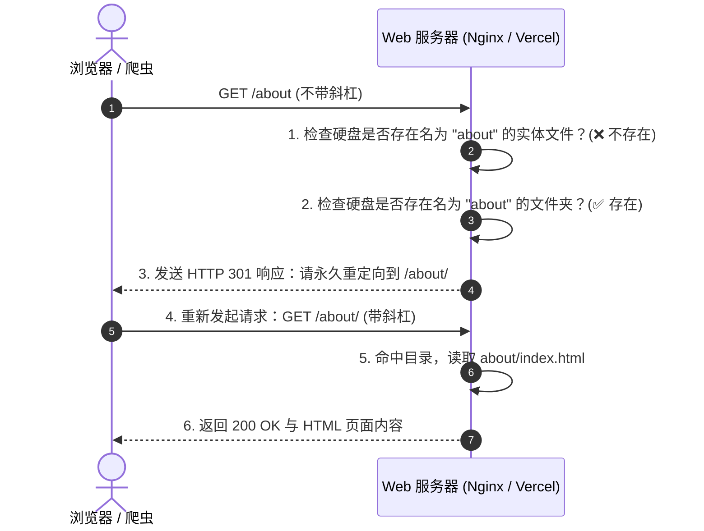

# URL 尾斜杠：加与不加的区别、静态站点“包裹”寻址与本地 404 避坑指南

> **核心背景**：在发布心迹动态时，点击独立页面与返回列表突发本地 404 报错，由此引出了一连串深层次疑问：URL 结尾到底该不该加 `/`？加与不加有什么本质区别？为什么开发源码明明只是单一 `.md` 文件，却说它是个“目录/包裹”？为什么同为静态站，HBU Wiki（VitePress）末尾没有斜杠也没有 `.html`，而个人博客（Astro）却必须带斜杠？
> **本文定位**：底层原理 + 框架对比 + 踩坑复盘 + SEO 避坑指南。把“现象 $\rightarrow$ 原理 $\rightarrow$ 对比 $\rightarrow$ 实战”一次性讲透，作为长期查阅的建站与 Web 体系知识沉淀。

---

## 💡 0. 核心心智模型：“信件” vs “包裹”（30 秒速览）

理解现代 Web 静态站点的 URL 寻址机制，只需要掌握一个形象的隐喻：

```text
┌────────────────────────────────────────────────────────────────────────┐
│                        现代 Web 寻址的两大流派                         │
├──────────────────────────────────┬─────────────────────────────────────┤
│ 1. 独立信件模式 (Clean URLs)     │ 2. 独立包裹模式 (Directory Index)   │
│    代表：HBU Wiki (VitePress)    │    代表：eryuemu 个人博客 (Astro)   │
├──────────────────────────────────┼─────────────────────────────────────┤
│ • 物理产物：transfer.html (单文件) │ • 物理产物：post/index.html (文件夹)│
│ • 标准 URL：/transfer (无斜杠)    │ • 标准 URL：/post/ (带尾斜杠)       │
│ • 寻址逻辑：服务器把信封撕掉后缀  │ • 寻址逻辑：进入包裹盒子找主页内容 │
│   直接将单份信件递给你           │   自动读取并展示 index.html         │
└──────────────────────────────────┴─────────────────────────────────────┘
```

---

## 一、历史溯源：URL 末尾的 `/` 到底代表什么？

在互联网早期（Web 服务器如 Apache、Nginx 刚出现的时代），URL 末尾是否存在 `/`，有着极其严苛的物理路径语义划分：

```text
https://example.com/about.html   👉 明确指向服务器硬盘上的一个【独立实体文件】
https://example.com/about/       👉 明确指向服务器硬盘上的一个【物理目录 / 文件夹】
https://example.com/about        👉 模棱两可：既没扩展名，也没尾斜杠
```

### 1.1 当你访问不带斜杠的 `https://example.com/about` 时，服务器在干什么？

如果底层实际上是一个名为 `about` 的文件夹，服务器在收到请求时必须经历一次纠错折腾：



因此，传统 Web 服务器为了保证目录语义的严肃性，必须强制补上一个 301 重定向，将请求修正为标准目录路径。

---

## 二、核心区别：加与不加 `/`，实际中有何巨大差异？

很多初学者以为“加不加斜杠只是美观问题”，但在底层工程与 SEO 实践中，两者存在着**性能、资源引用与权重计算**三大维度的硬性差异：

### 2.1 差异一：网络往返与服务器性能（零跳转 vs 额外重定向）
* **带尾斜杠（`/post/`）**：精准直达目录，服务器立即返回 200 页面，**耗时 0 毫秒额外开销**。
* **不带尾斜杠（`/post`）**：触发一次 301 重定向（或服务器内部 URL Rewrite），消耗一次额外的 TCP/TLS 握手往返，浪费移动端网络延迟与服务器算力。

### 2.2 差异二：相对路径资源解析的“致命陷阱”
如果你在 HTML 里使用相对路径引用图片或脚本（例如 ``）：

| 访问的 URL 路径 | 浏览器判定的当前层级 | 最终解析的图片请求地址 | 结果 |
| :--- | :--- | :--- | :---: |
| `https://eryuemu.com/blog/guide/` | `/blog/guide/`（处于该目录下） | `https://eryuemu.com/blog/guide/cover.jpg` | **✅ 正确加载** |
| `https://eryuemu.com/blog/guide` | `/blog/`（认为 guide 是个文件） | `https://eryuemu.com/blog/cover.jpg` | **❌ 报 404 资源丢失** |

*这是许多静态站迁移或部署后，图片和 CSS 偶尔离奇 404 的最隐蔽罪魁祸首。*

### 2.3 差异三：搜索引擎（SEO）视角：它们是两个完全独立的网页！
在 Google、Bing 等搜索引擎索引库中：
* `https://eryuemu.com/thoughts`
* `https://eryuemu.com/thoughts/`

**它们是两个完全不同的 URL 资源。**
如果站长不加以规范约束，让两个地址都能直接返回 200 内容，Google 就会将它们判定为“内容完全重合的重复网页（Duplicate Content）”，分散原本集中的权重（PageRank），并在 Google Search Console（GSC）后台报警**「备用网页（有适当的规范标记）」**。

---

## 三、源码明明是 `.md` 单文件，哪来的文件夹“包裹”？

> **“我们这个不是文件夹啊！我们在 `src/content/thoughts/` 目录下写的都是一个个 `.md` 文件，帖子里哪有文件夹？”**

这是最容易产生认知偏差的地方：**必须严格区分「开发源码（src）」与「构建产物（dist）」。**

```text
你编写的源码（src）：                  Astro 打包编译后的产物（dist）：
src/content/thoughts/                 dist/thoughts/
├── 2026-08-02-first-post.md    ───►  ├── 2026-08-02-first-post/        📁 真实物理文件夹
└── 2026-08-25-fall-rebirth.md  ───►  │   └── index.html               📄 标准入口主页
                                      └── 2026-08-25-fall-rebirth/       📁 真实物理文件夹
                                          └── index.html               📄 标准入口主页
```

### 3.1 Directory Index 铁律：为什么我们从来没在浏览器里见过 `.html`？
全球所有现代 Web 服务器（Nginx、Apache、Vercel、Cloudflare、GitHub Pages 等）自诞生以来就内置了一条**默认铁律（Directory Index 机制）**：

> **“凡是客户端请求一个目录路径（以 `/` 结尾），服务器默认自动寻找该目录下的 `index.html` 并吐出内容，且绝对不会在浏览器地址栏把 `index.html` 这几个字暴露出来。”**

所以当你访问 `https://eryuemu.com/thoughts/2026-08-25-fall-rebirth/` 时：
1. 浏览器向服务器索要 `2026-08-25-fall-rebirth/` 这个包裹文件夹；
2. 服务器打开包裹，把里面的 `index.html` 递给浏览器渲染；
3. 浏览器地址栏保持纯净优美，既隐藏了 `.html` 后缀，又完美契合了目录寻址。

---

## 四、方案对比：HBU Wiki (VitePress) vs 个人博客 (Astro)

为什么 [HBU Wiki（河北大学生存指南）](https://guide.hbuwiki.top/) 之前消除了 `.html` 后末尾**没有斜杠**，而个人博客却**必须带斜杠**？

这源于 VitePress 与 Astro 在处理“消除 `.html`”时所选用的不同哲学：

| 比较维度 | HBU Wiki（VitePress） | 个人博客（Astro） |
| :--- | :--- | :--- |
| **设计隐喻** | **独立信件模式（Single Document）** | **独立包裹模式（Package Box）** |
| **底层核心技术** | **Clean URLs（伪静态重写映射）** | **Directory Index（标准物理目录索引）** |
| **打包产物物理结构** | `dist/transfer.html`（依然是一个单文件） | `dist/blog/post/index.html`（独立目录） |
| **服务端处理行为** | 用户请求 `/transfer` $\rightarrow$ Vercel 内部重写指向 `/transfer.html` | 用户请求 `/blog/post/` $\rightarrow$ 服务器直接进入目录读取 `index.html` |
| **URL 标准形式** | `https://guide.hbuwiki.top/transfer`（无斜杠） | `https://eryuemu.com/blog/post/`（带斜杠 `/`） |
| **适用场景** | 侧重文档知识库、追求仿原生软件的极简 REST 风格 | 侧重长青内容、博客、静态生态，通用兼容性最强 |

两种方案都是现代前端工程的优秀方案，其关键在于**各司其职、全站统一**。

---

## 五、复盘实战：本地 404 报错溯源与 SEO 影响分析

### 5.1 为什么之前线上一切正常，今天本地 `astro dev` 却报 404？

这是导致今天困惑的直接导火索。真相在于**线上 Vercel 边缘网关 vs 本地 Vite 开发服务器的行为差异**：

```text
【线上生产环境（Vercel）】：
代码中存在旧内链 <a href="/thoughts">
  ↓
点击后浏览器发起请求 /thoughts
  ↓
Vercel 依据 vercel.json 中的 "trailingSlash": true，在底层自动做了一次 301 强跳
  ↓
浏览器瞬时跳到 /thoughts/（所以线上点击平滑，你误以为代码里的内链本来就是对的）

────────────────────────────────────────────────────────────

【本地开发环境（Astro Dev）】：
代码中存在旧内链 <a href="/thoughts">
  ↓
本地 Vite/Astro 开发服务器没有配置复杂的边缘 301 转发规则
  ↓
Astro 发现 astro.config.mjs 明确要求 trailingSlash: 'always'
  ↓
Astro 严谨地在路由表中比对，判定 "/thoughts" 不匹配 "/thoughts/"
  ↓
本地开发服务器直接吐出 404 Not Found！
```

### 5.2 修复组件内链对已有的 SEO 方案有影响吗？

**答案是：没有任何负面影响，反而是彻底把内链规范度推向了 100%！**

1. **线上早已被 301 兜底保底**：我们在 `vercel.json` 和 `astro.config.mjs` 中设置的服务端规则，已经让 Google 爬虫能够顺畅拿到 301 跳转信号，消除“备用网页”警告的任务本就正常在队列中消化；
2. **内链消除跳转开销**：把 [`Header.astro`](file:///w:/home/eryuemu/workspace/eryuemu-blog/src/components/Header.astro)、[`thoughts.astro`](file:///w:/home/eryuemu/workspace/eryuemu-blog/src/pages/thoughts.astro)、[`thoughts/[...id].astro`](file:///w:/home/eryuemu/workspace/eryuemu-blog/src/pages/thoughts/[...id].astro) 与 [`index.astro`](file:///w:/home/eryuemu/workspace/eryuemu-blog/src/pages/index.astro) 里的 `<a href>` 统一补全 `/` 后，用户与爬虫在站内点击时连那一次 301 跳转都省去了，抓取效率更高；
3. **本地开发彻底清爽**：本地 `astro dev` 预览与线上生产环境逻辑 100% 对齐，不再出现诡异 404。

---

## 🎯 6. 经验总结与建站黄金守则

1. **选型明晰**：如果你做的是**目录型静态博客（Astro、Hugo）**，坚定选择 `trailingSlash: 'always'`，让每个页面作为独立包裹稳定运作；如果你做的是**文档库（VitePress）**，开启 `cleanUrls: true` 享受单文件无后缀的极简感；
2. **内外一致**：在配置文件（`astro.config.mjs` / `vercel.json`）中确定了规则后，**所有组件、导航栏、正文内链、前后篇推荐的 `<a href>` 必须严格遵循该规则**，不要依赖服务端的 301 自动纠错；
3. **SEO 唯一真理**：搜索引擎不怕你带 `/`，也不怕你不带 `/`，怕的是你**“一会儿带一会儿不带”**。保证全站唯一标准 URL + 备用变体 301 强跳，就是最坚固的 SEO 护城河。
