# Vercel 免费层 10GB 部署存储爆满排查与化解全记录：从 21GB 到自动清理

> **症状**：周末收到 Vercel 官方系统邮件，提示免费版（Hobby）的“部署存储（Deployment Storage）”已 100% 耗尽（上限 10 GB），催促升级到 Pro。  
> **迷惑**：博客只是个人静态小站，本地整个目录不到 1GB，云端 GitHub 仓库更是只有 0.37GB，根本没有存海量文件，这 10 GB 到底从何而来？  
> **排查结果**：实际 Vercel 存储已经堆积到了 **21.29 GB（超额 212%）**！元凶是 Vercel 默认保留 30 天内所有构建快照，加上近一个月频繁更新、单次构建产物偏大（约 150MB），历史快照层层叠加撑爆了存储。  
> **解决方案**：将部署保留策略（Deployment Retention Policy）由默认的 30 天调整为 Production 1 周、其余 1 天，开启后台自动清理；厘清源码与构建产物的本质差异，解除 push 顾虑。

---

## 0. 核心数据速览（先看对比）

在动手解决前，先对各个环境的真实数据进行一次全面盘点：

| 指标 / 平台 | 实际占用体积 | 存储内容性质 | 状态评价 |
| :--- | :--- | :--- | :--- |
| **GitHub 仓库** (`eryuemu-blog`) | **368.26 MB** (约 0.37 GB) | 纯源码、Markdown、提交 Diff 历史（“做面包的配方”） | **远未用满**（离 1~5GB 限制还极远，非常健康） |
| **本地工作区** (跨设备本地代码) | **1019.4 MB** (约 0.99 GB) | 源码 + `.git` 历史(351M) + `node_modules`(162M) + `dist`(150M) | **正常范围**，不足 1 GB |
| **Vercel 部署存储** (Deployment Storage) | **21.29 GB** (超标 212%) | 过去 30 天内每一次打包编译出的完整静态网页快照（“做好的面包”） | **严重超标**（免费额度仅 10 GB，已满额报警） |

---

## 1. 起因：突如其来的 10 GB 报警邮件

周日下午，手机邮箱突然弹出一封来自 Vercel 的提醒邮件：


*手机收到的 Vercel 官方预警邮件*

邮件内容大致翻译如下：
> **你的网站在成长！**  
> 你的团队埃里乌穆斯（`eryuemu`）已使用了 **100% 的包含的免费层使用率部署存储（10 GB）**。  
> [升级到专业版]  
> 管理您的使用情况：如果这样使用是不预期，学习如何优化或删除您的项目。

第一反应完全是黑人问号脸：一个基于 Astro 的个人独立博客，文章才几十篇，文字加起来顶多几兆，怎么就“网站在成长”把 10 个 G 全吃光了？

---

## 2. 深度剖析：为什么 GitHub 有了 Git，Vercel 还要存这些？

排查中最关键的一个认知突破点：**既然 GitHub 已经有 Git 记录了所有的版本历史和回滚点，Vercel 存历史快照难道不是和 GitHub 重复了吗？**

答案是：**表面上看都是为了回滚，但两者本质完全不同。**

### 2.1 源码（配方） vs 成品（面包）

```
[GitHub]                          [Vercel 云端]
源代码 (.astro / .ts / Markdown)  ───(npm run build 编译打包 20~26秒)───► 静态成品网页 (HTML / JS / CSS)
体积：仅 368 MB                                                         单次体积：约 150 MB
浏览器不可读，不能直接上线                                              浏览器即下即看，部署于全球 CDN
```

* **GitHub 存的是「配方」**：记录的是代码行的增删改差量（diff）。浏览器看不懂 Astro 模板语法，也不认识 TypeScript，无法直接把源码当作网页呈现给访客。
* **Vercel 存的是「成品」**：每次 GitHub 有新的 push，Vercel 会开一台云端虚拟机执行 `astro build`，把所有文章预渲染成 HTML，把静态资源打包成 `dist` 目录。**这套打包后的成品，才是部署在全球 CDN 边缘节点上的最终网页**。

### 2.2 秒级切流（Instant Rollback）的代价

* **如果只靠 Git 回退**：
  若线上突发 bug 需要回滚，你必须在本地 `git reset` 或 `git revert`，推送至 GitHub，Vercel 重新收到 Webhook、重新拉镜像、重新下载依赖打包。整个过程需要 **2~3 分钟**，若遇上网络波动甚至可能构建失败。
* **Vercel 的 Instant Rollback（一键秒级回退）**：
  Vercel 为了让你在后台点一下“Rollback”就能在 **1 秒钟内恢复旧版**，选择了一种空间换时间的做法：**把你过去每一次提交打包出来的 150 MB 成品文件夹完整锁在云端存储桶里**。遇到事故，只需修改一下 CDN 域名指向，无需重新构建。

### 2.3 为什么单次构建会有 150 MB？

通过排查本地的 `src/` 与 `public/` 资源，发现了大体积的根源：
1. `src/assets/` 下存在多张相机直出、未经压缩的原始素材图片（如 `周边.jpg` 15.35MB、`上海站前.jpg` 14.63MB、`签到墙.jpg` 13.78MB 等，单张就达十多兆）；
2. `public/images/thoughts/` 中亦有多张 12~14 MB 的随想照片；
3. `public/music/` 下存放了数首 5~6 MB 的音频文件（`.m4a`）。

单次打包输出达 **150 MB**，只要保留：
$$\frac{10\text{ GB}}{150\text{ MB}} \approx 68\text{ 次构建}$$
而近期博客提交已有 200 多次，一个月内的频繁推送迅速冲垮了 10 GB 阈值。

---

## 3. 现场排查与逐步化解全过程

解决过程不慌不忙，一步一个脚印，从定位入口到一劳永逸开启自动化清理。

### 第一步：进入项目概览与部署列表

登录 Vercel 控制台，进入 `eryuemu-blog` 项目概览页：

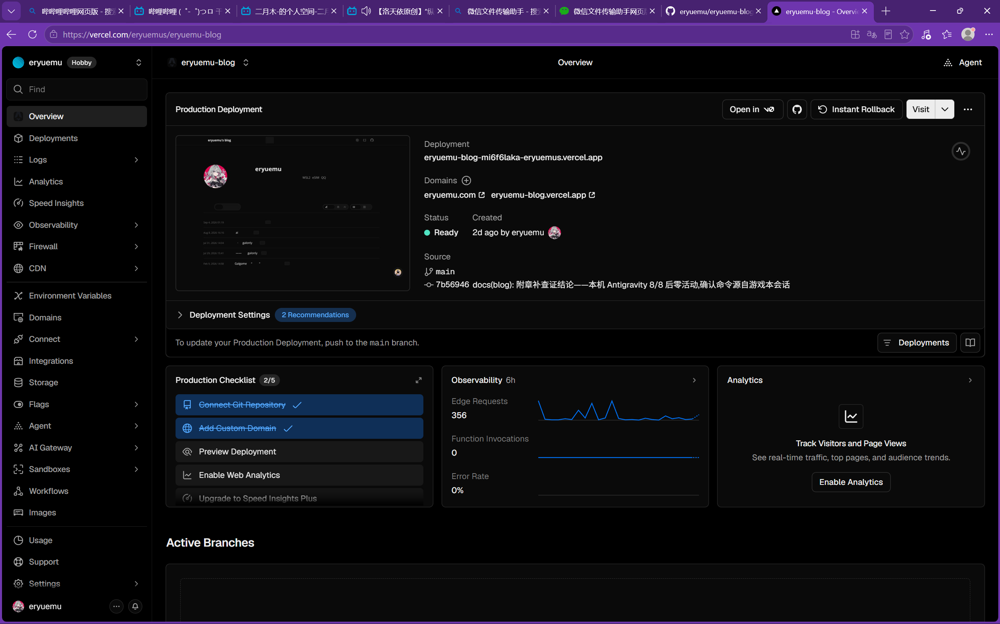
*Vercel 控制台主页面*

点击左侧菜单栏第二项 **`Deployments`**（小立方体图标），进入部署历史列表。列表中密密麻麻记录了过去所有的提交构建：

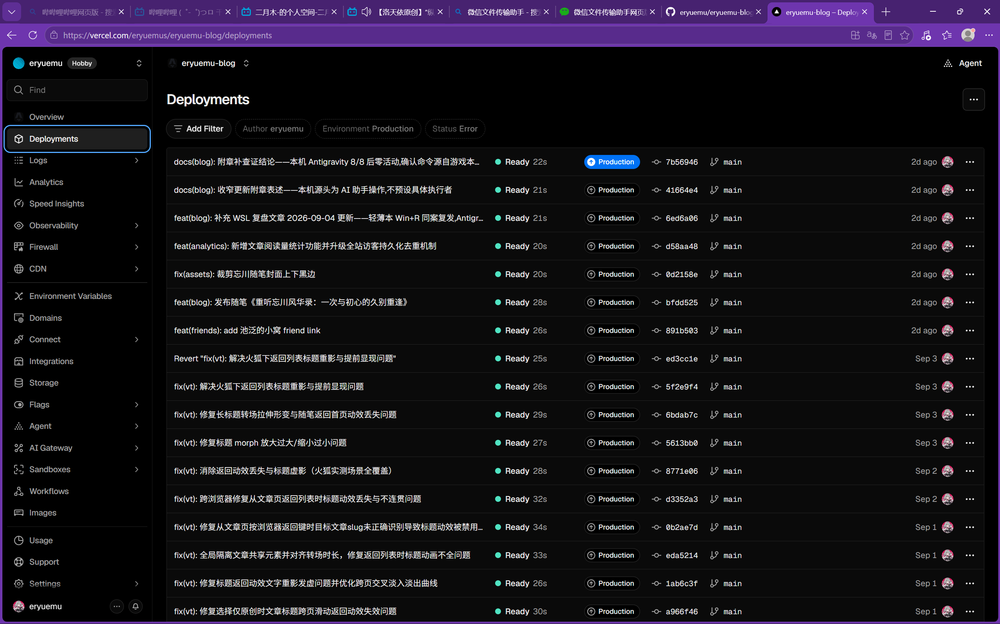
*部署历史列表*

> ⚠️ **关键注意**：列表最顶上第一条带有 `Ready (Current)` 蓝色徽标的，是当前线上正在服务的版本，**无论任何操作绝对不要动最顶部的当前生产版本**。

### 第二步：尝试手动删除单条历史记录

尝试在列表项右侧点击三个点 `...`，弹出的菜单只有 `Instant Rollback`、`Promote`、`Redeploy` 等操作，**并没有删除按钮**：

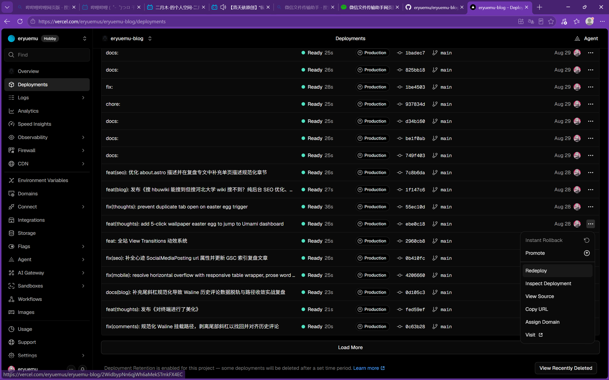
*历史生产部署在列表外层无法直接删除*

这是因为对于 Production 类型的历史构建，Vercel 在外层列表做了防误触保护。必须点击菜单中的 **`Inspect Deployment`**（查看该部署详情）：

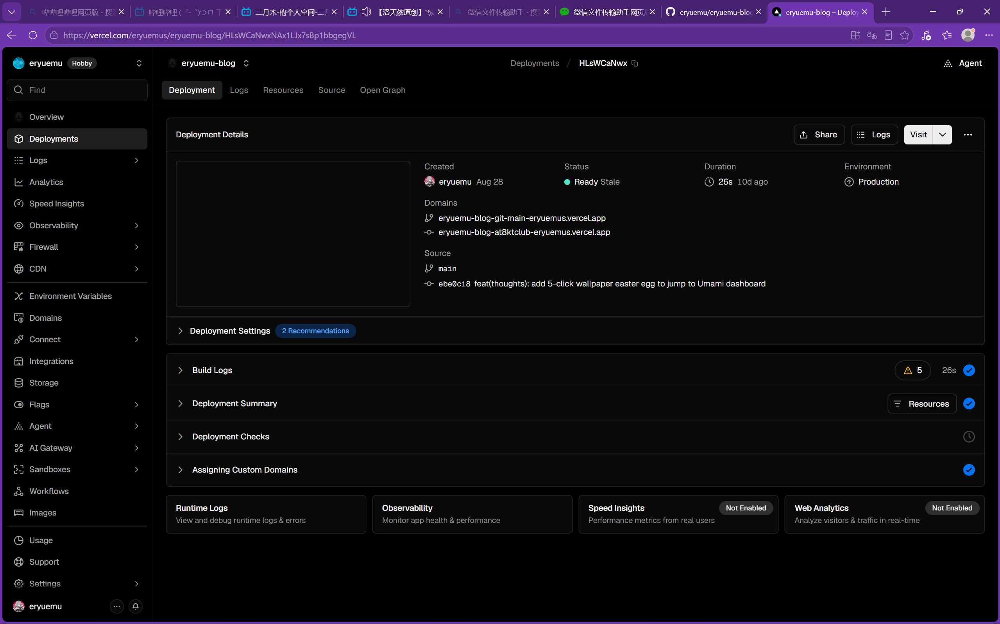
*部署详情页*

在详情页右上角的 `Visit` 旁找到三个点 `...`，终于露出了红色的 **`Delete`** 选项：

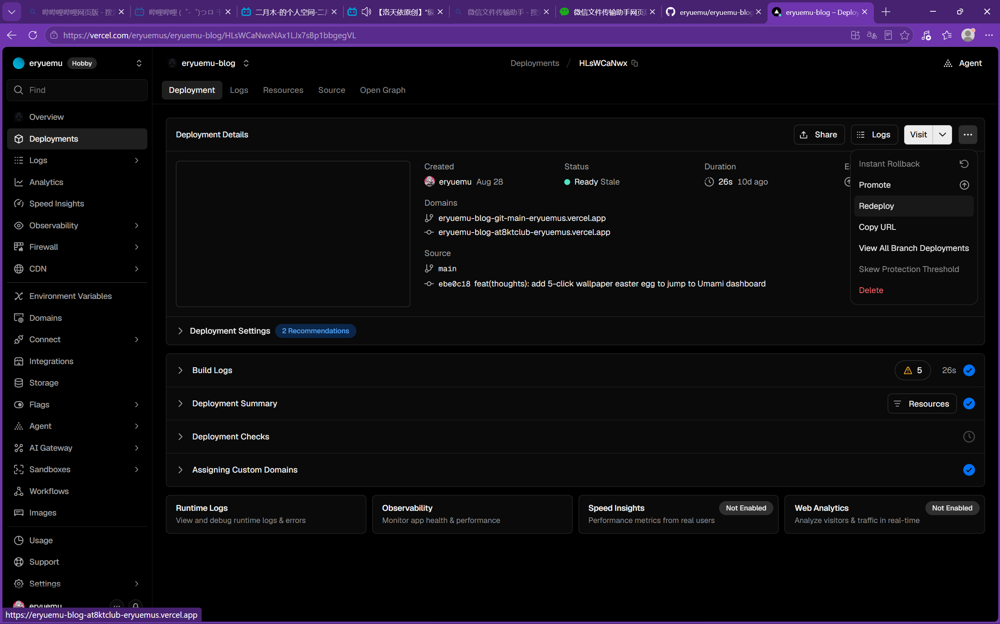
*详情页下拉菜单中的 Delete 按钮*

点击后弹出二次确认框，点击右下角 **`Delete`** 确认即可删除单条记录：

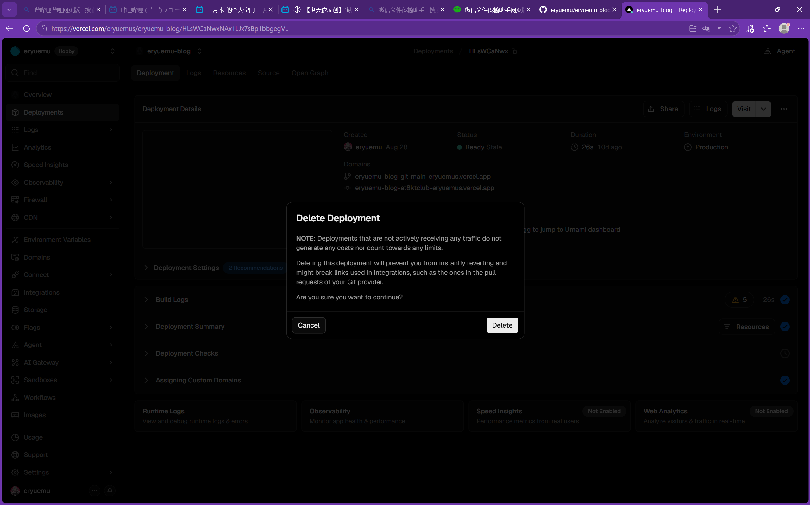
*确认删除弹窗*

### 第三步：寻找自动化策略——发现“30天回收站”玄机

手动一条一条点进去删，几十条记录费时费力。必须配置自动保留与清理策略。

在寻找设置项时，看左侧菜单最底部齿轮图标 **`Settings`** $\rightarrow$ 子菜单 **`Security`**：

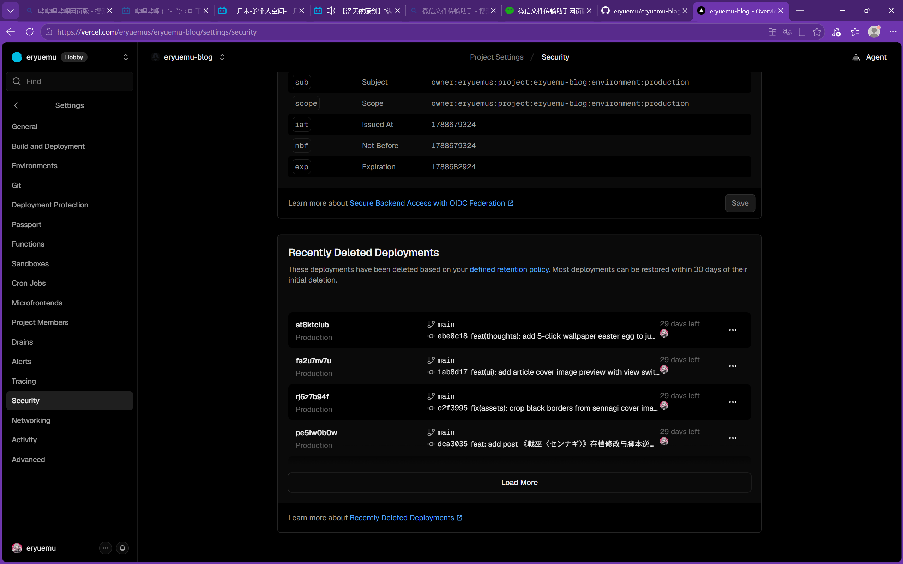
*Security 页面底部的 Recently Deleted 列表*

向下滚动页面，赫然发现一个名为 **`Recently Deleted Deployments`** 的区块，并带有一句核心说明：
> *These deployments have been deleted based on your **defined retention policy**. Most deployments can be restored within 30 days of their initial deletion.*

**破案了**：
即使此前系统根据规则清理过部分部署，它依然会把它们放在 **30 天回收站** 里！在 30 天恢复期结束之前，这些文件依然算作占用你免费层的 Deployment Storage。

直接点击文字里的蓝色链接 **`defined retention policy`**，直达策略配置面板。

### 第四步：调整部署保留策略（Deployment Retention Policy）

进入策略配置页（位于 `Settings` $\rightarrow$ `Build and Deployment` 下方）：

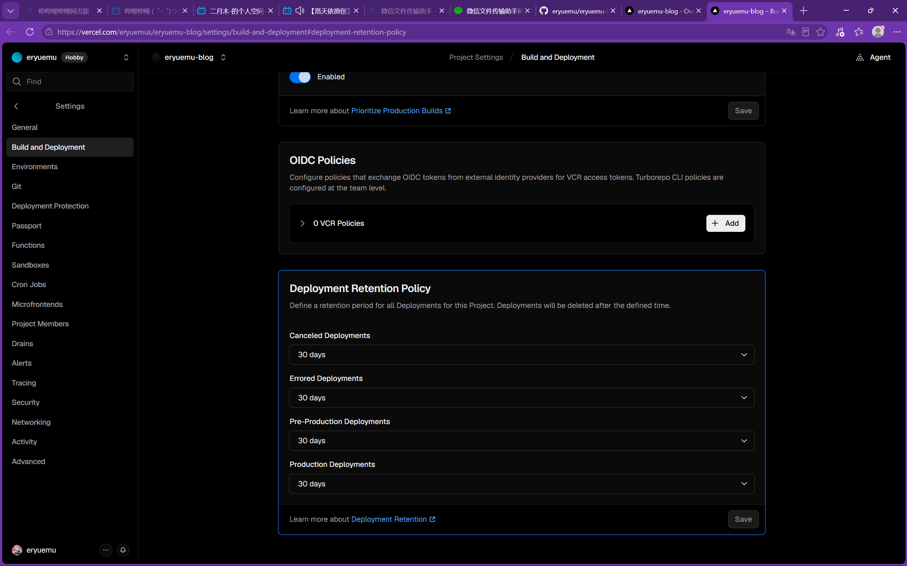
*所有部署类型默认保留整整 30 天*

四个选项默认全为 **`30 days`**！这意味着只要 30 天内任何一次提交，快照就会死死保留一个月。

针对个人静态博客的实际需求，做出如下调整：

1. **`Canceled Deployments`（被取消的部署）**：设置为 **`1 day`**（未成功半成品无需留存）；
2. **`Errored Deployments`（报错失败的部署）**：设置为 **`1 day`**（构建失败的无价值垃圾）；
3. **`Pre-Production Deployments`（分支测试部署）**：设置为 **`1 day`**；
4. **`Production Deployments`（正式发布部署）**：设置为 **`1 week`**（保留一周足矣，且当前线上最新版永远受保护不会被误删）。

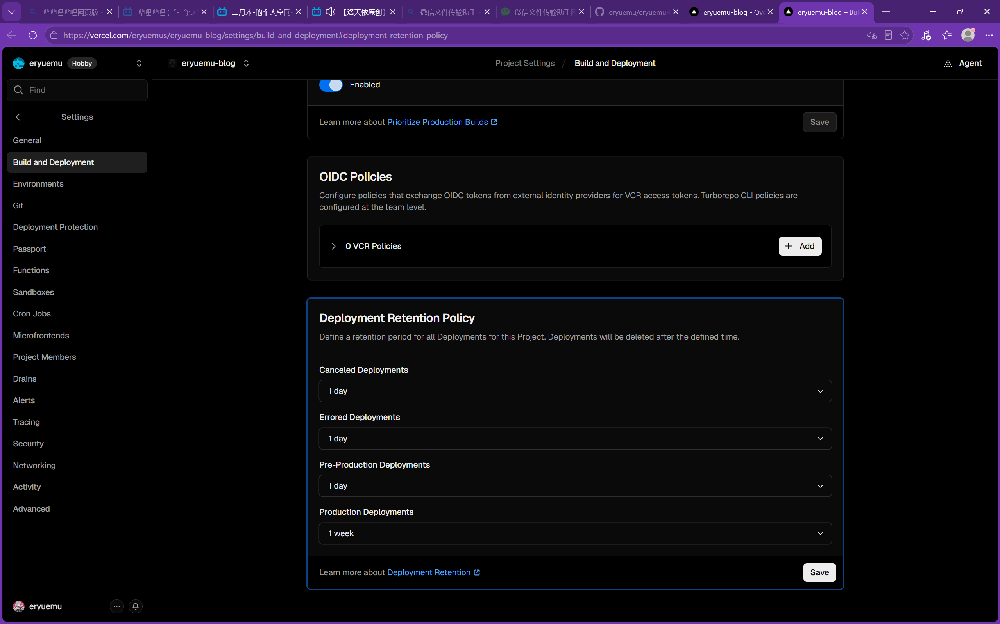
*调整为更短周期并点击右下角 Save 保存*

点击右下角 **`Save`** 保存配置。自此，Vercel 后台守护任务会自动将一周前的历史旧包逐一清理出库。

### 第五步：验证用量数据（Usage）——抓到 21GB 真凶

来到左侧菜单的 **`Usage`**（用量监控）页面：

首先看网络通信基础指标：
* **Fast Data Transfer（CDN 流量）**：只消耗了 **6.39 GB / 100 GB**（仅 6%）；
* **Edge Requests（请求次数）**：只使用了 **38K / 100万次**（仅 3.8%）。
说明网站日常访问与流量非常健康，没有任何被刷量或爆流的异常。

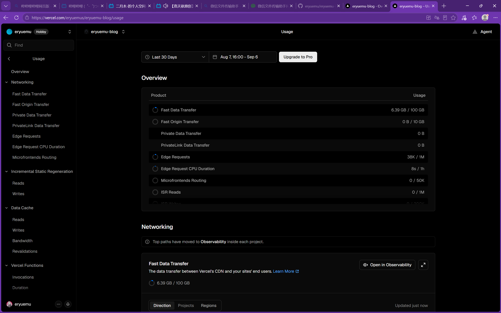
*访问流量仅 6.39GB，远低于 100GB 阈值*

接着向下滚动到 **`Deployment Storage`**（部署存储）折线图，终于看到震撼的全貌：

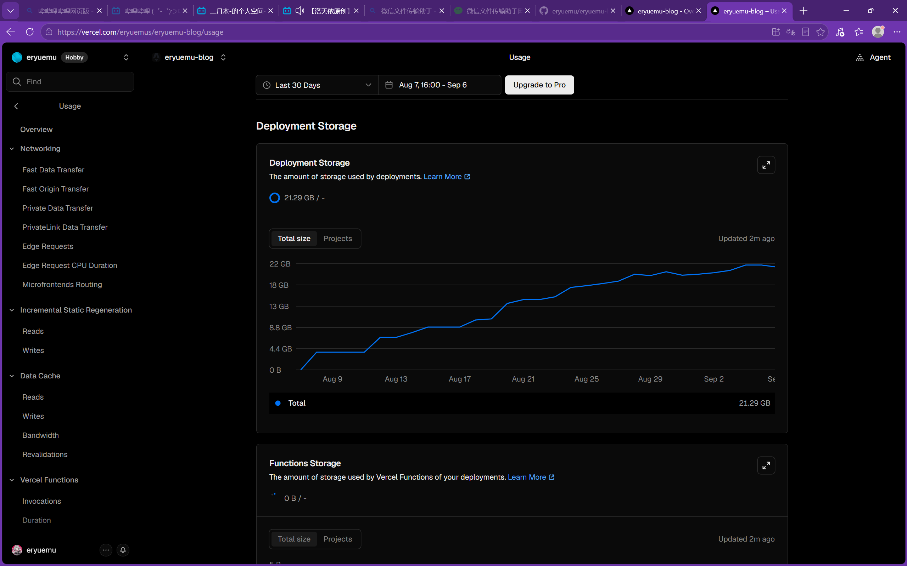
*近 30 天部署存储一路攀升至 21.29GB，末端因清理开始出现微幅拐点*

* **实际占用**：**21.29 GB**（超额达 **212%**）！
* **走势图**：从 8 月初的 4.4GB，随着一次次博文发布与样式调整，像楼梯一样稳步攀升到 8 月底的 20GB、9 月初的 21.29GB。
* **拐点出现**：注意观察折线图最右端，随着刚才手动删除与策略保存，曲线末尾已经开始微微向下拐头。未来 24~48 小时内，超期的 15GB+ 历史旧包将陆续被自动清除。

---

## 4. 关键认知解答：超额 200% 还能继续 Push 吗？

在排查尾声，面对 21GB 的数字，自然会产生两个最实际的疑问：

### Q1：既然已经超了 10GB 这么多，为什么今天才发邮件？
* **周期结算机制（Billing Cycle）**：监控周期标注为 `Aug 7, 16:00 - Sep 6`。**9 月 6 日恰好是该周期的最后结算日**。系统的月度审计脚本在期末跑批汇总时，检测到了月度额度超标，从而触发了阈值警告邮件。
* **软性提醒非实时断路器**：云厂商对历史快照类存储通常采用后台低优先级巡检，而非达到 10.001GB 瞬间报警。

### Q2：存储已经爆满了，我还能继续 `git push` 发新文章吗？
**结论：完全可以，畅通无阻！**

必须区分 Vercel 的**硬限制（Hard Cap）**与**软限制（Soft Cap）**：

| 类型 | 包含项目 | 触碰阈值后的反应 |
| :--- | :--- | :--- |
| **硬限制（Hard Cap）** | 单文件体积超 100MB、月度构建耗时超 6000 分钟 | **直接打断构建，构建失败或拒绝接收** |
| **软限制（Soft Cap）** | **部署快照存储（Deployment Storage）**、历史预览版本数量 | **发邮件建议升级或打扫卫生，绝不阻断正常上线** |

对于静态博客：
1. 单次构建耗时仅 **20~26 秒**，一个月构建额度有 6000 分钟，目前使用量连零头都不到；
2. Vercel 的设计初衷是提供优秀的开发者体验（DX），绝不会因为后台存了一些历史快照就蛮横地让个人博主的发布流水线停摆；
3. 新代码 push 上去后，生成最新的 Production，旧版本反而加速被推入过期淘汰队列。

---

## 5. 总结与后续建议

1. **GitHub 永远是核心资产**：
   本地代码与 GitHub 远端仓库体量仅 368MB，架构纯粹健康。Vercel 只是外部展示平台，切勿本末倒置产生数据焦虑。
2. **策略管长远**：
   通过将 `Production Deployments` 保留时间设为 1 周、其余状态设为 1 天，彻底关上了快照无限膨胀的龙头。
3. **日常素材轻量化（推荐好习惯）**：
   手机或相机直出的十几兆原图（4000×3000 分辨率），直接放到网页上既慢又浪费带宽。日常撰写新文章时，可随手缩放至 2K 分辨率并转为 WebP（单张一般在 200KB~500KB，画质人眼无损，体积缩减 95%）。
4. **备选方案从容无忧**：
   基于 Astro 的现代静态博客具备极佳的可移植性。若后续对 Vercel 的免费条款有所厌倦，随时可一键镜像切换至 **Cloudflare Pages**（无限构建次数、无快照存储收费）或 **GitHub Pages**。
