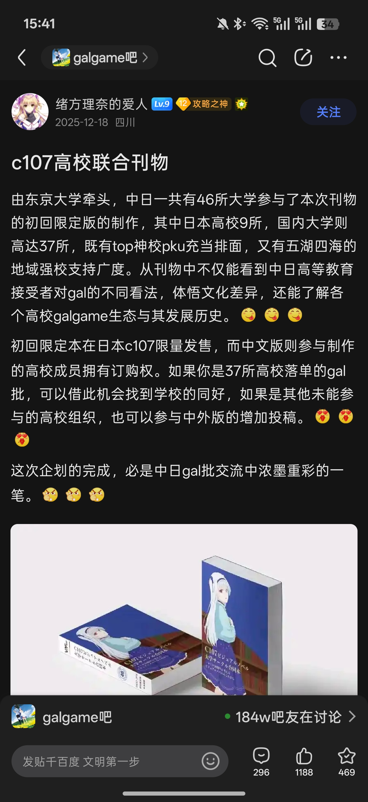
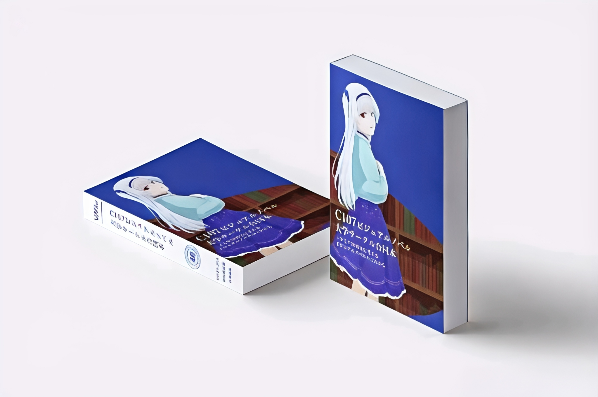
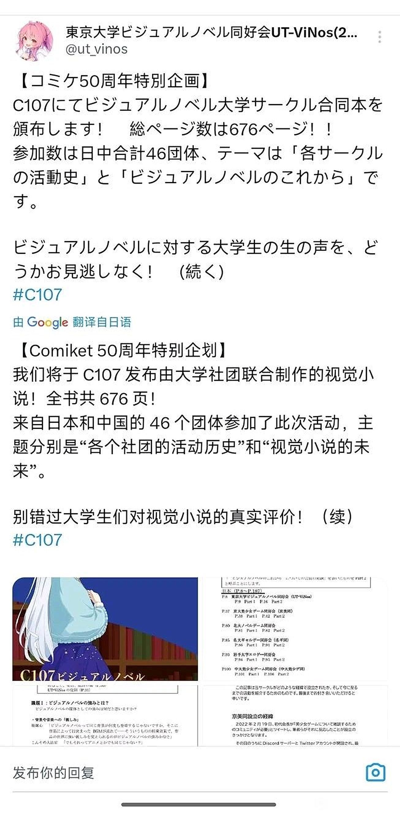
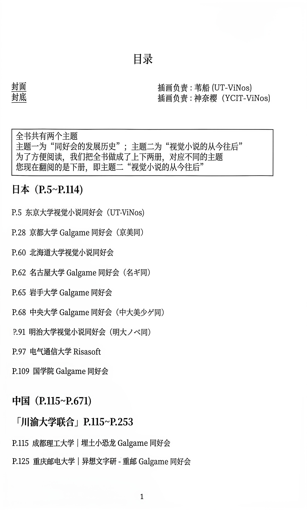
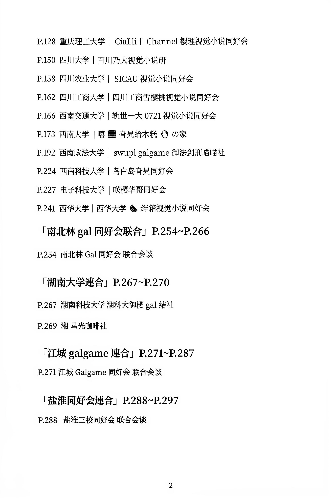
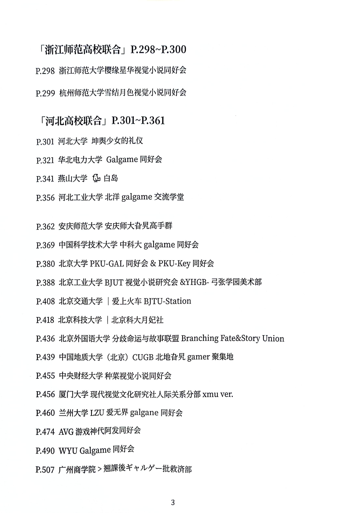
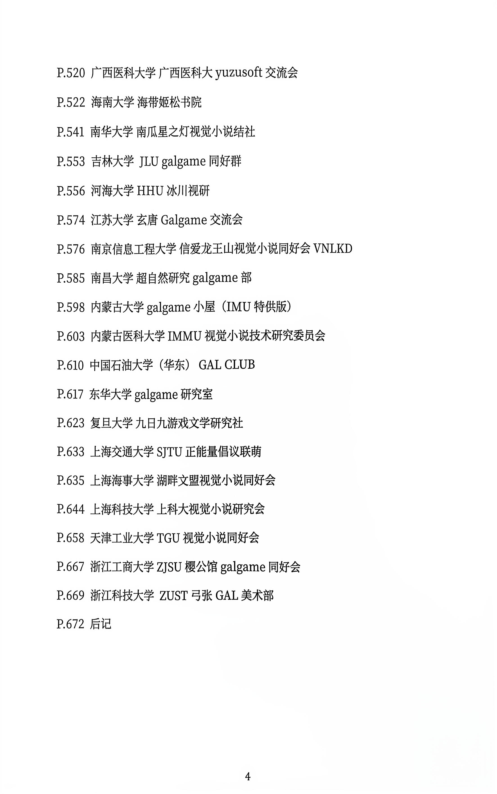

## 前言

> 本文最初为高校视觉小说同好会联合社刊（C107 联合刊物《高校视觉小说同好会合同志 —— 于 Comic market 50周年所思，视觉小说的从今往后》）所撰写的文章。作为一名普通的 Galgame 玩家，仅以个人视角记录并分享对这个圈子近年来变化的思考。

---

## 一、视觉小说：故事的叙述载体，而非单纯的“游戏”

说起来 Galgame，目前更官方的话是叫做视觉小说，我并不着重于强调它们的区别，生拉硬拽地把这两个概念切割开来。其实我觉得这两种概念本质上其实都是一样的，不知哪个天才把插图、文本（小说）、语音（有声小说）、音乐、人物结合在一起（当然大部分还有选择肢），最终变成了独特的故事表现形式——视觉小说（这里并不是强调这几个元素的历史比视觉小说要久，单纯说一下我对视觉小说的拆分而便于理解）。

只能说，这几部分是基本上缺一不可的，当然，据我了解，也有少数出色作品缺失了上述某些属性，比如说《海市蜃楼之馆》没有配音，这也丝毫不影响它成为神作，但是数量毕竟在少数，故此处我指的是现在市面上大部分 Gal。

相比于其他故事传播形式，如电影、动漫、小说，视觉小说给我的感觉永远是最独特的，前所未有的，视觉小说这种形式在我看来是最适合讲故事的载体——**电影和动漫是“看”别人的故事；小说是“听”别人的故事；而视觉小说更多的是“体验”别人的故事。**也就是最重要的一点——**代入感**。

或许你会说有些单机游戏也是很有代入感的，但是我认为它终究是很难在保有带入感的同时，容纳几十万字的文本，毕竟故事的载体是文本，讲好故事大概率是需要长文本的。因此我更多的认为视觉小说不像是个游戏，从单纯的故事艺术表现上，它更多的是一种故事的叙述载体，而不是游戏，毕竟它的游戏性太弱了。总之，视觉小说是故事叙述载体中的一个另类独特的存在。

---

## 二、从“小众圈子”到“旮旯给木”的流量浪潮

如今我入坑有两年半的时间了，正好也经历了 gal 从小圈子因爆火而走向大众的时期。只能说视觉小说的出圈总归是大环境所趋，不是人能左右的。

还记得最开始我入坑时候（在 23 年的上旬）没有电脑，就去 B 站搜一些模拟器的教程，比如 krkr、tyranor、exagear（那时候 winlator 还没有制作出来），当时还是有教程的，不过没现在这么丰富，热度也没这么高。当时也就几部作品比较出圈，如柚子社的《千恋\*万花》，还有猎奇作《沙耶之歌》《死馆》，更早的是《美少女万华镜》系列。

之后 24 年迎来了一个重要的日子——7 月 21 日——柚子社正式宣布入驻 B 站，之后卖上了收藏集。这就像哥伦布发现新大陆一样，柚子社发现了邻国中国市场的宝藏，从此其他厂商也在前前后后的来到 B 站卖收藏集。

再加上《亚托利》（ATRI -My Dear Moments-）的动漫化，Galgame 也算是迎来了第一次小出圈，不过真正的出圈还是在之后。大约是 25 年上旬至今，主要原因还是短视频这种流媒体的介入，让很多圈外人都接触到了 Galgame 这一游戏类型，也应该是差不多这时候开始渐渐被叫成了“旮旯给木”（PS：挺本土化的称谓，虽然我不是很喜欢这样叫）。

从头到尾，它都是以一种既抽象又充满刻板印象的形式出圈，从最初的“不是谁有那种旮旯 game”到 25 年中的“旮旯专家”抽象视频的爆火，最后是如今爆火的“枣子姐 COS”，以至于我周围从来不玩 Galgame 的朋友也是了解到了这个曾经冷门的圈子。当然，虽然我很不喜欢这种烂梗，但这不全是坏事。

至少让我知道，在这个时代，仍然有人能沉下心来真心的喜欢和热爱着视觉小说，也有了很多萌新的加入，我的一位高中同学（HEBUT 的）也是在我的帮助下入坑的，如今玩的数量已经不下于我了。当然很多萌新入坑是因为 HCG 或者是猎奇元素，但是我想视觉小说这种独特的交互感和代入感会打动许多人。只能说在 Galgame 的流量过后或者以后 Galgame 的流量不再，能留下尽量多的真正热爱的“旮旯痴”，引导他们在自己能力范围内购买正版，是我们能够做到的。

---

## 三、当日本厂商纷纷进驻 B 站：机遇与良性交流

说回各大会社官方纷纷效仿柚子社进驻 B 站卖收藏集，对此我并不反感，我反而是鼓励的态度，因为这增加了创作者和玩家的交流。在进驻之前，厂商的消息大多都是在 X（原 Twitter）这种平台才能看到，而 B 站有了官号，就不只是能卖个收藏集这么简单，日本创作者和中国玩家的交流会变得更密切，将 B 站这种平台作为一种桥梁，当然，前提是会社运营要认真一些，而不是来这里挂个名卖个收藏集就走。

当然，B 站作为目前国内最大的 ACG 社区，其价值远不止于充当厂商的“售票处”。在流量喧嚣之外，更让我感动的，是那些长久以来深耕于此的 UP 主们——像“Galgame 批评”、“爱摸鱼的人潮”、“略懂先生的小屋”等等。他们不追逐“旮旯给木”的烂梗流量，而是用深度的杂谈、专业的评测和充满情怀的考据，在维护着这个圈子的格调。

尤其是每年 B 站特有的 Galgame 拜年祭，更像是一场属于我们的春晚。看着那些精心制作的混剪和同人节目，你会发现，在官方力量之外，正是这些核心玩家用爱发电，构建起了独特的社区文化。他们和那些只会跟风玩梗的营销号不同，他们才是连接萌新与核心圈子真正的纽带。

> **关于版权的题外话**：
> 至于那些引流视频，我们不能左右，但我只是希望更多的人能在能力范围内入正。玩盗版没事，但是花钱买盗版那就真没必要了吧，自此也滋生了很多倒卖的人，这是让我很痛恨的。

---

## 四、高校同好会：封闭但温暖的避风港

此外玩家群体这一方面，除了一些老玩家，我平时浏览 Galgame 吧，看到的更多是各高校的年轻玩家——也就是那些活跃在同好会、甚至参与企划的各位。他们是我见到的主体玩家。

这些高校同好会，提供了一个相对封闭但温暖的避风港。大家因为纯粹的热爱聚在一起，构筑起了友善的交流氛围。这是 Galgame 玩家群体中不可或缺的一部分。

看到这么多同龄人依然在为这个“小众”的爱好发光发热，我觉得这就够了，只要 Galgame 还有受众，还有愿意静下心来去阅读、去感受的人，这门独特的艺术形式就永远不会消亡。中国很大，人口基数摆在这里。即便是考证门槛极高、极度硬核的业余无线电圈子，在国内也有二三十万的持证玩家（这还不算更庞大的泛爱好者群体）。相比之下，Galgame 作为一种通俗的娱乐形式，它的潜在受众只多不少……

---

## 结语：在另一个世界寻找一份感动

所以，我们玩 Galgame 的初衷，不过是为了在另一个世界里寻找一份感动。对于我们这些留下来的人来说，与其去纠结流量带来的混乱，不如把目光放回屏幕，去好好珍惜每一个还愿意认真讲故事的厂商，去安利每一部真正打动人心的作品。

---

### 背景附录：关于 C107 联合社刊《高校视觉小说同好会合同志》

关于这次由东京大学（UT-ViNos，中文简称“vnf”）牵头、中日高校联合制作的社刊《高校视觉小说同好会合同志 —— 于 Comic Market 50周年所思，视觉小说的从今往后》，其实有两个版本：

- **第一版（初回限定版/日本语版）**：在 C107 展会现场限量发售实体书，仅包含日文版。虽然有 37 所中国高校和 9 所日本高校共同参与制作，但当时国内参展社团只能获得电子版，只有日本地区才有实物。
- **第二版（中文版/纪念限定版）**：这一版专门面向国内高校同好会的参与成员开放了少量的实体订购额度，使国内参与企划的社员也有机会收藏这本珍贵的实体合同志。作为参展社团的一员，我也幸运地订购并拿到了一本实物。

这本厚达 670 多页的合订志倾注了中日两国众多年轻玩家对 Galgame 的热爱。

#### 合同志 3D 效果图与企划发布

*《高校视觉小说同好会合同志》3D 效果图*

*东京大学视觉小说同好会（UT-ViNos）在 X（Twitter）上发布的 C107 参展公告*

#### 实体书目录与国内高校参与名单

为了便于阅读，全书分为上下两册：上册主题为“同好会的发展历史”，下册主题为“视觉小说的从今往后”（收录了本文）。

以下是实体书中下册的目录实拍，展示了国内各大高校同好会的踊跃参与：

| | |
| :---: | :---: |
|  |  |
|  |  |

从目录中可以看到，像北京大学、复旦大学、上海交通大学、中科大、西南大学、重庆理工大学等 30 多所国内高校的 Galgame/视觉小说同好会都在其中留下了足迹。这本沉甸甸的实体书，正是中日两国高校年轻玩家跨越语言、用热爱连接彼此的最佳见证。

